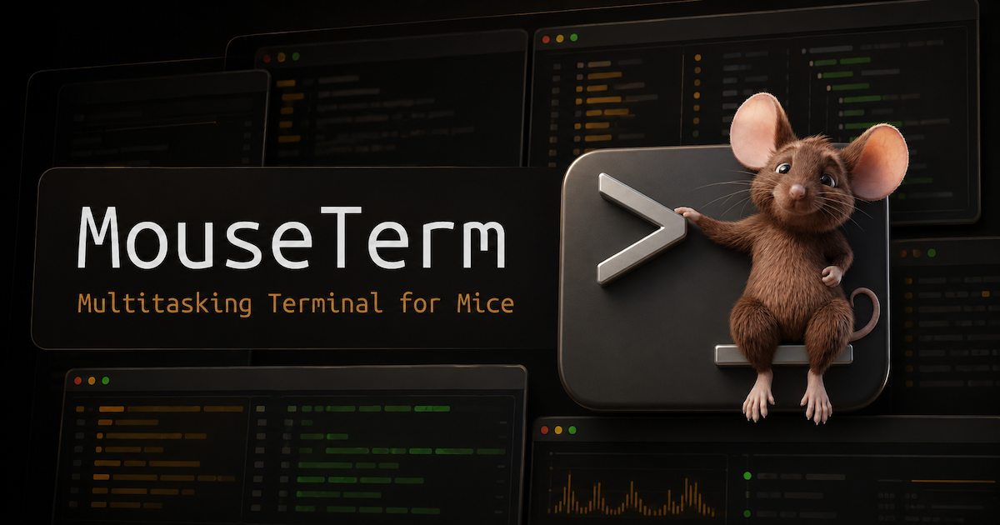

[![maintained with tend](https://img.shields.io/badge/maintained_with-tend-bba580?logo=data:image/svg%2bxml;base64,PHN2ZyB4bWxucz0iaHR0cDovL3d3dy53My5vcmcvMjAwMC9zdmciIHZpZXdCb3g9IjAgMCAxNiAxNiI+PGcgdHJhbnNmb3JtPSJ0cmFuc2xhdGUoMCwxNikgc2NhbGUoMC4wMTI1LC0wLjAxMjUpIiBmaWxsPSIjZmZmIiBzdHJva2U9Im5vbmUiPjxwYXRoIGQ9Ik02ODAgMTEyOCBjNjIgLTk2IDY5IC0xNzggMjAgLTI0MSAtMTcgLTIyIC0yMCAtNDAgLTIwIC0xMzQgbDEgLTEwOCAyMSAyOCBjMTEgMTYgMzAgNDcgNDIgNzAgMTIgMjIgMzIgNDkgNDYgNTkgMzcgMjcgMTE0IDM4IDE4NCAyNyA5MyAtMTUgOTQgLTE4IDQ0IC03OSAtNzIgLTg4IC0xMDkgLTExMyAtMTc2IC0xMTcgLTMxIC0yIC02NCAxIC03MiA2IC0yMyAxNSAyMSA1NiAxMDcgOTggNDAgMjAgNzEgMzggNjkgNDAgLTYgNyAtODggLTE3IC0xMjYgLTM3IC00OSAtMjUgLTEwMCAtNzggLTEyMSAtMTI1IC0xNSAtMzMgLTE5IC02NiAtMTkgLTE4OCAwIC0xNTcgOCAtMTk1IDUwIC0yMzIgMTcgLTE2IDM2IC0yMCA4NSAtMTkgNjIgMSA2MyAxIDczIC0zMiA5IC0zMiA5IC0zMyAtMjIgLTQwIC01MCAtMTIgLTEzMiAtNyAtMTY0IDEwIC00MCAyMSAtNzkgNjkgLTkyIDExNCAtNSAyMCAtMTAgMTAyIC0xMCAxODIgMCA4MCAtNSAxNjIgLTExIDE4NCAtMjIgNzkgLTEzNSAxNjYgLTIzNCAxODEgLTM3IDYgLTM1IDMgMzAgLTI4IDc4IC0zOSAxNDQgLTkxIDEzMiAtMTA0IC01IC00IC0zNyAtOCAtNzEgLTggLTc3IDAgLTExNyAyNCAtMTgyIDEwOSAtNTIgNjggLTUxIDcwIDQyIDg1IDcxIDExIDE0MyAwIDE4MyAtMjkgMTYgLTExIDQwIC00MyA1NCAtNzMgMTMgLTI5IDMyIC01OSA0MSAtNjYgMTQgLTEyIDE2IC03IDE2IDU4IDAgNTkgNCA3NyAyMyAxMDIgMTkgMjYgMjMgNDYgMjUgMTMwIDMgNjcgMCA5OSAtNyA5OSAtNyAwIC0xMSAtMjMgLTEyIC01NyAwIC0zMiAtNiAtNzYgLTEyIC05NyBsLTEyIC00MCAtMjcgMzIgYy0zNCA0MSAtNDMgOTYgLTI0IDE1MSAxNCA0MSA3NSAxNDEgODYgMTQxIDMgMCAyMSAtMjQgNDAgLTUyeiIvPjwvZz48L3N2Zz4K)](https://github.com/diffplug/tend)

## Try it

- **[Playground](https://dormouse.sh/playground)** - try in your browser, no install
- **[VS Code Marketplace](https://marketplace.visualstudio.com/items?itemName=diffplug.dormouse)** / **[Open VSX](https://open-vsx.org/extension/diffplug/dormouse)** - works in VS Code and its forks
- **[Standalone app](https://dormouse.sh#downloads)** - Mac, Windows, Linux

## Features

- **Automatic completion detection.** Detect when an agent needs your attention with standard terminal .,mn,.mn.,mnWhen a pane goes quiet for two seconds, it's marked done. Works with builds, AI agents, scripts, anything.
- **tmux-compatible keybindings.** Same prefix, same splits, same pane navigation. Muscle memory transfers.
- **Full mouse support.** Click to split, drag to resize, scroll to navigate. Or stay on the keyboard.
- **Copy-paste that works.** Click and drag selects text the way you'd expect, even in mouse-aware TUIs that normally swallow it as escape codes.
- **Sleep/wake panes.** Minimize a terminal to a compact status indicator. It keeps running and you can still see whether its task finished.
- **Dual distribution.** Standalone desktop app (Mac/Windows/Linux) or VS Code extension.
- **Pocket (coming soon).** Tether your sessions to your phone over WebRTC — walk away, keep working.

## Development

This project uses pnpm, react, typescript, vite, tailwind, storybook, and xterm.js. The standalone app is built with Tauri.

The terminal is currently hosted by `node-pty`, but we plan on switching to a Rust backend for the PTY.

### Quickstart

```sh
pnpm install
pnpm dev:website    # vite hotreload at http://localhost:5173/playground
pnpm dev:standalone # tauri hotreload

pnpm dogfood:vscode # builds the VSCode extension and installs it into your local VSCode
pnpm dogfood:standalone           # builds and runs the standalone app
pnpm dogfood:standalone --install # installs your local build overtop of your existing system installation

pnpm storybook    # http://localhost:6006
pnpm test         # runs all tests
```

### Folder structure

| Path | Description |
|------|-------------|
| `lib/` | Shared terminal library |
| `website/` | dormouse.sh (including playground) |
| `standalone/` | Tauri desktop app |
| `vscode-ext/` | VSCode extension |

### Agent strategy

This project was built with a combination of Claude, Codex, and Devin. We make heavy use of the [impeccable.style](https://impeccable.style/) agent skill, we recommend having it installed. See [AGENTS.md](AGENTS.md) for more detail.

## License

[FSL-1.1-MIT](LICENSE) — Copyright 2026 DiffPlug LLC

[Production dependencies](https://dormouse.sh/dependencies)
