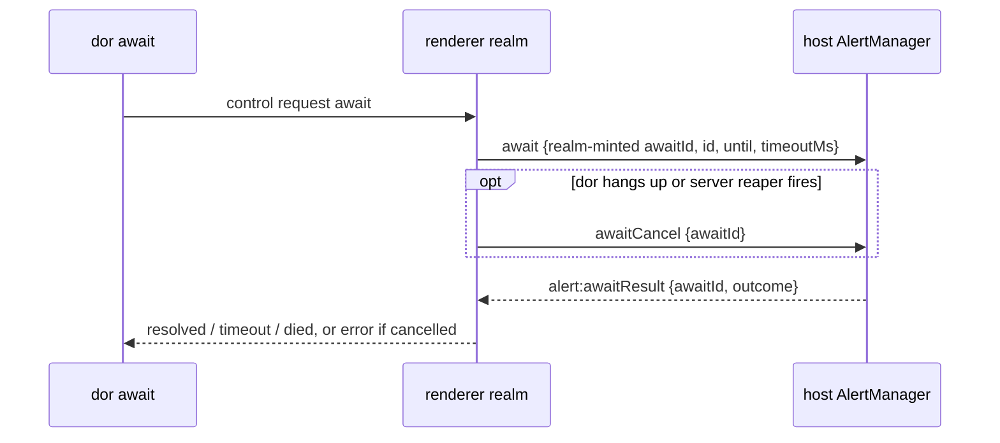

# Alert Spec

> - See `docs/specs/glossary.md` for Session / Pane / Door vocabulary.
> - Owns the Session Activity layer — the ring and its three sources, engagement, TODO, notification text and its sanitization, the two alarm sinks, and the Workspace union projection — and which alert state shows when; how each looks lives at its component. `docs/specs/layout.md` defers here for all alert/TODO behavior.
> - Defers placement and any size another module relies on to `docs/specs/layout.md`, the renderer ↔ host wire (`alert:command` and the `alert:*` events) to `docs/specs/transport.md`, and push sealing to `docs/specs/remote-security-model.md`; the await's own messages are stated here.

**Must preserve Activity across minimize/reattach** (glossary I3). **Never give a browser Surface an Activity machine**: it never rings, and carries only a user-set TODO flag, destroyed with that Surface.

Dormouse can owe the user attention in three ways. Each is a source of the Session's one ring, a latch held until cleared (Clearing And TODO):

| Source | Rings when | Detail |
|---|---|---|
| `watching` (WATCHING Track) | a watched command's output went busy, then quiet | `WATCHING`: `<watch key> went quiet` |
| `report` (Terminal reports) | the PTY emitted `BEL`, `OSC 9`, `OSC 99`, or `OSC 777`, or ended an `OSC 9;4` cycle | the sanitized report |
| `exit` (Command-exit Track) | a seen command exited | `COMMAND_EXIT` |

Only `watching` requires WATCHING.

## Non-goals

- **Must derive WATCHING only from the configured command rule set**, under WATCHING Track; never infer it from a process category.
- **Never raise native OS notifications on the machine Dormouse runs on**, nor a progress-bar widget. The one local audible channel is the opt-in spoken alarm below, which says a Pane name and nothing else; Dormouse plays no sound effects. Push is the exception and goes only to a remote paired phone.
- **Never introspect the process tree** for command-exit alerts; normalized terminal semantic events are the reliable input.

## Public State

Public `status` is a projection — first match wins:

1. `ALERT_RINGING` if the ring is active and not paused; consumers use `isAlertPaused` in `lib/src/lib/alert-episode.ts`.
2. `OSC_NOTIF_BUSY` if a progress cycle is active.
3. The output/silence detector's own state if WATCHING is on. **Never reorder 3 and 4** (rationale).
4. `COMMAND_EXIT_ARMED` if command-exit alerting is armed.
5. Otherwise `WATCHING_DISABLED`.

**Must identify each unresolved summons with an `episode` id and start time**, retained through animation pauses (Completion events). Opening the ring creates it; clearing ends it. A source joining an active ring joins its episode and never starts another delivery episode. **Never persist episodes.**

`awaited` sits beside `status`: true while at least one `dor await` is parked on the Session (Await). It is derived from live waiters and never persisted.

**Persist only** `todo` and the sanitized `notification` (plus `status` for diagnostics):

- **Must persist an unacknowledged ring, paused or visible, as the TODO a look would leave**, with its detail.
- Every spawn starts the id's alert state over; a cold restore carries those two on the pane's spawn (`SpawnPtyOptions.alert`), seeded before the PTY spawns, and a live resume keeps the host's. **Never recreate a ring, a progress cycle, or a command-exit arm on restore.**
- **Must read a notification this build cannot validate as none, keeping the pane**, and **never write a source outside `STRICT_READER_NOTIFICATION_SOURCES`** until no strict pre-tolerant build reads the file (rationale).
- **Never persist WATCHING per Session**: it is re-derived from the rule set at the next command start. Replay filtering in `docs/specs/terminal-escapes.md` keeps old terminal output from firing notification side effects again.

**Must retain host Activity before xterm initialization and clear it on Session disposal.**

Source of truth: `AlertState` / `SessionStatus` in `lib/src/lib/alert-manager.ts`; `toPersistedAlertState` / `normalizePersistedAlert` in `lib/src/lib/session-types.ts`; `respawn` in `lib/src/host/alert-host.ts`.

## Engagement

Three separate signals, never one lease (rationale):

| Signal | Of | Holds while |
|---|---|---|
| Presence | a viewer — one renderer realm: a VS Code webview, a standalone window, the fake adapter | its window is focused and visible, with typing, pointer (down or move), wheel, or IME composition anywhere in it within `inactivityTimeoutMs` |
| Focus | a viewer | the terminal Session its visible Wall points at: the passthrough pane, or the source of an open terminal context — never a command-mode selection, a Door, a browser Surface, or a hidden Workspace |
| Acknowledge | a Session | a human gesture on it, below |

A Session is engaged while some present viewer focuses it.

- **Must compute presence in the renderer and report transitions only**: an input event only stamps a time, and the host keeps no presence timer.
- An end of presence names its lapse — `idle` when the timeout ran out, `leave` on a window blur or hide. **Must treat a blur as a leave only when `document.hasFocus()` is false** (`docs/specs/layout.md` → Corner cases #2). Focus or visibility returning counts as input.
- **An iframe Surface holding focus must keep presence from lapsing `idle`**, its input never reaching the window; a blur behind it is a `leave` at the next deadline (rationale).
- **Must keep engagement per viewer**, deduped at the renderer, so one viewer's leave never disengages a Session another viewer engages. An absent viewer reports no focus change.

| Gesture | Acknowledges |
|---|---|
| typing into the pane (CSI/SS3 key encodings included), a paste, a file drop, the mobile input bar or a gesture key, a remote Client's write | with input |
| a Pane body or header click, zoom or unzoom, the dev-server chip, a Workspace tab's TODO pill on the member it enters, entering passthrough by keyboard, a Door click or `Enter`, a mobile tap | without input |
| a terminal reply, a mouse-only report chunk, `d` reattach, a spawn, split, or promotion, a `dor` reveal, an embed focusing itself, DOM focus alone | nothing |

- **Must acknowledge at each gesture's handler, never in the passthrough entry the silent paths share.**
- **Never treat terminal replies or mouse-only report chunks as keyboard input** (rationale).
- **Must write all human-originated PTY input through `writeUserInput`**, the mobile input bar's included: it carries `userInput`, and the host acknowledges it with input before the bytes reach the PTY, in the one message (rationale).
- **A remote Client's write must acknowledge the same way unless it holds only mouse reports**, the Burrow having dropped a mirror's terminal replies (rationale).
- **Never create an Activity entry to acknowledge**, the host's one check, so a browser Surface keeps its own TODO.
- **User input must open the echo window** (`cfg.alert.echoWindow`) even when acknowledging clears nothing, a helper's included. Output inside it is ignored entirely — detector, `outputSince`, the acknowledged state, awaits — and a completion inside it neither rings nor is held (rationale).

Source of truth: `setViewer` / `acknowledge` in `lib/src/lib/alert-manager.ts`; `createPresenceTracker` in `lib/src/lib/presence.ts`; `retainEngagementReporter` in `lib/src/lib/engagement.ts`; `writeUserInput` in `lib/src/lib/terminal-lifecycle.ts`; `alertedPty` in `lib/src/host/owner-pty.ts`. Pinned by `lib/src/lib/alert-engagement.test.ts`.

## Completion events

**Must dispatch every completion as a `CompletionEvent` before any suppression runs** — a detector settle, a command finish, a direct notification, and the end of a protocol progress cycle (completion or error) (rationale).

Claimants get first refusal per Session in registration order; the first to return `true` claims the event and the rest are not offered it. **A claimed event must never ring, set TODO, or store an `ActivityNotification`** — it stops before the ring rules, where the echo window, holding, and the command-exit seen check live.

**Must hold, never ring, a completion that would ring an engaged Session**, whatever its source — engagement alone decides: the hold keeps the sources it would raise and the richest detail (Clearing And TODO), repeated holds merging, never public. Holding leaves a progress cycle alone.

- A deferred report that comes due while engaged is held too; escalation rechecks recent output.
- **Presence lapsing `idle` with focus unchanged must ring what was held**, each source by its unengaged path.
- Any other end drops it — a user verb (Clearing And TODO), focus moving away, the viewer leaving, seeding, removal, or teardown (rationale).
- Rule removal withdraws a held `watching` source as it withdraws a ringing one (WATCHING Track).

With `deferAlertsUntilQuiet` enabled:

- **Must defer an eligible terminal notification until the detector's quiet deadline after the last accepted output** (`quietAt`), including unconfirmed activity and WATCHING off. Idle panes ring immediately (rationale).
- **Must derive pauses from recent output, never store them**, keeping the unresolved ring's sources, detail, episode, TODO, and pending alarm deadlines. Quiet restores it without confirmed BUSY; publishing a pause arms its wake.
- **Never defer a command-finish ring or pause one carrying an `exit` source**; a pending terminal notification joins it immediately. A held exit does not release an existing pause.
- **Must defer after claimants and ring eligibility, never redispatch the historical `CompletionEvent`** (rationale). A claimed new settle answers a retained `watching` source, never an earlier report.
- **Must keep initial pending intent live-only and bounded** to one notification, chosen by richness (Clearing And TODO). Accepted output moves the quiet deadline; command-boundary detector resets preserve it.
- **Never cap a deferral or pause** (rationale).
- **Must cancel pending delivery on acknowledgement, a dismissal that clears a ring, TODO changes, removal, seeding, or teardown.** A dismiss without a ring leaves initial deferral alone. Disabling the setting releases pending notifications immediately.

Two ordering rules:

- **Must clear the progress cycle before dispatch**, so a completion or error ends the cycle whether or not the event is claimed and `OSC_NOTIF_BUSY` falls back either way.
- **Must dispatch a command finish for every watch that existed**, including the unseen and engaged ones the ring rule then discards or holds.

Source of truth: `dispatchCompletion` / `holdOrDeliver` / `deferOrDeliverNotification` in `lib/src/lib/alert-manager.ts`; `quietAt` in `lib/src/lib/quiesce-detector.ts`. Pinned by `lib/src/lib/alert-engagement.test.ts`.

## Await

An await parks on one Session until it finishes what it is doing, then reports why the wait ended — the claimant the Completion events seam exists for. Where a human and a program want different things, an await serves the program and leaves the human's channels alone.

`until` (`dor await`'s required `--until`) names how much evidence of completion the caller accepts — a permissiveness ladder.

| `until` | Resolves on | `cause` | For |
|---|---|---|---|
| `quiet` | The Session settled, or the foreground command exited, or the Session emitted a notification | `quiet` / `exit` / `bell` | Agents that never exit — `claude`, `codex` |
| `exit` | The foreground command exited. Nothing else | `exit` | Builds, test runs, migrations |

- **Never narrow `quiet` to silence alone, and never let `exit` resolve on a bell** (rationale).
- **Never default `--until` or infer it from the WATCHING rule set** (rationale).
- **Never treat silence as settled.** Settling comes from the always-on detector (WATCHING Track), which needs no shell integration and cannot fire until it has been BUSY (rationale).

Is there anything to wait for?

| At await time | Behavior |
|---|---|
| A foreground command is running (`commandExitWatch`) | Park, no grace window. |
| Nothing running | Park for one grace window. A command start cancels it under either `until`; under `quiet` so does output, under `exit` output alone does not. Either way the await then waits for a real signal. Neither → resolve `cause: idle`. |

`idle` is a resolution, not a failure (rationale). Absent shell integration "is a command running" is unanswerable, so an `exit` await there falls back to the grace window and resolves `idle` rather than erroring.

**Resolution must consume only the ring source it resolved on**, its `cause` from that source: `report` → `bell`, `exit` → `exit`, `watching` → `quiet`. An await arriving mid-ring resolves immediately; under `exit` only the `exit` source counts and the await keeps waiting on the others.

- **Must skip the `exit` source while a foreground command is running** (rationale).
- **Must skip the `watching` source once output has resumed since it joined the ring** (`outputSince`), and **never stand the detector in for that flag** (rationale).
- **Never skip a report** — an `OSC 9` stays true until it is answered.
- **Consuming must withdraw that one source and never acknowledge**; a ring it leaves empty is withdrawn (Clearing And TODO).

Absorption — absorb the summons, keep the receipt:

- **A consumed completion must never latch a ring** — no alarm treatment, no spoken alarm, no push; nothing quieter is substituted (rationale).
- Absorption is per-signal, not per-Session: a human's own WATCHING rule on that Session still rings on the next settle.
- **A failed await must absorb nothing.** A timeout, a death, or a cancel claims no completion, so a crashed orchestration cannot silently eat the human's signal.
- **An await must never leave a TODO, nor clear a pre-existing one**, whether it parked before the report or after (rationale).
- **Claiming must be delivery**: once handed to an await the wait is settled and a later `cancel()` is a no-op — no release-after-claim, so the claim-to-read window is unacknowledged (rationale).

Every window derives from `cfg.alert`:

| Window | Source |
|---|---|
| Grace — "did anything start?" | `AWAIT_GRACE_MS` = `busyCandidateGap` + `busyConfirmGap`, the detector's floor for reaching BUSY |
| Settle — "has it stopped?" | `mightNeedAttention` + `needsAttentionConfirm` |
| Ceiling | `dor await`'s `--timeout` as `timeoutMs`, the only number not derived from `cfg.alert` |

- **Must enforce all three host-side**, so no hop reaps a parked await early and no caller parks forever by lying about its deadline.
- The ceiling's bound, `MAX_AWAIT_TIMEOUT_MS`: `docs/specs/dor-cli.md` -> "Deadlines And Cancellation" (rationale).
- **Must reject a non-finite, non-positive, or over-ceiling request rather than clamping it** — it settles `cancelled`, absorbing nothing; the webview handler rejects the same values with a visible error.

**Several awaits may park on one Session**, sharing one claimant: a completion goes to every await whose condition it satisfies, each resolving on the first qualifying signal after it registered.

An await crosses from the renderer to the host process that holds the manager, and the wait itself never leaves the host:

- **The host must answer exactly one `alert:awaitResult` per await, to the realm that parked it**, a cancel included. **Must ignore an `awaitId` already parked in that realm**; a malformed `id` or `until` is answered `cancelled`.
- **A realm that ends — a disposed or recreated webview, a reloaded or closed window — must have everything it parked cancelled and answered by the host, synchronously** (rationale); a disposing adapter settles its own.
- The fake adapter runs the same host in process. The Pocket phone adapter has no `dor` and protocol-v1 carries no await, so it settles every request `cancelled` at once.
- An await survives a Workspace transfer: the manager never moves (Live Workspace transfer).

**A PTY exit or Session removal must resolve every waiter still parked as `died`**, after command-finish dispatch gets first chance to resolve normally. Manager disposal resolves every waiter as `cancelled`.

Source of truth: `awaitCompletion` in `lib/src/lib/alert-manager.ts`; `AlertCommand` / `AlertAwaitResult` in `lib/src/host/alert-protocol.ts`; `createAlertHost` in `lib/src/host/alert-host.ts`. Pinned by `lib/src/host/alert-host.test.ts`.

## WATCHING Track

**Must key WATCHING by the foreground command's watch key** (Rules, below). A Session is watched exactly while a rule covers that key; edits reach every matching Session. **Never add per-Session enable or mute** (rationale).

The output/silence detector is always on. Every Session runs one `QuiesceDetector` for its whole lifetime, fed by every output chunk outside the echo window and reset at every command boundary. It never latches and knows nothing about engagement or rules; the rule set decides only whether its state is publicly visible and whether a settle — a busy Session that stayed quiet — may ring.

**A retired id must stay retired.** A host removes the alert entry in the same turn as its kill, ahead of any output still in flight. **Never let raw output or resizes revive a retired id**; a semantic or protocol event may (rationale).

Rules:

- **Must derive the key only from the shell-reported raw command line through `commandWatchKey`**, never the display title or keystroke fallback; its lexical grammar belongs to that function. Where bash's `E` falls back to the line's first simple command, that command keys (`docs/specs/terminal-state.md` → Shell-integration injection; rationale).
- A rule covers a key it equals, and a bare runner rule covers every `<runner> <script>` key of that runner (rationale). `watchRuleFor` is the one matcher, for WATCHING, rule-removal silencing, and the terminal context's row.
- **Every command boundary must reset the detector** — `commandStart`, `commandFinish`, `promptStart`, `promptEnd`, and PTY exit — even without a command watch.
- **Editing the rule set must re-derive WATCHING across every live Session immediately**, never restarting the detector (rationale).
- A WATCHING ring outlives the command that raised it: watching switches off when the watched command exits, and the ring's `watching` source keeps the originating key.
- **Removing a rule must withdraw the `watching` source it raised**, even after the command has exited, unless another rule still covers that key; other clearing paths follow Clearing And TODO. A command merely ending never clears the ring.
- **Must seed an absent `dormouse:watched-commands` key with `DEFAULT_WATCHED_COMMANDS` from `lib/src/lib/coding-agents.ts`.** **Must preserve saved lists, including empty lists**; malformed saved data falls back to empty. The host is authoritative for this app-global rule set; the seed / delta / broadcast wire is `docs/specs/transport.md` → Message protocol.

Limitation: WATCHING needs the shell to report its command line — `OSC 633 ; E`, or `cmdline_url` / `cmdline` on `OSC 133 ; C` (fish ≥ 4) — beside the boundaries. A shell reporting bare `OSC 133` boundaries, or none (`docs/specs/terminal-state.md` → Shell-integration injection), never names a command, so WATCHING never engages and the terminal context reports `No command running`. Terminal reports still work; command-exit alerting also requires semantic command boundaries. **Never route the keystroke fallback in `docs/specs/terminal-state.md` into the `AlertManager`** (rationale).

Meaningful output excludes resize redraw noise during `T_RESIZE_DEBOUNCE`, a grace the host opens before it resizes the PTY, a Client's resize included; theme changes, remounts, DOM reparenting, selection, and focus changes are not output. Invariants:

- **Must preserve an owed `watching` source when output resumes**; Completion events owns animation pauses (rationale).
- **Never reset the detector for engagement alone**; settles must reach awaits.
- **Must reset to `NOTHING_TO_SHOW` when a user verb or an await clears a ring with a `watching` source**, preventing its output tail from settling again; resumed work and rule removal leave it running.
- **New WATCHING summons must be caused by a fresh settle**, never rerender, theme change, remount, minimize, or reattach; Completion events owns resuming a paused summons.

Source of truth: `commandWatchKey` / `watchRuleFor` in `lib/src/lib/terminal-state.ts`; `QuiesceDetector` in `lib/src/lib/quiesce-detector.ts`; `onSettled` in `lib/src/lib/alert-manager.ts`; multi-renderer coordinator `lib/src/lib/watched-command-host.ts`.

## Terminal reports

Terminal notifications are independent of WATCHING and follow the deferral policy in Completion events. A report raises the ring's `report` source (Clearing And TODO).

**Must apply a parse batch's reports and command boundaries in stream order, timestamping its semantic events once** for both the `AlertManager` and the terminal-state store, at the host's parse site in both hosts.

Sequence syntax lives in `docs/specs/terminal-escapes.md`; what each means here:

- Standalone `BEL` — stripped from visible output and creates `TERMINAL_BELL_NOTIFICATION`. **Must drop the generic bells only beside a text-bearing notification in the same parse batch, never for a progress event** (rationale). Multiple bells in one batch collapse to one notification.
- `OSC 9` — the message becomes the body, title null. Empty sanitized messages are ignored. It also feeds title-candidate derivation (`docs/specs/terminal-state.md`), with no alert effect. A number, alone or before `;`, is a ConEmu subcommand (`9;12`, a bare `9;9`) yielding neither notification nor title — except `9;4` below and `9;9;<cwd>` (`docs/specs/terminal-state.md`).
- `OSC 777` — only the `notify` subcommand is supported; unsupported subcommands and empty sanitized notifications are ignored.
- `OSC 99` (kitty) — chunked notifications keyed by `i`; completion rings once if the sanitized title or body is nonempty. Management payloads (`p=?`, `p=close`, `p=alive`) contribute no content. Incomplete chunk state is capped and expired.
- `OSC 9;4` progress — progress only: no title, body, urgency, id, app name, or action fields. **A cycle must stay an independent sub-state: it never touches the ring, and the ring never touches it** (rationale).

  | Input | Behavior |
  |---|---|
  | active normal / warning / indeterminate | starts or updates the cycle, no TODO; never rings from silence |
  | `state=1, progress=100` | ends the cycle; a report completion |
  | `state=2` | ends the cycle; a report error |
  | clear | a report completion only if a cycle was active, else ignored |
  | completing a warning cycle | a report completion with the warning title |
  | invalid state, missing percent for `1`/`4`, out-of-range percent | ignored |
  | a command boundary — start, finish, prompt, PTY exit | ends the cycle silently |

  Titles name the running command — its watch key, else its display command — and fall back to a generic title with none running.

Source of truth: grammars, parsing, sanitization limits, and `applyTerminalEvents` in `lib/src/lib/terminal-protocol.ts`; `createOwnerPtyStream` in `lib/src/host/owner-pty.ts`; `updateProtocolProgress` in `lib/src/lib/alert-manager.ts`.

## Command-exit Track

Command-exit alerting consumes normalized semantic command events from `docs/specs/terminal-state.md` (`OSC 133`, `OSC 633`, or equivalent) and **must not parse raw OSC itself**.

- A command start creates `commandExitWatch` for the current foreground command, marked seen when the Session is engaged at its start, becomes engaged, or is acknowledged while it runs.
- **Must derive armed, never store it**: a seen command running while the Session is not engaged — public `COMMAND_EXIT_ARMED`, published on every engagement edge.
- When the same command finishes — a prompt boundary with no finish event counts, with no exit code — or the PTY exits before a finish event, it rings only if it was seen. **Never gate the ring on how long the command ran** (rationale).
- The `exit` source carries the `COMMAND_EXIT` notification: the summarized command and its exit code.
- A different command start, Session destruction, or the host's own interrupt (a reap, restart, or preview retarget: `docs/specs/dor-tool.md` → Run end) clears the watch without ringing.

Source of truth: `dispatchCompletion` in `lib/src/lib/alert-manager.ts`; `resolveCommandStart` in `lib/src/lib/terminal-state.ts`.

## Clearing And TODO

`todo` is a boolean reminder. **A ring must never set it**: a look at a ring without typing turns it into a TODO carrying the ring's detail, and dealing with it — typing, the pill — clears it (rationale). `notification` is the unresolved ring's detail, paused or visible, else the TODO's.

Detail follows one richness order: a text report (`OSC 9`, `OSC 99`, `OSC 777`) > `COMMAND_EXIT` > `OSC 9;4` > `WATCHING` > `BEL`. A new ring shows its own detail; a source joining an active ring, a deferred notification, and an acknowledged receipt each replace the detail only at an equal or higher rank (rationale).

| Verb | Effect |
|---|---|
| acknowledge without input (Engagement) | clears the ring, leaving `todo` on with its detail |
| acknowledge with input — any keystroke, paste, or drop — or clear TODO (pill click) | clears the ring; `todo` off, notification dropped, even if already off |
| dismiss (`a`, Pane Header) | clears the ring, leaving `todo` on with its detail; with nothing ringing: no change, no notify, a deferred notification kept |
| toggle TODO (`t`) | clears the ring; `todo` flips, on keeping the ring's detail, off dropping the notification |
| an await consumes a source (Await) | withdraws that source |
| a rule stops covering the `watching` key | withdraws `watching` |

- **The user verbs acknowledge; a withdrawal must never acknowledge.** Each verb also drops whatever was held or deferred, except a dismiss with nothing ringing, and a dropped hold or deferral leaves no TODO. A ring a withdrawal empties goes with its detail, leaving `todo` and its notification as they stood.
- **Any keystroke into the pane must clear TODO** (rationale).
- **Never summon twice for an acknowledged state.** After a user verb clears a ring or drops a held completion, a report arriving before any output opens no ring: it sets `todo`, updates the notification, and publishes. Settles and exits ring as usual, and opening a ring or starting a command forgets the acknowledgement (rationale).
- Command-mode `Enter` that only enters passthrough does not clear TODO.
- Removing a WATCHING rule clears neither a progress cycle nor a command-exit arm.
- Destroying the Session clears all alert, TODO, notification, held, progress, and command-exit state.

Source of truth: `raiseRing` / `withdrawRingSource` / `clearRingForUser` / `ringToTodo` in `lib/src/lib/alert-manager.ts`.

## Live Workspace transfer

**A Session's alert state must never move**: the host's one manager and its delivery scheduler hold it (`docs/specs/standalone.md` → Alerts), and a transfer moves only where its `alert:state` and `alert:speak` are routed — the source until the mark, then the target, whose collection is answered with every listed Session's state (rationale).

- **Never spawn or kill over a departure, a refused arrival, or a hand-back**: a spawn starts the host's entry over and a kill or reap removes it, and releasing a Session is neither.
- **Never feed a replay to the manager**, whose host parse already did.
- Awaits survive a transfer; a seen command stays seen, so it arrives armed; the destination's viewers establish their own engagement.
- **Must discard this window's Activity copy on any target failure**, mount or no mount: the source goes on showing the Session.

Source of truth: `teardownSession` in `lib/src/lib/terminal-lifecycle.ts`; `planArrival` / `discardArrival` in `standalone/src/workspace-move.ts`. Pinned by `standalone/src/workspace-move.test.ts`.

## Alarm settings

Application alarm defaults live beside the WATCHING rule set, edited in Settings (Settings dialog). **Never fold another store reached from Settings into `AlertSettings`**, which is relayed wholesale to the host.

- **Must validate and clamp every field on read and on write, the host included** (`normalizeAlertSettings`), so a hand-edited `localStorage` blob or a hostile message can never install a `NaN` or absurd timer. Unknown keys are dropped and missing keys defaulted, so the blob evolves additively with no version field. `cfg.alert` owns the inactivity default; `DEFAULT_ALERT_SETTINGS` owns the sink and boolean defaults.
- Distribution follows the WATCHING rule set's seed/broadcast shape (rationale), except that an edit relays the whole blob rather than a per-command delta, so every webview resolves workspace overrides against the same defaults. Wire contract and host revalidation: `docs/specs/transport.md`.
- **Must keep detection settings application-wide**, applied to each host's one manager.

**Must resolve delivery policy from application defaults, then sparse Workspace overrides.** Speech/push enable and delay can override independently; `speakVoice` selects a Web Speech voice URI, missing inherits the system-voice default, and explicit null selects the system voice. Missing or unavailable voices fall back to the engine default without erasing the saved choice. Unknown/invalid overrides are dropped; finite delays share the application clamp.

**Must persist overrides in the Workspace's `PersistedSession.alertDelivery` in both hosts**, preserving them through rename, reorder, save, and live move. Reset removes overrides, restoring inheritance. A pane resolves its current parent Workspace; a pane without membership uses application defaults.

**The host must decide when to deliver, in `createAlertHost` beside the manager** (rationale):

- **Must deliver at most once per sink per episode**, due at the episode's start plus the Session's delay. Pauses retain unsent deadlines and consumed sinks; resuming sends overdue alarms without restarting the delay. A source joining delivers nothing; clearing consumes pending work.
- **Must defer paused alarms until quiet; otherwise recheck at the deadline and consume a deadline that fails, never retrying it**: speech only while the Session is not engaged (Engagement); push only while no viewer is present (VS Code's window as a viewer: `docs/specs/vscode.md` -> "Workspaces"; rationale).
- **Disabling must consume pending work immediately; enabling must never replay an episode**, one that began disabled included. Delay edits never move a deadline; speech reads the current voice at engine admission.
- **Each realm must publish every Session it shows** — Pane label and Workspace overrides — as one `sessions` op, label changes throttled (rationale).
- **A publication must overwrite each Session it names, whichever realm published it last, and never drop one the manager holds state for**; one its realm omits with none is forgotten (rationale). The host keeps each Session's entry until the Session is removed, through its realm's end and a respawn under its id; an unpublished Session uses the defaults.

**Never carry the ringing `ActivityNotification` in either sink.**

| Contract | Speech | Push |
|---|---|---|
| Performed by | The realm showing the Session, sent `alert:speak`; with none it is not spoken, and a missing backend is a silent no-op. | The host's own Burrow (Push notifications), only while enrolled, whether or not a realm still shows the Session. |
| Payload | Pane label via `toSpokenText`; fallback `terminal`. | The label the realm last published, via `toPushText`, plus a fixed body; fallback `terminal`. |
| Delivery identity | The episode the host named, rechecked at engine admission, plus native attempt identity; renderer-local `speaking` / `spoken`. | HTTP push tagged by Session id, so a newer ring replaces the prior notification. |
| After delivery | Clearing the ring cuts off speech. | Never recalled — another push would only replace one stale notice with another. |
| Failure | A refused or unavailable engine produces no marker. | Warn on non-2xx, partial, or zero delivery; never retry stale alarms. |
| Authority | The renderer plays host-fetched managed-voice audio, else invokes `window.speechSynthesis`. | The host names Session and title; the Burrow selects active ACL devices, the Relay intersects subscriptions. |

Source of truth: `normalizeAlertSettings` in `lib/src/lib/alert-settings-model.ts`, its renderer mirror persisted at `dormouse:alert-settings` (`lib/src/lib/alert-settings.ts`); `resolveAlertDeliveryPolicy` in `lib/src/lib/alert-delivery-model.ts`; `createAlertDeliveryScheduler` in `lib/src/lib/alert-delivery-scheduler.ts`; `startAlertDelivery` in `lib/src/lib/alert-delivery.ts`. Pinned by `lib/src/lib/alert-delivery-scheduler.test.ts` and `lib/src/host/alert-host.test.ts`.

### Spoken alarms

- **Must replace high-entropy ASCII tokens with `REDACTED` locally before punctuation cleanup and truncation**, preserving `=` separators (rationale) — a heuristic, never a guarantee. Pinned by `lib/src/lib/redact-high-entropy.test.ts`.
- **Must sanitize the label before it reaches the engine** (`toSpokenText`; security, not tidiness — rationale): all Unicode punctuation, symbols, and `Other` characters (including controls, bidi controls, and zero-width formats) become spaces, except apostrophes, which are elided so contractions survive; letters, numbers, and their combining marks from every script remain. Whitespace collapses, the result is capped in code points, and an empty result falls back to `terminal`.
- **Delivery state must follow actual engine callbacks, not queue admission**: `start` publishes `speaking`; `end`, or `error` after a real start, publishes `spoken`; an utterance that never starts publishes neither. **Must check delivery identity before accepting `start` or completion**, including after cancellation, timeout, or teardown.
- **Never assume in the settle path that the callback arrives after `speak()` returns** — an engine may dispatch `start` then `end`/`error` synchronously inside `speechSynthesis.speak()`, so handlers register before dispatch (rationale). A dispatch the engine refuses outright settles too.
- **Clearing or pausing the ring mid-sentence must cut the utterance off** — silence the engine, not merely un-render the overlay. "Mid-sentence" is the sink's own record that an utterance started, never the rendered `speaking` state.
- **Must retain paused, unstarted speech, preparation included, without blocking other Sessions** (rationale). Never replay speech that started.
- **Must remove a resolved or disabled pending job before engine admission**, never cutting another pane's current utterance; one utterance plays at a time per renderer (`SpeechQueue`).
- `speaking` / `spoken` remains only while the originating episode is unresolved, a pause retaining `spoken`: any action that resolves the ring (Clearing And TODO) clears it, killing the Session included, while visibility, hover, and command-mode selection do not. **Never persist it or send it to the host**, so restore/reconnect cannot recreate it.

Source of truth: `toSpokenText` / `startAlertSpeech` in `lib/src/lib/alert-speech.ts`; `SpeechQueue` in `lib/src/lib/speech-queue.ts`; `redactHighEntropyTokens` in `lib/src/lib/redact-high-entropy.ts`.

#### Managed voice

Every rule above holds for both engines.

- **Must try managed voice first while the adapter's `managedVoice` status says a token is saved** (`docs/specs/transport.md` → "Managed voice"); otherwise the utterance goes straight to Web Speech.
- **A host may speak only at its build's voice origin; a self-host build's has none** and makes no request (`docs/specs/relay.md` → "Relay origin"), nor does any host under the network policy's `nothing` (`docs/specs/remote-network.md` → "Policy").
- **Must fall back to Web Speech for the same utterance, inside the same attempt, on any failure before managed audio starts** — `unconfigured`, offline, non-2xx, host timeout, undecodable or refused playback. **Never play both**: audio that started and then failed ends the attempt instead (rationale). Nothing is retried.
- `speaking` / `spoken` follow the audio element's `playing` / `ended`. **Cut-off and teardown must stop the audio**; a request still in flight runs out in the host and its answer is ignored.
- **Never let the voice token reach a renderer**; the host adds it to the request (rationale). Where it may go: `docs/specs/security-local.md` → "Persisted state".
- **Must bound the host request** at `MANAGED_VOICE_REQUEST_TIMEOUT_MS` (inside `SPEECH_ENGINE_TIMEOUT_MS`, so a fallback still fits) and `MAX_AUDIO_BYTES`, accepting only `audio/mpeg`, and validate the token (`dmv_…`) and voice id grammar before storing either.

Source of truth: `withFallback` in `lib/src/lib/speech-engine.ts`; `createManagedVoiceEngine` in `lib/src/lib/managed-voice-engine.ts`; `createManagedVoiceHost` in `lib/src/host/managed-voice-host.ts`.

### Push notifications

**A due push must be one `BurrowService.push` call in the host's process** (VS Code: `docs/specs/vscode.md` → Workspaces). `sendPush` touches no DOM or store. **Never send a push or pick its recipients from a webview.** Without a Burrow nothing is sent; a failure is warned, never thrown.

- **Must sanitize the label with `toPushText` at send time, in the Burrow, never by `toSpokenText`'s rule** (rationale). It keeps angle brackets and instead strips control characters and the Unicode bidi and zero-width format characters (including the Arabic letter mark); the cap counts code points, so a cut never ships half a surrogate pair. `toPushText` is only this sink's limit and fallback over `boundedPushText` in `remote-lib-common/src/security/push.ts`.
- **The Burrow must bound, then seal; the worker re-bounds at the render sink.** Title, body, and tag are sealed to each recipient's own Client static and the Relay forwards ciphertext, so the second pass runs in `lib/src/remote/pocket-app/sw.ts`, which imports the same `boundedPushText` rather than mirroring it (`docs/specs/remote-security-model.md` -> Push sealing).
- **The Burrow must name its targets; the Relay rejects a send that does not.** Targets are the Burrow's newest active ACL records in approval order, read at send time so a revocation during the delay takes effect, and the Relay intersects them with its own subscriptions (rationale).
- One sealed envelope per recipient — a Client static is not a group key — so a send names each `deliveryId` beside the ciphertext only that phone can open, **clamped to `MAX_PUSH_QUERY_DELIVERY_IDS`** because the route refuses the whole POST past it. The Burrow does not ask which devices are subscribed first (rationale).
- The settings dialog re-reads the device list when it opens; the transient preview never refreshes. **Must preview the same bounded target set a send selects**, joined with the Relay's subscriptions and the Burrow's ACL labels.
- **A disarmed enrolled gate must invalidate every in-flight refresh and clear the list**, so nothing already on the wire can repopulate the dialog with phones there is no longer anything to push to.

Source of truth: `push` in `lib/src/host/remote/service.ts`; `pushAlert` in `vscode-ext/src/burrow.ts`; `sendPush` / `pushTargets` / `toPushText` in `lib/src/remote/burrow/push-delivery.ts`; `lib/src/lib/push-devices.ts`.

### Settings dialog

Opened by the baseboard's Settings button. Its Activity and Notifications topics are this spec's; Network's content is `docs/specs/remote-network.md` -> "Settings → Network".

- **Must show only application-wide settings**, excluding Workspace overrides.
- A baseboard alarm button toggles only its own setting, as an override for that Workspace; components without a Workspace scope edit application defaults. **Must open a separate Workspace alert dialog from either button's right-click or focused `Shift+F10`/`ContextMenu`**, only with a Workspace scope, preserving per-field inheritance and reset-all.
- The watched-command list removes rules and cannot add one — creating a rule stays the terminal context of a Pane running the command. It is the only place a rule set on a since-closed Pane can be removed.
- **The push group's device line must name every device a push would reach**, and otherwise say why there is none.
- **The Managed voice group must never show the token**, and states what is sent to Hosted, and how long ElevenLabs keeps it, before one is saved. It is hidden without `managedVoice`, which a self-host build's adapter omits, and hidden unless the port offers setup (`offerSetup`, a dev build's adapter) or a token is already configured, managed voice being an admin-only test slice; wherever it shows, the speech row names managed voice instead of linking the `/hosted` preview ([website-docs.md](./website-docs.md) -> `/hosted` preview).
- Each sink carries a test control, usable while the sink is off: the test sound goes through the shared speech queue and selected voice, reporting admission or an unavailable backend, never Session delivery state; the test push takes the real Burrow→ACL→Relay path and distinguishes no targets, zero, partial, and full delivery, hidden without a Burrow service.

Source of truth: `SettingsDialog` in `lib/src/components/SettingsDialog.tsx`; `WorkspaceAlarmSettingsDialog` in `lib/src/components/WorkspaceAlarmSettings.tsx`; `Baseboard` in `lib/src/components/Baseboard.tsx`.

## Workspace union

**Must derive these fields from member Surface Activity:**

| Field | Meaning |
|---|---|
| `ringing` | Any member Session is `ALERT_RINGING`. |
| `todo` | Any member Surface has `todo === true`. |
| `count` | Number of members ringing or TODO; each Surface counts once. |
| `ringingSince` | The earliest ringing member's episode start, else `null`. |

**Must key the hidden tab's arrival burst on `ringingSince`**, held only for that ringing interval and only while the tab is hidden, so no later member, acknowledged member, or Workspace switch replays it (rationale).

**Must keep the projection display-only:** it never enters the Activity machine or fires its own ring. A Surface with no activity entry contributes nothing. **Callers must include minimized (`Doored`) Surfaces.**

**Must project every Workspace, active or not.** The Activity store spans the whole Window, so what scopes it to one Workspace is the membership each mounted Wall publishes — panes ∪ doors, on every layout commit.

**Must retain TODO and attention by stable Surface ID across a Workspace move and republish membership on both sides**, without replaying notifications on remount. GUI focus acknowledges without input; CLI movement alone does not acknowledge.

Source of truth: `computeWorkspaceUnion` in `lib/src/lib/workspace-union.ts`; `setWorkspaceSurfaces` in `lib/src/lib/workspace-surfaces.ts`.

Where it surfaces is host-specific:

- VS Code reflects the terminal portion onto native chrome — `docs/specs/vscode.md`, which also owns why browser-surface TODO stays webview-local.
- Standalone shows terminal rings/TODOs on panes and doors, and a browser Surface's `todo` on its own door. **Every Workspace tab, the visible one included, must carry its union's TODO pill** (rationale). **Only a hidden Workspace's tab may wear the alarm inset while ringing**, the visible one's panes already ringing. Whenever a tab shows either, `count` joins its accessible name (`WorkspaceStrip` in `lib/src/components/WorkspaceStrip.tsx`).

## UI Contract

### Pane Header

A terminal's or Tool's header, on either face, shows a fixed-text `TODO` pill when `todo === true`, a hover/focus notification preview when TODO has `notification`, and the terminal context opened by right-click or by `a`. **Never tint a ringing Session's header**: the Pane overlay already outlines it.

- **`a` on the selected Pane in command mode must dismiss a ringing Session and open the terminal context, whatever the status; it never edits a WATCHING rule.**
- **Must offer user additions to WATCHING only in the terminal context** ("Watch all `<key>` commands"), whenever a foreground command has a watch key — naming the bare runner rule instead when one already covers the running script — and removals there or in Settings. Removing a rule drops it for every Session running that command.
- Right-click always opens the context. Pressing `t` toggles TODO.
- The mobile composition dismisses by acknowledgement alone — a tap, leaving a TODO, or a keystroke, clearing it — and wears its ring as the alarm inset, never an icon (`docs/specs/mobile-terminal-ui.md`). In Pocket only the keystroke reaches the host, as a Client's write (Engagement); a Client cannot dismiss yet (`docs/specs/remote-api.md` → Future).

**Must keep context alert controls scoped to the source**, with TODO, running-command WATCHING, and notification detail. **Must suppress helper alerting until promotion, including after exit**: no completion dispatch (await, ring, TODO, speech, push), protocol report, acknowledgement, or TODO control, and only the default state published. A helper still tracks its command and feeds its detector, so one promoted mid-command is WATCHING what it runs; promotion publishes that state and never replays a suppressed event (rationale).

**Never put notification text inside the TODO pill**, which always reads `TODO`; it belongs in preview and detail surfaces. Clicking the pill clears TODO. **A Workspace tab's TODO pill must never clear a TODO** (it acknowledges without input: Engagement); the Surface it enters plays the landing spotlight on its header's pill, a Door's once reattached.

**Must wear the alarm treatment on every ringing terminal Pane**, labelled only once the speech sink acts. Its look and motion — one arrival burst per episode, never replayed by a remount — live at `AlertRingIndicator` and `useAlertRingBurst`; its layering: `docs/specs/layout.md` → Alarm overlay.

Source of truth: `TerminalContext` in `lib/src/components/wall/TerminalContext.tsx`; `setHelper` in `lib/src/lib/alert-manager.ts`, which every host calls at helper spawn and promotion; `lib/src/components/TodoPillBody.tsx`; `spotlightTodo` in `lib/src/lib/todo-spotlight.ts`; `AlertRingIndicator` in `lib/src/components/wall/AlertRingIndicator.tsx`; `useAlertRingBurst` in `lib/src/components/alert-ring.tsx`.

### Door

A Door is display-only for alert state, with no Door-specific alert menu. It shows the TODO pill while `todo`, the alarm inset while ringing, and the speech state while one is set — `SPEAKING` displacing the TODO pill for its utterance, `SPOKEN` sitting beside it until the ring clears. Its look: `Door` in `lib/src/components/Door.tsx`.

## Text And Security

Notification text is untrusted terminal output.

- **Must treat all text as plain text**: never interpret ANSI, OSC, HTML, Markdown, URLs, paths, or emoji shortcodes as markup.
- **Must sanitize at protocol-parse time** (`sanitizeText` in `lib/src/lib/terminal-protocol.ts`), bounded and control-stripped like every retained value (`docs/specs/terminal-state.md` → "Supported OSC Inputs"); every notification stored from a live PTY has been through that pass, generated `WATCHING` and progress titles included via the sanitized command line. `normalizeActivityNotification` in `lib/src/lib/alert-manager.ts` is only a shape check on top — known `source`, string-or-null fields, trimmed, at least one non-empty — so the cold-restore path (`seed`) re-accepts a persisted blob without re-applying the cap or the control strip (rationale).
- Keep only one `ActivityNotification` rather than unbounded history, and cap/expire incomplete OSC 99 parser state.
- **Never** execute commands, open URLs, copy to clipboard, read files, focus outside Dormouse, or render protocol-supplied icons/buttons/actions.
- Wherever notification text appears in visible UI or accessible labels, it is plain text, and layout must tolerate long text, CJK, RTL, combining marks, and emoji without pushing fixed controls out of bounds. Sanitized terminal-supplied `OSC 0` / `OSC 2` / `OSC 9` text also participates in normal Pane-label derivation, and that label may reach the opt-in speech and push channels — each after its own second pass, since the two fail in different ways (`toSpokenText` under Spoken alarms, `toPushText` under Push notifications).

Robustness: Sessions ring independently; an exited Session may keep ringing until acknowledged, dismissed, or destroyed; ringing must not rely on color alone.

## Future

**Scope: wider-presence**

- **Presence across VS Code windows.** A window's presence holds back only its own extension host's pushes; the peer link could share it.
- **OS-level idle time.** A user working in another application counts as away; the machine's input idle time could hold a push until they leave the computer.
