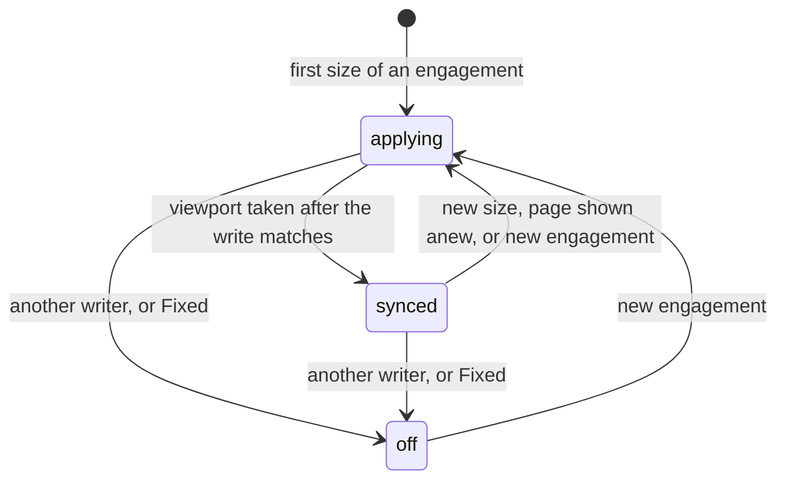
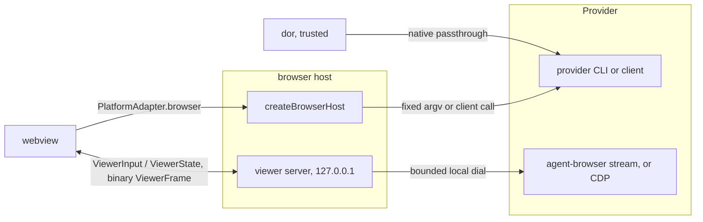

# Dor Browser Surface

> - See `docs/specs/glossary.md` for canonical Surface / Session / Pane vocabulary (a browser pane is a **browser Surface**), and `docs/specs/dor-cli.md` for the shared `dor` CLI, surface handle model, and host control plumbing this surface builds on.
> - Owns the browser Surface end to end — params, chrome, the renderers, the iframe proxy boundary. Its security boundaries are audited in `docs/specs/security-local.md`. Evidence behind the rules: [dor-browser.rationale.md](dor-browser.rationale.md).

One body component renders all web content: `BrowserPanel`, persisted as
`surfaceType: 'browser'` with a swappable `renderMode`. Two axes define a browser
pane — its **target** (today always a bare URL; process-backed targets belong to
the **dor-tools** scope, `docs/specs/dor-tool.md`) and its **render** mode
(`agent-browser-screencast`, `agent-browser-popout`, `playwright-screencast`, `playwright-popout`, `iframe`). **Render is a pane parameter, never a
separate surface kind**; `docs/specs/glossary.md` owns the `kind` / `render_mode`
mapping.

Browser entry points take a URL, a schemeless `host:port`, or a terminal Surface
handle (`docs/specs/dor-cli.md` → Browser Open Target Resolution):
`dor agent-browser ...` and `dor playwright ...` bind the user's own installed
CLI to a browser pane; `dor iframe <url>` uses the
[Iframe Renderer](#iframe-renderer).

Source of truth: `lib/src/components/wall/BrowserPanel.tsx`,
`lib/src/components/wall/browser-surface.ts` (`resolveRenderMode`),
`lib/src/components/Wall.tsx` (`createContentSurface`).

## Providers

An automated renderer belongs to one **provider**, the CLI that drives its
browser. **Must read every per-provider fact from the one registry** — render
modes, CLI, binary for `dor`, the hosts and the webview; label
and viewport hint for the GUI — never a ternary on the provider or a mode
prefix. **Must spell provider names in full and lowercase in UI, commands and renderer identifiers**, including public `render_mode` and `dormouse.yml` `render` values; abbreviated modes are not aliases. `parseRenderMode` reads anything
but a provider's mode as `iframe`.

**Must name automated actions by provider, with one "switch to <provider>" link
shown only when another provider is available.** The remembered preference
defaults to agent-browser, falling back to an available provider; the Display
modal opens on the current browser's provider.

Source of truth: `BROWSER_PROVIDERS` and `parseRenderMode` in
`dor-lib-common/src/browser-providers.ts`; `BROWSER_PROVIDER_GUI` in
`lib/src/components/wall/browser-automation.ts`; `BrowserProviderSwitch` in
`lib/src/components/wall/BrowserProviderSwitch.tsx`.

## Canonical Params

Invariants on the flat persisted `BrowserPanelParams`:

- **`renderMode` is canonical**; an absent one resolves to `iframe`, never to a
  live agent-browser. **Only params may omit it** — a live `ScreenSnapshot`
  always carries one.
- **`url` is the canonical target** across render swaps and relaunches.
  Agent-browser mirrors the newest http(s) active tab URL into it — the host
  relaunches at nothing else; iframe persists only navigations initiated by
  Dormouse chrome.
- **Must keep persisted browser params flat**; `browserViewport` stores resolved
  sizing, and `launchFallback` may carry restore params. **Must derive
  popped-out presentation from `renderMode`**, never a separate persisted flag.
- **Never carry a stream in params**: the port `dor agent-browser` reads, or the stream
  the host's `attach` answers for `dor playwright`, goes straight to the Surface's
  controller (rationale).
- **`contextPortKey` is persisted like any other param**, carried only by a
  Surface the pane context menu opened for a port
  ([Pane Context Menu Connect](#pane-context-menu-connect)). **Must keep
  agent-browser's provider suffix `agent`**, the value persisted before
  Playwright existed, so a restored pane still matches.
- **Never move a browser Surface's DOM, and never let a minimize unmount it**
  (rationale): a minimize **parks** the leaf (`docs/specs/tiling-engine.md` →
  "Parked leaves"), so the document returns with scroll, form, and script state
  intact. A restart is still a cold load: every param above survives it, no
  document state does.

Source of truth: `BrowserPanelParams` in `lib/src/components/wall/BrowserPanel.tsx`.

## Placement And Lifetime

**Must share one placement rule across browser entry points**:
replace an untouched, helper-less *terminal* caller in place, else split next to
the reference surface. **Never replace a reference that already has a browser** —
web content is not destroyed to make room. A replacement transfers the target
Surface's `surface:N` ref to the new browser Surface id. The pane context menu
never replaces ([Pane Context Menu Connect](#pane-context-menu-connect)). Helper callers follow `docs/specs/dor-cli.md` → Helper callers and targets.

**Must open focus-neutrally**, like `dor ensure`, except a Pane Context Menu
placement and `docs/specs/layout.md` corner case #6.

- **Must unpark a doored pane before killing it**, so its DOM dies with the Surface.
- **Killing an automated pane — or swapping away from that renderer — must go
  through `closeBrowserSurface`**: it closes the session through the controller
  (or from params when none holds it) and releases every client resource.
  **The Surface's work still in flight never outlives the close**
  ([Browser Host](#browser-host)).
- **A Workspace transfer releases its browser controllers without closing their
  sessions**; the destination attaches to them, or opens the same named session
  a launch was opening. **An abandoned launch closes only a session the host
  minted.**
- An iframe view's proxy grant ends with its lease
  ([Iframe Proxy Leases](#iframe-proxy-leases)).

Source of truth: `createContentSurface` in `lib/src/components/Wall.tsx`,
`closeBrowserSurface` in `lib/src/components/wall/agent-browser-surface-controller.ts`,
`prepareWorkspaceTransfer` in `lib/src/components/wall/workspace-transfer.ts`.

## Resource Policy

**Sight** — can anyone see a Surface's pane: its window (VS Code: webview) is
shown, its Workspace active, its leaf unparked, and no other leaf zoomed over
it. **Must derive sight in one pure place from the existing View states**
(`Doored`, `Hidden` arrive as parked). A popped-out pane's window is its
consumers' concern. **The VS Code extension must tell its webview whether it is
shown**, on each (re)initialization and change (rationale).

- An unseen screencast parks ([Browser Connection](#browser-connection)).
- An iframe proxy grant follows its view's lease, not sight
  ([Iframe Proxy Leases](#iframe-proxy-leases)).
- **Never evict or reload a minimized iframe page to bound resources**; past
  `RETAINED_PAGES_WARN_ABOVE` of them a Baseboard shows a quiet count, never a
  modal (`docs/specs/layout.md` → Baseboard places it).

Source of truth: `lib/src/lib/surface-sight.ts`,
`useSurfaceVisibility` in `lib/src/components/wall/use-surface-visibility.ts`,
`lib/src/components/RetainedPagesIndicator.tsx`.

## Browser Chrome

Chrome is keyed by a screen controller. **Both renderers must register one
unconditionally**; render swaps are separately host-gated. A Tool's header keeps
only its Display trigger (`docs/specs/layout.md` → Pane header).

**The Display trigger shows a capability-first identity, labelled
`<provider> <view>`, and browser Doors reuse it** (rationale):

| Display | Icon cluster |
| --- | --- |
| resizes with pane (`syncEngaged`) | wide robot + frame corners |
| fixed size | wide robot + picture-in-picture |
| popout | wide robot + arrow-square-out |
| iframe embed | frame corners only |

**The URL editor follows CLI scheme selection plus bare loopback → `http://`
and bare remote → `https://` (`normalizeNavUrl`; rationale), and refuses any
other scheme**, since no renderer opens one.

Source of truth: `lib/src/components/wall/SurfacePaneHeader.tsx`,
`lib/src/components/wall/BrowserDisplayIcon.tsx`,
`lib/src/components/wall/browser-url.ts`.

## Dev-Server Chip

For loopback URLs (`localhost`, `*.localhost`, `127.0.0.1`, `::1`) the header
asks which terminal-backed Surface — mounted, or a minimized Door — serves the
port (`PlatformAdapter.getOpenPortsMany`).

- **Show a chip only when exactly one candidate Surface owns that port**; zero
  or two-plus leave it unsettled, so a later dev server still matches.
- **Match only binds that serve localhost** — loopback or any-interface
  (`0.0.0.0`, `::`), never a specific non-loopback bind.

Source of truth: `lib/src/components/wall/use-dev-server-ports.ts`,
`servesLoopback` in `lib/src/components/wall/port-url.ts`.

## Pane Context Menu Connect

**Must scan once per context opening**, using the shared per-port URL selection
in `docs/specs/dor-cli.md` → Browser Open Target Resolution; a failed scan is
distinct from no listeners. **Must offer system browser, iframe, and each
provider's screencast and popout for the selected port.** **Opening a browser
from context always preserves the source terminal, including an untouched one.**

**Must reuse targets per source, port, and provider**: a provider's screencast
and popout share a browser session. **A reuse is one intent,
`setRenderMode(mode, { url })`, reaching the Surface's controller by id**
(`requestBrowserRenderMode`), so a mode switch relaunches at the port's page
rather than racing a navigation into it, even in an unmounted Door. Minimized
targets are reattached, closed ones recreated.

**A new automated target starts its controller before any Pane exists; the
split appears, and takes focus, only once the host confirms startup, without
waiting for page load** (rationale). A failure reports in context without changing layout or
focus; concurrent requests for one target are serialized.

**Must dismiss context after a successful placement or reuse, leaving focus on
the browser**; a failed or
cancelled launch keeps it open, and a completed launch never dismisses a
replacement context. **Must cancel pending placement when its context closes or
is replaced, its source disappears or minimizes, or its Workspace deactivates
or closes**, closing a browser that arrives after cancellation or cannot be
placed.

Source of truth: `openContextPort` in `lib/src/components/Wall.tsx`;
`prepareForPlacement` in `lib/src/components/wall/agent-browser-surface-controller.ts`;
`listenerUrlsByPort` in `lib/src/components/wall/port-url.ts`.

## Display Modal And Render Swaps

**The Display modal is the GUI for render mode and screencast resolution.**
**Must offer only the render modes the Surface's screen controller declares**
(`renderModes`), never the host's global capabilities: both presentations of a
provider its host drives (`browserProviders`), the running one's screencast even
where it does not; always `iframe`; for a Tool, only its declarable renders
(`docs/specs/dor-tool.md` → Declaring tools). **`setRenderMode` refuses any
other mode.** Screencast resolution is Resize with pane or Fixed size; device
emulation is CLI-only.

**Resize with pane is owned by the host** (rationale), which reports each
engagement's state to its panes:

- **Must send the pane's laid-out CSS size — never `getBoundingClientRect()`,
  which a Workspace presentation scales — and display ratio over the viewer
  socket while engaged, never from a popped-out pane.**
- **Each choice of Resize with pane is a new engagement**, named in every size
  sent, which reclaims the viewport even at the size last written.
- **The host serializes all viewport writes per browser**, through the provider's
  viewport primitive, never while a launch or close settles it; a write in
  flight keeps only the latest pane size.
- **The host judges a write only by a viewport taken after it landed**, as the
  provider vouches for it: agent-browser's changed frames, Playwright's poll
  measurement; never `status`, Playwright's screencast metadata, or the ratio
  (rationale). **One still differing a settle window later, with no write
  since, is another writer's**, and no later size of that engagement is
  written. **A page shown anew (the
  active tab) is written, never judged.**
- **A Fixed viewport ends the browser's sync**, after its write in flight;
  **refused if a launch or close of that browser began meanwhile, or the host
  shut down**. **Must carry the pane's ended engagement to the host, which
  rejects its later socket intents even when none arrived before Fixed.**
- **The webview disengages only on the host's `off` for its engagement.**

**Must persist resolved viewport settings**, restoring them when the browser is
recreated without rereading a preset definition.

| From -> To | Behavior |
| --- | --- |
| `iframe` or the other provider -> `agent-browser-*` / `playwright-*` | **The pane swaps at once** to a session-less pane whose controller launches at the current URL, headed for a popout (rationale). **A failed launch restores the previous renderer in place** (`launchFallback: { restore }`), even minimized: the embed, or the previous provider reopened in its own session, keeping its `key` (rationale). Inert without the capability. **A non-http(s) `url` refuses the swap** (`browserSurfaceUrl`). |
| `agent-browser-screencast` <-> `agent-browser-popout` | Same Surface id and session, headed/headless relaunch; preserves only the active URL. |
| `agent-browser-*` -> `iframe` | Uses canonical `params.url`; with multiple tabs, requires confirmation, because only the active tab survives. |

Source of truth: `lib/src/components/wall/AgentBrowserScreenModal.tsx`,
`offeredRenderModes` in `lib/src/components/wall/browser-automation.ts`,
`onSwapRenderMode` in `lib/src/components/Wall.tsx`, `createViewportSync` in
`lib/src/host/browser-sync.ts`.

## Viewport presets

**Must default new automated screencasts to fixed `desktop` sizing**, independent of pane layout; splitting, resizing, minimizing and maximizing change presentation only. **Must preserve live browser sizing on reuse**, including native resize/device choices and externally attached browsers. Iframes remain pane-sized; popouts remain window-sized.

**Must resolve the nearest ancestor `dormouse.yml` browser settings over user configuration over built-ins**, using the browser's bound working directory. A named preset replaces its whole lower-priority definition. `pane-sync` is reserved and cannot be redefined. `browser.default_viewport` defaults to `desktop`; a Tool's explicit viewport takes precedence. User-only Tool lookup excludes project settings. Browser configuration is data and grants no Tool execution authority. **Must parse browser preferences independently of Tool declarations**; invalid YAML or browser settings still fail explicitly.

**Must preserve the current device-pixel ratio when DPR is omitted.** A requested ratio unsupported by the provider fails before changing dimensions; playwright can accept only its current context ratio. **Never turn an observed playwright DPR into an explicit request for future contexts.** Presets describe viewport geometry, not devices.

**Must apply initial dimensions before the destination page's first script runs**, for managed CLI, GUI and Tool launches. Deferred `pane-sync` launches start at a fixed size until placement; **must engage sync when resolving that preset and send the actual pane dimensions on first attach**. A failed initialization never navigates at a silently substituted size. **Must apply a renderer and viewport chosen together to the new renderer**, not discard sizing during a swap.

**Must query the active page's measured CSS dimensions and DPR**, never infer them from the pane or screenshot. Dormouse sizing commands require an existing bound Surface, never create a browser, and use the same serialized writes as the Display modal; their contract is `docs/specs/dor-cli.md` → Browser viewport control.

Source of truth: `resolveBrowserViewport` in `dor-lib-common/src/browser-viewports.ts`; `parseBrowserConfig` in `lib/src/host/browser-config.ts`.

## Automated Browser

**Dormouse is a viewer/client for the user's installed provider CLI** — it
neither bundles nor forks a browser. `dor agent-browser` / `dor playwright` extract identity flags, handle
`dor-embed-size` and prepare initial sizing ([Viewport presets](#viewport-presets)); native commands then run against the resolved session, and flags
Dormouse does not model pass through (`docs/specs/dor-cli.md` → Browser Surface Addressing).
The webview's two channels:

**Must resolve new GUI launches in a fresh shell environment**, in the browser's
cwd while it exists (rationale): the host runs the staged `dor __launch-env`
helper through a short-lived, pipe-backed shell, creating no terminal Surface,
so it captures exported startup settings, not an already-running terminal's
mutations or prompt hooks. **Must preserve the selected shell's initialization arguments**, replacing stay-open flags with the helper command. The shell is VS Code's selected native one, else:

- **POSIX:** `SHELL`, then the account shell, as an interactive login shell
  (csh and tcsh interactive only).
- **Windows:** ComSpec; PowerShell loads profiles. **Must pass explicit cmd.exe command strings verbatim**, without MSVCRT quote escaping. A WSL selection uses ComSpec: browser providers and their Playwright library run on the native host, not in a WSL distribution.

**Must retain that environment only for the browser session's lifetime**, for
provider discovery, CLI commands, and daemon state paths. **Must close without
starting or waiting for a shell**, using the session environment when available,
otherwise the host environment and validated binding. A close, failed
initialization, or host shutdown discards it; a close refuses launches it
overtook. **Never send this environment to the webview, persist it, or include
helper output in diagnostics.** A failed initialization is reported without
falling back to the GUI environment.

**Must resolve each new GUI browser independently**, without borrowing another
session's executable; `dor` resolves from its calling terminal. **Must spawn
provider CLIs through `spawnAndCapture`**, including absolute executables
(`docs/specs/dor-cli.md` → Spawning External Binaries).

Source of truth: `browserLaunchEnv` in `lib/src/host/browser-launch-env.ts`,
`createBrowserHost` in `lib/src/host/browser-host.ts`. The launch environment
is pinned on native Windows and macOS by `lib/src/host/browser-launch-env.test.ts`
(`.github/workflows/ci.yml`).

### Managed identity

- Default is `--key default`; **`--key <name>` must match `[A-Za-z0-9._-]+`**,
  because it becomes part of a session name that becomes a filesystem path.
  Identity-flag exclusivity: `docs/specs/dor-cli.md` → "Browser Surface Addressing".
- **A key names the Surface of that provider holding it in the answering Wall**,
  whose stored binding — session, cwd, executable — the command runs with; so a
  Surface keeps its session however keys were named when it was made.
- **A key no Surface holds is minted `dormouse.<scope>.<name>`**, scoped by the
  Workspace that will hold the browser — its *stable* id, so a strip reorder
  renames nothing. **A bare Wall, which has no Workspace id (a VS Code webview,
  the website, Pocket), mints a scope of its own for its life**, so two
  webviews' `--key default` are two browsers. A key's concurrent first
  commands share one reservation of the caller's cwd and executable
  (`BrowserBindingReservations`). **A key never mints a session a Surface anywhere in the
  Window holds, or the provider's reservation of another key**: it takes the
  first free `.2`, `.3`, … suffix (rationale).
- **Only the answering Workspace can name a key**, so `dor` asks the host
  (`surface.resolveBrowser`) before it forwards anything, and names the key
  itself (`dormouse.1.<name>`) only when there is no control endpoint at all —
  outside Dormouse, where `dor` is a pure passthrough. **Every managed
  invocation depends on the host answering** — a passthrough verb included —
  with no CLI-side fallback, which would name the wrong Workspace's browser: a
  refusal fails the command with the host's message before the binary runs
  (`docs/specs/dor-cli.md` → "Handle Model").
- GUI-spawned sessions use `dormouse.1.gui-<hex>`, minted host-wide, which no
  `--key` names; they are reachable by `--surface <handle>`. **The host answers
  only for a Surface its provider renders** — an `iframe`-rendered Surface has a
  browser but no session to drive.
- **One browser maps to one Dormouse surface**, found by its host-reported
  native identity (agent-browser: the session; Playwright: installation,
  project scope and session, which a raw `--session` shares across one
  project's subdirectories). A command for a browser that has a Surface hands
  its stream over, refreshes `binaryPath` and reuses the pane — not an invariant,
  though: a surface killed or render-swapped mid-command leaves the trailing
  request to mint a fresh pane (rationale).

Source of truth: `sessionForKey` in `dor-lib-common/src/browser-providers.ts`,
`runBrowserCli` in `dor/src/commands/browser-cli.ts`, `BrowserBindingReservations`
in `lib/src/components/wall/browser-binding-reservations.ts`,
`ensureBrowserSurface` in `lib/src/components/wall/use-dor-control.ts`.

### Browser Connection

A surface-id-keyed controller registry owns one connection per Surface, its end
of a [Viewer Socket](#viewer-socket). **The controller is Surface-scoped, not
panel-scoped** — it survives panel unmount — **and keeps the daemon/session
alive while parked.** **A view must key its controller by provider as well as
Surface id, and the registry must replace one driving the other provider**: a
controller's provider is fixed for its life.

A **stream** is what a launch or `attach` answers for a live browser —
agent-browser's daemon stream port, the host's number for a Playwright
connection — and what `view` takes back. The viewer socket exists only while the
controller is `live`.

- **Every browser operation must pass one gate (`driver`), open only while
  `live`** — chrome and Display modal actions, tabs, edit chords (rationale).
  The gate orders the Surface's own intents; the host is what keeps an
  operation off a browser mid-relaunch ([Browser Host](#browser-host)).
- **A navigation or a Fixed viewport asked for outside `live` is kept as the
  one latest intent**, run on the next `live` (a viewport never on a headed
  window); **so is a pop-out or pop-in asked before the browser is bound**, run
  as a relaunch, and so is a new `url` in params while launching (rationale).
  **A launch or relaunch opens the pending page itself; one the host opened
  never loads again** (rationale).
- **The controller never asks a daemon-spawning CLI verb for a stream**:
  streams come from a launch or relaunch answer, a `dor` handover, or `attach`.
- **A failed first launch is reported once to the Wall, which applies the
  Surface's `launchFallback`**: `close` the pane, `embed` (a Tool's iframe), or
  `{ restore }` the params a swap replaced (rationale). **A launch into a named
  session is sent only once every close of that session this webview sent has
  been answered**, whatever the transport's order; **a Surface's close is sent
  at once**, for its bound session or the one its launch names.

**Parking.** A pane that loses sight ([Resource Policy](#resource-policy)), or
whose view unmounts, parks after a debounce: its viewer socket closes, the daemon/session stays alive, and
daemon-side streaming stops because no client triggers it (rationale).

- **An unpark keeps the last good frame on screen**; a fresh reattach asks the
  host to `repaint`.
- **Never park a popped-out pane**: its viewer socket brings the window's page
  and its close, which auto-reverts, even while minimized.
- **Never set `AGENT_BROWSER_IDLE_TIMEOUT_MS`** for Dormouse-managed sessions —
  daemon self-exit when idle would defeat "alive while parked".

Input crossing to the host:

- **Must send a local paste as bounded `input_text` messages** (`viewerTextInputs`),
  never a key pair per character from the webview; the host inserts each whole
  (rationale).
- **Select-all/copy/cut go through the host `edit` operation on every
  platform**, since those chords do not survive CDP input. Undo/redo is not
  emulated.
- Tab select/close use the host `tab` operation.

Source of truth: `lib/src/components/wall/agent-browser-surface-controller.ts`
(`Phase`, `driver`), `lib/src/components/wall/AgentBrowserPanel.tsx`,
`lib/src/components/wall/agent-browser-input.ts`, `onBrowserLaunchFailed` in
`lib/src/components/Wall.tsx`.

### Viewer Socket

**The webview reaches a browser only through its host's viewer socket** —
never a daemon's stream, never CDP. One loopback listener in the host serves a
socket per Surface, onto the browser at the stream `view` names; its upgrade
gate and input rebuilding are audited in `docs/specs/security-local.md` →
"Loopback Listeners".

- **Must send state only on change, and current state to a connecting socket,
  except `sync`, which answers each size sent.** Agent-browser's `url` is an
  undeduplicated commit edge; Playwright publishes changed URLs from its poll
  (rationale).
- **A browser that goes on its own is reported `status { connected: false }`
  before its socket closes**, ending a headless pane and auto-reverting a
  headed one seen connected. A headed browser left with no page is gone after a
  grace (rationale). **A launch or close of the browser ends every socket on
  it**; a URL granted before one opens nothing.
- **A headed socket carries no frames.**
- **Must paint changed stream frames provisionally and replace them with
  host-owned device-resolution captures** (rationale).
- **Settle, then sharpen**: a page in motion paints from the stream, then gets
  one capture once it rests. **All sockets' captures share one host-wide
  budget**, spent only by a capture that starts, recent input first; **a capture outliving its slot frees it, and
  every provider bounds its capture** (rationale).

**Upstreams.** agent-browser: the daemon's stream, dialed on `127.0.0.1` only;
**a tab list or URL is state at any size**,
never taken for a frame; a paste goes as key pairs. **A headed window is
followed over its browser's CDP, held host-side and dialed on loopback only**
(rationale): its page targets, and the shown page's viewport and ratio, which
replace the daemon's own in `status` (rationale). **The CDP endpoint is asked
of a daemon once** (rationale). **Every upstream dial is bounded.** Playwright:
its CDP screencast ([Playwright](#playwright)).

Source of truth: `createViewerServer` and `BrowserView` in
`lib/src/host/browser-viewer.ts`; `ViewerState` in
`lib/src/lib/platform/browser-automation.ts`; `viewStream` and `observeWindow`
in `lib/src/host/agent-browser-host.ts`.

### Pop-Out

A popout relaunches the same session headed, because Chrome fixes
headed/headless at launch; the pane becomes a stub with Pop back in. **State
carried is only the last http(s) active URL**, and on a pop-in the window's
resolution: other tabs, DOM state, scroll, form inputs, session storage,
cookies/logins do not survive.

A pop-out or pop-in is a `launch` of the bound session ([Browser Host](#browser-host)).
agent-browser's relaunch runs `close`, **then terminates the daemon its state
files prove live ([agent-browser](#agent-browser)) and waits for it to exit**
(rationale), then reopens. **Never wait for the page to load** (rationale): the
launch resolves once the *relaunched* daemon is up. **A non-zero `open` exit
with the daemon up is a page still loading, not a failed launch**; only a launch
without a published port fails, including after a zero exit. **Never query the
daemon during the close/reopen gap** (rationale), so **Dormouse supplies the
active-tab URL and the host trusts it**.

While popped out, **the host follows the window's page and resolution and
reports it gone** ([Viewer Socket](#viewer-socket)), and a window seen connected
that goes auto-reverts to the pane. **Nothing but the pop-in's own `close` may
run a CLI verb for a browser whose window closed** (rationale).

**A pop-in, by the window closing or Pop back in, fixes the screencast at the
window's last reported viewport and ratio**: sync disengages, and that size
waits as the pending intent for the headless browser. A window that reported
none leaves sync as it was.

Source of truth: `lib/src/components/wall/agent-browser-surface-controller.ts`
(`fixViewport`), `killDaemon` in `lib/src/host/agent-browser-host.ts`.

### Browser Host

**Every browser operation rides one `PlatformAdapter.browser(request)`**: a
provider-tagged `BrowserRequest` answered by a `BrowserResult`. A host lists
the providers it drives in `browserProviders`; one without them (the web demo)
offers no automated renderer. VS Code runs the shared host in the extension
host; standalone runs the bundled copy in the sidecar behind one Rust command.
**No frame rides a request's transport**: frames reach the webview over the
[Viewer Socket](#viewer-socket), never the sidecar stdio PTY traffic shares.

- **`launch`** without a session opens an http(s) `url` in a new GUI session;
  with one, it navigates the browser when it is up in the mode asked for, else
  relaunches it headed or headless at `url`. It resolves when the browser is up,
  not when the page loads.
- **`attach` and `measure` never start a browser**, except that `attach`
  relaunches a gone one at the page its caller names, answering `relaunched`;
  one it cannot view is left alone.
- **Arbitrary CLI arguments, JavaScript and CDP methods are unavailable through
  the webview channel**: each operation is one fixed argv or client call, and
  `edit` runs fixed host-owned JS plus an OS clipboard write. The trusted `dor`
  process keeps native passthrough.

**Every transport waits `BROWSER_REQUEST_TIMEOUT_MS` for any reply**, past
agent-browser's own 25 s action timeout, so the webview never re-asks while the host
still works.

**Must run one lifecycle for both providers**, whose native primitives are
canonical in `BrowserProvider`:

- **Must serialize a browser's launches, relaunching attaches and closes per
  native identity**, in arrival order, so two panes restoring one session
  relaunch it once. **A close runs after the launch or attach already running,
  closing what it brings up, and supersedes one sent before it that has not
  begun** (rationale). **A close also cancels, by webview-minted `requestId`,
  the closing Surface's own launches, relaunches and page-naming attaches still
  unanswered; one arriving after it opens nothing.**
- **A launch naming a session whose browser is up in the mode it asks for
  must navigate it, never stop it** (a Tool re-announced); only one gone or in
  the other mode is relaunched (rationale). agent-browser cannot report its
  mode: one this host did not launch headed counts as headless.
- **Must refuse every operation but `launch`, `attach` and `close` on a
  browser a launch is replacing or a close is ending**, `view` included, until
  it is done, whichever Surface asks.
- **Must answer a launch inside `BROWSER_REQUEST_TIMEOUT_MS`**, queueing
  included. **A launch that gives up must let its `open` land briefly before
  closing the session**, and close again when a later `open` lands unless a
  newer launch owns the session (rationale).
- **Once `open` returns, only a still-current launch closes stray blank and
  new-tab pages (`isBlankUrl`), and only while a real page is open**, so it
  never closes the sole tab (rationale).
- **Every provider call a browser's queue waits on must be bounded**, and so is
  shutdown's wait on the queue (rationale).
- **A headed launch is tracked for shutdown before it starts**, so a window
  whose page never loads is still closed. **Shutdown supersedes pending
  launches and sweeps, then closes every tracked headed browser**, so quitting
  orphans no window.

**Host-side validation is the security boundary: `parseBrowserRequest` rebuilds
every request field by field before a provider sees it** — a known provider and
operation, an http(s) navigation or new-session URL, bounded dimensions, a tab
id that cannot read as an option, a session name neither CLI reads as an option
or a path, and bounded request ids (rationale).

**`binaryPath` crosses from the webview realm, so it is checked at the spawn**
(rationale). Accepted: the provider's executable by file name — absolute, or
bare and resolved on `PATH` — plus the host's own override variable by exact
match (`DORMOUSE_AGENT_BROWSER_BIN`, `DORMOUSE_PLAYWRIGHT_BIN`). **A refused
path is dropped, never fatal**, so the host's own candidates
run. The webview applies the same predicate before sending or storing one.

**A crisp capture a CLI writes lands in a fresh, randomly named file in a
private per-process `mkdtemp` directory (mode `0700` on Unix), is read into
memory and deleted — read or not, failed or killed — and the directory is
removed at shutdown** (rationale). **One capture per browser is in flight**;
a viewer socket asking meanwhile joins it, never one from before the browser's
close or relaunch. Windows permission limits are `docs/specs/security-local.md`
-> "Browser panes".

Source of truth: `parseBrowserRequest` and `createBrowserHost` in
`lib/src/host/browser-host.ts`, `isAllowedBinary` in
`dor-lib-common/src/browser-providers.ts`, `BrowserRequest` in
`lib/src/lib/platform/browser-automation.ts`, `createBrowserCaptures` in
`lib/src/host/browser-capture.ts`, `vscode-ext/src/agent-browser-host.ts`,
`standalone/sidecar/main.js`. The lifecycle is pinned by
`lib/src/host/browser-host.test.ts`.

### agent-browser

What is agent-browser's alone: its per-session daemon, the state files beside
its socket, the pid kill a relaunch needs ([Pop-Out](#pop-out)), and one fixed
argv per operation. `--headed` is a no-op against a *live* daemon; only a
relaunch changes the mode.

- **`attach` reads the live port from `<session>.pid` / `<session>.stream` and a
  port probe, never spawning** — any CLI verb starts a daemon at `about:blank`
  to answer. A daemon up but not streaming is left alone. **A state file
  written before this boot reads as absent.**
- **Never signal a pid its state files do not prove to be the session's live
  daemon** (`liveDaemon`): named by a pid file from this boot, alive, beside a
  stream port that accepts, checked before `close` (rationale).
- **Only a launch's own steps may run a CLI verb with no daemon up**: an
  operation, a capture or `get cdp-url` runs only on that same proof; **a stream
  is captured only when the proof names its port**.
- **A launch runs `open` in the binding's project directory while it exists**,
  so a relaunch reads the same `./agent-browser.json` the `dor agent-browser` there did;
  every other call runs in the host's.
- **`dor agent-browser` must read the stream port itself after a command that may bind**
  (`stream status --json`) and hand it over; the host views it on loopback
  without reading the caller's socket directory (rationale). **Never carry a
  socket directory to the host** — it kills the pid it reads there.
  **Host-side operations and captures for a session in a socket directory the
  host does not share are refused**; its viewer socket still sends every
  changed frame, and a close runs the CLI under the session's shell environment.
- **The post-launch sweep lists and closes page targets over the browser's
  CDP, never `tab list`** (rationale).

Source of truth: `createAgentBrowserProvider` in
`lib/src/host/agent-browser-host.ts`, `streamStatus` in
`dor/src/commands/agent-browser.ts`.

### Playwright

**Must use the user's installed `@playwright/cli`, resolved from `DORMOUSE_PLAYWRIGHT_BIN` or `PATH`**, with `playwright-cli` as the accepted executable name under the agent-browser rule for `binaryPath`. GUI launches use Chromium. Native commands retain Playwright semantics: `open` restarts, `goto` navigates; commands for unsupported engines still run, with a viewer warning. The viewer requires CLI 0.1.19's local browser-binding endpoint; installation errors name this requirement. **A Playwright session lives in its CLI project scope, so a binding's cwd and executable pin every later command**, relative paths included; `--session` uses the caller's own scope. GUI Connect inherits the source terminal's cwd; a swap without one uses the host cwd.

**Must discover the native session in its CLI project scope and connect using that installation's matching Playwright client.** Accept only a unique registry entry matching session, workspace and library, with a local pipe endpoint and Chromium engine. **Never load modules from the registry's library path**; the host derives the client from the validated CLI installation. **`attach` relaunches at the page only when the registry lists no browser for the session**, never one it cannot view; `dor playwright`'s binding attaches with no page. It reports the browser's headedness, and **the controller must apply a host-reported mode before the new stream**, so sync never sizes a headed window, except mid-relaunch or as an echo. Native CLI tabs and the pane share the selected tab, which the host polls while viewed.

**Every CLI call a launch waits on is killed at its deadline; every other one is bounded, except `open`**, whose end could take its browser down. Viewer disconnect alone leaves the CLI browser alive; **a browser that disconnects on its own is reported gone to its viewers**. **A screencast that fails to start must forget its page**, so the next poll retries.

Frames come from the CDP screencast, **decoded once with acknowledgements paced** (rationale); a paste is inserted with CDP `Input.insertText`. **Must drop a frame byte-identical to the last, still acknowledging it** (rationale).

**Must write a page's viewport only through Playwright's own `setViewportSize`** — sync and a Fixed size alike — **never a CDP metrics override from the host's session** (rationale). **Must preserve the browser context's measured ratio when DPR is omitted, and reject an explicit different DPR before writing dimensions.**

Source of truth: `createPlaywrightProvider` in `lib/src/host/playwright-host.ts`; `resolvePlaywrightInstall` in `lib/src/host/playwright-install.ts`; `followParamsHeadedness` in `lib/src/components/wall/agent-browser-surface-controller.ts`. `lib/src/host/playwright-host.test.ts` runs against a real CLI when `DORMOUSE_PLAYWRIGHT_TEST_BIN` is set.

## Iframe Renderer

`dor iframe <url>` frames the page's own DOM — zero-lag for human inspection, but
agents cannot drive or read it. On hosts with `createIframeProxyUrl`,
`IframePanel` frames a per-grant loopback proxy URL; without it, a raw
uninstrumented iframe. The desktop playground's fronts only its own viewers
(`docs/specs/tutorial.md` → Playground filesystem).

The proxy instruments any `http://` upstream, loopback and remote alike:

- Headers are rewritten per the table below and the shim injected into HTML;
  HTTP and WebSocket traffic passes through. **A site's "do not embed" is
  overridden, not obeyed** (rationale); JS framebusting is neutralized
  separately, by the sandbox.
- **Every panel error but a non-http(s) URL offers Open in agent-browser** (a
  swap to `agent-browser-screencast`) where the host can launch one, with
  `dor agent-browser open <url>` as the fallback text.
- **Must refuse link-local / cloud-metadata address literals (`scheme`) after
  canonicalizing equivalent spellings**, including decimal/octal/hex, short
  forms, and IPv4-mapped IPv6. This checks the URL's hostname literal, not DNS
  answers; named targets remain the user's command authority.

**Must refuse `https://` at every entry to the iframe renderer on a host with
the proxy, in the one `IFRAME_HTTP_ONLY` wording** (a host without it frames
https raw):

| Entry | Outcome |
| --- | --- |
| `surface.iframe` (`dor iframe`) | refused before any pane opens, naming `dor agent-browser open <url>` |
| Display modal | iframe option disabled, showing the wording |
| Render swap to `iframe`, tool or not | refused, judged on the page on screen (chrome URL, then `params.url`) |
| New-tab request from a framed page | `agent-browser-screencast` where supported, closed on a failed launch; otherwise the iframe refusal |
| A pane already holding one | `scheme` panel error |

Header rewriting:

| Direction | Header | Treatment |
| --- | --- | --- |
| request | `Host` | upstream host |
| request | `Origin` | upstream origin **only** when it is the proxy's own; else forwarded untouched (absent stays absent), on request and upgrade paths |
| request | `Referer` | an exact parsed proxy origin replaced with the upstream origin, path and query kept |
| request | `Accept-Encoding` | deleted on a document load (`Sec-Fetch-Dest` `document`, `iframe`, `frame`, `embed`, `object`, or none sent), so its HTML comes back identity; kept on every other request |
| request | `Cookie` | dropped, including WebSocket handshakes |
| response | `Set-Cookie` | dropped, including successful and refused WebSocket handshakes |
| response | `X-Frame-Options`, CSP headers | with validated chain, replaced by `frame-ancestors 'self' <validated chain>`; opted-in CSP policies remain alongside it (rationale) |
| response | `X-Dormouse-Preserve-CSP: 1` | consumed; preserves upstream CSP headers and meta policies |
| response | hop-by-hop (RFC 7230 §6.1) | dropped |
| response | `Location` | an exact upstream origin rewritten back to the proxy origin, so a redirect stays inside the proxy |
| response | `Vary` | `Sec-Fetch-Dest` appended, since the `Accept-Encoding` sent upstream depends on it |
| response | `Clear-Site-Data` | `"cache", "storage"` on a freshly minted grant's first frame load only: its port may have fronted another upstream |
| response body | `<meta http-equiv="content-security-policy">` | removed unless the response opts into CSP preservation |

**Must update this table whenever header rewriting changes.**

**Must instrument only an identity-encoded, ASCII-compatible HTML body, and keep
its `content-type` as sent**, charset included; a compressed body, or a UTF-16
one (any WHATWG label, or a byte-order mark), passes through uninstrumented
(rationale). **Never place the shim ahead of the doctype, a `<meta charset>` or a
UTF-8 BOM.**

**Must preserve enforced and report-only CSP verbatim when the upstream response sends `X-Dormouse-Preserve-CSP: 1`**, for every MIME type, adding the validated ancestor policy separately. **Never infer this opt-in from request headers.** Additional upstream restrictions may prevent framing or shim execution. (rationale)

**One dedicated `127.0.0.1:0` server per grant, with no token in the path** — the
origin itself is the grant boundary (rationale). A grant asked for without a
lease has a sliding idle TTL and a hard cap; **a request the `Host` check
refuses never refreshes the TTL**, so a stranger cannot hold one open.

Current limits: absolute-origin subresources (`http://localhost:5173/...`,
`ws://localhost:5173/...`) bypass the proxy uninstrumented — acceptable for
loopback; and the shim reclaims only Dormouse control messages, leaving ordinary
keyboard and pointer interaction inside the frame by design.

Source of truth: `lib/src/components/wall/IframePanel.tsx`,
`lib/src/host/iframe-proxy.ts`, `lib/src/host/iframe-proxy-rewrite.ts`
(`instrumentHtml`, `isBlockedAddress`), `IFRAME_HTTP_ONLY` in
`lib/src/lib/platform/iframe-proxy-types.ts`, `iframeRefusal` in
`lib/src/components/wall/browser-url.ts`.

### Iframe Proxy Leases

**Every mounted `IframePanel` takes its grant under a lease** it mints, held
under an **owner the host transport names** (VS Code router, standalone window
label), never the webview.

- **A leased grant has no idle TTL and is never evicted.** It ends, with every
  connection and upgraded pipe, when its lease is released (unmount), its owner
  reinitializes or ends, or the lease moves to another upstream origin
  (rationale).
- **The same lease, upstream origin and embedder chain reuse the grant**, so
  Reload, Back and Forward keep the page's origin and storage.
- **Leases are bounded by `MAX_IFRAME_LEASES`; past it a new one is refused,
  never made room for.**

Source of truth: `createIframeProxyUrl` and `releaseIframeProxyLease` in
`lib/src/host/iframe-proxy.ts`, `attachRouter` in
`vscode-ext/src/message-router.ts`, `iframe_release_proxy` in
`standalone/src-tauri/src/lib.rs`.

### Iframe Shim

**Must send only fixed shim message kinds to the app** — `leader`, `pointerdown`, `location`, `open-window`, `theme-request`; `location` carries
`loaded: true` only on the document's own `pageshow`/`DOMContentLoaded` report.
**Must relay only `leader`, `pointerdown`, and `open-window` from nested documents.** **`open-window` intercepts nonempty anchor targets other than `_self`, except
links with `download`, plus `window.open`.** Theme delivery is `docs/specs/theme.md` → Tool iframe themes; `theme-request` stays in the outer document.

**Only `http:` and `https:` reach a browser Surface, re-checked at the sink.**
`open-window` and the control socket's `surface.iframe` go through
`browserSurfaceUrl`, and `IframePanel` checks `params.url` again before framing
it — the header's URL editor writes there too. (rationale)

**Parent listeners must validate the message origin against live proxy grants.**
Leader messages feed the same Wall command-mode exit path as in-document
dual-tap; `IframePanel` maps proxy-origin `location` URLs back to upstream URLs
for chrome/history without reloading the frame. A new-tab request asks before
opening an adjacent browser pane.

**Once a proxied frame's shim has reported, a `load` with no `location` report
soon after marks the document uninstrumented** (not HTML, off the proxy, refused,
or its grant gone), and a banner offers Reload and Open in agent-browser. Only a
`loaded` report naming the proxy origin counts; a new frame source waits for its
first report again (rationale).

Source of truth: `iframeShim` in `lib/src/host/iframe-proxy-rewrite.ts`,
`browserSurfaceUrl` in `lib/src/components/wall/browser-url.ts`,
`lib/src/lib/iframe-proxy-registry.ts`, `lib/src/components/wall/IframePanel.tsx`.

### Iframe Focus And Rendering Notes

- Cross-origin iframe focus blurs the parent window while `document.hasFocus()`
  remains true; **focus code must distinguish this from app backgrounding**.
- **Every framed page is sandboxed, proxied or raw** (rationale), and the
  `sandbox` omits `allow-top-navigation` to block framebusting.
- **The `allow` attribute grants no device or clipboard-read permission** —
  `autoplay`, `clipboard-write`, `fullscreen` only. (rationale)

Source of truth: `lib/src/components/wall/IframePanel.tsx`, `subscribeWindowFocus` in `lib/src/lib/window-focus.ts`.

## Iframe Host Capability And CSP

The optional `PlatformAdapter.createIframeProxyUrl` method and the
`IframeProxyResult` union are canonical in the platform types, as is
`releaseIframeProxy`, which ends a lease. Reachability is
diagnosed lazily by served error pages, and frame refusal only as an
uninstrumented load ([Iframe Shim](#iframe-shim)). VS Code routes the request
to `vscode-ext/src/iframe-proxy-host.ts`; standalone through the sidecar's
`iframe:createProxyUrl`. The VS Code webview CSP must allow loopback frames
(`docs/specs/vscode.md` → CSP policy).

**The webview passes its own ancestor chain with every request for a proxy
URL** — `location.origin` plus `location.ancestorOrigins`, knowable only in the
realm that has a `location` (rationale). **Validated host-side and used
all-or-nothing**: an unparseable or opaque (`"null"`) entry means no chain
(rationale). **With no chain the proxy preserves framing headers and injects
nothing.**

Security boundaries — the `Host`, `Origin`, cookie, `frame-ancestors`, shim
targeting and grant-refresh rules are audited in `docs/specs/security-local.md`
→ "Loopback Listeners" and "Browser panes"; **never relax one without updating
that audit**:

- the proxy binds loopback only — a mitigation, **not** the boundary;
- each grant fronts exactly one upstream;
- no user script is injected;
- link-local/cloud-metadata address literals follow [Iframe Renderer](#iframe-renderer);
- every other user-supplied `http://` target is trusted as the user's command,
  at the cost of the upstream's own XSS policy unless it opts into preservation.

**`'self'` in the replacement policy permits same-grant nesting; foreign
ancestors fail.** `isOwnOrigin` and `isForeignOrigin` are not each other's
negation — an *absent* `Origin` keeps refreshing an unleased grant's idle
timer (rationale).

Source of truth: `lib/src/lib/platform/iframe-proxy-types.ts`,
`embedderOrigins` in `lib/src/lib/embedder-origins.ts`,
`normalizeEmbedderOrigins` in `lib/src/host/iframe-proxy-rewrite.ts`,
`lib/src/host/loopback-guard.ts`. Pinned by `lib/src/host/iframe-proxy.test.ts`,
which covers the upgrade path as well as the request path.

A moved iframe Surface remounts at its saved URL after consent: `docs/specs/layout.md` → Moving Surfaces between Workspaces.

## Future

- Stable agent-browser profile/state persistence so pop-out preserves logins,
  cookies, tabs, DOM state, and scroll.
- Upstream support for stream keyboard `commands`, replacing the host edit
  workaround and enabling undo/redo.
- General per-surface teardown hook for future Dormouse-owned backend
  processes; agent-browser surfaces already dispose their controller on
  kill/swap, and iframe views release their leases.
- Process-backed targets are owned by the **dor-tools** scope
  (`docs/specs/dor-tool.md` `## Future`), which subsumes the plugin/backend
  target axis formerly staged here.
- Optional terminal-side "this port is viewed by surface:N" indicator.
### Daemon-owned crisp captures

Replace spawn-per-shot CLI screenshots only with a daemon-owned capture channel
or an upstream answer exposing current viewport and DPR. **Must retain
device-resolution output and external viewport/device changes without adding a
second viewport writer.** The host cannot reconstruct an externally chosen DPR
from screencast frames; a host-owned CDP metrics override is safe only while
sync-to-pane owns the values. (rationale)
