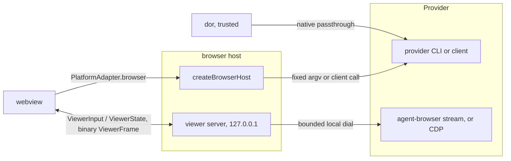

# Dor Browser Surface

> - See `docs/specs/glossary.md` for canonical Surface / Session / Pane vocabulary (a browser pane is a browser Surface), and `docs/specs/dor-cli.md` for the shared `dor` CLI, surface handle model, and host control plumbing this surface builds on.
> - Owns the browser Surface end to end — params, chrome, the renderers, the iframe proxy boundary. Its security boundaries are audited in `docs/specs/security-local.md`, whose `FAIL IF` lines own the properties this spec's mechanisms serve. Evidence behind the rules: [dor-browser.rationale.md](dor-browser.rationale.md).

One body component renders all web content: `BrowserPanel`, persisted as `surfaceType: 'browser'` with a swappable `renderMode`. A browser pane has a target (today always a bare URL; process-backed targets belong to the **dor-tools** scope, `docs/specs/dor-tool.md`) and a render mode (`agent-browser-screencast`, `agent-browser-popout`, `playwright-screencast`, `playwright-popout`, `iframe`). **Never make render a separate surface kind**: it is a pane parameter, and `docs/specs/glossary.md` owns the `kind` / `render_mode` mapping.

Browser entry points take a URL, a schemeless `host:port`, or a terminal Surface handle (`docs/specs/dor-cli.md` → Browser Open Target Resolution): `dor agent-browser ...` and `dor playwright ...` bind the user's own installed CLI to a browser pane; `dor iframe <url>` uses the [Iframe Renderer](#iframe-renderer).

Source of truth: `lib/src/components/wall/BrowserPanel.tsx`, `lib/src/components/wall/browser-surface.ts` (`resolveRenderMode`), `lib/src/components/Wall.tsx` (`createContentSurface`).

## Providers

An automated renderer belongs to one provider, the CLI that drives its browser. **Must read every per-provider fact from the one registry** — render modes, CLI, binary for `dor`, the hosts and the webview; label and viewport hint for the GUI — never a ternary on the provider or a mode prefix. **Must spell provider names in full and lowercase in UI, commands and renderer identifiers**, including public `render_mode` and `dormouse.yml` `render` values; abbreviated modes are not aliases. `parseRenderMode` reads anything but a provider's mode as `iframe`.

**Must name automated actions by provider.** The remembered provider preference defaults to agent-browser, else an available provider.

Source of truth: `BROWSER_PROVIDERS` and `parseRenderMode` in `dor-lib-common/src/browser-providers.ts`; `BROWSER_PROVIDER_GUI` in `lib/src/components/wall/browser-automation.ts`; `BrowserProviderSwitch` in `lib/src/components/wall/BrowserProviderSwitch.tsx`.

## Canonical Params

Invariants on the flat persisted `BrowserPanelParams`:

- **Must treat `renderMode` as canonical, resolving an absent one to `iframe`, never to a live agent-browser.** Only params may omit it; a live `ScreenSnapshot` always carries one.
- `url` is the canonical target across render swaps and relaunches. Agent-browser mirrors the newest http(s) active tab URL into it, and the host relaunches at nothing else; iframe persists only navigations Dormouse chrome initiated.
- **Must keep persisted browser params flat** — `browserViewport` stores resolved sizing, `launchFallback` may carry restore params — and derive popped-out presentation from `renderMode`, never a separate flag.
- **Never carry a stream in params**: the stream a launch, `attach`, or `dor` hands over goes straight to the Surface's controller (rationale).
- `contextPortKey` is persisted, carried only by a Surface the pane context menu opened for a port. **Must keep agent-browser's provider suffix `agent`**, the value persisted before Playwright existed, so a restored pane still matches.
- **Never move a browser Surface's DOM, and never let a minimize unmount it** (rationale): a minimize parks the leaf (`docs/specs/tiling-engine.md` → "Parked leaves"), keeping scroll, form, and script state. A restart is a cold load: every param survives it, no document state does.

Source of truth: `BrowserPanelParams` in `lib/src/components/wall/BrowserPanel.tsx`.

## Placement And Lifetime

**Must share one placement rule across browser entry points**: replace an untouched, helper-less terminal caller in place, else split next to the reference surface. **Never replace a reference that already has a browser.** A replacement transfers the target Surface's `surface:N` ref to the new browser Surface id. The pane context menu never replaces ([Pane Context Menu Connect](#pane-context-menu-connect)); helper callers follow `docs/specs/dor-cli.md` → Helper callers and targets.

**Must open focus-neutrally**, like `dor ensure`, except a Pane Context Menu placement and `docs/specs/layout.md` corner case #6.

- **Must unpark a doored pane before killing it**, so its DOM dies with the Surface.
- **Must kill an automated pane, or swap away from its renderer, through `closeBrowserSurface`**: it closes the session through the controller (or from params when none holds it) and releases every client resource; the Surface's work in flight never outlives the close ([Browser Host](#browser-host)).
- **Must release a Workspace transfer's browser controllers without closing their sessions**; the destination attaches to them, or opens the same named session a launch was opening. An abandoned launch closes only a session the host minted.
- An iframe view's proxy grant ends with its lease ([Iframe Proxy Leases](#iframe-proxy-leases)).

Source of truth: `createContentSurface` in `lib/src/components/Wall.tsx`, `closeBrowserSurface` in `lib/src/components/wall/agent-browser-surface-controller.ts`, `prepareWorkspaceTransfer` in `lib/src/components/wall/workspace-transfer.ts`.

## Resource Policy

A Surface's pane is in sight when its window (VS Code: webview) is shown, its Workspace active, its leaf unparked, and no other leaf zoomed over it. **Must derive sight in one pure place from the existing View states** (`Doored`, `Hidden` arrive as parked); a popped-out pane's window is its consumers' concern. **Must report the VS Code webview's shown state to it** on each (re)initialization and change (rationale).

- An unseen screencast parks ([Browser Connection](#browser-connection)).
- An iframe proxy grant follows its view's lease, not sight.
- **Never evict or reload a minimized iframe page to bound resources**; past `RETAINED_PAGES_WARN_ABOVE` of them the Baseboard shows a quiet count, never a modal (`docs/specs/layout.md` → Baseboard places it).

Source of truth: `lib/src/lib/surface-sight.ts`, `useSurfaceVisibility` in `lib/src/components/wall/use-surface-visibility.ts`, `lib/src/components/RetainedPagesIndicator.tsx`.

## Browser Chrome

**Must register a screen controller from both renderers, unconditionally**: chrome is keyed by it, and render swaps are separately host-gated. A Tool's header keeps only its Display trigger (`docs/specs/layout.md` → Pane header).

The Display trigger shows a capability-first identity — a robot for an automated renderer, then a glyph for its presentation (pane-sized, fixed, popout, or the frame alone for `iframe`) — labelled `<provider> <view>`; browser Doors reuse it (rationale).

**Must follow CLI scheme selection in the URL editor**, plus bare loopback → `http://` and bare remote → `https://` (`normalizeNavUrl`; rationale), and refuse any other scheme, since no renderer opens one.

Source of truth: `lib/src/components/wall/SurfacePaneHeader.tsx`, `lib/src/components/wall/BrowserDisplayIcon.tsx`, `lib/src/components/wall/browser-url.ts`.

## Dev-Server Chip

For loopback URLs (`localhost`, `*.localhost`, `127.0.0.1`, `::1`) the header asks which terminal-backed Surface — mounted, or a minimized Door — serves the port (`PlatformAdapter.getOpenPortsMany`).

- **Must show a chip only when exactly one candidate Surface owns that port**; zero or two-plus leave it unsettled, so a later dev server still matches.
- **Must match only binds that serve localhost** — loopback or any-interface (`0.0.0.0`, `::`), never a specific non-loopback bind.

Source of truth: `lib/src/components/wall/use-dev-server-ports.ts`, `servesLoopback` in `lib/src/components/wall/port-url.ts`.

## Pane Context Menu Connect

**Must scan once per context opening**, with the per-port URL selection of `docs/specs/dor-cli.md` → Browser Open Target Resolution, and offer system browser, iframe, and each provider's screencast and popout for the selected port; a failed scan is distinct from no listeners. **Must always preserve the source terminal when opening from context**, even an untouched one.

**Must reuse targets per source, port, and provider**: a provider's screencast and popout share a browser session, and a reuse is one `setRenderMode(mode, { url })` intent to the Surface's controller, so a mode switch relaunches at the port's page rather than racing a navigation into it (rationale). Minimized targets are reattached, closed ones recreated.

**Must start a new automated target's controller before any Pane exists**; the split appears, and takes focus, once the host confirms startup, never waiting for page load (rationale). A failure reports in context without changing layout or focus. **Must cancel a pending placement when its context closes or is replaced, its source disappears or minimizes, or its Workspace deactivates or closes**, closing a browser that arrives after cancellation or cannot be placed. Context dismisses after a successful placement or reuse, leaving focus on the browser (rationale).

Source of truth: `openContextPort` in `lib/src/components/Wall.tsx`; `prepareForPlacement` in `lib/src/components/wall/agent-browser-surface-controller.ts`; `listenerUrlsByPort` in `lib/src/components/wall/port-url.ts`.

## Display Modal And Render Swaps

The Display modal is the GUI for render mode and screencast resolution, Resize with pane or Fixed size; device emulation is CLI-only. **Must offer only the render modes the Surface's screen controller declares** (`renderModes`), never the host's global capabilities: both presentations of a provider its host drives (`browserProviders`), the running one's screencast even where it does not; always `iframe`; for a Tool, only its declarable renders (`docs/specs/dor-tool.md` → Declaring tools). `setRenderMode` refuses any other mode.

The host owns Resize with pane (rationale), answering each engagement — a choice of Resize with pane, named in every size sent — with its state: applying, synced, or off.

- **Must send the pane's laid-out CSS size and display ratio over the viewer socket while engaged**, never `getBoundingClientRect()`, which a Workspace presentation scales, and never from a popped-out pane (rationale).
- **Must serialize all viewport writes per browser in the host**, never while a launch or close settles it, and end an engagement when another writer changes the viewport, judged only by a viewport taken after the host's own write landed, as the provider vouches for it (rationale).
- **Must carry a Fixed choice's ended engagement to the host**, which rejects that engagement's later socket intents; the webview disengages only on the host's `off`.

**Must persist resolved viewport settings**, restoring them when the browser is recreated without rereading a preset definition.

| From -> To | Behavior |
| --- | --- |
| `iframe` or the other provider -> `agent-browser-*` / `playwright-*` | Swaps at once to a session-less pane whose controller launches at the current URL, headed for a popout (rationale). A failed launch restores the previous renderer in place (`launchFallback: { restore }`), even minimized: the embed, or the previous provider reopened in its own session, keeping its `key` (rationale). Inert without the capability; a non-http(s) `url` refuses the swap (`browserSurfaceUrl`). |
| `agent-browser-screencast` ↔ `agent-browser-popout` | Same Surface id and session, headed/headless relaunch; preserves only the active URL. |
| `agent-browser-*` -> `iframe` | Uses canonical `params.url`; with multiple tabs, requires confirmation, since only the active tab survives. |

Source of truth: `lib/src/components/wall/AgentBrowserScreenModal.tsx`, `offeredRenderModes` in `lib/src/components/wall/browser-automation.ts`, `onSwapRenderMode` in `lib/src/components/Wall.tsx`, `createViewportSync` in `lib/src/host/browser-sync.ts`.

## Viewport presets

**Must default new automated screencasts to fixed `desktop` sizing**, independent of pane layout; splitting, resizing, minimizing and maximizing change presentation only. **Must preserve live browser sizing on reuse**, including native resize/device choices and externally attached browsers. Iframes stay pane-sized, popouts window-sized.

**Must resolve the nearest ancestor `dormouse.yml` browser settings over user configuration over built-ins**, from the browser's bound working directory. A named preset replaces its whole lower-priority definition; `pane-sync` is reserved and cannot be redefined; `browser.default_viewport` defaults to `desktop`; a Tool's explicit viewport wins. User-only Tool lookup excludes project settings. Browser configuration is data and grants no Tool execution authority. **Must parse browser preferences independently of Tool declarations**; invalid YAML or browser settings still fail explicitly.

**Must preserve the current device-pixel ratio when DPR is omitted.** A ratio the provider cannot apply fails before changing dimensions; Playwright accepts only its context's current ratio. **Never turn an observed Playwright DPR into an explicit request for future contexts.** Presets describe viewport geometry, not devices.

**Must apply initial dimensions before the destination page's first script runs**, for managed CLI, GUI and Tool launches. Deferred `pane-sync` launches start at a fixed size until placement. **Must engage sync when resolving that preset**, sending the actual pane dimensions on first attach. A failed initialization never navigates at a silently substituted size. **Must apply a renderer and viewport chosen together to the new renderer.**

**Must query the active page's measured CSS dimensions and DPR**, never infer them from the pane or a screenshot. `dor`'s sizing commands share the Display modal's serialized writes (`docs/specs/dor-cli.md` → Browser viewport control).

Source of truth: `resolveBrowserViewport` in `dor-lib-common/src/browser-viewports.ts`; `parseBrowserConfig` in `lib/src/host/browser-config.ts`.

## Automated Browser

Dormouse is a viewer and client for the user's installed provider CLI; it neither bundles nor forks a browser. `dor agent-browser` / `dor playwright` extract identity flags, handle `dor-embed-size` and prepare initial sizing ([Viewport presets](#viewport-presets)); native commands then run against the resolved session, and flags Dormouse does not model pass through (`docs/specs/dor-cli.md` → Browser Surface Addressing). The webview's two channels:

**Must resolve new GUI launches in a fresh shell environment** — the user's selected shell with its initialization arguments, in the browser's cwd while it exists, through the staged `dor __launch-env` helper, creating no terminal Surface (rationale) — and retain it only for the browser session's lifetime. **Must close without starting or waiting for a shell**, and refuse launches a close overtook. **Never send this environment to the webview, persist it, or include helper output in diagnostics**; a failed initialization reports without falling back to the GUI environment. A WSL selection resolves on the native host, where providers run.

**Must resolve each new GUI browser independently**, never borrowing another session's executable; `dor` resolves from its calling terminal. Spawning follows `docs/specs/dor-cli.md` → Spawning External Binaries.

Source of truth: `browserLaunchEnv` in `lib/src/host/browser-launch-env.ts`, `createBrowserHost` in `lib/src/host/browser-host.ts`. `lib/src/host/browser-launch-env.test.ts` pins the launch environment on native Windows and macOS CI.

### Managed identity

- **Must match `--key <name>` against `[A-Za-z0-9._-]+`**, since it becomes part of a session name and so a filesystem path; the default is `--key default`. Identity-flag exclusivity: `docs/specs/dor-cli.md` → "Browser Surface Addressing".
- **Must resolve a key to the Surface of that provider holding it in the answering Wall**, whose stored binding — session, cwd, executable — the command runs with, so a Surface keeps its session however keys were named when it was made.
- **Must mint a key no Surface holds as `dormouse.<scope>.<name>`**, scoped by the stable id of the Workspace that will hold the browser, so a strip reorder renames nothing. **Must give a bare Wall (a VS Code webview, the website, Pocket), which has no Workspace id, a scope of its own for its life**, so two webviews' `--key default` are two browsers (rationale). A key's concurrent first commands share one reservation of the caller's cwd and executable (`BrowserBindingReservations`). **Never mint a session a Surface anywhere in the Window holds, or the provider's reservation of another key**: take the first free `.2`, `.3`, … suffix (rationale).
- **Must let only the answering Workspace name a key**, so `dor` resolves it host-side (`docs/specs/dor-cli.md` → "Browser Surface Addressing") and names `dormouse.1.<name>` itself only with no control endpoint at all, outside Dormouse, where `dor` is a pure passthrough. **Never fall back CLI-side when the host refuses a managed invocation**, a passthrough verb included: that would name the wrong Workspace's browser, so the refusal fails the command before the binary runs (`docs/specs/dor-cli.md` → "Handle Model").
- **Must name GUI-spawned sessions `dormouse.1.gui-<hex>`, minted host-wide**, which no `--key` names; `--surface <handle>` reaches them. **Must answer only for a Surface its provider renders**: an `iframe` Surface has no session to drive.
- **Must map one browser to one Surface**, found by its host-reported native identity (agent-browser: the session; Playwright: installation, project scope and session, which a raw `--session` shares across one project's subdirectories). A command for a browser that has a Surface hands its stream over, refreshes `binaryPath` and reuses the pane — not an invariant: a Surface killed or render-swapped mid-command leaves the trailing request to mint a fresh pane (rationale).

Source of truth: `sessionForKey` in `dor-lib-common/src/browser-providers.ts`, `runBrowserCli` in `dor/src/commands/browser-cli.ts`, `BrowserBindingReservations` in `lib/src/components/wall/browser-binding-reservations.ts`, `ensureBrowserSurface` in `lib/src/components/wall/use-dor-control.ts`.

### Browser Connection

A Surface-id-keyed controller registry owns one connection per Surface, its end of a [Viewer Socket](#viewer-socket). **Must scope the controller to the Surface, not the panel**: it survives panel unmount and keeps the daemon/session alive while parked. **Must key a view's controller by provider as well as Surface id**: a controller's provider is fixed for its life.

A stream is what a launch or `attach` answers for a live browser — agent-browser's daemon stream port, the host's number for a Playwright connection — and what `view` takes back. **Never ask a daemon-spawning CLI verb for a stream**: streams come from a launch or relaunch answer, a `dor` handover, or `attach`.

- **Must keep a navigation or Fixed viewport asked outside `live`, a pop-out or pop-in asked before the browser is bound, and a new `url` in params while launching as the one latest intent**, run once it can be (a viewport never on a headed window; rationale). A launch or relaunch opens the pending page itself, so it never loads twice (rationale).
- **Must report a failed first launch once to the Wall**, which applies the Surface's `launchFallback`: `close` the pane, `embed` (a Tool's iframe), or `{ restore }` the params a swap replaced (rationale).
- **Must send a launch into a named session only once every close of that session this webview sent has been answered**, whatever the transport's order; a Surface's close is sent at once ([Browser Host](#browser-host)).

A pane out of sight ([Resource Policy](#resource-policy)) or unmounted parks after a debounce: its viewer socket closes and the daemon/session stays alive, unstreamed (rationale). **Never park a popped-out pane**: its socket carries the window's page and close. **Never set `AGENT_BROWSER_IDLE_TIMEOUT_MS`** for Dormouse-managed sessions: a daemon exiting when idle defeats alive-while-parked.

**Must send a local paste as bounded `input_text` messages** (`viewerTextInputs`), never a key pair per character (rationale). Select-all, copy, cut, and tab select or close go through host operations (`edit`, `tab`), since editing chords do not survive CDP input; undo/redo is not emulated.

Source of truth: `lib/src/components/wall/agent-browser-surface-controller.ts` (`Phase`, `driver`), `lib/src/components/wall/AgentBrowserPanel.tsx`, `lib/src/components/wall/agent-browser-input.ts`, `onBrowserLaunchFailed` in `lib/src/components/Wall.tsx`.

### Viewer Socket

**Must reach a browser from the webview only through its host's viewer socket**, never a daemon's stream or CDP: one loopback listener in the host serves a socket per Surface onto the browser at the stream `view` names. Its upgrade gate and upstream dials are `docs/specs/security-local.md` → "Loopback Listeners".

- **Must send state only on change, and current state to a connecting socket**, except `sync`, which answers each size sent, and agent-browser's `url`, a commit edge sent even when unchanged, since a reload commits the same URL (rationale).
- **Must report a browser that goes on its own as `status { connected: false }` before its socket closes**, ending a headless pane and auto-reverting a headed one seen connected; a headed browser left with no page is gone after a grace (rationale). A launch or close of the browser ends every socket on it.
- A headed socket carries no frames. Others paint changed stream frames provisionally, replaced by a host device-resolution capture once the page rests (rationale). **Must spend one host-wide capture budget across all sockets**, with every provider's capture bounded (rationale).

A headed agent-browser window is followed over its browser's CDP, held host-side (rationale): its pages, and the shown page's viewport and ratio, which replace the daemon's own in `status` (rationale). **Must bound every upstream dial.**

Source of truth: `createViewerServer` and `BrowserView` in `lib/src/host/browser-viewer.ts`; `ViewerState` in `lib/src/lib/platform/browser-automation.ts`; `viewStream` and `observeWindow` in `lib/src/host/agent-browser-host.ts`.

### Pop-Out

A popout relaunches the same session headed, because Chrome fixes headed/headless at launch; the pane becomes a stub with Pop back in. Only the last http(s) active URL is carried, plus the window's resolution on a pop-in: other tabs, DOM state, scroll, form inputs, session storage, and cookies/logins do not survive.

A pop-out or pop-in is a `launch` of the bound session ([Browser Host](#browser-host)), resolving once the relaunched browser is up, never waiting for the page (rationale); agent-browser's first stops the live daemon (rationale). **Never query the daemon during the close/reopen gap** (rationale): Dormouse supplies the active-tab URL and the host trusts it. **Never run a CLI verb for a browser whose window closed but the pop-in's own `close`** (rationale).

A window seen connected that goes auto-reverts to the pane. **Must fix the screencast at the window's last reported viewport and ratio on a pop-in**: sync disengages, and that size waits as the pending intent for the headless browser.

Source of truth: `lib/src/components/wall/agent-browser-surface-controller.ts` (`fixViewport`), `killDaemon` in `lib/src/host/agent-browser-host.ts`.

### Browser Host

**Must carry every browser operation on one `PlatformAdapter.browser(request)`**, a provider-tagged `BrowserRequest` answered by a `BrowserResult`. A host lists the providers it drives in `browserProviders`; one without them (the web demo) offers no automated renderer. VS Code runs the shared host in the extension host, standalone the bundled copy in the sidecar. **Never put a frame on a request's transport** (rationale).

- `launch` opens an http(s) `url` in a new GUI session, or for a named session navigates its browser when up in the mode asked for, else relaunches it headed or headless; it resolves when the browser is up, not the page. **Never stop a browser a named launch finds up in its mode**: a Tool re-announced (rationale).
- **Never start a browser from `attach` or `measure`**, except that `attach` relaunches a gone one at the page its caller names, answering `relaunched`.
- **Never expose arbitrary CLI arguments, JavaScript or CDP methods through the webview channel**: each operation is one fixed argv or client call, and `edit` runs fixed host-owned JS plus an OS clipboard write. The trusted `dor` process keeps native passthrough.

**Must answer a launch inside `BROWSER_REQUEST_TIMEOUT_MS`**, queueing included — the wait every transport gives any reply, past agent-browser's own 25 s action timeout, so the webview never re-asks while the host still works.

**Must run one lifecycle for both providers** (`BrowserProvider` holds the native primitives):

- **Must serialize a browser's launches, relaunching attaches and closes per native identity**, in arrival order. A close runs after the work already running, supersedes work queued, and cancels by webview-minted `requestId` the closing Surface's own unanswered launches and attaches, so one arriving after it opens nothing (rationale).
- **Must refuse every operation but `launch`, `attach` and `close` on a browser a launch is replacing or a close is ending**, `view` included, until it is done, whichever Surface asks.
- **Must bound every provider call a browser's queue waits on**, and shutdown's wait on it (rationale).
- **Must close every headed browser at shutdown**, tracked before its launch starts, so quitting orphans no window.

**Must rebuild every request field by field in `parseBrowserRequest` before a provider sees it**, the security boundary: a known provider and operation, an http(s) navigation or new-session URL, bounded dimensions, a tab id that cannot read as an option, a session name neither CLI reads as an option or a path, and bounded request ids (rationale).

**Must check `binaryPath` at the spawn**, since it crosses from the webview realm (rationale): accepted are the provider's executable by file name — POSIX- or drive-absolute, never a UNC or device path (`\\host\share`, `//host`, `\\?\`, `\\.\`), or bare and resolved on `PATH` — and the host's own override variable by exact match (`DORMOUSE_AGENT_BROWSER_BIN`, `DORMOUSE_PLAYWRIGHT_BIN`). A refused path is dropped, never fatal, so the host's own candidates run. The webview applies the same predicate before sending or storing one.

**Must land each crisp capture a CLI writes in a fresh, randomly named file in a private per-process `mkdtemp` directory** (mode `0700` on Unix), deleted however the capture ends; the directory goes at shutdown (rationale). Windows permission limits are `docs/specs/security-local.md` -> "Browser panes".

Source of truth: `parseBrowserRequest` and `createBrowserHost` in `lib/src/host/browser-host.ts`, `isAllowedBinary` in `dor-lib-common/src/browser-providers.ts`, `BrowserRequest` in `lib/src/lib/platform/browser-automation.ts`, `createBrowserCaptures` in `lib/src/host/browser-capture.ts`, `vscode-ext/src/agent-browser-host.ts`, `standalone/sidecar/main.js`. `lib/src/host/browser-host.test.ts` pins the lifecycle.

### agent-browser

agent-browser alone has a per-session daemon, state files beside its socket, and one fixed argv per operation; `--headed` is a no-op against a live daemon, so only a relaunch changes the mode.

- **Never spawn a daemon outside a launch's own steps**: any CLI verb starts one at `about:blank`, so `attach` reads the live port from `<session>.pid` / `<session>.stream` and a port probe, and every other verb runs only on proof of a live daemon (`liveDaemon`) — a pid file from this boot, alive, beside a stream port that accepts.
- **Never signal a pid without that proof** (rationale).
- **Must run a launch's `open` in the binding's project directory while it exists**, so a relaunch reads the same `./agent-browser.json` the `dor agent-browser` there did.
- **Must read the stream port in `dor agent-browser` after a command that may bind** (`stream status --json`) and hand it over (rationale). **Never carry a socket directory to the host**, which kills the pid it reads there; host-side operations and captures for a session in a socket directory the host does not share are refused, while its viewer socket still streams and a close still runs.

Source of truth: `createAgentBrowserProvider` in `lib/src/host/agent-browser-host.ts`, `streamStatus` in `dor/src/commands/agent-browser.ts`.

### Playwright

**Must use the user's installed `@playwright/cli`**, resolved from `DORMOUSE_PLAYWRIGHT_BIN` or `PATH` (`playwright-cli` under the `binaryPath` rule); the viewer requires CLI 0.1.19's local browser-binding endpoint. GUI launches use Chromium. Native commands keep Playwright semantics: `open` restarts, `goto` navigates. **Must pin every later command to a binding's cwd and executable**, since a Playwright session lives in its CLI project scope; `--session` uses the caller's own scope, GUI Connect the source terminal's cwd, a swap without one the host's.

**Must connect with the validated installation's own Playwright client**, accepting only a unique registry entry matching session, workspace and library, with a local pipe endpoint and Chromium engine. **Never load modules from the registry's library path.** `attach` relaunches at the page only when the registry lists no browser for the session. **Must apply a host-reported headedness before the new stream**, so sync never sizes a headed window. Native CLI tabs and the pane share the selected tab.

**Must kill every CLI call a launch waits on at its deadline, and bound every other but `open`**, whose end could take its browser down. A viewer disconnect leaves the CLI browser alive; a browser that disconnects on its own is reported gone to its viewers.

**Must drop a screencast frame byte-identical to the last**, still acknowledging it, and pace acknowledgements (rationale). **Must write a page's viewport only through Playwright's own `setViewportSize`**, never a CDP metrics override from the host's session (rationale).

Source of truth: `createPlaywrightProvider` in `lib/src/host/playwright-host.ts`; `resolvePlaywrightInstall` in `lib/src/host/playwright-install.ts`; `followParamsHeadedness` in `lib/src/components/wall/agent-browser-surface-controller.ts`. `lib/src/host/playwright-host.test.ts` runs against a real CLI when `DORMOUSE_PLAYWRIGHT_TEST_BIN` is set.

## Iframe Renderer

`dor iframe <url>` frames the page's own DOM — zero-lag for human inspection, but agents cannot drive or read it. On hosts with `createIframeProxyUrl`, `IframePanel` frames a per-grant loopback proxy URL; without it, a raw uninstrumented iframe. The desktop playground's fronts only its own viewers (`docs/specs/tutorial.md` → Playground filesystem).

The proxy instruments any `http://` upstream, loopback and remote alike: headers are rewritten per the table below and the shim injected into HTML; HTTP and WebSocket traffic passes through. A site's "do not embed" is overridden, not obeyed (rationale); the sandbox neutralizes JS framebusting. **Must refuse link-local / cloud-metadata address literals (`scheme`) after canonicalizing equivalent spellings** — decimal/octal/hex, short forms, IPv4-mapped IPv6; this checks the hostname literal, not DNS answers, and named targets remain the user's command authority.

**Must refuse `https://` at every entry to the iframe renderer on a host with the proxy**, in the one `IFRAME_HTTP_ONLY` wording (a host without it frames https raw):

| Entry | Outcome |
| --- | --- |
| `surface.iframe` (`dor iframe`) | refused before any pane opens, naming `dor agent-browser open <url>` |
| Display modal | iframe option disabled, showing the wording |
| Render swap to `iframe`, tool or not | refused, judged on the page on screen (chrome URL, then `params.url`) |
| New-tab request from a framed page | `agent-browser-screencast` where supported, closed on a failed launch; otherwise the iframe refusal |
| A pane already holding one | `scheme` panel error |

Header rewriting beyond `Origin`, `Cookie`, `Set-Cookie`, and the framing headers, which `docs/specs/security-local.md` -> "Loopback Listeners" owns:

| Direction | Header | Treatment |
| --- | --- | --- |
| request | `Host` | upstream host |
| request | `Referer` | an exact parsed proxy origin replaced with the upstream origin, path and query kept |
| request | `Accept-Encoding` | deleted on a document load (`Sec-Fetch-Dest` `document`, `iframe`, `frame`, `embed`, `object`, or none sent), so its HTML comes back identity; kept on every other request |
| response | `X-Dormouse-Preserve-CSP: 1` | consumed; preserves upstream CSP headers and meta policies |
| response | hop-by-hop (RFC 7230 §6.1) | dropped |
| response | `Location` | an exact upstream origin rewritten back to the proxy origin, so a redirect stays inside the proxy |
| response | `Vary` | `Sec-Fetch-Dest` appended, since the `Accept-Encoding` sent upstream depends on it |
| response | `Clear-Site-Data` | `"cache", "storage"` on a freshly minted grant's first frame load only: its port may have fronted another upstream |
| response body | `<meta http-equiv="content-security-policy">` | removed unless the response opts into CSP preservation |

**Must instrument only an identity-encoded, ASCII-compatible HTML body, keeping its `content-type` as sent**, charset included; a compressed body, or a UTF-16 one (any WHATWG label, or a byte-order mark), passes through uninstrumented (rationale). **Never place the shim ahead of the doctype, a `<meta charset>` or a UTF-8 BOM.**

**Must preserve enforced and report-only CSP verbatim when the upstream response sends `X-Dormouse-Preserve-CSP: 1`**, for every MIME type, adding the validated ancestor policy separately; opted-in policies may still prevent framing or shim execution (rationale). **Never infer this opt-in from request headers.**

**Must serve each grant from one dedicated `127.0.0.1:0` server, with no token in the path**: the origin is the grant boundary (rationale). A grant asked for without a lease has a sliding idle TTL and a hard cap. **Never refresh the TTL for a request the `Host` check refuses**, so a stranger cannot hold one open.

Current limits: absolute-origin subresources (`http://localhost:5173/...`, `ws://localhost:5173/...`) bypass the proxy uninstrumented, acceptable for loopback; and the shim reclaims only Dormouse control messages, leaving ordinary keyboard and pointer interaction inside the frame.

Source of truth: `lib/src/components/wall/IframePanel.tsx`, `lib/src/host/iframe-proxy.ts`, `lib/src/host/iframe-proxy-rewrite.ts` (`instrumentHtml`, `isBlockedAddress`), `IFRAME_HTTP_ONLY` in `lib/src/lib/platform/iframe-proxy-types.ts`, `iframeRefusal` in `lib/src/components/wall/browser-url.ts`.

### Iframe Proxy Leases

**Must take every mounted `IframePanel`'s grant under a lease** it mints, held under an owner the host transport names (VS Code router, standalone window label), never the webview.

- **Never give a leased grant an idle TTL or evict it.** It ends, with every connection and upgraded pipe, when its lease is released (unmount), its owner reinitializes or ends, or the lease moves to another upstream origin (rationale).
- The same lease, upstream origin and embedder chain reuse the grant, so Reload, Back and Forward keep the page's origin and storage.
- **Must bound leases by `MAX_IFRAME_LEASES`**; past it a new one is refused, never made room for.

Source of truth: `createIframeProxyUrl` and `releaseIframeProxyLease` in `lib/src/host/iframe-proxy.ts`, `attachRouter` in `vscode-ext/src/message-router.ts`, `iframe_release_proxy` in `standalone/src-tauri/src/lib.rs`.

### Iframe Shim

**Must send only fixed shim message kinds to the app** — `leader`, `pointerdown`, `location`, `open-window`, `theme-request`; `location` carries `loaded: true` only on the document's own `pageshow`/`DOMContentLoaded` report. **Must relay only `leader`, `pointerdown`, and `open-window` from nested documents.** `open-window` intercepts nonempty anchor targets other than `_self`, except links with `download`, plus `window.open`. Theme delivery is `docs/specs/theme.md` → Tool iframe themes; `theme-request` stays in the outer document.

**Must let only `http:` and `https:` reach a browser Surface, re-checked at the sink**: `open-window` and the control socket's `surface.iframe` go through `browserSurfaceUrl`, and `IframePanel` checks `params.url` again before framing it, since the header's URL editor writes there too (rationale).

Parent listeners check the message origin against live proxy grants (`docs/specs/security-local.md` -> "Browser panes"). A leader message exits passthrough like an in-document dual-tap; a `location` maps back to its upstream URL for chrome and history without reloading the frame; a new-tab request asks before opening an adjacent browser pane.

A proxied frame whose shim has reported, then loads a document with no `location` report soon after, shows that document as uninstrumented (not HTML, off the proxy, refused, or its grant gone); a new frame source waits for its first report again (rationale).

Source of truth: `iframeShim` in `lib/src/host/iframe-proxy-rewrite.ts`, `browserSurfaceUrl` in `lib/src/components/wall/browser-url.ts`, `lib/src/lib/iframe-proxy-registry.ts`, `lib/src/components/wall/IframePanel.tsx`.

### Iframe Focus And Rendering Notes

- **Must tell cross-origin iframe focus from app backgrounding in focus code**: it blurs the parent window while `document.hasFocus()` stays true.
- **Must sandbox every framed page, proxied or raw** (rationale), omitting `allow-top-navigation` to block framebusting.
- **Never grant a device or clipboard-read permission in the `allow` attribute**: `autoplay`, `clipboard-write`, `fullscreen` only (rationale).

Source of truth: `lib/src/components/wall/IframePanel.tsx`, `subscribeWindowFocus` in `lib/src/lib/window-focus.ts`.

## Iframe Host Capability And CSP

The optional `PlatformAdapter.createIframeProxyUrl`, the `IframeProxyResult` union, and `releaseIframeProxy`, which ends a lease, are canonical in the platform types. VS Code routes the request to `vscode-ext/src/iframe-proxy-host.ts`; standalone through the sidecar's `iframe:createProxyUrl`. The VS Code webview CSP allows loopback frames (`docs/specs/vscode.md` → CSP policy).

**Must pass the webview's own ancestor chain with every request for a proxy URL** — `location.origin` plus `location.ancestorOrigins`, knowable only in the realm that has a `location` (rationale). The host validates it and uses it all-or-nothing: an unparseable or opaque (`"null"`) entry means no chain (rationale), and with no chain the proxy preserves framing headers and injects nothing.

The proxy binds loopback only, a mitigation and not the boundary; each grant fronts exactly one upstream; no user script is injected; and every user-supplied `http://` target but a refused address literal ([Iframe Renderer](#iframe-renderer)) is trusted as the user's command, at the cost of the upstream's own XSS policy unless it opts into preservation. The `Host`, `Origin`, cookie, `frame-ancestors`, shim-targeting and grant-refresh rules are `docs/specs/security-local.md` → "Loopback Listeners" and "Browser panes".

Source of truth: `lib/src/lib/platform/iframe-proxy-types.ts`, `embedderOrigins` in `lib/src/lib/embedder-origins.ts`, `normalizeEmbedderOrigins` in `lib/src/host/iframe-proxy-rewrite.ts`, `lib/src/host/loopback-guard.ts`. `lib/src/host/iframe-proxy.test.ts` pins the upgrade path as well as the request path.

A moved iframe Surface remounts at its saved URL after consent: `docs/specs/layout.md` → Moving Surfaces between Workspaces.

## Future

**Scope: dor-browser-next** — unordered, plus [Daemon-owned crisp captures](#daemon-owned-crisp-captures):

- Stable agent-browser profile/state persistence so pop-out preserves logins, cookies, tabs, DOM state, and scroll.
- Upstream support for stream keyboard `commands`, replacing the host edit workaround and enabling undo/redo.
- General per-surface teardown hook for future Dormouse-owned backend processes; agent-browser surfaces already dispose their controller on kill/swap, and iframe views release their leases.
- Process-backed targets are owned by the **dor-tools** scope (`docs/specs/dor-tool.md` `## Future`), which subsumes the plugin/backend target axis formerly staged here.
- Optional terminal-side "this port is viewed by surface:N" indicator.
### Daemon-owned crisp captures

Replace spawn-per-shot CLI screenshots only with a daemon-owned capture channel or an upstream answer exposing current viewport and DPR. **Must retain device-resolution output and external viewport/device changes without adding a second viewport writer.** The host cannot reconstruct an externally chosen DPR from screencast frames; a host-owned CDP metrics override is safe only while sync-to-pane owns the values. (rationale)
