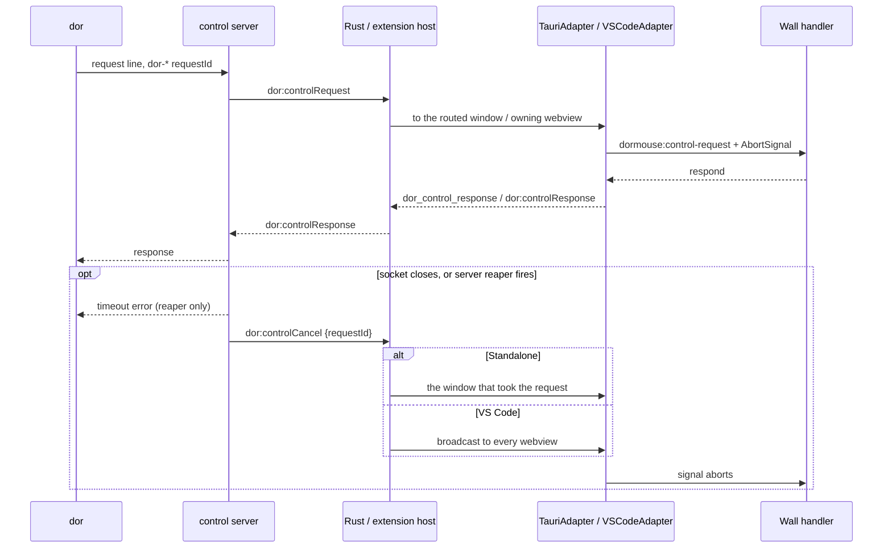
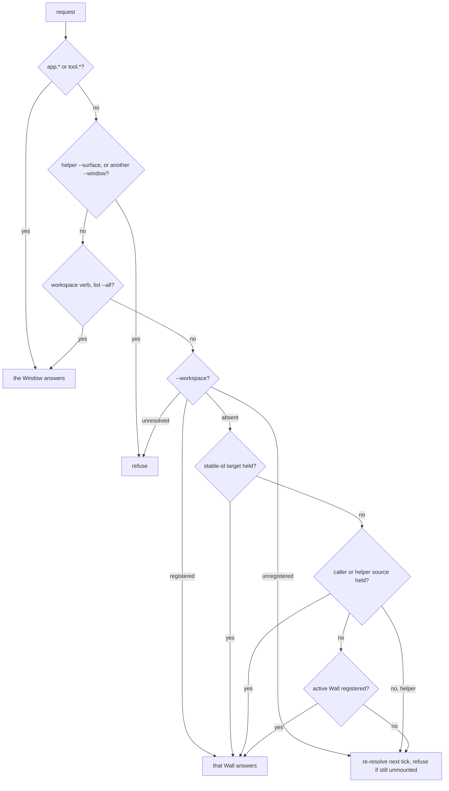

# Dor CLI

> See `docs/specs/glossary.md` for canonical Surface / Session / Pane
> vocabulary. A Surface is `dor`'s user-facing handle; Pane stays layout
> vocabulary, out of the public target grammar.
>
> Owns the bundled CLI:
> staging, the PTY env contract, external-binary spawning, control plumbing,
> handles, the shipped command set, and the bundled agent skill. **The CLI is
> the public API; any socket under it is private host plumbing.**
>
> Defers to `docs/specs/dor-browser.md` for what a browser Surface renders, to
> `docs/specs/alert.md` for `dor await`'s wake conditions, and to the generated
> help (`dor/test/snapshots/help/`, pinned exhaustive by
> `dor/test/cli-help.test.mjs`) for command names, syntax, flags, defaults,
> output shapes, and `await`'s exit codes. Evidence:
> [dor-cli.rationale.md](dor-cli.rationale.md).

## Bundling And PATH

**`dor` must work without `npm i -g`.** Both hosts stage `dor`
(`scripts/stage-dor-cli.mjs`) before build and prepend its `bin` directory to
every spawned PTY's `PATH`. Staged: `bin/dor` + `bin/dor.cmd`, `dist/dor.js`,
the builtin runtime tree (`docs/specs/dor-tools-builtin.md` → Packaging), and a
generated `package.json` declaring `"type": "module"`, independent of parent
package metadata.

**Both launchers must set `ELECTRON_RUN_AS_NODE=1` themselves** before
`exec "$DORMOUSE_NODE" "$DORMOUSE_CLI_JS"`, or under VS Code `dor` silently
does nothing and **exits 0** (rationale). **Dormouse-launched terminals must
rely on injected env, never on a globally installed Node**; each launcher's
`PATH`-`node` fallback is for developer/manual use. **Both launchers must
return the CLI's exit status** (`dor/test/launcher.test.mjs`, including
`dor.cmd` on Windows).

Public PTY env:

- `DORMOUSE_NODE` — Node runtime the launcher execs; `process.execPath` under VS
  Code; standalone on Windows: `docs/specs/standalone.md` -> "Windows node
  subsystem".
- `DORMOUSE_CLI_JS` — absolute path to staged `dist/dor.js`.
- `DORMOUSE_SURFACE_ID` — stable invoking Session/surface id.
- `DORMOUSE_HOST` — hosting app kind: `vscode` or `standalone`.
- `DORMOUSE_HOST_WORKSPACE` — VS Code only: the loaded on-disk `.code-workspace`
  file, else the first workspace folder (an untitled workspace has no file and
  falls through). Unset under standalone and for an empty VS Code window.
- `DORMOUSE_CONTROL_SOCKET` and `DORMOUSE_CONTROL_TOKEN` — private control
  endpoint credentials, **set together or not at all**. The token is a CSPRNG
  value (`docs/specs/security-local.md` → "The dor control socket").

The CLI also reads `DORMOUSE_AGENT_BROWSER_BIN` and `DORMOUSE_PLAYWRIGHT_BIN`,
the user's own binary overrides that no host sets (`docs/specs/dor-browser.md`).
**An empty override must read as unset**, in `dor` and the hosts alike.

**`DORMOUSE_CLI_BIN` is host-internal spawn configuration, never
terminal-facing:** `pty-core` prepends its value to the child's `PATH`, then
deletes it (with `DORMOUSE_SHELL_INTEGRATION_DIR`) from the child env. **Must
delete the sidecar's storage roots, `DORMOUSE_STATE_DIR` and
`DORMOUSE_RECOVERY_DIR`, from the child env too**, so a dev server run in a pane
never writes into the running app's state.

**On Windows, `DORMOUSE_CLI_BIN` and `DORMOUSE_CLI_JS` must be plain paths,
never `\\?\` verbatim paths** — cmd.exe cannot execute `dor.cmd` through one,
and Tauri's `resource_dir()` hands out a verbatim prefix (rationale).

**`dor.cmd` (and any `.cmd`/`.bat`) must be checked out with CRLF** — cmd.exe
misparses LF-only batch files (rationale), and staging copies bytes verbatim.
`.gitattributes` pins it (`*.cmd text eol=crlf`; the POSIX launcher `eol=lf`).

**Must keep `dor/src/cli-core.ts`, every command module, and the other browser-shared CLI modules free of Node runtime dependencies**, even though the CLI package uses Node types: Node reaches the CLI only through the `CliHost` that `dor/src/node-host.ts` supplies, which the website playground replaces. `dor/test/browser-shared.test.mjs` bundles their dependency graphs for the browser. (rationale)

### Git Bash PATH survival

**On Windows the `PATH` prepend must survive Git Bash / MSYS login:** the PTY
core strips `ORIGINAL_PATH` from the child env on win32, so a login shell cannot
rebuild a pre-prepend `PATH` from it (rationale). No-op for cmd.exe /
PowerShell, which never read it.

**A caller cwd must leave the MSYS drive form before it goes on the wire.** Git
Bash exports `PWD` as a POSIX path (`/c/Users/…`) that win32 `path.resolve`
would mangle into `C:\c\Users\…` and match no Surface; every command that
resolves the caller's cwd does so through `callerWorkingDirectory`, which folds
it back to a native path.

Source of truth: `scripts/stage-dor-cli.mjs`, `dor/bin/dor`, `dor/bin/dor.cmd`,
`withoutInheritedMsysOriginalPath` in `standalone/sidecar/pty-core.js`,
`callerWorkingDirectory` in `dor/src/commands/shared.ts`.

## Spawning External Binaries

**Every spawn of an external/user-installed binary must go through
`spawnAndCapture` from `dor-lib-common`, never raw `node:child_process`
`spawn`** — `dor agent-browser` driving `agent-browser`, the agent-browser host running
tab/eval/screenshot commands, and anything added later. It owns the Windows
recipe: cross-spawn rather than Node's own `spawn`, `windowsHide`, and
resolution on `exit` with an exit-time output snapshot (rationale).

**Must leave Windows shim quoting to `spawnAndCapture`.** Forwarded argv can contain literal percent expressions; never interpolate them into an independently constructed shell command. (rationale)

- **`dor agent-browser`, `dor playwright` and both browser hosts spawn the `PATH`-resolved
  absolute path, never the bare name** — cross-spawn resolves a bare name
  through `which`, which searches the cwd before `PATH` on Windows (rationale).
- **Within the `PATH` directories, and only those, the walk must select the file
  `which` would**, mirroring `getPathInfo` in `which/which.js` — a divergence
  either runs a different binary or reports a present install as missing.
  **Never extend the search to the cwd**, which is the one place `which` looks
  and the rule above exists to exclude.
- **A bare name the walk cannot resolve is a missing install, reported before
  the spawn** — including when there is no `PATH` to search at all, since the
  spawn's own fallback is the bare name.

**`spawnAndCapture` never throws:** a spawn-level failure resolves as
`{ ok: false, error }`, including synchronous argv-validation errors.

**Must decode stdout/stderr as continuous UTF-8 streams**, retaining partial
characters across pipe chunks (rationale).

**Must release captured stdout/stderr pipes when the result settles**, including
the exit-grace fallback, without terminating descendants (rationale).

**An optional `timeoutMs` must kill the child and resolve `{ ok: false }` with
`SPAWN_TIMEOUT_CODE`** (`ETIMEDOUT`), without waiting for the kill. **On Windows
it must end the whole tree**, since a `.cmd` shim's child is `cmd.exe` and the
real CLI is its descendant.

**The `dor` and `dormouse-lib` prebuilds must build `dor-lib-common` first**:
its `exports` point at built `dist`, so its `.d.ts` files are otherwise missing
when either typechecks.

Source of truth: `dor-lib-common/src/spawn.ts`,
`dor-lib-common/src/resolve-binary.ts`.

## Host Plumbing

The control channel carries every Surface verb — `send` keystrokes in, `read`
screen and scrollback out, `kill` — and `dor app` from `dor` to the Wall. The
control server runs in the sidecar (Standalone) or `pty-host.js` (VS Code):

### Standalone

`standalone/package.json`'s `stage` step (before `build` and `tauri`, not bare
`vite` dev) runs `stage:dor-cli`. Rust starts the Node sidecar with
`DORMOUSE_HOST`, `DORMOUSE_NODE`, `DORMOUSE_CLI_BIN`, `DORMOUSE_CLI_JS`, and
`DORMOUSE_CONTROL_TOKEN`; the shared PTY core then prepends `DORMOUSE_CLI_BIN`
and sets `DORMOUSE_SURFACE_ID` per PTY. **Rust must not set
`DORMOUSE_CONTROL_SOCKET`:** the sidecar picks the path itself and restores both
control variables to the env `pty-core` merges into every shell only once the
socket is bound, holding stdin commands until then so no PTY spawns with the
channel's fate undecided.

Routing precedence, the refusal for a Surface no window owns, and a cancel
following its own request belong to `docs/specs/standalone.md` -> "Routing"; a
target the registry cannot place, to `docs/specs/standalone.md` -> "Workspace
registry".

### VS Code

`vscode-ext/package.json` runs `pnpm stage:dor-cli` before bundling the
extension host and `pty-host.js`. The extension host computes the staged paths
under `context.extensionPath/dor-cli`, forks `pty-host.js`, and sends the same dor env
on each PTY spawn. **`getDorRuntimeEnv` must omit both control variables:** the
token reaches `pty-host.js` through the fork env alone, and the host folds it
with a bound socket path onto each spawn's env itself. Its `ready` message is
held until the channel settles, so no spawn can race the bind.

One extension host can hold multiple Dormouse webviews, so the request carries
`DORMOUSE_SURFACE_ID` and `message-router.ts` routes it to the webview that owns
that surface. **A named surface no active webview owns must fail** rather than
fall back to a sibling; a request with no surface id goes to the first active
router.

### Control-channel security

`docs/specs/security-local.md` → "The dor control socket" owns the control
server's path, directory, token, handshake, and lost-bind rules.

### Deadlines And Cancellation

**Every valid request must preserve `host ceiling < client socket < server
reaper`.** The client sends its own `timeoutMs` as a hint and the server reaps
10s above it. `dor await`'s host ceiling is at most 24h (`--timeout` takes 1–86400 whole
seconds, the host's `MAX_AWAIT_TIMEOUT_MS`) and its socket deadline 5s later, so the server accepts hints up to 24h + 5s; an absent or nonsense hint
(non-finite, ≤ 0, or above that) falls back to 65s, which clears the longest
fixed client deadline (`dor ensure --restart` at 60s).

**Must answer a malformed control request with an error before forwarding it,
and keep serving the connection** (`standalone/sidecar/dor-control-server.test.js`).

**Some requests outlive their client.** Standalone routes their cancel by
request id, which requires that **`dor-*` request ids never collide with Rust's own `req-*`
invoke ids**; VS Code broadcasts it, since only the webview holding that id has
anything to abort.
**A handler that parks must release whatever it armed when the signal fires** —
nothing it responds with afterwards can reach the client.

**Must cancel `ensure`'s polling when the client disconnects**: before an
interrupted command returns to its prompt it prevents the relaunch; during
initial integration detection it closes the temporary Surface
(`lib/src/components/Wall.test.tsx`).

**Must exclude Surfaces with a Wall closure in progress from reuse.**

Source of truth: `standalone/sidecar/dor-control-server.js`,
`dor/src/control-client.ts`, `lib/src/lib/platform/dor-control-dispatch.ts`.

## Handle Model

`Window ⊃ Workspace ⊃ Pane ⊃ Surface` (`docs/specs/glossary.md`). **Must use Surface handles for Surface verbs and container refs for container verbs.** `dor move` takes a destination Workspace, while `--workspace <ref>` scopes the source ([dor workspace](#dor-workspace)). Cross-window request routing follows [Standalone](#standalone).

Invariants:

- A target may be `surface:N`, a stable Surface id, or `surface:<stable-id>`.
  `surface:focused` selects the focused Surface in the current Workspace;
  `surface:self` the invoking Surface from `DORMOUSE_SURFACE_ID`. An omitted
  target falls back to the caller, then to the focused Surface. Helper callers follow [Helper callers and targets](#helper-callers-and-targets).
- Short refs (`surface:1`, …) are Workspace-scoped stable refs, not layout/list
  positions: each Workspace starts at `surface:1` and numbers Surfaces as they
  are created/restored. The map and its counter persist in the session snapshot
  (`docs/specs/transport.md` → "Persisted session types"). **Must assign a ref on
  creation or adoption into another Workspace** — layout churn (reorder,
  minimize/reattach, zoom, focus), replacing an untouched terminal with a
  browser Surface, and browser render-mode swaps leave it unchanged. **Killing a
  Surface retires its ref; a later target that names it must fail rather than
  silently retarget.**
- **Must retire a moved Surface's source ref**, retaining its stable ID. **Must
  route a moved caller by that stable ID**: its cached `surface:N` refs now
  resolve in the destination and may name strangers; unscoped `ensure` searches
  there and may duplicate work left behind. After a successful move, the moved
  terminal gets one renderer-local notice of the new handles and scope (a pane
  notice in alternate-screen programs), never PTY input or an Activity change.
- Surface targets also accept `title:<exact display title>`; titles drift, so
  automation should prefer refs. Action commands (`read`, `send`, `await`,
  `kill`, `dor agent-browser --surface`) resolve against listed Surfaces,
  **minimized ones included**; `split` and `ensure --surface` resolve their
  *reference* the same way, so minimized peers participate in ambiguity checks.
  Browser placement commands (`iframe`, browser creation) resolve against
  visible Surfaces. **If multiple Surfaces in the relevant scope match, the
  command fails and lists the matching refs.**
- **Bare numeric targets and `pane:N` are not Surface handles.** Pane refs stay
  reserved for future layout-only commands.
- Text list output defaults to refs; JSON list output always carries both refs
  and stable ids.
- `workspace:<n>` selects a container and is **stable**: `n` is the number of
  the Workspace's registry-minted id (`docs/specs/standalone.md` → "Workspace
  registry"), so a strip reorder and a move between Windows rename nothing.
  **Must use positional refs only on hosts without a registry (VS Code).**
  **Must address unnumbered registry Workspaces as `workspace:<id>`, resolving
  exact ids before names**, so legacy snapshots, duplicate names, and numeric
  names cannot redirect a ref. `workspace:<name>` **resolves only when exactly
  one Workspace carries that name**, else the error lists the candidates. All
  three are accepted bare, and **a ref that reads as a number is a ref**, never a
  name. **A Window is `window:<label>` — its host's own name for it**
  (`window:main`, `window:ws-2`), and a host with one Window answers `window:1`;
  each accepts its own ref bare. A Surface ref alone never identifies a
  Workspace.
- **One Wall answers each request**, in the figure's order below; `dor list
  --all` fans out to every Wall, and a **stable id** is unique Window-wide,
  unlike `surface:N`. **Nothing mounted answers `workspace '<ref>' is still
  mounting` for the active Workspace** after a bounded retry covering the tick
  between a Workspace's creation and its Wall registering, never left to the
  caller's deadline (`docs/specs/dor-browser.md` → "Managed identity"); **a
  resolved `--workspace` whose Wall has not registered answers the same**, not
  the unknown-Workspace refusal. **Every request is
  answered, including a container ref of the wrong type and a handler that
  throws** — an unanswered one blocks its caller to the deadline. A Workspace
  being closed refuses the Surface-creating verbs (`docs/specs/layout.md` →
  "Workspaces"). **Surface targets resolve within the answering Workspace**, so
  a `dor split` from a background Workspace lands beside its caller, and **a
  caller the answering Workspace does not hold is dropped by the router**,
  leaving that Workspace's focused Surface as the fallback rather than a
  failure — what gives `--workspace` a reference to place against.
  Cross-window duplicate ids follow `docs/specs/vscode.md` → "Peer surfaces
  across windows".

Source of truth: `dor/src/commands/shared.ts`, `parseWorkspaceRef` in
`dor/src/protocol.ts`, `classifySurfaceTarget` in
`lib/src/components/wall/use-dor-control.ts`, `resolveWorkspaceRef` in
`lib/src/lib/workspace-store.ts`, and `resolveDorControlRoute` in
`lib/src/components/wall/dor-control-router.ts`.

## Current Implemented Commands

Implemented commands call private `surface.*` control methods, **enumerated once
in `dor/src/protocol.ts` (`SURFACE_CONTROL_METHODS`, with `WORKSPACE_CONTROL_METHODS`,
`APP_CONTROL_METHODS`, and `WINDOW_CONTROL_METHODS` beside it)** so the emitting client and the dispatching webview cannot drift.

`surface.list` joins one Workspace's Surfaces — visible panes **plus minimized
(doored)** ones, each tagged `view` — with terminal state and activity
snapshots, and reports the answering Workspace's `workspace:<n>` and Window's
`window:<label>`. **Its `scope: 'all'` spans every Workspace of the Window**,
tagging each row with its Workspace; **one Workspace that cannot answer fails
the whole listing** — including one whose Wall never registers, after the
routing retry ([Handle Model](#handle-model)) — since a missing Workspace reads
as one holding nothing. **Only the active Workspace's selection is `focused`**
in such a listing. **`dor list` rows sort by the `surface:N` ref**, independent
of Lath layout order.

**Port enumeration is opt-in** (`dor list --ports` / `--port`): the host scans
each terminal Surface's process tree (`docs/specs/dor-browser.md` → Dev-Server
Chip). **One listing costs one scan**
(`PlatformAdapter.getOpenPortsMany`), and **a `--all` listing never forwards
`includePorts` to a Wall**, scanning once for every Workspace's terminals
instead. A remote paired session reports none, and any error degrades to an
empty list rather than failing the call. Source of truth: `attachSurfacePorts`
in `lib/src/components/wall/surface-ports.ts`, `getOpenPortsForPids` in
`standalone/sidecar/pty-core.js`.

**`dor` forwards command tails as raw argv; the host quotes them** — `dor`
cannot know the configured default shell, so tails after `--` travel as
`command: string[]` and the host renders **one** command string, used for
output, JSON responses, default `ensure` titles, and the launched command alike,
picking its style with the same classifier clipboard/drop path escaping uses
([mouse-and-clipboard.md](mouse-and-clipboard.md) §8.6).

**Every public first-party command except the `dor agent-browser` and `dor playwright`
passthrough accepts `--json`**, emitting a stable object with the same handles
as its text output; single-Surface responses always carry both `surface_id`
and `surface_ref`. Text output is the primary interface, for agents as much as
humans. Any JSON mode under a native browser command belongs to its delegated
CLI; `dor-embed-size` owns its JSON output.

**A command that operates on one existing Surface takes the target as a required
positional handle** (`read` / `send` / `await` / `kill`); **a command that
creates or places a Surface keeps `--surface` as an optional *reference*
Surface** (`split`, `ensure`, `iframe`, browser creation). So `--surface` means
"place near this" everywhere except [`dor agent-browser` and `dor
playwright`](#browser-surface-addressing), whose whole positional space belongs to the
provider's CLI.

Where `stricli` cannot express a shape, a command may declare narrow,
snapshot-tested help patches, never a general docs renderer. **Must rewrite a
leading `o` to `open` before parsing**; the takeover gate resolves the same alias
through `canonicalDorVerb` in `dor/src/protocol.ts`. **Must accept only the full
browser command names**, with no `ab` or `pw` compatibility aliases.
Behavior help does not carry:

- `read` returns clean, ANSI-free rendered lines; line limits count rendered lines.
- `kill` accepts browser Surfaces.
- `ensure` against an unintegrated shell other than `cmd.exe` times out and
  closes the temporary Surface.
- `list` **owns every Workspace read**.
- Every command exits 1 on a usage or target error; besides 0, only `await`
  uses others (2, 3; help). `await` prints no terminal text (rationale).

`list --json` carries Host identity and runtime paths but **never the control
socket**. **Consumers must gate on `has_terminal` / `has_browser`, not `kind`**,
the capability vocabulary commands also use in target errors.

Source of truth: `dor/src/cli-core.ts`, `dor/src/commands/`,
`buildShellCommandForKind` in `dor/src/commands/shell-quote.ts`, and
`useDorControl` in `lib/src/components/wall/use-dor-control.ts`.

## dor move

**Must move one Surface within this Window through the shared move coordinator.** Interaction and refusal rules follow `docs/specs/layout.md` → Moving Surfaces between Workspaces.

**Must require exactly one destination: a Workspace argument or `--new`.** Never reserve the bare name `new`; `--workspace` scopes the source. CLI moves preserve focus unless `--focus` follows the pane; if the active source disappears, activate the destination in command mode. **Must refuse iframe moves unless `--dangerously-destroy-iframe-page-state` is explicit**, without a GUI prompt. Single-Workspace hosts refuse `surface.move` through `spansWorkspaces`.

Source of truth: `moveCommand` in `dor/src/commands/move.ts`; `moveSurface` in `lib/src/components/wall/surface-move.ts`.

## dor workspace

**`dor workspace` mutates and `dor list` enumerates**, so the overview has one
home. Its verbs are container verbs, answered by the Window rather than by a
Wall ([Handle Model](#handle-model)):

- `new` **creates in the background**, never activating; an unnamed Workspace
  is auto-named (`docs/specs/layout.md` → "Workspace names").
- `rename` renames the Workspace only, no Surface title (`docs/specs/layout.md`
  → "Workspaces"); `dor list --workspaces --json` reports `auto`.
- `close` **refuses without a confirmation** when the Workspace's close would
  ask (`docs/specs/reopen.md` → "Workspaces and windows") unless `--force`, as
  `dor kill` does. It also refuses when
  another close is in flight, or when its Wall never registers (`still
  mounting`, after the routing retry), which would leave its Sessions running
  with nothing holding them. Member Surfaces close in sequence; a refusal leaves
  the Workspace open and the user where they were. A dirty Tool refuses even
  `--force` (`docs/specs/dor-tool.md` → Closing unsaved Tools).
- `move` runs the same transfer the strip's drag does (`docs/specs/standalone.md`
  → Transfer), answers `moved` only once the target Window has adopted the
  Workspace, and **refuses a move between Windows while the Workspace holds a
  plain iframe Surface unless the flag is passed** (`docs/specs/layout.md` →
  Workspaces). A host with one Window reorders only.

**Each verb ships as one action of one command**, not a route map: the published
CLI reference renders one help page per top-level command
(`docs/specs/website-docs.md` → /dor), and a nested command would have none.

**VS Code refuses every Workspace-spanning request at the extension host** —
`dor workspace`, `dor list --workspaces`, `dor list --all`, and any
`--workspace` but this webview's own — because each Workspace there is a
separate webview (`docs/specs/vscode.md` → "Workspaces").

Source of truth: `dor/src/commands/workspace.ts`, `handleWorkspaceControl` in
`lib/src/components/wall/workspace-control.ts`, and `dorWorkspaceRefusal` in
`vscode-ext/src/dor-workspace-guard.ts`.

## dor app

**`dor app` verbs act on the running app, so the webview's control router
answers them first** ([Handle Model](#handle-model)); Rust
still delivers them by the caller's Surface ([Standalone](#standalone)).
`restart` is the only one: it asks the host for the quit that relaunches
(`docs/specs/standalone.md` → "Restart"), so the running-work confirmation still
applies and the relaunch restores what any quit restores
(`docs/specs/transport.md` → "The governing rule").

- **Must request the restart before answering**, so the caller sees a host
  refusal (a dev build) and whether the request joined a quit already in
  progress, which exits without relaunching. The CLI fails on the latter.
- The caller's `DORMOUSE_SURFACE_ID` is the restart's requester
  (`docs/specs/standalone.md` → "Restart").
- **A host without `PlatformAdapter.requestAppRestart` refuses** — VS Code and
  the browser-dev harness.
- **A Dormouse older than the verb answers `unsupported Dormouse control method
  'app.restart'`** (`unsupportedControlMethodMessage`, whose text is frozen),
  which a newer `dor` meets once the bundle is replaced under the running app.
  The CLI turns it into a quit-and-reopen hint **only when `DORMOUSE_HOST` is
  `standalone`**; VS Code answers with the same text.

Source of truth: `dor/src/commands/app.ts`, `handleAppControl` in
`lib/src/components/wall/app-control.ts`.

## dor reopen

**`dor reopen` is the Reopen verb (`docs/specs/reopen.md` → "Reopen verb"),
answered by the webview's control router before any Workspace resolves**
([Handle Model](#handle-model)); Rust delivers it by the caller's Surface
([Standalone](#standalone)), so it reopens into the caller's Window.

- **Must stay focus-neutral** and answer what came back: a Surface's handles, a
  Workspace's, or a window.
- **Must refuse an empty stack** rather than answer nothing.
- **A Dormouse older than the verb answers `unsupported Dormouse control method
  'window.reopen'`**, which the CLI names as a host that predates it.

Source of truth: `dor/src/commands/reopen.ts`, `handleReopenControl` in
`lib/src/components/wall/reopen.ts`.

## Browser Open Target Resolution

`dor agent-browser open <target>` and `dor iframe <target>` accept, wherever they
take an absolute URL, a terminal **Surface handle** ([Handle
Model](#handle-model)) or a schemeless **`host:port`** (including `:port`).
`host:port` inference is a string rewrite and works outside Dormouse; a Surface
handle requires a live control endpoint.

**The explicit port, never the hostname, is the signal for the `http` default**
(rationale). An explicit scheme is always honored. This overrides
`agent-browser`'s own `https` default for a bare `host:port`. **`dor iframe`
rejects** an input that is neither an http(s) URL nor a `host:port`, including a
purely numeric "host" like `800:600` (rationale); `dor agent-browser` forwards
any such target to the provider unchanged.

**Must resolve navigation targets CLI-side before forwarding to the browser provider.** Only the first target of a navigation verb is eligible. Skip known option values; an unknown option leaves the argv unchanged rather than guessing its arity. The provider descriptors and `resolveOpenTargetArgs` own recognized verbs and option arities.

A Surface handle resolves through `surface.resolveOpen`, which runs the same
host port scan as `dor list --ports` (visible panes **and** minimized doors) and
groups listening records by distinct port, so several bindings of one dev
server stay one candidate. Zero or several distinct ports fail, the latter
listing the choices. **One port opens `http://localhost:<port>/` when a loopback
or any-interface bind exists, otherwise the specific bound LAN/Tailnet
address.** Only terminal Surfaces own ports, so a browser-Surface handle is
rejected.

Source of truth: `dor/src/commands/open-target.ts`, `resolveOpenTargetArgs` in
`dor/src/commands/browser-cli.ts`, `listenerUrlsByPort` in
`lib/src/components/wall/port-url.ts`.

## Browser viewport control

**Must intercept `dor-embed-size` under either browser command before native passthrough.** Identity flags select one existing bound Surface; raw `--session` must match uniquely. No selection creates or restarts a browser. A provider mismatch fails with the matching full command name; sizing mutations require a screencast.

**Must query without dimensions or a preset; otherwise apply the requested sizing and await its measurement.** JSON and text report Surface identity, provider, render mode, resolved intent, readiness, and actual width, height and DPR when available. A disconnected browser reports no invented dimensions. Dimensions and preset selection are mutually exclusive; `pane-sync` rejects a DPR override. Fail invalid settings and unsupported DPR before changing size.

**Must prepare a new managed browser's viewport before destination navigation**, keeping preparatory output out of native stdout. Live reuse and explicit native device/attachment choices keep their sizing. Configuration and provider semantics belong to `docs/specs/dor-browser.md` → Viewport presets; native `playwright open` still restarts its browser.

Source of truth: `runBrowserCli` in `dor/src/commands/browser-cli.ts`; `BrowserViewportRequest` / `BrowserViewportResponse` in `dor/src/commands/types.ts`.

## Browser Surface Addressing

**Must intercept `dor agent-browser` and `dor playwright`
before stricli parses provider arguments.** One runner drives both;
`BROWSER_PROVIDERS` and its descriptors own what differs: session argv,
navigation verbs, nonbinding/informational controls, and execution scope.

- **Exactly one identity flag**: `--key` (default `default`), `--session`, or
  `--surface`, plus `--workspace`; any two fail. Except the Dormouse-owned
  `dor-embed-size`, arguments are forwarded to the provider; stdout, stderr and
  exit status pass through.
- **Resolution is host-side**: a `--key` or `--surface` takes one
  `surface.resolveBrowser { provider, key | surface, proposed? }` round trip
  before the binary runs, answered with a binding `{ session, cwd?, binaryPath? }`
  (`docs/specs/dor-browser.md` → Managed identity). `proposed` — the caller's
  cwd and executable — rides only a command that may bind. `--session` and an
  informational command ask nothing. Outside Dormouse a key names its unscoped
  session itself; a `--surface` fails.
- **After a command that may bind succeeds, `surface.browser { provider, key?,
  session, cwd, binaryPath, wsPort? }` opens or reuses its Surface**: `dor agent-browser`
  first reads the stream port itself (`docs/specs/dor-browser.md` →
  agent-browser), and the host reports Playwright's stream. **The call must wait past
  `BROWSER_REQUEST_TIMEOUT_MS`**, since the host's answer can queue behind a
  launch or close of the browser (rationale). A failure there adds a stderr
  warning without changing the command's success. **Exception: a fixed-DPR
  Playwright `open` binds before navigating**, and on a DPR mismatch kills a
  Surface it created and fails unopened.

A `--surface` handle resolves against **listed** Surfaces ([Handle
Model](#handle-model)), and the host applies two gates in order:

- **Browser-gated** (`docs/specs/glossary.md` → Panes and Surfaces): a target
  with no browser fails with the capability wording of [`dor
  list`](#current-implemented-commands).
- **Render-mode-gated.** A browser Surface on the `iframe` renderer has nothing
  to drive, and one the other provider renders is driven by the other CLI. **The
  refusal must name the command that works** (`dor playwright --surface …`, or
  `dor agent-browser open <its url>` for an iframe).

Neither gate covers a Surface whose launch has not yet named its session
([dor-browser.md](dor-browser.md) → Browser Connection); it fails as having no
session yet.

For a project-scoped provider: **must pass the bound cwd through
`spawnAndCapture`'s optional cwd argument**; **never spawn a bound executable
the provider's allowlist refuses**, since the binding comes back off persisted
params — run the caller's own resolution instead, whose `DORMOUSE_PLAYWRIGHT_BIN`
is the exact-match override; **must run the caller's own executable, with a
stderr warning, when the bound one is gone**, and **must fail naming a bound cwd
that no longer exists** rather than report the CLI missing.

Source of truth: `runBrowserCli` in `dor/src/commands/browser-cli.ts`;
`BROWSER_PROVIDERS` in `dor-lib-common/src/browser-providers.ts`;
`requireBrowserSurface` in `lib/src/components/wall/use-dor-control.ts`.

## Agent Workflows

Agents **discover the target Surface with `dor list` (filtered), then act on it
with a handle-taking command.** Matching lives in `dor list` alone; `read` /
`send` / `await` / `kill` **must not grow their own match syntax**, and a bare
`dor kill "npm dev"` stays unsupported.

**Identity follows the Surface, not a user-supplied key:** a terminal Surface is
named by its `surface:N` ref or rediscovered by `--command` / `--cwd` /
`--port`, and `dor ensure`'s command+cwd match is an implicit key that also lets
an agent adopt a command the user started by hand. Browser join keys follow
`docs/specs/dor-browser.md` → Managed identity; Tool keys follow
`docs/specs/dor-tool.md` → Identity and dedupe. The worked examples are
`dor/skill.md`'s "## Recipes".

## Agent Skill

`dor/skill.md` is the agent skill, teaching a coding agent inside a Dormouse
terminal to drive it through `dor`. Distribution splits into content and
bootstrap:

- **Content ships with the CLI.** `scripts/generate-dor-skill.mjs` (prebuild)
  inlines the markdown into the bundle, so `dor skill` prints text
  version-locked to the CLI that staged it. **The skill body must carry no
  environment detection:** if `dor skill` ran, `dor` is available. **Its
  connection troubleshooting must distinguish sandbox socket denial from stale
  caller context**, directing agents to sandbox approval or a fresh caller
  environment, never socket discovery or authentication bypass.
- **Bootstrap is a loud stub that barely drifts.** `dor skill --install` writes
  a marker-delimited block (`<!-- dor-skill:begin` … `dor-skill:end -->`) into
  the project's agent instructions file, resolved against the invoking shell's
  PWD. It holds the detection rule plus two mandatory directives (rationale):
  never background a long-running process (use `dor ensure`), never use a native
  browser tool (use `dor agent-browser`). **Nothing else may join them**, and
  **`dor/skill.md` must lead with the same two** (rationale). **Committing the
  block is the point** — the env guard keeps it inert for collaborators without
  Dormouse. **A begin marker without a well-ordered end marker fails** rather
  than guessing; output names the bare file, never an absolute path.

Source of truth: `dor/src/commands/skill.ts`, whose printed text is pinned
byte-identical to `dor/skill.md` by `dor/test/cli-output.test.mjs`.

## Helper callers and targets

**Must derive helper-origin metadata from the PTY host before routing across Windows**, preserving the actual caller Session id. **Never accept that metadata from a control-socket client.**

- **Must route an unscoped helper-origin request through the source's Workspace.** A missing source refuses rather than falling back to the active Workspace.
- **Must keep unpromoted helpers out of discovery, matching, and explicit targeting**, including `surface:self` and internal ids. Never substitute the source for an explicit helper target or mark the source as the caller in a listing. Promotion assigns the ordinary public Surface ref without changing Session identity.
- **Must use the source as the helper's default placement reference, never as its caller.** A helper is never the caller a Wall sees, even once promoted, so nothing marks, takes over, or retargets the source on its behalf.
- **Never promote, take over, or replace a helper or placement reference to fulfill a helper-origin creation**, including for a request accepted before promotion; matching, keyed reuse, and preview slots still apply. A captured placement reference disappearing before creation fails.
- **Must retain the actual helper Session as an app-restart requester**, without exempting its source from running-work checks.

Source of truth: `createDorControlServer` in `standalone/sidecar/dor-control-server.js` (host); `installDorControlRouter` in `lib/src/components/wall/dor-control-router.ts` (renderer).

## Dor Tools

**Must route `dor tool` and `dor open` through the Tool launch contract**, including approval, explicit-key reuse, and placement (`docs/specs/dor-tool.md` → CLI).

**The router answers `tool.list` (`dor tool --list`) and `tool.openHandlers` (the `dor open` picker) first**, like `app.*` ([Handle Model](#handle-model)).

Source of truth: `toolCommand` in `dor/src/commands/tool.ts`; `openCommand` in `dor/src/commands/open.ts`; `handleToolControl` in `lib/src/components/wall/tool-control.ts`.

## Future

- **Surface a dead control channel in the UI.** A lost bind leaves one
  `[dor-control]` line on the host's stderr, and all a user sees is `dor`
  reporting "Dormouse control endpoint is not available in this terminal yet" —
  which reads like a startup race rather than a channel that will never come up.
  Open design question: where the visible notice goes, given that the Baseboard
  carrying the standalone update notice (`docs/specs/auto-update.md`) has no VS
  Code counterpart. The plumbing exists — both hosts already know the outcome at
  `ready` (see [Control-channel security](#control-channel-security)).

- **`dor skill` follow-ons** — skill-ecosystem publication (plugin marketplaces,
  npm) distributes the bootstrap stub, never a copy of the content. A user-level
  `--global` install variant waits until a story needs it.

- **Cross-Window `--all`.** `dor list --window <label>` lists one other Window
  and `--workspace` reaches a sibling's Workspace ([Standalone](#standalone)),
  but `dor list --all` still lists the answering Window alone; a union would
  read the registry (`docs/specs/standalone.md` → "Workspace registry").
- **Cross-Workspace listing in VS Code.** Each Workspace is its own webview
  there, so `dor list --all` would have to aggregate at the extension host
  rather than in a per-webview control handler; until it does, VS Code refuses
  the Workspace-spanning requests ([dor workspace](#dor-workspace)).
- **Additional `dor list` filters** — activity/state filters are deliberately
  deferred: `--running` as shorthand for `--activity running`, full `--activity
  unknown|prompt|editing|running|finished`, and possible alert filters such as
  `--alert` / `--todo`. Add only once a story needs them, each with
  snapshot-tested help.
