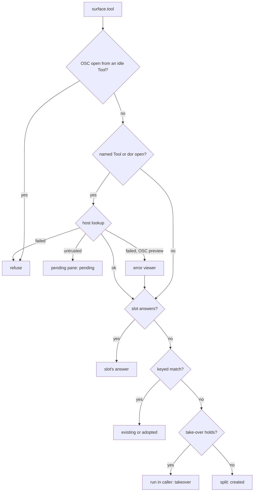
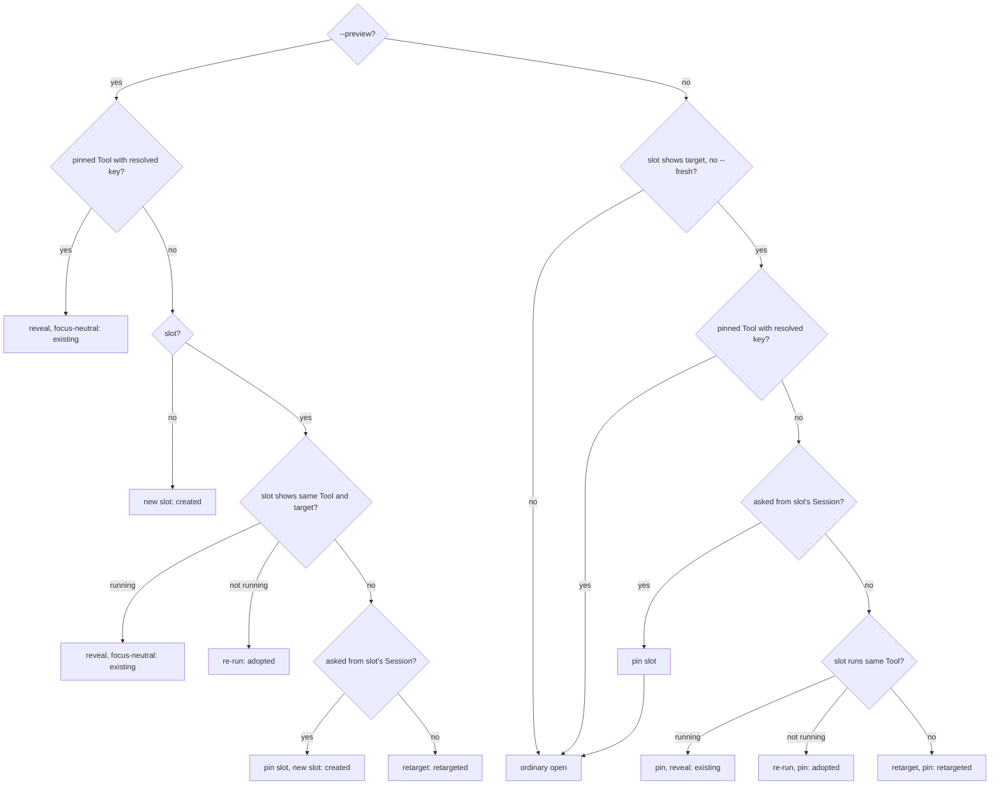

# Dor Tools

> See `docs/specs/glossary.md` for Surface / Session / Pane / Door vocabulary.
> Owns tool designation, configuration, trust workflow, serving, naming, and command lifecycle. Browser chrome belongs to `docs/specs/dor-browser.md`; helpers belong to `docs/specs/terminal-context.md`; the built-in Tools themselves to `docs/specs/dor-tools-builtin.md`; the integration library to `docs/specs/dor-tools-lib.md`.

## Availability

**Must make `dor tool` and `dor open` available without a feature flag or Settings opt-in.** Project execution follows [Trust](#trust).

Source of truth: `surface.tool` in `lib/src/components/wall/use-dor-control.ts`.

## The tool capability set

**Must designate the Surface as `tool` before its command starts serving.** A Tool has terminal and browser capabilities, including while booting, awaiting approval, showing a port conflict, or resting at a prompt after command exit. Browser operations still require the renderer/session they operate on.

- **Must retain the Session id, public Surface ref, and terminal across serving and renderer changes.** These are changes within one Surface.
- **Never offer or apply a renderer swap outside a Tool's declarable `render` values** ([Declaring tools](#declaring-tools)), in the Display modal or `onSwapRenderMode` (rationale).
- **Must run the terminal Activity model for a Tool**, including when its browser is visible. Watched-command defaults belong to `docs/specs/alert.md`.
- **Never apply the untouched-shell kill or shell-replacement shortcut to a Tool**, which spawns touched.

Source of truth: `surfaceKindFromParams` in `lib/src/components/wall/browser-surface.ts`; `onSwapRenderMode` in `lib/src/components/Wall.tsx`.

## Declaring tools

**Must resolve a named Tool from the nearest ancestor `dormouse.yml`, then fall back to user Tools when that name is absent.** `--global` skips project discovery. Malformed project files fail lookup. If only the user file exists, an unknown name reports that file and its Tool names. The host owns discovery, bounded reads, YAML parsing, and substitutions; the renderer receives the resolved result. `ToolEntry` / `parseToolFile` own declaration fields and defaults; [Serving](#serving) owns port selection; `docs/specs/dor-browser.md` → Viewport presets owns sizing resolution.

**Must read user Tools from `$XDG_CONFIG_HOME/dormouse/dormouse.yml` only when that environment value is absolute**, else `~/.config/dormouse/dormouse.yml`; both local hosts use this location. User Tools require no project grant; malformed or unreadable user configuration fails lookup. Project and user Tools occupy separate reuse scopes.

- **Must reject unknown `prespawn_*` fields and unknown substitutions**; unknown ordinary fields produce warnings. `$PROJECT_ROOT` is the declaring directory, `$CWD` the caller's resolved directory, and `$TARGET` the canonical local file or directory input. (rationale)
- **Must deliver the parsed file's warnings on the untrusted answer and on a built-in open**, as well as on a trusted lookup.
- **Must preserve scalar `prespawn_dedupe` as a one-element literal list**, never interpret it as a command to execute. Reserve separate fields for future computed keys. (rationale)
- **Must reject an empty `prespawn_dedupe` list, and `$TARGET` in a `prespawn_dedupe` whose `run` is a shell-command string**, which takes no inputs.
- **Must warn when a repo-local key omits `$PROJECT_ROOT`, or a `$TARGET` run has a key without `$TARGET`.** Allow intentional cross-checkout or cross-file dedupe.
- **Must reject `$PROJECT_ROOT` in user configuration**, which has no project root.

**Must pass named-tool inputs as argument values, never substitute them into a shell-command string.** String `run` accepts no arguments and remains literal shell syntax. List `run` expands `$TARGET`, `$CWD`, and `$PROJECT_ROOT` within elements; a whole `$ARGS` element expands all input arguments. Without `$ARGS` or `$TARGET` in the list, append the inputs. **Must quote argv for the destination Session's shell**, using the current default only for new Sessions; takeover stores that quoted command for reruns.

**Must require exactly one existing local regular file or directory when `$TARGET` appears in the run list or dedupe key.** Resolve relative paths against the invocation CWD and follow symlinks to a canonical absolute path before substitution and reuse. **Must accept a `file:` URL only when its host is empty, `localhost`, or this machine's name** (case-insensitive, either side in its short form before the first dot); reject other URLs, missing paths, and every other file kind (fifo, socket, device). Validate run and key inputs before showing approval. Input control-character restrictions belong to `docs/specs/security-local.md` → Dor Tool configuration.

**Must resolve a Tool's initial viewport host-side with its declaration, including after approval.** Iframe Tools accept only `pane-sync`; automated Tools accept a preset or inline dimensions. **Must preserve live user/agent sizing when reusing a Tool**, rather than reapplying its declaration.

Source of truth: `createToolHost` in `lib/src/host/tool-host.ts`; `parseToolFile` in `lib/src/host/tool-registry.ts`; `toolRunCommand` in `lib/src/components/wall/use-dor-control.ts`.

## Identity and dedupe

**Must dedupe only when an explicit key exists and `--fresh` is absent.** Neither a command nor its CWD implicitly creates identity; anonymous `dor tool -- <command>` invocations create fresh Surfaces. (rationale)

- **Must namespace keys by the host-resolved Tool name**; runtime output supplies scope elements, never another Tool's namespace.
- **Must dedupe within the answering Workspace.** `--workspace` uses the routing in `docs/specs/dor-cli.md` → Handle Model.
- **Must serialize every Tool launch request and approval completion in the renderer through one queue**, not per key, so two requests never both create a match.
- **Must reveal a live matching Tool and report `existing` without sending input.** An idle match restarts its stored command in its own directory and reports `adopted`; a failed restart reports an error.
- **Must reuse and reveal a matching pending approval Surface unless `--fresh` is set**, matching Tool name, project root, CWD, arguments, and fresh intent; preserve its approval state and report `pending`.
- **Must apply runtime re-keys only to the announcing Tool**, without merging Surfaces, transferring state, or killing either side of a collision. (rationale)
- A marked preview slot never matches ([Preview slot](#preview-slot)).

Source of truth: `surface.tool` in `lib/src/components/wall/use-dor-control.ts`; `namespacedToolKey` in `lib/src/components/wall/browser-surface.ts`.

## Trust

**Must obtain a recorded grant before executing a repo-local named Tool.** Anonymous command invocations carry the caller's explicit command and require no repo-config grant. The local authority boundary belongs to `docs/specs/security-local.md` → Dor Tool configuration.

1. **Must derive grant keys host-side from the canonical upstream remote URL or project-root folder.** Either recorded key satisfies lookup; upstream trust spans clones and worktrees. (rationale)
2. **Must present unapproved named invocations in a visible pending Tool pane**, returning `pending` without spawning a PTY. Defer requested minimization until approval. Pending approval is never persisted as a runnable Tool.
3. **Must grant only through the approval controls in Dormouse chrome**, never through a `dor` verb or terminal output. The prompt names the proposed command; it is not itself executable terminal content. (rationale)
4. **Must require `trust-recorded` before re-resolving the named entry**, and stage the resolved command, renderer, port strategy, and key before exposing its terminal. A rejected grant keeps the approval with its error. A failed re-resolution keeps it with its error and no PTY, offering Retry (lookup only) and Close (permission kept). A closed approval never starts later or shows a stale error.
5. **Must recheck the resolved key before launching an approved Tool**, honoring its original `--fresh` intent. A now-redundant approval closes before the match is revealed or restarted; a failed closure retains the approval and sends no command.
6. **Must close a declined approval through the ordinary close coordinator and record no denial.** A helper refusal may retain the pane. (rationale)
7. **Must record each grant as its own atomically written file** under the host's state directory, so hosts sharing one never lock or merge. **A host that supplies no state directory keeps grants in memory for that process only**, rather than inventing a location the user cannot find to revoke.
8. **Never content-hash grants or re-prompt solely because the config changed.** (rationale)

**Never restore pending approval once launch clears its marker**, including after PTY/minimization failure. Approval layout follows `docs/specs/layout.md` → Pane body.

**Must validate a bounded regular, non-symlink grant receipt for the requested key.** Missing, corrupt, or mismatched records grant nothing; a filename alone is never approval.

**Must keep implicit file dispatch user-global and limited to user-global Tools or the built-in viewer.** Reserved: any future repo `prespawn_*` execution uses the same approval; see scope **dor-tools** under [Future](#future).

Source of truth: `createToolHost` in `lib/src/host/tool-host.ts`; `FileToolTrustStore` in `lib/src/host/tool-trust.ts`; `resolveToolApproval` in `lib/src/components/Wall.tsx`.

## Serving

**Must frame only a port returned by the Tool Session's process-tree scan while its designated command is current.** An OSC announcement selects a discovered port; it cannot supply an arbitrary listening service or designate an ordinary terminal as a Tool. Recheck the command run after asynchronous discovery and browser startup.

| Policy | Selection |
| --- | --- |
| Announced port present | Match that exact port in the scan; absent match frames nothing |
| `port: announced`, no announced port | Frame nothing, without scanning |
| `port: auto`, no announced port | Wait for one unchanged poll; one port frames, several show a conflict, zero keeps waiting |
| Anonymous command | Uses `auto` |

- **Must scan unbound Tools on a poll while their command runs, and a Tool alone at once when its announced port or path changes**; that scan is never an autobind poll. Reset settle memory and retire browser resources when the observed command-run id changes, even when the command text is unchanged; an initial observation preserves an imported live binding. (rationale)
- **Must let a changed announced port or path override a committed conflict or browser**, but only after a matching scan. An unchanged announcement never undoes URL-bar navigation. (rationale)
- **Must stop ordinary port scans once a browser or conflict is committed.** An unannounced additional port appearing after settle is not detected.
- **Must display the browser destination at once and leave the launch to the Surface's controller** (`docs/specs/dor-browser.md` → Browser Connection), in the session the Tool has or else its own `tool.<leafId>`, falling back to the embed.

Reserved: **Must derive a Tool's URL again on cold restore**, compatible with future `prespawn_port` and `DORMOUSE_TOOL_PORT` in scope **dor-tools**; [Persistence and hosts](#persistence-and-hosts) owns the saved projection.

Source of truth: `useToolServing` in `lib/src/components/wall/use-tool-serving.ts`.

## Lifecycle

**Must create a shell-hosted PTY and type the command only after integration readiness.** An unsupported shell fails before launch; integration timeout or cancellation closes the temporary Surface.

| Transition | Result |
| --- | --- |
| Spawn | Terminal visible; Tool identity already established |
| Serving | Browser becomes visible in the same Surface |
| Port conflict | Explanation occupies the browser half; terminal remains available |
| Command exit or different command | Browser resources retire and terminal becomes visible |
| Re-run stored command | Same Surface may serve again |
| Kill | Helper guard settles before PTY/browser teardown |

**Must show the full terminal before serving and after command exit**, except while a preview slot switch holds a browser ghost ([Switching the slot](#switching-the-slot)). A serving Tool shows its browser, kept mounted while Terminal Context reveals the same primary terminal (`docs/specs/terminal-context.md` → Tool context). Pending approval mounts neither capability.

**Must hide Tools in inactive Workspaces and minimized leaves without unmounting.**

Source of truth: `ToolPanel` in `lib/src/components/wall/ToolPanel.tsx`.

## Naming

**Must name a serving Tool's Pane header from its params and a user rename alone**, never its port, page, or terminal output, so the name changes only with a retarget, a runtime re-key, or a rename (rationale). The first that applies:

1. A user rename.
2. Its target's name, as the built-in viewers title it (`docs/specs/dor-tools-builtin.md` → File viewer), previewed or pinned.
3. Its Tool name, then each dedupe-key element that adds to it, space-separated: an absolute path by its last component, an element that shows as the name skipped.
4. An anonymous Tool's command.

The terminal face and the Door keep the derived terminal label, which carries command status, except where a switch's hold names the retargeted Tool (`docs/specs/layout.md` → Pane header).

Source of truth: `toolSemanticName` in `lib/src/components/wall/tool-name.ts`.

## CLI

**Must return the Tool Surface handle**, placed in this order (rules in [Trust](#trust), [Preview slot](#preview-slot), [Identity and dedupe](#identity-and-dedupe), [Take-over](#take-over)):



**Must retain `dor tool` and `dor open` as Surface-producing commands on every supported host**, never route them to a native editor. Generated help owns syntax and response types own shape.

**Must answer `dor tool --list` from the files `dor tool <name>` resolves from the same directory, executing nothing.** A project lists without a grant and reports whether it has one. Each entry carries the comment block directly above it as its description, and a user Tool hidden by a same-named project Tool is `shadowed`. A malformed file fails the listing as it fails lookup.

Source of truth: `toolCommand` in `dor/src/commands/tool.ts`; `listTools` in `lib/src/host/tool-list.ts`; `ToolSurfaceResponse` / `ToolListResponse` in `dor/src/commands/types.ts`.

## Opening local files

**Must accept exactly one existing local regular file or directory for `dor open`**, resolved by the `$TARGET` rules in [Declaring tools](#declaring-tools); [Folders](#folders) owns directories.

**Must select the first matching entry of the user file's ordered `open` list.** Every association must name an argument-list Tool in that same user file or a built-in handler of its kind. **Never discover project configuration during this lookup**; project `open` rules are ignored with a warning during explicit project-tool lookup.

**Must use a matching rule's optional `preview` handler for a `--preview` request**, validated as `tool` is, and its `tool` otherwise; an explicit `--tool` overrides both.

**Must use the supplied CWD when canonicalization fails**, and never let matching change the Tool's run directory or `$CWD`. A miss names the user config path and suggests `--tool`. (rationale)

**Must pass the canonical path as the selected Tool's one input.** Reuse follows [Identity and dedupe](#identity-and-dedupe), `$TARGET` in the key providing per-file identity; placement follows [Take-over](#take-over), and `--preview` follows [Preview slot](#preview-slot).

**Must reject declared Tool names beginning with `builtin:` in either configuration scope.** Built-in handler names cannot be shadowed.

**Must fail without fallback on an explicit unknown handler or malformed user configuration**; a built-in named for a format it cannot open reports that limitation and suggests a user Tool. Built-in identity is the canonical file path in its own scope, separate from user and project Tools. The built-in handlers `builtin:file`, `builtin:code`, and `builtin:folder` belong to `docs/specs/dor-tools-builtin.md`.

Source of truth: `openCommand` in `dor/src/commands/open.ts`; `resolveOpenTool` in `lib/src/host/tool-open.ts`.

## Folders

**Must match a directory as its name suffixed with `.📁` (U+1F4C1)**, in the filename and both path forms. **A pattern ending in `.📁` matches only directories, and a directory matches only such patterns**, so a catch-all file rule never captures one (rationale). Dot-directories follow the dotfile rule: `*.📁` skips them and `.*.📁` names them.

**Must open `builtin:folder` for a directory no rule matches.** **Never let `builtin:file` or `builtin:code` open a directory, or `builtin:folder` a file**: a rule naming the other kind fails the configuration, and `--tool` fails the open, naming the handler that fits.

A folder viewer is any Tool that selects on single-click and activates on double-click through the [Preview slot](#preview-slot) invocations. `builtin:folder`, the default, belongs to `docs/specs/dor-tools-builtin.md` → Folder viewer.

Source of truth: `BUILTIN_HANDLERS` in `dor-tools-builtin/src/file-viewer-format.ts`; `resolveOpenTool` in `lib/src/host/tool-open.ts`; `parseOpenRules` in `lib/src/host/tool-registry.ts`.

## Choosing a file

**Must open a fuzzy file picker for `dor open` with no path when stdin and stdout are TTYs**, else fail asking for a path. The chosen file opens as `dor open <file>` with the invocation's flags; a cancel prints nothing and exits 1.

- **Must list the files under the resolved CWD as git does in a work tree** — tracked and untracked, less ignored and deleted. Outside one, a walk lists each work tree it reaches likewise and skips dot-entries, `node_modules`, and the macOS home `Library`.
- **Must stream the listing, ranking as files arrive without blocking input**; an Enter before ranking settles opens the best match then.
- **Must offer the highlighted file's `tool.openHandlers` answer in order**: what [Opening local files](#opening-local-files) selects, then later matching rules' `tool` and `preview`, then each built-in supporting it — each once, with what it runs and the rule or built-in that offers it.
- **Must open the first handler without `--tool` and any other as `--tool <name>`.** `--tool` fixes the handler; a host refusing the read leaves the default openable.

Source of truth: `runFilePicker` in `dor/src/commands/open-picker.ts`; `listOpenHandlers` in `lib/src/host/tool-open.ts`.

## Preview slot

**Must keep at most one preview slot per Workspace**: a Tool Surface whose params carry `toolPreview`, marked in its Pane header and Door (`docs/specs/layout.md` → Pane header) and tagged `[preview]` by `dor list`. Creating a slot pins every other marked Surface, a closing one included, so a refused close never leaves two. **Must resolve a preview through the user's ordered `open` list**, as `dor open` does, never through a faster built-in-only renderer (rationale). A Tool browsing files selects and activates them through two invocations:

| Gesture | Invocation | Result |
| --- | --- | --- |
| Select | `dor open --preview <file>` | Show the file in the slot |
| Activate | `dor open <file>` | Pin the slot when it shows that file; otherwise the ordinary open |

A running Tool may send either as an OSC 367 `open` instead ([OSC 367](#osc-367)).

Same Tool: same scope, name and run; a run a superseded retarget interrupted is
not running.



- **Must retarget in place**: interrupt the slot's command, wait up to 1s for its prompt, then type the new Tool's command quoted for the slot's shell, in the slot's directory. Retain the Session id, Surface ref, terminal, and a user rename; the new Tool may differ. Retire the old command's browser, announcements, and unsaved state at once ([Serving](#serving)); a Door slot reattaches focus-neutrally. **Must keep a slot still running after that 1s**: pin it untouched and place the launch as if there were no slot (rationale); slot Tools should exit on Ctrl+C (`less -K`, `glow`). **Must restore a slot pinned during the interrupt**, whatever becomes of the request: type its previous command again, then place the launch as if there were no slot.
- **Must let the newest preview in a Workspace supersede older ones**: a preview not yet past its lookup, or still interrupting the slot, answers `superseded` with the slot's handle, or an error while there is no slot (rationale). **Must restore a run a superseded or cancelled retarget interrupted and nothing replaced**, once a Tool request ends with no preview left to come.
- **Must type a kept or restored run's command again when its prompt comes after the 1s, within 15s of the interrupt**, without holding the launch queue (rationale). **Never retype a Surface the user has typed into since the interrupt**, one a newer command or retarget has taken, or one going away with its Workspace.
- **Never let a preview take over its caller or become a Door.** A new slot splits focus-neutrally from `--surface` when given, else from the slot pinned last while it is a visible pane of the Workspace, else from the caller (rationale). `--preview` rejects `--fresh` and `--minimize`.
- **Must exclude a marked slot from keyed dedupe.** It keeps its key, which counts once pinned, so pinning only clears the mark.
- **Must pin at once when the slot's Tool reports unsaved changes** ([Unsaved changes](#unsaved-changes)); clean and unreported state never pin. A double-click on its Pane header, or Keep open in its terminal context, pins too (`docs/specs/layout.md` → Pane header). **Never pin on keyboard input or focus** (rationale).
- **Must pin without restarting when `dor open` resolves the slot's running Tool and target.**

Source of truth: `surface.tool` in `lib/src/components/wall/use-dor-control.ts`; `decidePreviewSlot` in `lib/src/components/wall/preview-slot.ts`.

### Switching the slot

**Must hold a preview's slot as a ghost from the moment `dor open --preview` reaches the renderer until the new view is ready**: what a visible slot last fully showed, never a Door's, and never for a preview from the slot's own Session, which never retargets it. The newest preview takes a switch over, keeping its ghost and a committed switch's ready signals; the switch ends at once when the request places the Tool elsewhere or answers otherwise, and one taken over ends nothing. Session disposal ends a switch.

- **Never reload or reconnect a ghost, and never dim it** (rationale). The ghost takes no input; a press on it selects the pane. Under a browser ghost the terminal face shows only as the switch ends (rationale).
- **Must count the new view ready** on its browser layer's first document load or screencast frame; for a terminal-only Tool, once visible output (neither OSC nor its command's echo) settles or its command finishes, so a failure shows; or after a fallback timeout.

The header holds as `docs/specs/layout.md` → Pane header.

Source of truth: `beginPreviewSwitch` in `lib/src/components/wall/use-dor-control.ts`; `lib/src/lib/preview-transition-store.ts`.

### Terminal links

**Must open a local `file:` `OSC 8` link as a `dor open` from the Session showing it**: a click previews, a double-click's second click (`MouseEvent.detail` 2) pins, and later clicks of that burst do nothing (rationale). The request carries the URL ([Declaring tools](#declaring-tools)) and the Session's local CWD, else the target's directory.

- **Must send a link to the confirmation dialog unless its display text names its target**: trimmed, with at most one trailing `ls -F` classifier removed, the text equals the decoded path or a whole-component suffix of it, case-sensitively — `x/README.md` names `/x/README.md`, `EADME.md` does not. A host that is not a plain name, or a control character in the decoded path, sends it there too. The dialog belongs to `docs/specs/mouse-and-clipboard.md` -> "OSC 8 hyperlinks".
- **Must fall back to the dialog when the open fails**, a superseded preview excepted — its status, or its error while there is no slot. A double-click's pin never reopens the dialog its failed preview opened. A host without Tool operations sends every link to the dialog.
- **Must open a confirmed `file:` link as a pinned `dor open` from its originating Session**, with the CWD captured at the click, never through the system URL opener. A closed source or a host without Tool operations reports an error.
- **Must offer it the `tool.openHandlers` answer as [Choosing a file](#choosing-a-file) does.**
- **Must keep an opening failure in the dialog, open to retry or cancel**; a cancelled or replaced dialog ignores its outstanding replies.

Source of truth: `activateTerminalLink` in `lib/src/lib/terminal-link-activation.ts`; `ExternalLinkModalHost` in `lib/src/components/ExternalLinkModalHost.tsx`.

## Take-over

**Must run a standalone `dor tool` or `dor open` invocation in its calling pane when every takeover condition holds**, after the earlier rungs of [CLI](#cli). Helper callers follow `docs/specs/dor-cli.md` → Helper callers and targets. (rationale)

| Condition | Required state |
| --- | --- |
| Verb | `dor tool` or `dor open` (or its alias `dor o`) |
| Caller | Visible pane of the active Workspace; integrated plain terminal (not an existing Tool); not closing or dying |
| Command line | OSC 633 reports the invocation alone; compound shell syntax rejects takeover |
| Directory | Resolved Tool CWD equals the caller's reported CWD |
| Placement | Neither `--surface` nor `--minimize` supplied |
| Helper | No existing auxiliary helper; preserve it by splitting |

**Must retain Tool designation after its command exits.** Takeover is one-shot per Surface: a later invocation from that prompt splits unless keyed reuse finds a match; the same keyed Tool reruns in place through the handshake below.

**Must answer `takeover` before waiting for the calling shell's prompt**, then transform and type the command. The answer promises placement, not successful command startup.

- **Must leave the caller unchanged on prompt timeout or cancellation**, and recheck transfer/closing state, pane membership, CWD, kind, and helper presence after the wait. **Must complete an accepted takeover after switching Workspaces** without changing the active Workspace. (rationale)
- **Must retain the Session id, Surface ref, scrollback, and any user rename** through the transformation.
- **Must rerun a keyed match in the caller through the same answer/prompt handshake**, reporting `adopted`, when its line is standalone and integrated. Never interrupt the waiting `dor` process. Placement flags do not relocate an existing match; run in its current directory.
- **Must report an error when the caller is the keyed match but its command line cannot be typed behind**, instead of reporting a misleading `existing` result.
- **May interleave user keystrokes arriving between the prompt and command injection.**
- **Must include already-owned background listeners in the usual process-tree scan.** [Serving](#serving) owns selection.

Source of truth: `toolTakesOverCaller` / `toolRerunsInCaller` in `lib/src/components/wall/tool-takeover.ts`; `runToolInCallerPane` in `lib/src/components/wall/use-dor-control.ts`.

## OSC 367

**Must consume OSC 367 at the PTY owner's parser**, including malformed and unknown verbs, and emit no reply. `serve`, `state`, and `open` are implemented verbs. The escape registry is `docs/specs/terminal-escapes.md`.

- **Must sanitize and bound the payload before retaining it.** `parseToolAnnounce`, `parseToolState`, and `parseToolOpen` own the field shapes and validation limits.
- **Must reject invalid encoder inputs and serialized payloads exceeding the host's limit**, including JSON escaping that expands an otherwise valid field. (rationale)
- **Must reject a payload naming a version this contract does not speak.** `state` and `open` require `v: 1`; `serve` reads an omitted `v` as 1 and refuses any other value — a future v2's rejection path.
- **Must treat an optional serve `path` as a path/query on the discovered port, never as another authority.** Accept at most 2,048 characters starting with one `/`, with no backslash, ASCII whitespace, C0/C1 control, or DEL; invalid paths are ignored and the default is `/`. The port still must belong to the designated Session's process tree. Live binding memory includes the path; durable saves omit it.
- **Must forward parsed announcements, state reports, open requests, and command-start resets in stream order to the owning renderer.** A start clears the previous command's announcement and unsaved state; later reports in that chunk survive. Both hosts forward each parse's events as one `terminal:toolEvents` message; the fake adapter applies them locally.
- **Must reconstruct announcements, state, and resets from raw replay without emitting replies or acting on an `open`**, preserving transferred announcements when since-mark replay has no command start, and clear the renderer record on Session disposal. Ordinary terminal announcements stay inert.
- Reserved: **Must retain `name`, `dehydrate`, and `persist` as inert parsed fields**, serving the announced-name and D1/D2 items under [Future](#future). Neither `persist: never` nor a `dehydrate` verb changes current persistence.
- **Must act on `open` only from live output of a Tool Session whose designated command is running**, as `dor open` from that Session (`--preview` when `preview` is true), resolved from the Session's local CWD, else the target's directory. The path is absolute, with no control character; the Tool gets no answer.
- **Must show a failed `open` in the preview slot**: a preview whose lookup fails runs the built-in error viewer there instead (`docs/specs/dor-tools-builtin.md` → Error viewer), and a failed activate is sent again as a preview unless a newer `open` from that Session followed it.
- Reserved: **Never assign an OSC 367 verb beyond `serve`, `state`, `open`, and `dehydrate`**; `dehydrate` belongs to D2 under [Future](#future), while existing title/progress protocols keep those roles.

Source of truth: `dor-tools-lib/src/osc.ts`; `TerminalProtocolParser` in `lib/src/lib/terminal-protocol.ts`; `applyLiveToolEvents` in `lib/src/lib/tool-events.ts`; `dispatchToolOpens` in `lib/src/lib/tool-open-requests.ts`.

## Unsaved changes

**Must accept a Tool's `OSC 367;state;{"v":1,"dirty":true}` report as unsaved state**, with `false` reporting clean; `dirty` must be a boolean. Malformed, oversized, and unknown-version reports leave the last state unchanged. State reports never change serving hints, Tool identity, or designation; ordinary terminal reports have no dirty UI.

**Must distinguish unreported state from clean.** Start unknown, update immediately on valid reports, and return to unknown on command start, explicit restart, or Session disposal. Command completion is not a save: retain its last report until reset. Serve announcements never clear unsaved state.

**Must retain unsaved state through minimize/reattach, renderer changes, and live Workspace transfer.** Never write it to durable session metadata; a cold-started Tool reports its own new state. Layout owns the Pane and Door indicator under `docs/specs/layout.md` → Pane header.

**Never treat a dirty-state report as a save acknowledgement or permission to reap.** Close handling and the save channel belong to [Closing unsaved Tools](#closing-unsaved-tools).

A Tool writes reports to its terminal output (`stateSequence` in `dor-tools-lib/src/osc.ts` builds them):

```sh
printf '\033]367;state;{"v":1,"dirty":true}\033\\'
```

Source of truth: `parseToolState` in `dor-tools-lib/src/osc.ts`; `recordToolDirty` in `lib/src/lib/tool-dirty-store.ts`.

### Closing unsaved Tools

The iframe save channel, connected only to a `builtin:file` or `builtin:code` frame (`docs/specs/dor-tools-builtin.md` → Editing files), binds its window, proxy origin, and a per-mount connection nonce. Save completion carries the request id and current dirty state; a timeout or disconnected editor never permits a Save closure. **Must bind each save completion to its accepted connection generation and discard it after reconnect or close**, even when a replacement connection reuses the request id or nonce. (rationale) **Must ignore a save-channel message naming another `dorTool` version or malformed for its kind**; a save error reaches the prompt control-stripped and bounded.

**Must offer Save / Discard / Cancel before closing dirty Tools through Dormouse**: Pane closure, standalone window/app teardown, iframe reload or renderer change, and Workspace movement to another Window; **a Workspace close asks once, before any Surface closes.** Discard authorizes that action without declaring the edit clean; Save proceeds only after successful acknowledgement and no newer edits. A Tool without a connected save handler must be saved in its own UI or discarded. **Never prompt for a command close or move**: `dor kill`, `dor workspace close` (even `--force`), and cross-window `dor workspace move` (even `--dangerously-destroy-iframe-page-state`) refuse a dirty Tool. VS Code webview/host closure, forced termination, and crashes cannot be vetoed; drafts are not persisted.

Source of truth: `dor-tools-lib/src/protocol.ts`; `confirmToolEditorsClose` / `connectToolEditor` in `lib/src/lib/tool-editor.ts`. Tests: `lib/src/lib/tool-editor.test.ts`.

## Security

The Tool-specific local boundaries are `docs/specs/security-local.md` → Dor Tool configuration. Browser content follows `docs/specs/security-local.md` → Browser panes.

## Persistence and hosts

**Must persist the command and stable Tool metadata with `surfaceType: 'tool'`**, retaining the ordinary CWD field. Never persist a derived URL, browser session binding, conflict, or pending approval as runnable Tool state.

**Must retain resolved browser viewport settings with Tool metadata**, including cold restore and Workspace transfer; sizing behavior belongs to `docs/specs/dor-browser.md` → Viewport presets.

**Must persist a preview slot's mark and an opened Tool's canonical target with its Tool metadata**, so a cold-restored slot is still the slot ([Preview slot](#preview-slot)). Reject a persisted target containing terminal controls, as argv is.

**Must retain resolved argv for argument-list Tools and re-quote it for the shell selected at cold restore.** Literal shell-string commands retain their saved text. Reject persisted argv containing terminal controls before restoring any PTY.

**Must cold-restore an approved Tool by starting its saved command through integration-gated shell readiness**, then rediscover its port. Agent-resume commands do not override the saved Tool command. Pending approvals restore as ordinary terminals and execute nothing. **Must rebuild visible Tool metadata from its pane row when layout geometry is unusable**, rather than starting the command in a plain terminal with no serving behavior.

Dirty or pending Tools refuse Surface moves between Workspaces: `docs/specs/layout.md` → Moving Surfaces between Workspaces.

**Must retain live Tool browser params and OSC announcements in volatile Workspace-transfer content**, applying them to the destination plan without mutating the durable record. A serving iframe Tool participates in the ordinary iframe move confirmation. **Must refuse transfer while a Tool awaits approval or its browser startup has no session binding.**

**Must pause serving updates during Workspace closure or transfer, and never launch a Tool, looked up or approved, into a closing or transferring Workspace.**

**Must provide Tool host operations in standalone and VS Code**; the desktop playground answers `open` and `open-handlers` from its snapshot (`docs/specs/tutorial.md` → Playground filesystem). Remote terminal transport remains protocol-v1; remote browser presentation is staged in `docs/specs/remote-api.md`.

Source of truth: `PersistedToolMetadata` in `lib/src/lib/session-types.ts`; `captureToolParams` / `restoreToolParams` in `lib/src/components/wall/tool-transfer.ts`; `toolControl` in `lib/src/lib/platform/types.ts`.

## Future

**Scope: dor-tools** — remaining design, in implementation order.

- **D1 — reaping without cooperation.** Idle-threshold reap +
  rehydrate-from-args + `persist: "never"`: every stateless tool, no new API,
  no Windows question. Establish an explicit safe-to-stop contract first;
  clean or unknown state alone is insufficient.
- **D2 — dehydrate/rehydrate.** The `367;dehydrate` verb +
  `DORMOUSE_DEHYDRATE`, opted into by the `dehydrate` flag the shipped `serve`
  payload already reserves. The Windows graceful-stop is needed here only.
- **The announced `name`.** Wire the reserved [OSC 367](#osc-367) `name` into
  the title-candidates channel and `dor list`'s location column.
- **Later** — `prespawn_*` beyond the dedupe literal: a computed key, and
  `prespawn_port`. Pocket/remote browser view (rides the browser-surface
  staging in `docs/specs/remote-api.md`; reserve the kind on the wire now). An in-pane terminal/browser strip (decide against the
  glossary's reserved multiple-Surfaces-per-Pane). A `boots: web` hint if the
  terminal flash grates. `--has terminal` / `--has browser` *filter flags* for
  `dor list`, whose rows already carry the fields.

**Scope: open-folder** — the [Preview slot](#preview-slot)'s speed within the open rules: opt-in retarget without restart, built-in viewer first.

### Dehydrate and rehydrate

**Reap a tool announcing `dehydrate: true` on an idle threshold while
`Doored` / `Hidden`** — Surfaces of an inactive Workspace included — **never on
the minimize itself** (reattach must not cost a boot every time) **or under
memory pressure**. The headline case is Workspaces, not shutdown: an inactive
Workspace of dehydratable tools drops to zero processes, relieving the
parked-surface pressure hidden Workspaces carry (`docs/specs/layout.md`
→ Workspaces; `docs/specs/tiling-engine.md` → Parked leaves).

**This is an in-session mechanism.** The payload lives with the running host;
whether it survives a host quit follows each host's session-persistence story
(`docs/specs/transport.md`). The flow: host sends the graceful-stop signal →
tool emits `367;dehydrate;{json}` on the way out → rehydrate respawns with
`DORMOUSE_DEHYDRATE` in the env.

**Args-only restart is the mandatory floor; the payload is fidelity, never
correctness.** Degradation is Lath-restore-token style — dehydrated state →
bare args → error. Small versioned JSON, never a document. A hung tool blocks
nothing: request, grace, kill anyway, fall back to args.

### Open questions

The [OSC 367](#osc-367) collision sweep before the contract is frozen (xterm
ctlseqs plus the iTerm2/kitty/WezTerm/ConEmu private ranges; runners-up 3676
and 4242); the Windows graceful-stop for D2; the dehydrate idle-threshold
default; whether `persist` belongs in the announce or the file (currently the
announce — self-knowledge, like a runtime re-key); the final marketing noun
("Dor Tools" carries the LLM-tool-use collision-avoidance; the spec says
"tool" throughout).
