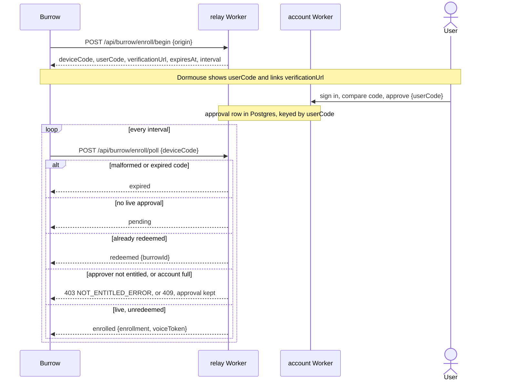

# Dormouse Hosted accounts

> - See `docs/specs/glossary.md` for Burrow, Client, Relay, and Session vocabulary.
> - Owns the Hosted account application, the Hosted Relay's account-scoped routes and sockets, and the deployment of Hosted's three Workers. The one-time rendezvous the relay Worker serves belongs to `docs/specs/one-time.md` -> "Hosted rendezvous"; the Relay's shared route and routing semantics to `docs/specs/relay.md` -> "HTTP API" and "Routing"; remote authorization to `docs/specs/remote-security-model.md`.

## Application boundary

**Must serve Hosted as three Workers from `hosted/`, one origin each:**

| Worker | Origin | Serves | Holds |
|---|---|---|---|
| `dormouse-hosted` | `https://hosted.dormouse.sh` | the account frontend, `/api/auth/*`, `/api/providers`, `/api/ready`, voice tokens, the Relay's account routes ("Burrow enrollment"), billing ("Billing") | the login cookie, auth secrets, Hyperdrive, the approval rate limit, a binding to the relay's `RelayRoom`, the Stripe secrets |
| `dormouse-relay` | `https://relay.dormouse.sh` | the Hosted Relay, its sockets, and Pocket ("Relay", "Relay sockets"), the one-time rendezvous and `/connect/` (`docs/specs/one-time.md` -> "Hosted rendezvous") | Hyperdrive, `OneTimeRoom`, `RelayRoom`, the one-time, sign-in, setup, and enrollment rate limits, `ACCOUNT_ORIGIN`, `RELAY_ENROLL_SECRET`, the VAPID pair |
| `dormouse-voice` | `https://voice.dormouse.sh` | speak and the history sweep ("Managed voice") | `ELEVENLABS_API_KEY`, Hyperdrive |

Every Worker answers `/api/health`, 404s anything else under its non-page prefixes (`/api`, and the relay's `/ws` too), `/dev/*`, or `/__test/*`, and answers a thrown request 503 under `secureHeaders`. The account falls back to its SPA assets, the relay to Pocket's. Origin and binding isolation: `docs/specs/security-hosted.md` -> "Origin boundary" (rationale).

**Must run committed Better Auth migrations before deploying code that needs them, never during a Worker request.** Postgres is reached through an uncached Hyperdrive binding.

**Must grant `dormouse_relay` and `dormouse_voice` only what `hosted/server/runtime-roles.sql` lists, never default privileges**, so a new table needs a grant there; each reaches only its Worker's tables and the entitlement's user and subscription columns, and the relay inserts a sign-in's voice token ("Managed voice"). Both Workers still bind the account's role (`docs/specs/security.md` -> "Known gaps").

**Must install released core/auth packages from npm and commit their lockfile integrity hashes.** The installed packages' `dist/provenance.json` must name the same clean pgstencil commit; no runtime import depends on a sibling checkout. The auth migrations remain owned by the package; Dormouse's own tables migrate from `hosted/server/dormouse-migrations/`. **Never edit a merged migration**: a migrated database never reruns one, so append the next number (pinned by `hosted/server/tests/migrations.test.ts`).

**Must declare every peer dependency of the installed packages in `hosted/package.json`**, so they share Hosted's copy and Renovate updates them.

Source of truth: `WORKERS` in `hosted/scripts/workers.mjs`; `workerApp` in `hosted/server/worker-app.ts`; `hosted/server/bindings.ts`; `hosted/wrangler.jsonc`, `hosted/wrangler.relay.jsonc`, `hosted/wrangler.voice.jsonc`; `verifyPackages` in `hosted/scripts/production.mjs`; `hosted/server/runtime-roles.sql`. Pinned by `hosted/server/tests/boundary.test.ts` and `hosted/server/tests/runtime-roles.test.ts`.

## Identity and login

**Must retain independent simultaneous browser logins.** Login lifetime is 24 hours without refresh or cookie caching; logout revokes only the current login. These authentication records are not terminal Sessions.

**Must require explicit provider connection from a login less than ten minutes old.** The callback must retain that same live login. Matching email alone never connects an unbound OAuth identity. Different verified provider emails are allowed; an identity already attached to another account cannot be claimed.

**May create provider-only accounts without verified email.** Public email is null; pgstencil's internal placeholder is never a delivery address. Email-code login remains an access path to an account's canonical verified mailbox. No merge, email adoption, unlink, or account-recovery interface exists.

**Must identify accounts by immutable user ID, never email.** Provider-only accounts keep their identity when a provider subsequently supplies email. Exception: `ADMIN_EMAIL` ("Entitlement").

**Must enable providers explicitly in `OAUTH_PROVIDERS`.** The allowed set is GitHub, Google, Microsoft, and Apple. Missing paired credentials or unknown names fail closed; unused credentials enable nothing. Email uses Postmark in production and local capture in development.

**Must discard provider tokens after identity verification and omit login tokens from browser JSON.** Cookies and upstream identity verification follow the packed adapter.

Source of truth: `hosted/server/providers.js`; `authPolicy` / `providerBindings` in `hosted/server/policy.ts`.

## Interface

**Must link the account footer to the public Hosted privacy policy and terms.**

**Must show configured sign-in methods only.** Login tokens never enter browser storage, and only public identity fields render, without provider images or external assets.

**Must render on Dormouse product theme tokens**, the OS light/dark preference choosing bundled Light Visual Studio or Kimbie Dark, loading no marketing styles, fonts, or analytics.

Source of truth: `App` in `hosted/src/App.tsx`; `restoreTheme` in `hosted/src/main.tsx`.

## Entitlement

**Must read the entitlement (`docs/specs/pricing.md` -> "Checkout and entitlement") on the server, per request, through one SQL predicate over the account's `"user"` row**, so a bearer and its owner's entitlement resolve in one query.

- **An account is entitled while it holds exactly one current subscription, and that one is `active` before its period end or `trialing` before its trial end**, against the database's clock: `@pgstencil/stripe`'s `status()` access, so `past_due` is refused at once.
- **`ADMIN_EMAIL` is a standing comp** while it is the account's verified email, the only exception to "never email" ("Identity and login"); nothing else may key on an address.

Source of truth: `entitledSql` and `entitled` in `hosted/server/entitlement.ts`; `cookieEntitled` in `hosted/server/account-gate.ts`.

## Managed voice

A signed-in desktop exchanges its voice token for ElevenLabs speech in a voice of the curated set (`MANAGED_VOICES` in `remote-lib-common/src/remote/managed-voice.ts`). Signing in is the device-code enrollment ("Burrow enrollment"), whose redemption mints the token; the account Worker's token routes are the admin test path. The voice Worker serves speak.

| Route | Credential | Success |
|---|---|---|
| `GET /api/voice/tokens` | login cookie | 200 `{ tokens }` |
| `POST /api/voice/tokens` | login cookie, exact `Origin` | 201 `{ id, token, createdAt }` |
| `DELETE /api/voice/tokens/:id` | login cookie, exact `Origin` | 204; 404 for another account's or an unknown ID |
| `POST /api/voice/speak` | `Authorization: Bearer dmv_…`, JSON `{ text, voiceId }` | 200 `audio/mpeg`, `Cache-Control: no-store` |

Errors are JSON `{ message }`. Cookie routes answer 401 without a login and 403 for an account not entitled ("Entitlement").

**Must store only a token's SHA-256.** A token is `dmv_` plus base64url of 32 random bytes, returned only by the mint response: the account's `POST`, or the poll that redeems a sign-in. Revocation is permanent.

**Must mint a sign-in's token in the statement that redeems it**, owned by the approver and naming the Burrow it enrolled (`hosted/server/dormouse-migrations/005_voice_token_burrow.sql`), so removing that computer from the account deletes its token, and the Burrow cap bounds them. The relay's role may insert those columns and nothing else of voice.

**Speak must answer in this order:**

1. 401 for a missing, malformed, unknown, or revoked token.
2. 403 when the owner is not entitled.
3. 400 for malformed JSON, `text` outside 1–200 characters after trim, or a `voiceId` outside the curated set.
4. 503 when the deployment has no `ELEVENLABS_API_KEY`.
5. 429 once the owner's UTC-day counter reaches 500. The atomic increment precedes the upstream call, so failed upstream attempts count.
6. 502 when ElevenLabs throws or answers non-2xx.

**Never log the text or forward an upstream body or status.** The upstream URL, model, and format (`mp3_44100_128`, so 200 characters stay under a shipped desktop's `MAX_AUDIO_BYTES`) are fixed in code; no binding or request field redirects them. `ELEVENLABS_API_KEY` is the voice Worker's secret, which production preflight requires there; the voice preview mapper never passes it.

**Must delete ElevenLabs speech history, which keeps each generation's text, from the production voice Worker only**: one pass shortly after each successful speak, and a Cron Trigger every 5 minutes for what that missed. No retention bound is guaranteed (rationale).

- **Must use an ElevenLabs account dedicated to Dormouse voice.** A sweep deletes the whole account's history.
- **Never touch the database or any binding but `ELEVENLABS_API_KEY` in a sweep**, so an idle deployment lets Postgres suspend. Without the key nothing runs; development and previews never sweep.
- **Must fail the cron invocation when its pass cannot list or any delete fails; the after-speech pass only logs** (rationale).

Source of truth: `hosted/server/voice.ts`; `hosted/server/voice-app.ts`; `mintVoiceToken` in `hosted/server/voice-token.ts`.

## Relay

The relay Worker serves the self-host Relay's HTTP API to many accounts: the paths, shapes, statuses, and error strings of `docs/specs/relay.md` -> "HTTP API", "Setup tokens and the pairing QR", and "WebAuthn without a WebAuthn library", so a Burrow and Pocket cannot tell the two apart; both run the checks and bounds in `remote-lib-common/src/remote/relay-common.ts`. Assertions demand presence, not verification. Security checks: `docs/specs/security-hosted.md` -> "Relay boundary". Only the differences:

| Route | On Hosted |
|---|---|
| `POST /api/setup/begin`, `/finish` | The passkey joins the account owning the token's Burrow: `accountId` is its user ID, `existingCredentialIds` its passkeys; 409 at `MAX_PASSKEYS_PER_ACCOUNT` |
| `POST /api/setup/retire` | Spends only a token one of the session's account's Burrows minted |
| `POST /api/signin/finish` | The asserted credential's account; `accountId` is its user ID. 401 `NOT_ENTITLED_ERROR`, and no session, for an account not entitled |
| `POST /api/reauth/begin`, `/finish` | Only the session's account's credentials and nonces |
| `GET /api/burrows` | The session's account's Burrows, each `online` while it holds a live socket in the account's `RelayRoom` ("Relay sockets") |
| `POST /api/burrow/setup-token` | 401 for a removed Burrow, 403 `NOT_ENTITLED_ERROR` for an owner not entitled |
| `POST /api/burrow/enroll` | Always 401 `UNAUTHORIZED_ERROR`: Hosted has no setup password; a Burrow enrolls by device code ("Burrow enrollment") |
| `GET /api/push/config` | The VAPID public key, or `null` when push is off ("Push") |
| `POST /api/push/subscribe` | 404 for a Burrow not the session's account's; 400 `endpoint must be a known push service` off the allowlist ("Push") |
| `POST /api/push/subscriptions/query`, `DELETE /api/push/subscriptions/:deliveryId` | Only rows of the session's account's Burrows |
| `POST /api/push/send` | A recipient repeating an earlier one's `deliveryId` is not sent again and counts as `unknown` (rationale) |
| `GET /api/hello` | 404: the self-host installers' probe |
| `GET /*` | Pocket (below) |

A session-gated route answers a session of an account no longer entitled with the expired session's 401 `UNAUTHORIZED_ERROR`, so Pocket returns to sign-in.

- **Must keep the Relay's state in Postgres** (`hosted/server/dormouse-migrations/002_relay.sql`), sessions, challenges, and nonces included, where the self-host Relay holds them in memory.
- **Must resolve each bearer and its owner's entitlement in one query**, the socket upgrades' query-parameter token included. The entitlement: "Entitlement".
- **Must cap every table a caller grows, keyed by whoever grows it**, as `docs/specs/relay.md` -> "Guardrails" does: setup tokens and setup challenges per Burrow (`MAX_TOKENS_PER_BURROW`), presence nonces per session (`MAX_PENDING_REAUTH_NONCES_PER_SESSION`), and sessions per account (`MAX_SESSIONS_PER_ACCOUNT`), each evicting its key's own oldest; passkeys per account are refused at the cap (rationale). A capped write runs under its key's advisory lock and prunes, trims, and evicts only that key's rows.
- **Must sweep every Relay table's expired rows from the relay's hourly Cron Trigger** (rationale); sign-in challenges, minted unauthenticated and flat, are bounded by it and the per-address limit.
- **Must answer 429 with `Retry-After` past the per-address limit on `signin/*` (`RELAY_SIGNIN_LIMIT`) and `setup/begin`/`finish` (`RELAY_SETUP_LIMIT`)**, before the body limit and any database read: 30 a minute, a ceremony's two routes sharing one budget (rationale).
- **Must restore a token a refused `finish` spent on its original expiry, within the Burrow's cap, and never once that expiry has passed.**

**Push.** The push routes keep `docs/specs/relay.md` -> "Web Push" and its "State files" upsert rules; a send is HTTPS from the Burrow to the relay Worker, independent of terminal transport.

- **Must keep subscriptions in Postgres** (`hosted/server/dormouse-migrations/003_relay_push.sql`), keyed `(burrowId, deliveryId)`, every field bounded as self-host bounds it, deleted with their Burrow. **Must read the addresses a delivery moves off, drop rows, and prune 404/410 among the account's rows only.**
- **Must cap subscriptions at `MAX_PUSH_SUBSCRIPTIONS_PER_BURROW` and `MAX_PUSH_SUBSCRIPTIONS_PER_ACCOUNT`** in place of self-host's file total, evicting the oldest `subscribedAt`, never the row just written, under the account's advisory lock (rationale). A subscribe racing its Burrow's removal answers 404.
- **Must register and fetch only a known Web Push service's endpoint** (`knownPushEndpoint`) in place of the self-host DNS guard: `https:` on the default port, no credentials, at most `MAX_PUSH_ENDPOINT_LENGTH`, and host `fcm.googleapis.com` or `updates.push.services.mozilla.com`, or one under `.push.apple.com` or `.notify.windows.com` (rationale). **Never follow a redirect**: a 3xx is `failed`. A refusal's log keeps at most 1 KiB of its body, copying no chunk past it, and cancels the rest.
- **Must send through `webPushRequest`** (`remote-lib-common/src/remote/web-push.ts`), WebCrypto with no `web-push`: RFC 8291 `aes128gcm` and an RFC 8292 VAPID JWT whose `sub` is the relay's `APP_ORIGIN`, each delivery bounded by `PUSH_SEND_DEADLINE_MS`. **Never hold a Postgres connection across a push service's fetch.**
- **Push is disabled, not half-working**: without both `RELAY_VAPID_PUBLIC_KEY` and `RELAY_VAPID_PRIVATE_KEY`, with malformed keys (including noncanonical base64url), with a private key that does not sign for its public point, or without an https, non-loopback `APP_ORIGIN` for the subject, the config route answers `null` and subscribe and send 503. The pair is a relay Worker secret; previews derive theirs ("PR previews"), and the dev loop has none.

**Pocket at the root.** `build` stages `lib/dist-pocket` at the root of the relay's assets and the one-time page beside it, checking both shells. Pocket is served per `docs/specs/pocket-app.md` -> "Serving the built bundle", except that a path naming no file (no extension, outside `/diagnostics`) gets the shell in one asset fetch.

Source of truth: `relayApiRoutes` in `hosted/server/relay-api.ts`; `hosted/server/relay-auth.ts`; `relayPushRoutes` in `hosted/server/relay-push.ts`; `pocketRoutes` in `hosted/server/pocket.ts`; `stageRelay` in `hosted/scripts/stage-relay.mjs`; `hosted/wrangler.relay.jsonc`. Pinned by `remote-lib-common/test/web-push.test.mjs` (the RFC 8291 Appendix A vector).

## Relay sockets

The relay Worker serves `GET /ws/burrow` and `GET /ws/client` at the self-host paths, token in `WS_TOKEN_PARAM`, and routes them by `docs/specs/relay.md` -> "Routing", every rule, through the same frame layer and bounds. Only the differences; `docs/specs/security-hosted.md` -> "Relay boundary" holds the checks.

| Route | Admitted | Refused |
|---|---|---|
| `GET /ws/burrow` | no `Origin`, a Burrow token whose owner is entitled | 403 `forbidden` with any `Origin`; 401 `UNKNOWN_BURROW_TOKEN_ERROR`; 403 `NOT_ENTITLED_ERROR` |
| `GET /ws/client` | `Origin` exactly `APP_ORIGIN`, a live session of an entitled account | 403 `forbidden`; 401 `UNAUTHORIZED_ERROR` for any session refused, which Pocket's probe of `GET /api/burrows` reads as expiry |

- **Must route each account's sockets through one `RelayRoom` Durable Object, named `idFromName(userId)` from the account the token resolved to**, holding all its Burrow and Client sockets. Another account's Burrow is in another object, so a cross-account binding is impossible, not refused.
- **Must hand the object a fresh request**: the upgrade, the account, and the Burrow's id or the session's `expiresAt` as search parameters (`RELAY_ROOM_PARAMS`); never a header, token, or cookie of the caller's.
- **Must store only the account id**, written at the object's first upgrade; a request or RPC naming another account is refused and logged with no frame content.
- **Must recheck a Burrow's row in the object before accepting its socket**, under `blockConcurrencyWhile`: enrolled, the account's, its owner entitled, else the Worker's 401 or 403, so a removal committed after the Worker's token check is refused. **Never open a database connection in the object** (rationale): it reads rows through the relay Worker's `RelayRows` entrypoint. **Must bound every row read at `RELAY_ROW_READ_TIMEOUT_MS`**: past it the upgrade answers 503 and the sweep leaves its Burrows to the next.
- **Must accept every socket through the Hibernation API**, its routing state in the socket's attachment.
- **Must measure a frame against `MAX_RELAY_FRAME_BYTES` before parsing it**, a text frame in UTF-8 bytes as the self-host `maxPayload` counts, closing 1009 past it; an under-cap binary frame is dropped. The Client cap is per account object.
- **Must close, from the object's alarm, every expired Client 1008 `unauthorized`** (its Burrow told `client-gone`) **and every removed or another account's Burrow 4001 (`WS_CLOSE_BURROW_REVOKED`) and de-entitled one 4002 (`WS_CLOSE_BURROW_NOT_ENTITLED`)** (its Clients told `burrow-gone`): the alarm fires at the earliest held Client's `expiresAt` and, while a Burrow socket is held, at most `RELAY_ROOM_SWEEP_MS` (an hour) apart. It replaces the self-host expiry and revocation sweeps.
- **Must answer `RELAY_PING` with `RELAY_PONG` as the object's auto-response**, which never wakes it, reaches no handler, and is never forwarded. **A socket whose last auto-response is older than `RELAY_IDLE_TIMEOUT_MS` is gone**, retired with 1001; a socket that never pinged is never judged. It replaces the self-host heartbeat. Two gaps are accepted: a Burrow that never pings is never judged, since every build that can enroll with Hosted pings; and at the Client cap a backgrounded Pocket, its pings paused, counts as gone once silent that long, the Burrow reaping its session at 120 s anyway.
- **Must close a removed Burrow's socket from the account Worker's `DELETE /api/relay/burrows/:burrowId`**, through its `RELAY_ROOM` binding (`script_name` the relay) calling `closeBurrow`: 4001, its Clients `burrow-gone`. **Must answer 204 once the row is gone, even if the close fails**, logging it; the sweep closes the socket. `GET /api/burrows` reads `online` through account-scoped `onlineBurrows`. **Never expose either RPC or `RelayRows` as a public endpoint.**

Source of truth: `relaySocketRoutes` in `hosted/server/relay-sockets.ts`; `hosted/server/relay-room-contract.ts`; `RelayRoom` in `hosted/server/relay-room.ts`; `RelayRows` in `hosted/server/relay-rows.ts`. Pinned by `hosted/server/tests/relay-room.test.ts`, which also runs the routing cases every Relay passes (`remote-lib-common/test/harness/relay-parity.mjs`).

## Burrow enrollment

A Burrow joins an account by device code, in place of the self-host setup password. The account owns the Burrow; the Burrow's own ACL still authorizes every Client. The relay serves the Burrow's two routes, the account the rest; wire types are `BurrowEnrollBeginResponse` / `BurrowEnrollPollResponse` in `remote-lib-common/src/remote/wire.ts`. The desktop's side is `docs/specs/relay.md` -> "Burrow side".

Begin answers another origin, or none, with the self-host 409 `ORIGIN_MISMATCH_ERROR`. `userCode` is `XXXX-XXXX`; `verificationUrl` is `ACCOUNT_ORIGIN/enroll#<userCode>`, absent without `ACCOUNT_ORIGIN`; `expiresAt` is `ENROLLMENT_TTL_MS` (10 minutes) out; `interval` is 5 seconds. `enrolled` carries the self-host `BurrowEnrollResponse`, `origin` the relay's `APP_ORIGIN` and `rpId` its hostname, without `requireUserVerification`, and the voice token ("Managed voice"). `redeemed` answers until the approval expires, so the Burrow can name what the account must remove. The 409 names `ACCOUNT_ORIGIN/account` at `MAX_ENROLLED_BURROWS` Burrows.

- **Never write from begin.** The device code is 32 bytes, the bearer shape: a 4-byte big-endian expiry in epoch seconds, then 28 random bytes. The user code is `enrollUserCode`: `HMAC-SHA-256(RELAY_ENROLL_SECRET, deviceCode)` read five bits at a time into `ENROLL_USER_CODE_ALPHABET`, values past it skipped (rationale).
- **Must store the approval alone** (`dormouse_relay_enrollment_approvals`): it cannot tell an issued code from any well-formed one, so it approves any; one no Burrow redeems expires (rationale).
- **Never admit a begin or poll request carrying `Origin`** (403): only a Node Burrow calls them. Then 429 with `Retry-After` past `RELAY_ENROLL_BEGIN_LIMIT` (10 a minute per address) or `RELAY_ENROLL_POLL_LIMIT` (60), before the body limit and any database read.
- **Must answer an expired device code from the code alone**, reading no database.
- **Must redeem in one statement** that marks the user code's live unredeemed approval redeemed and inserts the Burrow owned by its `userId` and its voice token, under the account's lock with the cap check, so two polls mint one Burrow. The entitlement is rechecked first.
- **Must keep a redeemed approval until it expires**, swept hourly, so a poll whose `enrolled` answer was lost reads `redeemed`. **Never key it to the Burrow**: removing that Burrow leaves it redeemed; only an approval after it expires replaces it.

| Route (account) | Credential | Success |
|---|---|---|
| `POST /api/relay/enrollments/approve` | login cookie, exact `Origin`, JSON `{ userCode }` | 204 |
| `GET /api/relay/burrows` | login cookie | 200 `{ burrows }` |
| `DELETE /api/relay/burrows/:burrowId` | login cookie, exact `Origin` | 204; 404 for another account's or an unknown ID |

Errors are the managed-voice cookie routes' ("Managed voice"), except that their 403 carries `NOT_ENTITLED_ERROR`.

- **Must refuse approval from a login older than `LOGIN_FRESH_AGE_MS`**, 403 `RECENT_LOGIN_REQUIRED`, failing closed when the login's `createdAt` is missing or unparsable; the voice routes require no recent login.
- **Must count every approval attempt** against `RELAY_APPROVE_LIMIT` (10 a minute per account) before reading the body: 429 with `Retry-After` past it.
- **Must answer a malformed code 400**, forgiving case, spaces, and dashes, and a second approval of a live code 409 `ALREADY_APPROVED`, whichever account sends it: a live approval never moves. An expired one is replaced.
- **Must remove by deleting the Burrow's row**, its setup tokens and setup challenges cascading, so `burrowByToken` finds nothing on any relay route, **then close its live socket** ("Relay sockets").
- **Must take the `/enroll` fragment before render and erase it from history, and hold the code in memory only**: through email sign-in and back, never into storage. Provider sign-in leaves the page, so the user opens the link again.

Source of truth: `relayApiRoutes` in `hosted/server/relay-api.ts`; `relayAccountRoutes` in `hosted/server/relay-account.ts`; `enrollUserCode` in `remote-lib-common/src/remote/enroll-code.ts`; `takeEnrollment` in `hosted/src/enrollment.ts`; `ENROLLMENT_TTL_MS` in `hosted/server/policy-constants.ts`.

## Billing

The account Worker sells the plans `monthly`, `yearly`, and `founding` through `@pgstencil/stripe` (`docs/specs/pricing.md` -> "Checkout and entitlement").

| Route | Credential | Success |
|---|---|---|
| `GET /api/billing` | login cookie | 200 `{ plan, until, renews, entitled, founder, founding }`, resynced from Stripe |
| `POST /api/billing/checkout` | login cookie, exact `Origin`, JSON `{ plan }` | 200 `{ url }` of Stripe Checkout |
| `POST /api/billing/confirm` | login cookie, exact `Origin`, JSON `{ checkout }` | 200, the `GET` body |
| `POST /api/billing/portal` | login cookie, exact `Origin` | 200 `{ url }` of the customer portal |
| `PUT /api/billing/founder` | login cookie, exact `Origin`, JSON `{ shown, name }` | 204; 409 for an account with no current founding subscription |
| `PUT /api/billing/survey` | login cookie, exact `Origin`, JSON of the four answers | 204 |
| `POST /api/billing/webhook` | `Stripe-Signature` over the raw body | 200 once `webhook()` committed |
| `GET /api/hosted/cohorts` | none | 200 `{ cohort, seatsLeft, founders: { total, shown } }` |

Errors are JSON `{ message }`; the cookie routes answer 401 without a login and need no entitlement.

- **Billing is off, not half-working**, without all five bindings — the secrets `STRIPE_SECRET_KEY` and `STRIPE_WEBHOOK_SECRET`, the vars `STRIPE_PRICE_MONTHLY`, `STRIPE_PRICE_YEARLY`, and `STRIPE_PRICES_FOUNDING` (cohort order): every billing route answers 503 `CHECKOUT_CLOSED` and the cron does nothing. **Must refuse a ladder whose length differs from `FOUNDING_LADDER`** in `website/src/lib/hosted-pricing.ts`, the one owner of prices. Previews and the dev loop never bill.
- **Never take a Price, customer, owner, quantity, or return URL from a request**: checkout takes a plan name, the owner is the login, and Stripe returns to `/billing`. An account without a public email checks out with Stripe Checkout collecting one. A checkout left open for another plan is expired first.
- **Must offer founding at the open cohort's Price**: the highest ladder step with a completed purchase, or the next once it holds `FOUNDING_COHORT_SIZE`; 409 once the ladder is full. A purchase counts unless it ended within `REFUND_DAYS` of starting, so a refund returns its seat only when the subscription is canceled at once in Stripe.
- **Must verify the signature over the raw body before any write**, cap the body at `WEBHOOK_BODY_BYTES` (413), and answer 2xx only once `webhook()` has committed; any other failure answers 503, which Stripe retries.
- **The cohort endpoint answers only the open cohort's index and seats (both absent once founding closes), the count of founding purchases, and the chosen names of opted-in current founders**, at most `MAX_SHOWN_FOUNDERS`, from a per-isolate cache of `COHORT_CACHE_MS`. **Must answer `SITE_ORIGIN` (`https://dormouse.sh`) this one `GET` path and 421 every other**, through the zone route `PRODUCTION` pins.
- **Must resync, from the account's hourly Cron Trigger, every subscription whose paid period or trial ends within the hour**, so a missed renewal webhook never lapses a member; a failed resync fails the invocation.
- **Must keep a founder's opt-in as the name they chose to show** (`dormouse_founders`, deleted on withdrawal) and the survey as one set of answers per account (`dormouse_price_survey`), each answer whole dollars or null.

Source of truth: `billingRoutes` and `reconcileDue` in `hosted/server/billing-routes.ts`; `billingSetup`, `openCohort`, and `withBilling` in `hosted/server/billing.ts`; `hosted/server/dormouse-migrations/005_billing_founders.sql`. Pinned by `hosted/server/tests/billing.test.ts`.

## Development and release

**Must run local development with `dor tool hosted` inside Dormouse.** Its single loopback `http://localhost:<port>` origin serves Vite and Node auth on a disposable development database, with the voice token and Relay account routes but never speak, which every Hosted build reaches only at `https://voice.dormouse.sh`. Host, Origin, and Fetch Metadata checks guard the local captured-email inbox; no production entry imports an inbox or test-control handler. `dor tool one-time` runs the relay Worker on loopback without a database, so its Relay routes answer 503 (`docs/specs/one-time.md` -> "Dev loop").

**Must verify the three production Worker bundles and run the consumer's integration suite before release.** Root `pnpm test` runs Hosted's deploy-script and Docker-free suites; `pnpm test:hosted` adds the suites that need Docker. Only test entries inject deterministic Better Auth. Simulated callbacks do not certify provider registrations; production acceptance requires real browser login with each enabled provider and email delivery.

**Must keep production, test, and preview databases and credentials separate.** The development and preview entries are email-only. Production configuration and operator steps live in `hosted/README.md`.

Source of truth: `allowedDevRequest` in `hosted/server/dev-host-guard.ts`; `hosted/server/dev.ts`; `build` in `hosted/package.json`. Pinned by `hosted/server/tests/boundary.test.ts`.

## PR previews

**Must deploy only verified same-repository PR merge revisions touching Hosted or its shared build inputs.** Drafts qualify; forks receive no deployment credentials.

**Must isolate each PR in three persistent workers.dev Workers (`dormouse-{hosted,relay,voice}-pr-N`), one uncached Hyperdrive all three share, and a Neon branch from an empty dedicated preview project**, all reused until close or merge deletes them. Preview configs exclude production routes, triggers, and credentials; runtime bindings cannot enable OAuth, Postmark, ElevenLabs, or Stripe. **Must give each relay preview its own Durable Object namespaces, each preview preview-only rate-limit namespaces, and wire each preview to its own PR's siblings** (the account's `RELAY_ROOM`, the relay's `ACCOUNT_ORIGIN`). **Must derive every preview secret from `PREVIEW_AUTH_SECRET` and its Worker's name**, the relay's VAPID pair included, so no production key reaches a preview and subscriptions survive the PR's redeploys.

**Must run cleanup from the base branch's checkout, never the closed PR's.**

**Must capture preview mail in Postgres and expose escaped text only**, on a public inbox that accepts only the preview's configured origin. No test clock is deployed. Preview data is disposable; it is not access-controlled.

Source of truth: `.github/workflows/hosted-preview.yml`; `touchesHosted` in `hosted/scripts/changed.mjs`; `previewConfig` / `previewSecrets` in `hosted/scripts/preview.mjs`; `postgresInbox` in `hosted/server/preview-inbox.ts`; `hosted/server/preview-worker.ts`. Pinned by `hosted/scripts/preview.test.mjs`.

## Production releases

**Must deploy only manually selected main revisions after Hosted tests/build and accepted clean package provenance.** `productionConfig` holds each config to its Worker's pinned name, origin, and lone custom domain (the account also to its site route, "Billing"), and the relay's `ACCOUNT_ORIGIN` to the account's origin; `preflight` checks uncached Hyperdrive, matching migration/runtime database identity with distinct roles, and each Worker's own secret names (the voice's is `ELEVENLABS_API_KEY`, the relay's `RELAY_ENROLL_SECRET` and its VAPID pair) — names only, as Cloudflare exposes no value. **Must back up, encrypt, decrypt, and restore-test before applying migrations**, uploading only the encrypted archive. **Must deploy relay, voice, then account, stopping at a failure**; the relay must pass its revision check, push config, and `oneTimeSmoke` before the next deploy (rationale). Production has no public candidate URL.

**Must only append Durable Object migrations**: a deployed tag is never edited or removed, and Cloudflare refuses a rollback across one, so each is a rollback floor. The account keeps the `v1` that created `OneTimeRoom` and appends `v2` deleting it; the relay has its own `v1` (`OneTimeRoom`) and `v2` (`RelayRoom`). A deploy restarts every room, dropping links still waiting or mid-handshake, and every relay socket, which its end reconnects; a session already on its direct path never touches Hosted. Live verification checks each Worker's revision and, once the relay's passes, requires its `/api/push/config` to answer a key and runs `oneTimeSmoke` on it, whatever the account's outcome.

**Never replay a smoke's POST after a transport failure.** Production repeats only the relay and voice smokes, up to six times 10 s apart (rationale).

**Must record an immutable annotated hosted/YYYY-MM-DD tag only after live verification**, naming the deployed commit and verification run and attempt; retries are idempotent and redeployments get new tags. Code rollback never reverses migrations.

Source of truth: `.github/workflows/hosted-production.yml`; `hosted/scripts/production.mjs`; `deployWorkers` in `hosted/scripts/workers.mjs`; `hosted/scripts/production-backup.mjs`; `hosted/scripts/preview-smoke.mjs`; `oneTimeSmoke` in `hosted/scripts/one-time-smoke.mjs`; `recordDeployment` in `hosted/scripts/production-tag.mjs`.

## Future

**Scope: hosted-launch** — in order:

1. Deploy the configured providers and pass real production acceptance. pgstencil includes the Microsoft fix; personal and work/school callbacks need acceptance.
2. Add per-browser login listing/revocation, sign-out-everywhere, and account recovery before broad paid use. Revisit the fixed 24-hour login lifetime for daily voice use.
3. Managed voice for every member: per-account quotas, usage accounting, spending bounds beyond the fixed daily cap, and retiring the account page's hand-minted tokens.
