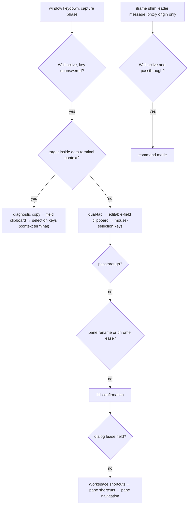
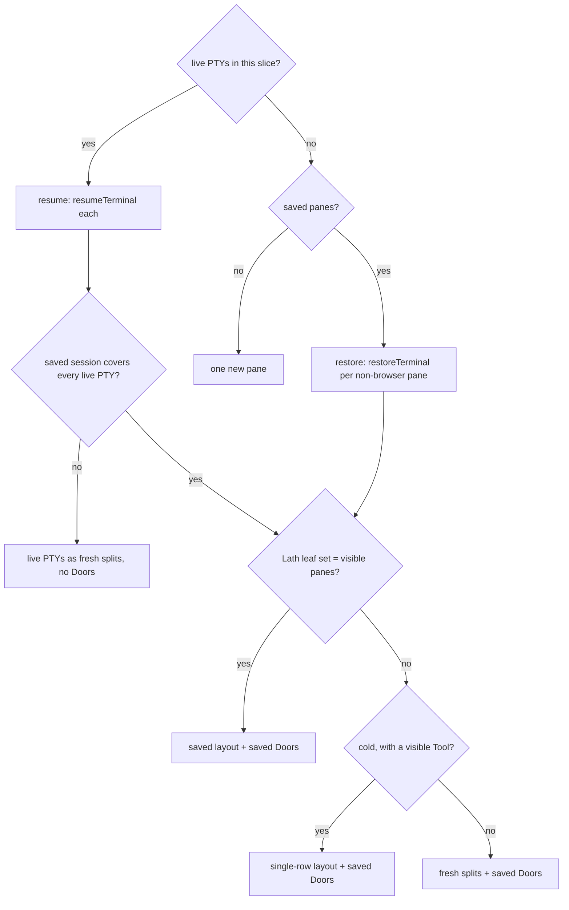

# Layout Spec

> - See `docs/specs/glossary.md` for canonical state names, layer definitions, and transition verbs. This spec uses the glossary's vocabulary throughout.
> - **Owns:** the interaction model on top of Lath — modes and keyboard dispatch, navigation, minimize/reattach, kill/rename, the selection overlay, session lifecycle + persistence recovery, and the Workspace model. Pane chrome: placement and sizing only.
> - **Defers:** engine internals (split tree, rects, DnD, animator) to `docs/specs/tiling-engine.md`; alert/TODO/speech behavior and visual states to `docs/specs/alert.md`; per-Session semantic state (CWD, command lifecycle, title candidates, header derivation, grouping keys) to `docs/specs/terminal-state.md`; browser surfaces to `docs/specs/dor-browser.md`; selection/copy/paste and the mouse-override icon to `docs/specs/mouse-and-clipboard.md`; persisted shapes to `docs/specs/transport.md`; tokens to `docs/specs/theme.md`.
> - **Convention:** "Session" where a statement is terminal-specific, "Surface" where it holds for both.

## Conceptual model

A Wall renders one Workspace's Surfaces as Panes in Content or Doors on the Baseboard. Pane↔Door preserves the Surface; a Doored browser or Tool Surface keeps its backing session while releasing its viewer resources ([Minimize and reattach](#minimize-and-reattach)). Standalone mounts one Wall per Workspace and switches between them ([Workspaces](#workspaces)). VS Code maps each Workspace to a webview (`docs/specs/vscode.md`).

## Shell layout

Two areas: **Content**, the tiling layout of Panes rendered by the **Lath** engine, and **Baseboard**, the bottom strip of Doors and shortcut hints, always present in the app shell.

Lath holds the geometry — split tree, rects, sashes, drag-and-drop, zoom, pane animation (`docs/specs/tiling-engine.md`). **The Wall holds** selection (`selectedId` / `selectedType`), modes, Activity + TODO state, and everything else this spec owns. Source of truth: `Wall` in `lib/src/components/Wall.tsx`.

## Content

Each pane is one leaf in Lath's split tree, never re-parented (`docs/specs/tiling-engine.md` → "The HTML adapter (LathHost)"). **One Surface per leaf, always**; there is no tab stacking. Panes are separated by `PANE_GUTTER_PX`, kept odd for the [Selection overlay](#selection-overlay).

Pane drag scopes: `docs/specs/tiling-engine.md` → "Hierarchical drag and drop". The Wall commits the op and owns selection after it: a center drop lands exactly where `Cmd/Ctrl+Arrow` would ([Spatial navigation](#spatial-navigation)). Source of truth: `onProposeMove` in `lib/src/components/Wall.tsx`.

### Pane header

**Must keep a Tool's unsaved-change dot visible in its Pane header and minimized Door**, across header widths and faces (`docs/specs/dor-tool.md` → Unsaved changes). In a Pane the dot replaces Kill's glyph until hover or keyboard focus reveals the X; where the header tier or the rename editor hides Kill, it sits at the right edge.

**Must mark the Workspace's preview slot with an italic label alone in its Pane header and Door**, naming it Preview in the label's tooltip and the Door's accessible name (rationale). **Must keep the slot on a double-click of its Pane header whose first press lands in the header itself, off its controls** (every button, and an open rename; rationale). **Must offer Keep open in its terminal context too**, beside the Tool status and only while it is the slot. Slot semantics: `docs/specs/dor-tool.md` → Preview slot.

**Must hold the slot's header while a switch holds its ghost** (`docs/specs/dor-tool.md` → Switching the slot): the ghost's face and Display glyph stay until the new view is ready. A terminal face's label keeps its name until the retarget, then shows the Tool's name (`docs/specs/dor-tool.md` → Naming); derivation resumes once ready. A serving Tool's name, read from its params, needs no hold (rationale).

The header doubles as a drag handle: **a `pointerdown` past the drag threshold begins a Lath pane drag**; below it the header's own click behavior stands.

**Never give a Tool navigation, an address, or a dev-server chip** (rationale). **Must keep every Tool header control inside the header's palette**, Terminal Context included. A serving Tool's header, left to right: Display (`docs/specs/dor-browser.md` → Browser Chrome); Terminal Context; its name (`docs/specs/dor-tool.md` → Naming), renamed as a terminal label is; its TODO pill (`docs/specs/alert.md` → Pane Header); flexible gap; split buttons (full only); the pane-action group, with Break between minimize and kill on every face past approval (`docs/specs/dor-tool.md` → Run end). A port conflict's terminal header leads with Terminal Context; the terminal face, which shows that terminal, has none.

A terminal header, left to right: derived label; TODO pill (compact+); flexible gap; mouse-reporting override icon (compact+, only while the inside program requests mouse reporting); split left/right, split top/bottom (full only); then the pane-action group: zoom/unzoom, minimize, kill.

The label is the `DerivedHeader` (`docs/specs/terminal-state.md`). Click renames, except on a preview slot, whose label is drag area; right-click — or `>` in command mode — opens the terminal context.

Source of truth: `TerminalPaneHeader` in `lib/src/components/wall/TerminalPaneHeader.tsx`; `SurfacePaneHeader` in `lib/src/components/wall/SurfacePaneHeader.tsx`; `ToolPaneHeader` in `lib/src/components/wall/ToolPaneHeader.tsx`; `usePreviewKeep` in `lib/src/components/wall/preview-keep.ts`; `useHeldWhile` in `lib/src/components/wall/preview-transition.ts`.

#### Header context menu

**Must open the terminal context from terminal header, body, and command-mode `a` and `>` entry points.** Browser-only Surfaces and Doors have no context. A Tool's context displays its primary terminal (`docs/specs/terminal-context.md` → Tool context); application mouse ownership: `docs/specs/mouse-and-clipboard.md` → Terminal context input.

**Must render one context per Wall in a stable Wall-level overlay**, anchored to the invoking source and following its painted bounds without resizing panes or remounting the helper. An outside pointer press or explicit close dismisses it; its copy editors count as inside.

**Must choose placement on opening and retain its side while usable. Never reposition in response to terminal output.** It goes beside the source where a usable candidate fits, else over the source's half opposite its visible terminal cursor; minimized panes do not count, and zoom uses single-pane placement. **Must remember a manual side choice per source for the mounted Wall's lifetime**, never on disk; an unavailable choice falls back automatically.

**Must always show source title, directory actions, ports, alerts, and helper actions.** **Must keep port actions reachable on one line**, overflowing into a dropdown that launches only on a choice from its open list.

**Must focus context controls on opening.** Explicit entry into the helper xterm gives it terminal keys, Escape there included. Escape from controls closes the innermost disclosure, then the context. Terminal clipboard routing uses the focused helper rather than the selected source.

**Must promote by adopting the helper Session into a new split beside the source**, preserving identity and focusing it. Helper lifetime and source closure: `docs/specs/terminal-context.md`.

Source of truth: `TerminalContextOverlay` in `lib/src/components/wall/TerminalContextOverlay.tsx`; `placeTerminalContext` in `lib/src/components/wall/terminal-context-placement.ts`.

### Pane body

**The terminal host's background must match the terminal screen exactly** and clip to the pane's rounded bottom corners (rationale). Source of truth: `lib/src/components/TerminalPane.tsx`.

**Must share scroll-safe pane messages across iframe status, Tool approval, and port conflicts**, keeping all controls reachable in small panes.

**Must pin a held pane's strip ("Sized for \<label\>" and Take back) to the body's bottom-right corner**, truncating the label rather than wrapping, and never in the header. Hold semantics: `docs/specs/remote-api.md` → "Size authority: last-attach-wins".

Source of truth: `PaneMessage` in `lib/src/components/design.tsx`; `SizeHoldStrip` in `lib/src/components/wall/SizeHoldStrip.tsx`.

### Alarm overlay

A ringing terminal Session gets an overlay spanning its whole Lath leaf through the engine's per-leaf overlay slot; browser surfaces never render it. **It must never intercept pointer/focus routing or change geometry.** Its two layers straddle the header's stacking context:

- **The wash and label** sit above terminal content, below the header and the pane-corner mouse-override banner and held-pane strip, so none is tinted (rationale).
- **The perimeter ring** sits above the header, so the treatment reads as one rounded rectangle around the Pane, and below the sashes (rationale). **Only the ring animates**; the motion is `docs/specs/alert.md` → Pane Header.

| State | Wash | Ring | Label |
|---|---|---|---|
| ringing | 10% | 3px | none |
| `SPEAKING` | 20% | 5px | `SPEAKING` + speaker icon |
| `SPOKEN` | 10% | 3px | `SPOKEN` + speaker icon |

Source of truth: `AlertRingIndicator` in `lib/src/components/wall/AlertRingIndicator.tsx`.

### Pane header responsive sizing

**Must measure each header's own border-box width, never the viewport, retaining its tier at zero width** (rationale). **Each terminal boundary below compact is the width at which the next-lowest-priority element would start eating the group's padding** (rationale). The boundaries live in the tier functions beside each header.

**The pane-action group yields last, and zoom last within it** (to the popover where there is one), since zooming restores everything the header dropped. Narrowing, each header drops:

| Header | In order |
|---|---|
| Terminal | split; then the TODO pill and mouse-override icon (the label truncates); then minimize and kill |
| Browser | split; then navigation; then the chrome, into a viewport-clamped popover behind one trigger; then minimize and kill, into the popover |
| Serving Tool (no popover) | split; then Display; then minimize, Break, and kill — each boundary reserving the widest Display glyph (rationale) |

A port conflict's terminal header adds its Terminal Context button to each terminal boundary.

**Must reclamp the popover on content resize and keep it keyboard reachable** (focus enters on open, Tab stays inside, Escape returns it to the trigger) **and dismiss it on resize, returning focus to the trigger when a focused minimize or kill moves into it, or when its Surface is hidden (without restoring focus)**; controls dismiss only after acting. Keys and connection labels truncate before controls, and a connection label only once the URL has given up all its width.

Source of truth: `useHeaderTier` in `lib/src/components/wall/use-header-tier.ts`; `terminalHeaderTier` in `lib/src/components/wall/TerminalPaneHeader.tsx`.

## Baseboard

**Must group the right-hand controls**, in order: the `N more →` overflow arrow, the live-minimized-pages count (`docs/specs/dor-browser.md` → "Resource Policy"), the host-supplied `notice` slot, the one-time connection indicator (`docs/specs/one-time.md` -> "Laptop UI"), then the always-present spoken-alarm, push, and Settings buttons. The two status buttons toggle their alarm settings and expose state through shape and `aria-pressed`; Settings opens `docs/specs/alert.md` → Settings dialog. With no Doors and room for it, the baseboard shows the command-mode gesture hint.

A minimized session becomes a **door**, showing its label plus the alert badge cluster (`docs/specs/alert.md` → Door); both speech states also name themselves in the Door's `title` and accessible name. **A Door's label is header-derived only for a terminal-backed Surface** (`hasTerminal`); any other keeps its stored title, and a browser Door adds the display glyphs from `docs/specs/dor-browser.md` → "Browser Chrome".

### Door interaction

- **Click** (any mode) or **Enter** (command mode): restore the session as a pane and enter passthrough.
- **m** / **d** (command mode): restore into a pane but stay in command mode — the inverse of `m`/`d` on a pane, making them toggles.
- **x** / **k** (command mode): restore into a pane, then show the kill confirmation; a close that asks nothing closes the Door as it is, so Reopen returns it to the Baseboard ([Kill confirmation](#kill-confirmation)).
- **Arrow keys** navigate to and between doors ([Spatial navigation](#spatial-navigation)).

### Baseboard responsive sizing

- **Everything in the right cluster but the overflow arrow — page count, notice, one-time indicator, the three buttons — is never available to Doors; never measure the overflow arrow into it**, since its presence is an output of the fit.
- **At least one door is always shown**, even if it overflows; past that, Doors fit while room remains for an overflow arrow. A scrolled baseboard shows `← N more` and/or `N more →`; clicking one reveals one Door in that direction. One Door too long to fit between both arrows keeps both and truncates its title.
- **An arrow hiding a ringing or TODO Door must say so**, wearing the Door shape with a static alarm inset and TODO pill, its accessible name counting them (`3 more, 1 ringing, 1 TODO`). **Every arrow must reserve the width of the TODO one**, so the fit never depends on which Doors an arrow hides.
- **Must reveal the selected Door when selection or membership changes**, without overriding manual overflow scrolling.

Source of truth: `lib/src/components/Baseboard.tsx`.

## Workspaces

### Workspace tabs

- Tabs take the shared Door geometry and the pane-header palette pairs; the active tab joins the Wall through a full-width gradient, and inactive tabs fade into the app background.
- **Must show `×` only on the active tab**, outside rename. Middle-click may close an inactive tab.
- **Must activate inactive tabs in command mode on click; clicking the active tab renames without changing mode.**
- **Must make a tab's TODO pill (`docs/specs/alert.md` → Workspace union) its own button, beside the tab's and never inside it.** Its click activates the Workspace and enters the next member with a TODO after the current selection — panes in tree pre-order, then Doors in baseboard order — wrapping. **It enters that member as a click on it would**, unlike the tab's click: passthrough, reattaching a Door (rationale). **With no TODO left it only activates in command mode, never renaming.** Its tooltip names the Surface a click enters as its header or Door shows it; that Surface plays the landing spotlight (`docs/specs/alert.md` → Pane Header).
- **Must enter the Workspace `+` creates in passthrough, keyboard focus included, after mount, unless the user has switched away.** Deactivation restores a Wall's chrome selection to its last live pane. External removal of the highlighted Workspace selects a live pane.
- **Must route command-mode `x` / `k` on a highlighted Workspace tab through the tab's `×` close action**, including inactive tabs.
- **Must reveal a Workspace in command mode before a user close or its confirmation.** Successful user closure selects the next Workspace tab in command mode (previous at the end). Command closures stay focus-neutral.

Source of truth: `WorkspaceStrip` in `lib/src/components/WorkspaceStrip.tsx`; `nextTodoMember` in `lib/src/lib/workspace-union.ts`.

### Workspace names

A Workspace's name is **auto**, derived from its terminals, until a user renames it; an empty rename or `dor workspace rename --auto` hands it back.

- **One vote per member terminal**, Doored ones included, with `cwdAtStart` while a command runs, else `cwd`; browsers do not vote.
- **Any vote inside a git repository wins**: the name is the most common `<repo> @ <branch>`, and directories outside a repository are ignored. `<repo>` is origin's repository name, else the main checkout's folder, so every worktree shares it; a detached HEAD shows a short hash.
- **Otherwise the most common directory**, counted by `cwdIdentity` and shown by basename: `~` for local home, a remote one with its host.
- **A tie keeps the current name when it is among the tied**, else takes the earliest member's (Lath leaf order, then Doors).
- **Must hold the current name for a never-answered path until three consecutive unanswered lookups** (rationale), then vote "no repository"; `Workspace N` until a terminal reports a directory.
- **Never ask git about a remote cwd.** **Must re-ask after a command finishes** (rationale). A host without `gitInfo` names by directory.
- **A path absent from a `gitInfo` answer is unanswered, never "no repository"**, as is every path of a rejected request. **A host failure must reject**, never answer `{}`. An unanswered path keeps its last answer, else holds the name, and is re-asked after a delay doubling per miss.
- **An untouched editor never submits**: opening it must not pin an auto-name, even one that changed while it was open.
- **Must run only `rev-parse` and `config --get`, reading `HEAD` directly**, so `core.fsmonitor` never runs; a lookup past its deadline is left out of the answer.

Source of truth: `deriveWorkspaceAutoName` in `lib/src/lib/workspace-autoname.ts`; `installWorkspaceAutoNaming` in `lib/src/lib/workspace-autoname-controller.ts`; `gitInfo` in `lib/src/host/git-info.ts`.

### Workspace motion

- **Must expand the visible Workspace from its tab on activation, creation, and arrival**, keeping its layout box full-size throughout.
- **Must keep the outgoing Workspace visible and inert beneath the incoming Workspace during a switch**, then hide it and detach its terminal elements when its fade finishes ([Workspace lifecycle](#workspace-lifecycle)).
- **Must collapse a closing Workspace before disposing its Surfaces or removing its tab**, then expand the successor; a refusal restores an active Workspace. Transfer sequencing: `docs/specs/standalone.md` → Transfer.
- **Must reverse interrupted motion from its displayed progress and settle departures even when backgrounded frames stop.**
- **Must render the selection ring outside the transformed Workspace**, re-measuring on its animation frames.

Source of truth: `createWorkspaceMotion` in `lib/src/components/workspace-motion.ts`.

### Moving Surfaces between Workspaces

- **Must move a Pane or Door on release over another Workspace tab**, inserting beside the destination's last selected live pane. **Never activate on hover.** A header or Door press owns a pane drag; a tab press owns reorder and cross-Window tear-out. A drop on a strip gap, the source tab, or a disabled target moves nothing; Escape and pointer cancellation change nothing.
- **Must offer `+` and New workspace only when the source has more than one Surface**, counting Panes and Doors; create a receiving Wall with only the moved Surface. Otherwise disable both, and refuse CLI `--new`.
- **Must offer Move to workspace in terminal and Tool context**, using the same coordinator as dragging. **Never add a browser context menu. Never add a command-mode move binding.** Browser Surfaces move by dragging or CLI.
- **Must retain stable Surface identity and Session state while remounting in the destination Wall**: terminals keep their registry instance, browser automation reconnects, and a retained helper follows its source. **Never close a departing Session.** A moved preview slot is pinned.
- **Must confirm plain iframe and serving iframe Tool moves before creating a destination or changing membership**, with the typed-letter Workspace confirmation ([Workspace lifecycle](#workspace-lifecycle)): the Surface reopens at its last-known saved URL, possibly losing page state. Doors remain minimized while waiting. CLI consent: `docs/specs/dor-cli.md` → dor move.
- **Must refuse dirty Tools, pending Tool approval, browser startup, closing Surfaces/Workspaces and helper promotion**, rechecking after consent and asynchronous preparation. Iframe consent never bypasses a dirty or pending refusal.
- **Must follow a GUI move into destination passthrough** (acknowledgement: `docs/specs/alert.md` → Workspace union); CLI focus: `docs/specs/dor-cli.md` → dor move. Remove a source with no Panes or Doors; if Doors remain but no pane does, refill normally.
- **Must prepare before departure and roll back failed adoption**, restoring layout, Doors, parked state, selection, zoom, metadata and refs. Refs: `docs/specs/dor-cli.md` → Handle Model; durable publication: `docs/specs/transport.md` → Persisted session types.

Source of truth: `moveSurface` in `lib/src/components/wall/surface-move.ts`.

### Workspace lifecycle

Each Wall renders one Workspace. Standalone mounts one Wall **per Workspace**; VS Code and the website playground mount a bare Wall with no Workspace id, which behaves exactly as a single-Workspace Window. Verb semantics are the glossary's Workspace verb rows.

- **Must mount every Workspace's Wall in one grid cell**, inactive Walls `inert`, then `visibility:hidden` after their fade and never `display:none` (rationale).
- **Must preserve mounted leaves across switches**: no re-seed, no re-parent, no leaf unmount, and no `resumeTerminal` / `restoreTerminal`; the only mount work is the terminal reattach below, which replays nothing, so I8 holds by construction.
- **A hidden Wall's terminals hold no element and no GL context**: the outgoing fade's completion unmounts every terminal element, exactly as minimize does ([Renderer](#renderer)); activation mounts and fits through the [Animations](#animations) gate, so an unchanged grid sends no PTY resize. Browser Surfaces keep their live documents (rationale).
- **A hidden Wall consumes no window input**: every listener that dispatches, forwards, or `preventDefault`s window input is gated on `active`. **Only the active Wall renders the modal hosts and the overlays that trap keys** — the kill confirmation and a terminal's copy editor (rationale); a staged prompt survives the switch and is answered only where the user can see it.
- **Exactly one Wall answers a `dor` request** (`docs/specs/dor-cli.md` → "Handle Model"). Every Wall registers a handle, a bare one under `DEFAULT_WORKSPACE_ID`.
- **Never unmount a Wall before its Surfaces are disposed** — `closeAll` waits for the kill fade to commit, bounded by the engine's exit duration (`docs/specs/glossary.md` → "Invariants" I4). **The deadline refuses rather than reporting clean**, and the walk re-reads membership until nothing is left, so a Surface born behind it is closed too.
- **A closing Workspace takes no new Surfaces**: while `closeAll` walks, this Wall answers every Surface-creating `dor` verb with an error, **rechecked after any host round trip the verb makes before creating** (`CREATING_CONTROL_METHODS` in `lib/src/components/wall/use-dor-control.ts`).
- **Must reject duplicate Workspace IDs before mutating the model.**
- **Must retain mode and selection across switches unless the [activation gesture](#workspace-tabs) changes them.**
- **Close confirms first when any member's own close would** (`docs/specs/reopen.md` → "Workspaces and windows"; under Labs a pending kill instead), then closes every member Surface. **Must select the fresh Workspace that replaces the last closed one. Must serialize closes across the Window.**
- **A Workspace whose Wall has not registered is refused** (`workspace '<ref>' is still mounting`, one wording for every caller), never closed past (I4). **A gesture waits out the registration gap first**, as `dor workspace close` does, and is dropped unannounced on its timeout, a pending transfer, or a close in flight.
- **Rename edits the Workspace `name` only**, never a Surface title or the per-pane inline rename, and pins it ([Workspace names](#workspace-names)). **A press inside the open rename editor never starts a reorder.**
- **Must drop the closing Workspace's rename editor and pending confirmation, and no other's.**
- **Every Workspace verb runs outside the strip**, which renders the rename editor and confirmation from a store, so tab gestures and `dor` commands take one path. **Every Workspace verb has a `dor` counterpart** (`docs/specs/dor-cli.md` → "dor workspace"): a command close raises no confirmation, refusing instead, and closes its member Surfaces silently.

A Workspace may leave the Window for another: `docs/specs/standalone.md` -> "Transfer". **Must confirm before a move that would destroy an iframe's page state**: a Workspace holding a plain iframe or serving iframe Tool, Doored ones included, asks with the Close's typed confirmation before it leaves, since that document reopens at its saved URL; agent-browser Surfaces reconnect and ask nothing (`iframeSurfaceRefs` on the Wall handle). **Must show drag refusals over Window content in a dialog** until dismissal, retry, or Workspace departure; it waits behind a pending confirmation and an open rename.

**Must use `WorkspaceKillConfirm` for Workspace close, the iframe move gates, and host termination confirmations**: **a bare matching letter confirms, another bare key cancels, and a modifier or chord never answers**, so `Cmd+Q` still quits. **Must ignore the close confirmation's key while that Workspace transfers.** **Must hold at most one pending Workspace confirmation** (close, cross-Window move gate, Surface move iframe consent), **answered no when a newer one is raised or any close, cross-Window move, or Surface move starts**, by gesture or `dor`, even one that refuses. **Must abandon superseded preparation while awaiting a Wall, window probe or editor decision**, so an older verb cannot later act or replace the newer question. A successful transfer dismisses only the departing Workspace's pending confirmation and rename UI; a failed transfer retains them. No pending kill follows a Workspace to its destination.

Persisted containers: `docs/specs/transport.md`; standalone's per-window record: `docs/specs/standalone.md` -> "Persistence". The union projection: `docs/specs/alert.md` → Workspace union.

Source of truth: `WorkspaceWindow` in `lib/src/components/WorkspaceWindow.tsx`; `requestWorkspaceClose` in `lib/src/components/wall/workspace-lifecycle.ts`; `requestConfirmation` in `lib/src/lib/workspace-ui-store.ts`; `prepareWorkspaceTransfer` in `lib/src/components/wall/workspace-transfer.ts`; `onDropOnOtherWindow` in `standalone/src/workspace-drag.ts`.

## Modes

Wall starts in `command` mode. Embedders may pass `initialMode="passthrough"` when the first pane is an already-running interactive surface that should receive keyboard input immediately.

### Passthrough mode
- Keyboard input routes to the active session's xterm.js instance, which holds DOM focus.
- **Three interceptions only**: the mode-exit gesture (below), the terminal selection/copy/paste chords (`docs/specs/mouse-and-clipboard.md`), and clipboard chords inside one of Dormouse's own text fields.
- In VS Code, selected workbench chords are mirrored: xterm still processes the key and the extension host runs the matching VS Code command (`docs/specs/vscode.md`).

### Command mode
- Keyboard drives navigation and commands; the Session receives no input.

### Mode switching

**Enter passthrough mode:** clicking any pane body or header; `Enter` or `z` on a selected pane; creating a terminal through a manual split (`|` / `%` / `-` / `"`, a header split button) or a host New Terminal action; clicking or pressing `Enter` on a door (restoring the session first); clicking a Workspace tab's TODO pill ([Workspace tabs](#workspace-tabs)).

**Enter command mode:** Left Cmd, then Right Cmd in quick succession — or the same left-then-right gesture with Shift — detected even while xterm holds DOM focus.

- **The Meta and Shift tracks are independent** — Left Cmd then Right Shift does not trigger — and **both are always live** (rationale).
- **A bare Meta/Shift press outside the terminal context is always consumed by this detector**, so no later handler mistakes it for a command key; a key targeted inside the context never reaches it ([Keyboard shortcuts](#keyboard-shortcuts-command-mode)).
- **Must cancel a pending in-Wall mode-exit gesture when any non-Meta/Shift key intervenes.**

Source of truth: `handleDualTap` in `lib/src/components/wall/keyboard/handle-dual-tap.ts`.

## Keyboard shortcuts (command mode)

`docs/specs/shortcuts.md` tables every binding; this section owns the dispatch behavior behind it.

**Must use `,` to rename the selected terminal pane or Workspace tab in command mode**, without activating an inactive Workspace.

**Must support Workspace navigation in command mode through bare `1`–`9`, arrows, and `Enter`.** Digits select by strip position; out-of-range positions are consumed without switching. **Never bind `c`, `n`/`p`, `$`, or `&`.** Rename inputs and confirmation dialogs retain their own controls.

One capture-phase `keydown` listener on `window` delegates in a fixed order; a handler that handles the key, or a gate that holds, ends the chain:

**A key targeted inside `[data-terminal-context]` leaves the chain before dual-tap.** **Must let one Wall answer each key**, even a key that activates another Workspace. **Must prevent default and stop propagation for a handled key and its `keyup`**, which win32-input-mode or kitty would report to the program. Bare Meta/Shift presses stop only internal dispatch; the detector leaves their DOM event untouched.

**Every open dialog holds its own reference-counted lease on that gate**, and command-mode dispatch resumes only once the last lease is released.

**Must defer the pending Workspace confirmation while an inline Workspace rename editor is open**, leaving its keys to the input; it appears after rename ends.

**Chrome outside every Wall takes the chrome keyboard lease instead**: the Workspace strip's rename editor and close confirmation live in the app bar, where `stopPropagation` cannot reach a capture-phase window listener. **The Workspace branch is inert on a Wall with no Workspace id**, leaving those keys unbound on a bare Wall.

**Must leave Escape and Tab to IME composition in modal/popover focus traps and terminal-context dialogs, and Enter/Escape in shared inline editors** (`isComposingKey` in `lib/src/lib/dom.ts`).

Source of truth: `useWallKeyboard` in `lib/src/components/wall/use-wall-keyboard.ts`; `acquireChromeKeyboardLease` in `lib/src/components/wall/chrome-keyboard-lease.ts`.

### Split cwd inheritance

A split from an existing pane (`|`/`%`/`-`/`"` or the header split buttons) spawns the new pane with its source pane's last-known cwd, then selects it and enters passthrough; host New Terminal actions share that focus tail (rationale). Focus-neutral control-plane creation keeps its background behavior ([Corner cases](#corner-cases) #6).

**Never inherit a remote cwd** (`isRemote === true`, e.g. an OSC 7 path reported over ssh). The host default applies when the source cwd is unknown, remote, or absent. Source of truth: `getInheritableCwd` in `lib/src/lib/terminal-state-store.ts`.

### Kill confirmation

Dirty Tool close consent: `docs/specs/dor-tool.md` → Closing unsaved Tools.

`x`/`k` (or the kill button, which first leaves passthrough) shows a pane-centered confirmation with a random lowercase letter; typing it confirms the kill. **`x`, `k`, and Reopen's `u` are excluded from that alphabet** so neither a double-tap nor a reopen accepts it. Which closes skip it: `docs/specs/reopen.md` → "The rule"; under Labs one that would show it becomes a pending kill instead (`docs/specs/reopen.md` → "Labs: No-confirm delayed kill"). `Escape`, the cancel button, and clicking another panel cancel; any other key dismisses it.

**Must return keyboard selection to the next surviving Door after killing a revealed Door**, falling back to previous Doors, then a pane only if no Doors remain. Apply this to confirmed and unasked kills only while the revealed pane, or the Door, is still selected in command mode; cancellation, refusal, or navigating away discards the return target.

A newly spawned shell starts `untouched: true`; the first user-originated PTY input flips it to false. Counted: printable keys, Enter, control keys, keyboard CSI such as arrows/history, paste, file-drop path insertion, forwarded mouse reports, `dor send` input, and a Client's input, which the host owning the PTY reports to the webview as `terminal:clientInput`. Not counted: replay-shaped terminal reports and mouse reports removed by an override.

Source of truth: `requestKill` in `lib/src/components/Wall.tsx`; `wireXtermHandlers` in `lib/src/lib/terminal-lifecycle.ts` (untouched input gate).

## Selection overlay

**Must outline the union of the invoking source Pane and its open helper**, following their outer contour without an internal seam or enclosing unused neighboring space, and restore the source-only ring on close.

A fixed-positioned element over the Lath host, covering the active pane inflated by `SELECTION_RING_INFLATE_PX`, or the active Door uninflated. **The inflate is derived in `lib/src/components/design.tsx` so both ring strokes center on the gutter's midline** (rationale).

- **Exactly one pane or door is active at a time**, drawn by one SVG renderer.
- **Passthrough:** a 1px solid stroke, no glow (rationale).
- **Command:** marching ants. **March for as long as command mode lasts** (rationale). **Never restart or retime the march for travel** — only the dash resizes to the moving perimeter — and draw the smear separately ([Ring travel](#ring-travel)). **While unfocused, pause and desaturate the ring.**
- **Never pause the ants in a focused window except during Workspace title editing**, resuming when editing ends without changing mode, **under reduced motion**, which holds a still dashed ring, **or under `cfg.marchingAnts.paused`**.
- Under `WorkspaceWindow` it renders into `document.body`, outside the Workspace's transform and stacking context. **Every modal must render into `document.body` too, at a `MODAL_LAYERS` value above the ring's**, or the ring crosses it — by value, never insertion order.

Source of truth: `WorkspaceSelectionOverlay` in `lib/src/components/wall/WorkspaceSelectionOverlay.tsx`.

### Ring travel

The ring's rect and shape are driven **per-frame by a JS tween, never a CSS transition** (rationale), over `FOCUS_MOTION_MS` on the house curve. Per-frame writes are imperative and re-applied pre-paint after structural renders. **Never reintroduce per-frame React state** (rationale).

- **Identity change → tween.** A measurement whose identity (`${selectedType}:${selectedId}`) differs from the one on screen glides from the current interpolated position, **clock restarted**, so arrow-key spam stays responsive. An open helper appends its side to the identity.
- **Same identity → snap 1:1** when no tween is in flight; **during one, retarget the destination without resetting the clock**, so the ring converges on a moving target and lands on the original completion instant.
- **Snap gate.** `motionIsInstant()` settles the ring instantly — the predicate the Lath animator's duration uses, so ring and leaves agree. **A ring appearing with nothing on screen also snaps.**
- **Must continue from the last painted frame across Workspace activation**, not the incoming Wall's stale frame. Hidden Walls neither animate nor publish ring geometry.

Source of truth: `lib/src/lib/rect-tween.ts`; `lib/src/lib/ring-geometry.ts`.

#### Directional motion smear

**Must smear each travelling edge by its own perpendicular analytic velocity**, with no smear when settled, under reduced motion, or around a source/helper union, **separate from the crisp, unbroken outline** (rationale). **Must compute dash length from the rendered path's geometry**, never a DOM path measurement (rationale). **Never use an SVG `feGaussianBlur` here** (rationale).

Source of truth: `writeSmear` in `lib/src/components/wall/WorkspaceSelectionOverlay.tsx`.

### Position tracking

The ring measures a pane's enclosing Lath leaf (header + body) through `resolvePaneElement`, and only *visible* Doors — an overflowed door has no element to measure. It re-measures on selection change, target resize, ancestor scroll, window resize, Workspace changes, every Lath store commit, and each Lath animation frame. **Must hold the last painted frame when the target is missing, detached, or zero-sized.**

Source of truth: `resolvePaneElement` in `lib/src/components/wall/resolve-pane-element.ts`.

## Spatial navigation

**Must resolve arrow navigation through the engine-neutral `WallNav` seam to Lath's `neighborOf`, never a DOM rect scan.** Neighbor eligibility: `docs/specs/tiling-engine.md` → "Layout".

**Back-navigation.** A breadcrumb tracks the last navigation direction and origin pane; **the opposite direction returns to the origin instead of doing a spatial lookup**, so asymmetric layouts navigate reversibly.

**Pane↔door.** Down from a pane with no pane below it selects the *first* door; Up from a door selects the *last* pane; Left/Right moves between doors. **Doors have no spatial query** — they are an ordered list.

**Must let Up from a top-edge pane highlight the active Workspace tab when a strip is mounted.** Left/Right traverses tabs in strip order and then `+`, stopping at either end; Down returns to the originating live pane, or the first live pane if it disappeared. Clear pane backtracking on entry to either chrome row. Highlighting changes neither the active Workspace nor DOM focus.

**Must keep Workspace tabs and `+` command-mode-only selection targets.** `Enter` on an inactive tab activates it and retains tab selection in command mode; on the active tab it enters the last live pane in passthrough, falling back to the first. `Enter` on `+` creates a Workspace and enters its terminal after mount. Other pane actions and terminal clipboard operations are inert there. Every passthrough entry selects a live pane.

**`Cmd/Ctrl+Arrow` swap.** Swaps Surface **content** between two panes, leaving the layout shape unchanged (`docs/specs/tiling-engine.md` → "The wall store and engine"). Selection stays on the moved Surface, so **the breadcrumb records the *partner*** (the pane now holding the old slot): the opposite `Cmd+Arrow` swaps back exactly and a plain opposite arrow selects the partner. **Must ignore swap chords while non-pane chrome is selected**, including when a prior pane move left a breadcrumb.

Source of truth: `WallNav` in `lib/src/components/wall/keyboard/types.ts`; `handlePaneNavigation` in `lib/src/components/wall/keyboard/handle-pane-navigation.ts`.

## Minimize and reattach

### Minimize (`m`/`d`, the header button, or a drag onto the baseboard)

Minimizing detaches the leaf into a Door with its restore token (`docs/specs/tiling-engine.md` → "Restore tokens") and moves selection to the new door in command mode; a drag onto the baseboard takes the same path. **The Session stays in the registry — nothing is disposed.** Minimizing the *last* pane also triggers the [Auto-spawn refill](#auto-spawn-refill). A Door carries no metadata copy, and a minimized browser or Tool Surface parks: `docs/specs/tiling-engine.md` → "Parked leaves".

### Reattach (click door, `Enter`/`m`/`d` on door, or drag out)

Reattach applies the token's restore policy (`docs/specs/tiling-engine.md` → "Restore tokens") with the selected pane if live, else the first pane, as its fallback reference; a tokenless or failed restore splits beside the last leaf (or roots an empty tree), so **a reattach is never silently swallowed**. A door dragged out of the baseboard skips the token and inserts at the drop position.

### Splitting from a Door

`dor split --surface <minimized-ref>` and `dor ensure --surface <minimized-ref>` **create the new terminal Surface directly as a Door**, immediately to the right of the reference Door, and **the response reports `minimized: true` even without `--minimize`**. Its restore token's neighbor tier points at the reference Door. **`--auto` resolves to `right` for a Door reference** — there is no visible pane geometry to inspect.

## Inline rename

Triggered by `,` in command mode or by clicking the session name in the pane header. **Must consume `,` without starting a rename on a Door or browser Surface.** Only a terminal or Tool pane, on every face, mounts the title editor.

The editor (`InlineEditInput`, shared with the browser URL editor) confirms on `Enter` or blur and cancels on `Escape`; **whichever lands first settles the edit**. **Must seed each rename from the current label and preserve the user's draft and selection across header re-renders** (rationale). Clipboard chords follow `docs/specs/mouse-and-clipboard.md` §8.9.

Submitted values are rejected when empty or when they fail the `setTerminalUserTitle` validation that also guards title seeding (`docs/specs/terminal-state.md` → Supported OSC Inputs); `<unnamed>` is allowed as a user pin. **On rejection the input still closes** — it is not a blocking dialog — and a transient warning names the offending value.

Source of truth: `usePaneRename` in `lib/src/components/wall/use-pane-rename.tsx`.

## Session lifecycle and terminal registry

**Must use one stable Session id for a terminal Surface, its registry key, and its platform PTY.** Layout moves and swaps change position only. **The session (xterm.js instance, PTY, DOM element) persists in the registry across React mount/unmount cycles**; an unmounted element leaves the entry `Orphaned`. A browser surface's pane ID is a Surface id with no registry entry or PTY; its DOM is rebuilt from persisted params, never from the registry.

| Op | Behavior |
|---|---|
| **Create** `getOrCreateTerminal` | Creates xterm.js and a PTY; reuses an existing entry. **The WebGL addon is not loaded here** ([Renderer](#renderer)). |
| **Resume** `resumeTerminal` | Creates the xterm entry and writes replay data, spawning no PTY. Webview recreated over retained Live or Exited PTYs (Link: Severed → Resuming → Live). |
| **Restore** `restoreTerminal` | Creates the xterm entry and spawns a new PTY with the saved cwd; **replays no transcript** (`docs/specs/transport.md` → "What is persisted"). Cold start (Link: Cold → Live). |
| **mount / unmount** | Reparents or removes the persistent DOM element. **The Registry entry survives**, and **neither fits the terminal** — the caller owns fitting ([Animations](#animations)). |
| **Dispose** `disposeSession` | Kills the PTY, disposes xterm, removes the registry entry on kill or Surface replacement. **Never on minimize.** |
| **Swap** | Registry entries follow the traded leaf ids ([Spatial navigation](#spatial-navigation)). |

- **Untouched**: new sessions start untouched, user-originated PTY input clears it ([Kill confirmation](#kill-confirmation)), and resume/restore seed the persisted one. **Missing snapshot data defaults to touched**, keeping close confirmation conservative.
- **Shell selection replacement**: the standalone Settings dialog's Shell row and the VS Code shell picker send `dormouse:new-terminal` with `replaceUntouched` when the selected shell type changes. **A shell is identified by executable path plus ordered arguments**, so WSL distributions and Windows Developer shells sharing an executable stay distinct. **`Wall` always mints a new session id and a fresh `surface:N` ref.** An untouched selected plain terminal pane or door is replaced in its leaf (an atomic identity swap), the old session disposed and its ref retired; a touched selection, or none, spawns a new pane beside it. Announced spawns show a transient pane-anchored notice.
- **Replay-time terminal reports must be dropped; user input must not be** (`docs/specs/transport.md` → "Report filtering on the input side").

Source of truth: `lib/src/lib/terminal-registry.ts` (the facade over `lib/src/lib/terminal-store.ts` and `lib/src/lib/terminal-lifecycle.ts`).

### Agent resume on cold restore

On cold restore, a terminal pane with a host-captured recovery invocation runs it automatically (`docs/compatible-agents.md` → "Cold restore"). Layout writes one dim `⟲ resuming agent session: <command>` line **to xterm, never the PTY**, a passive notice marking the discontinuity. Source of truth: `restoreTerminal` in `lib/src/lib/terminal-lifecycle.ts`.

### Renderer

**Must use `@xterm/addon-webgl` for mounted terminals when available**, falling back to xterm's DOM renderer on unsupported WebGL, activation failure, or context-budget eviction. `cfg.terminal.webglRenderer` disables WebGL and is off under visual snapshots. (rationale)

- **Must acquire GPU resources at mount, never at Session creation**, and keep a successfully activated renderer when context capture or explicit loss is unavailable. (rationale)
- **Must dispose the addon on unmount/minimize, Workspace deactivation, helper parking, and Session disposal**, then explicitly lose its context when captured and supported, never letting a release failure abort teardown. Minimize preserves the xterm, grid, buffers, PTY, and other addons.
- **Must load a fresh addon on reattachment without resizing the terminal for the renderer swap.** A stale mount's cleanup must not release a newer mount's renderer.
- **Must attempt WebGL at most once per mount.** Failure or context loss stays on DOM until the next unmount/remount; focus and metadata changes never retry (re-arming: [Future](#re-arming-the-webgl-renderer-after-context-loss)).
- **Must preserve the addon's shared atlas cache** across compatible mounted terminals; releasing one renderer releases only its atlas ownership. (rationale)

**Must report the active renderer as `data-renderer="webgl"|"dom"`** on the persistent terminal host.

Source of truth: `TerminalWebglRenderer` in `lib/src/lib/terminal-webgl.ts`.

### Inline graphics

**Must support SIXEL (`DCS ... q ... ST`), iTerm IIP (`OSC 1337 ; File=` and its multipart forms), and Kitty graphics (`APC G ... ST`) in every Session through stock `@xterm/addon-image`**, gated by `cfg.terminal.inlineImages`; Kitty support follows the addon's alpha-quality subset. **Must load the addon at Session creation, never on the first image**: it answers the DA1, XTSMGRAPHICS, and cell-size probes a program reads before sending one (rationale).

**Must bound each Session to 8,388,608 pixels per image, 33,554,432 bytes per SIXEL/IIP/Kitty sequence, and 34 MB of FIFO image storage** (rationale). **Dormouse forwards only the bytes carried in the sequence and resolves no filename**; ImageAddon discards a transfer without `inline=1`.

**Every host's CSP must grant `'wasm-unsafe-eval'`, never `'unsafe-eval'`** — the addon compiles its WebAssembly SIXEL decoder at Session creation (rationale).

Source of truth: `IMAGE_ADDON_OPTIONS` in `lib/src/lib/terminal-lifecycle.ts`; `OSC1337_FORWARDED` in `lib/src/lib/terminal-protocol.ts`; the host CSPs: `getWebviewHtml` in `vscode-ext/src/webview-html.ts`, `app.security.csp` in `standalone/src-tauri/tauri.conf.json`, `pocketContentSecurityPolicy` in `remote-lib-common/src/remote/relay-common.ts`.

### Session persistence

**Must coalesce scheduled saves into one timer without restarting it on later commits.** The snapshot stores its layout in the native Lath format (`docs/specs/tiling-engine.md` → "Persistence"); `docs/specs/transport.md` → "Persistence policy" lists what is persisted. **Derived command/app labels on minimized doors are display-only** — never persisted as user-pinned titles.

Three save triggers, in ascending urgency:

- Any Lath store commit **schedules** the save.
- Content changes with no Lath commit — PTY output, activity/TODO, pane title/command state, minimized-door changes — only **mark the session dirty**; a heartbeat persists only when dirty, so an idle app stops writing.
- PTY exit, `onRequestSessionFlush`, `pagehide`, unmount, and extension shutdown requests **flush immediately and unconditionally** — the net for any dirty-trigger gap (a program calling `chdir()` emits no event, so its persisted CWD may go stale until the next output — accepted).

**A save clears dirty only up to the generation it captured before serializing**, so a change arriving mid-save leaves the session dirty for the next heartbeat; a fresh Wall starts dirty, so the first heartbeat after boot persists. Source of truth: `createSessionDirtyTracker` in `lib/src/lib/session-dirty.ts`.

**Under a Workspace, a Wall publishes its record to the Window aggregator instead of the platform slot**, comparing each save against its own Workspace's previous record (`docs/specs/transport.md` → "Persisted session types"). **A Wall marks itself dirty only for Surfaces it owns.** VS Code persists one Workspace per webview.

Startup recovery plans each Workspace from its slice of one live-PTY list (`docs/specs/standalone.md` → Persistence); a single-Wall host plans through `resumeOrRestore`.

- **Resume** (webview recreated, retained Live or Exited PTYs): **saved pane and door titles are seeded back via `setTerminalUserTitle()`**, so persisted placeholder labels never replay as user pins. **Never fall through to cold restore just because the visible `paneIds` list is empty** — a wall whose retained sessions are all minimized is still a resume.
- **Restore** (app restart, cold start): each pane respawns with saved cwd and title, plus the single-use agent resume invocation (`docs/compatible-agents.md` → "Cold restore") and the pane's persisted TODO, which rides the spawn (`docs/specs/alert.md` → Public State). Every PTY a restore or the one new pane spawns uses the current default shell selection.
- **A visible browser Surface is rebuilt only from the saved layout**, which alone carries its params; a browser Door returns with the saved Doors.

Source of truth: `lib/src/components/wall/use-session-persistence.ts` (save triggers); `collectLivePtys` / `resumeOrRestoreFrom` in `lib/src/lib/reconnect.ts` (recovery priority).

### Activity state

Renderer Activity storage: `docs/specs/alert.md` → Public State.

## Theme

**The `PANE_GUTTER_PX` gap is the only visual separator between panes.** The host paints the app background, so gutters and rounded corner cutouts match host chrome; **terminal content backgrounds are painted by the React terminal wrappers and xterm host elements, never by the outer leaf containers**. Token strategy: `docs/specs/theme.md`.

## Animations

All pane motion belongs to the Lath animator (`docs/specs/tiling-engine.md` → "Animation"). **Never resize terminals to intermediate animation or sash-preview dimensions.** Fit after the final geometry is painted, including a sash commit at its last preview size; canceled sash drags preserve the original grid, and same-size reattachment sends no PTY resize. Outside layout motion, container resizes are debounced (rationale).

Source of truth: `TerminalResizeContext` in `lib/src/components/wall/wall-context.tsx`.

### Zoom (elevated expansion)

**Zoom is presentation-only** (`docs/specs/tiling-engine.md` → "Core model"). **Zoom is coupled to passthrough focus**: acquiring it enters passthrough and focuses that pane; exiting passthrough, focusing another pane, or selecting a Door or a Workspace tab starts unzoom immediately.

**Only the owner's header shows Unzoom**, and only the owner's control toggles zoom *off*. Other headers stay reachable around the zoomed pane, so their Zoom control **hands zoom over — focus included** — rather than merely unzooming the owner. Source of truth: `releaseZoomExcept` in `lib/src/components/Wall.tsx`.

### Spawn (new pane reveal)

Enter motion: `docs/specs/tiling-engine.md` → "Animation". Shell-selection replacement shows a transient notice over the resulting pane, static under reduced motion; its reuse after a Surface move: `docs/specs/dor-cli.md` -> "Handle Model".

### Kill (two-phase fade + tween reclaim)

Every kill gesture runs the animator's two-phase exit (`docs/specs/tiling-engine.md` → "Animation").

**Selection tail.** At removal time selection moves to a survivor (or to `null`, then auto-spawn, when the last pane goes) **only when the killed pane is still the selected pane** — a live check re-read at removal, so a background kill leaves selection untouched and a selection move *during* the fade is honored both ways (rationale).

**A doored Surface has no visible pane to fade**: its kill closes any agent-browser session, forgets the leaf, disposes the Session, and drops the Door. Source of truth: `killPaneImmediately` in `lib/src/components/Wall.tsx`.

### Auto-spawn refill

A store commit that empties the tree (last pane killed or minimized) spawns one leaf **re-entrantly on the same commit chain**, so the refill appears with no separate delay (rationale). Like a split, it takes the default shell selection and **the departing pane's local cwd**.

**The refill adopts the replacement only when the current selection points at nothing real** — null or still naming the removed pane. **A valid selection is left alone** — the just-created door on the minimize path, or a live pane after an unselected kill. Only an explicit user selection of a pane — a click, a drag, or an embed focusing itself — moves selection off that door afterwards.

## Corner cases

> Numbers are cited from other specs and code: never renumber; leave a retired one retired.

- **#2 — A focused iframe surface is not a window blur**: it blurs the window while `document.hasFocus()` stays true, so **presence ends only on a *real* blur** (`docs/specs/alert.md` → Engagement). Source of truth: `subscribeWindowFocus` in `lib/src/lib/window-focus.ts`.
- **#6 — Focus-neutral surface creation (`dor ensure` / `dor iframe` / `dor agent-browser`)**: unlike `dor split`, these open in the background without moving focus off the caller (`docs/specs/dor-cli.md`, `docs/specs/dor-browser.md`); the create never re-parents the caller's subtree, steals activation, or selects. **The one exception**: `dor iframe` / `dor agent-browser` replacing the pane the user is *currently selected on* moves selection to the replacement, else it would dangle on the removed leaf; any other pane, or a door selection, is left untouched. Any completed teardown preserves the caller's live selection.

## Future

### Re-arming the WebGL renderer after context loss

A mounted pane that loses its WebGL context ([Renderer](#renderer)) stays on the DOM renderer until it is unmounted and mounted again, even once other panes close and free budget. The eviction order is also backwards for a tiling terminal: browsers evict *oldest-first*, but the pane that most deserves the GPU is the focused one.

The future policy permits another WebGL attempt when a DOM-fallback pane gains focus. Unbuilt because the naive version thrashes: past the context cap, focusing panes in turn would evict and rebuild glyph atlases on every focus change, plausibly worse than sitting still on the DOM renderer. Any implementation needs a re-arm budget (at most once per pane, or a cooldown) and a measurement showing focus-cycling does not regress.
