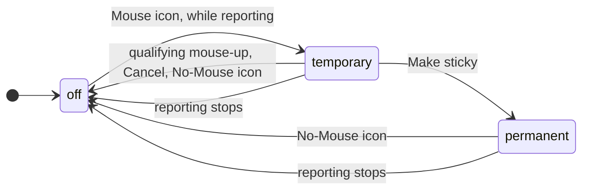

# Terminal Mouse and Clipboard Behavior Specification

> - See `docs/specs/glossary.md` for Session / Pane vocabulary. This spec uses it for the pane-level scoping of mouse regime, override state, and selection.
> - Owns terminal selection, copy, paste, link activation, and mouse override across platforms; for a Tool, only while its terminal is forward. Header placement: `docs/specs/layout.md`; sequence registry: `docs/specs/terminal-escapes.md`.
> - Sections are numbered for cross-spec reference (`§8.6` etc.); the numbers are stable, so append rather than renumber.

---

## 1. The Mouse Icon (Header Indicator)

**Visibility.** The **Mouse icon** marks an inside program requesting mouse reporting (§6.1); the **No-Mouse icon** takes the same slot while an override is active.

Source of truth: `TerminalPaneHeader` in `lib/src/components/wall/TerminalPaneHeader.tsx`.

---

## 2. Override State

The mobile touch modes set it directly (`docs/specs/mobile-terminal-ui.md` -> "Touch mode selector").

**Temporary override.** While active:

- Mouse events go to the terminal, not the inside program; the reports xterm still emits: `docs/specs/transport.md` -> "Report filtering on the input side".
- **Wheel events are suppressed too**, so xterm cannot turn scroll into mouse reports or alternate-screen arrow keys.
- A banner over the pane offers **Make sticky** and **Cancel**.

It ends on the **next mouse-up inside the terminal content area** paired with a prior mouse-down there:

- **Counts:** a plain primary click (down/up that never crossed the drag threshold) or a completed drag.
- **Does not count:** a non-primary click, whose context menu the override swallows anyway; clicks on the No-Mouse icon or the banner buttons; and an orphan mouse-up from a drag that started outside the terminal. Pinned by `lib/src/lib/terminal-mouse-router.test.ts`.
- **On end** — or on **Cancel** — reporting is restored and the banner dismissed. **Must cancel a pending banner action when its temporary override ends**, never reactivating it later. **No timeout:** absent any mouse action the override stays indefinitely.

**Sticky override** (`permanent`): banner dismissed, No-Mouse icon kept, mouse and wheel still going to the terminal.

**Auto-clear on reporting off.** **Either override clears when the inside program stops requesting mouse reporting** (it exits, or DECRSTs `?9l`/`?1000l`/`?1002l`/`?1003l`); icon and banner go with it. A **dead** session's replay ends in the `REPLAY_MODE_RESET` tail that DECRSTs mouse tracking (`docs/specs/transport.md` -> "Replay-time mode-reset tail (Dormouse-emitted)"), so a mode latched by a dead TUI cannot block selection in the restored pane.

Source of truth: `setOverride` / `setMouseReporting` in `lib/src/lib/mouse-selection.ts`; `MouseOverrideBanner` in `lib/src/components/wall/MouseOverrideBanner.tsx`, pinned by `lib/src/components/wall/mouse-chrome.test.tsx`.

---

## 3. Selection Behavior

Selection is available whenever the terminal handles the mouse (§3.5, §6.1).

### 3.1 Initiating a Selection

- **A selection edge is the cell boundary nearest the pointer**, as xterm.js's own selection reads it: the earlier edge (reading order, or column order for a block) takes the cell after its boundary, the later edge the cell before (rationale). Source of truth: `dragCells` in `lib/src/lib/drag-cells.ts`, pinned by its test.
- **Must begin selection only once a click-and-drag crosses the drag threshold**; plain clicks shift pane focus or activate hyperlinks. **Must capture mouse presses on xterm’s screen immediately** (rationale); that capture, and the plain click it must not break, are pinned by `lib/src/lib/terminal-mouse-router.test.ts`.
- On touch or pen, a primary pointer tap-and-drag takes the same path; non-primary touch pointers are ignored.
- **A drag whose button comes up outside the webview iframe must still finalize**, by captured `pointerup` or the window-`mousemove` backstop (rationale).

Source of truth: `lib/src/lib/terminal-mouse-router.ts`.

### 3.2 Selection Shapes

- **Linewise (default):** reading order, wrapping end-of-line to start-of-next-line.
- **Block (rectangular):** hold **Alt** (Option on macOS) during the drag.
- **The shape updates live as Alt is pressed and released mid-drag**, including while the mouse is stationary.
- Touch has no Alt key, so block mode is armed by **starting the drag with a double-tap** on a previous touch that *ended as a tap*. **Must retain that block shape for the whole drag**, including hardware-keyboard events. Pinned by `lib/src/lib/terminal-mouse-router.test.ts`.

### 3.3 Selection Hint Text

A hint beside an in-progress selection names its keys for the whole drag; §5.2 adds the extension line. Strings and placement live in `lib/src/components/SelectionOverlay.tsx`.

### 3.4 Selection Follows Content

A selection is anchored to the characters under it, not to screen coordinates: stored in absolute buffer rows (scrollback + viewport).

- **Pure scroll** — vertical translation with no character changes — carries the selection along; coordinate math only, no matching.
- **Must cancel a finalized selection on the next xterm render when its extracted selected text changes**; repaints elsewhere are irrelevant. Retake the text snapshot when the selection is finalized or moved (§4.3). **Never add a partial-match or content-tracking heuristic** (§9.1).
- **Terminal resize** carries a finalized linewise selection Dormouse owns, in the normal buffer, through xterm's reflow (rationale). Its editor stays open in the same format and same-labeled scope, else As selected; per-break edits drop unless the width held.
  - **Must cancel if an edge's line was trimmed or its cells no longer read as the selected text** (rationale).
  - **Must cancel any other.**

Source of truth: `followReflow` in `lib/src/lib/selection-reflow.ts`, pinned by `lib/src/lib/selection-reflow.test.ts`; `watchSelection` in `lib/src/lib/selection-watch.ts`.

### 3.5 Selection in the Live Region vs. Scrollback

**Scrollback selection is always available**, whatever the reporting or override state, and a drag from scrollback into the live region is a single continuous selection; live-region availability follows §6.1's matrix.

### 3.6 During a Drag

**A terminal-handled drag claims the keyboard.** **e** extends to a detected token (§5), **Esc** cancels the drag and any in-progress selection, and every other keystroke is swallowed, not forwarded. **Alt** alone is left un-swallowed, so the OS still sees the modifier that drives block shape (§3.2). Normal routing resumes on mouse-up; the handler yields entirely when the selected Surface is not a terminal.

Source of truth: `lib/src/components/wall/keyboard/handle-mouse-selection-keys.ts`.

### 3.7 Ending a Selection

- Releasing the button ends the drag and fixes the selection; the copy editor (§4) opens.
- It persists until the editor is dismissed (§4.5).
- **A new mouse-down in the terminal content area replaces any existing selection immediately**, its editor with it.

### 3.8 Drags the Inside Program Owns

A primary mouse drag that reaches the inside program (§6.1) is **shadowed**: its events reach the program untouched, and on release the cells it crossed become a linewise selection the program owns.

- **Must never consume, delay, or reorder a shadowed drag's events**; only a press that crosses the drag threshold counts, so a program click shadows nothing.
- It draws no outline, only a copy-chord hint: the program paints its own highlight.
- **The copy chord opens the copy editor over it** (§4), outline included. Any input the program receives drops the shadow (§4.5), as does the program ending mouse reporting.
- Touch never shadows; a touch drag over a reporting program takes §6.1's rows.

Source of truth: `finishProgramDrag` in `lib/src/lib/terminal-mouse-router.ts`, pinned by `lib/src/lib/terminal-mouse-router.test.ts`.

---

### 3.9 Select All

**Must keep macOS ⌘A from selecting Dormouse's UI or a terminal's buffer**; text fields, Tool iframes, and browser panes keep it.

Source of truth: `isMacSelectAll` in `lib/src/lib/select-all.ts`.

## 4. Copy Editor

Mouse-up over a terminal-handled drag opens the **copy editor**, as does the copy chord over a shadowed one (§3.8): the text a copy would produce, every line break the selection crossed marked (rationale).

### 4.1 Formats

| Format | Clipboard text |
|---|---|
| **Auto** (opens here) | Decoration stripped, each break judged on its own (§4.1.1). |
| **Exact** | As displayed: selected rows joined by `\n`, each trimmed of trailing whitespace — soft-wrapped rows included. |
| **Spaces** | Decoration stripped, blank lines dropped, every break one space, continuation indents removed. |
| **No breaks** | As Spaces, every break deleted. |

**Decoration** is a frame-only line (dropped), a leading or trailing run of box drawing (`U+2500–U+259F`, Box Drawing and Block Elements), and a TUI's leading bullet (`⏺`, `⎿`, `●`). **Must read cells through xterm's wide-character continuation cells.** **A deleted soft wrap joins its rows exactly**, keeping a blank on either side of it. **Every judgement reads a soft wrap's rows as one line**, indented as its first row (rationale). **Never rewrap a block-shape selection**: it is a rectangular slab, so Auto reads it as Exact, and it has no wider scope (§4.2) and no edge keys (§4.3).

Source of truth: `render` in `lib/src/lib/copy-text.ts`, pinned by `lib/src/lib/copy-text.test.ts`.

#### 4.1.1 Auto

**Must delete true soft wraps before judging hard breaks against their surrounding logical lines.** The ordered heuristic, including its bounded local width estimate, lives at `autoBreak` (rationale).

**Must trim leading/trailing blank lines, collapse blank runs, and remove shared indent**, keeping relative indent. **Must use full row indentation for mid-line starts.**

Source of truth: `autoBreak` in `lib/src/lib/copy-text.ts`.

### 4.2 Scopes

**Must offer distinct scopes containing the drag, narrowest first.**

| Scope | Covers |
|---|---|
| **As selected** | The drag (opens here). |
| **Whole words** | Each edge grown over its token, across any row break Auto deletes; an edge on a blank grows nothing. Named **Full URL** or **Full path** when the §5.1 detector classifies a grown edge token so. |
| **Paragraph** | The lines between blank lines, frame-only lines, and box sides (`│ ┃ ║`) at column zero; an edge on a boundary never crosses it. |

Source of truth: `computeScopes` in `lib/src/lib/copy-text.ts`.

### 4.3 Keys

| Key | Effect |
|---|---|
| `Cmd+C` (Ctrl+C on non-macOS), with or without Shift | Copy what the editor shows, in either mode. |
| `e` / `Shift+E` | Next wider / narrower scope, stopping at either end. |
| `f` / `Shift+F` | Next / previous format, wrapping, in table order (§4.1), then the program's own copy (§4.6). |
| `←` `→` / `Shift+←` `→` | Move the end / start one word; a row boundary ends a word. Returns to As selected, keeping the format. |
| `Enter` | Copy, as the chord does. |
| `Esc` | Close and cancel the selection. |

**Every key but the copy chord is the editor's in passthrough only**; command mode keeps its own. Any other key goes to the terminal, which closes the editor (§4.5). **Intercept Ctrl+C only while the editor is open or a shadowed drag waits for it** (§3.8); otherwise it reaches the inside program (SIGINT for shells, app-defined for TUIs). A selection a TUI makes from the keyboard (vim visual mode, less search highlight) is neither, and does not change that routing. Touch shows no key hints.

Source of truth: `handleMouseSelectionKeys` in `lib/src/components/wall/keyboard/handle-mouse-selection-keys.ts`; the transitions in `lib/src/lib/copy-editor.ts`, pinned by `lib/src/lib/copy-editor.test.ts`.

### 4.4 Preview and Marks

Every break is a mark that a click cycles keep → space → none, flagging the active format as edited; a scope or format change, or a nudge, discards those edits.

### 4.5 Placement and Dismissal

- **Must render into `document.body` at `COPY_EDITOR_Z_INDEX`**: above the selection ring, below every `MODAL_LAYERS` value (rationale).
- **Must re-place on every selection or scope change; never keep a spot that covers the selection while another fits.** Above and below may cover neighboring panes. The ranking lives at `placeCopyEditor` (rationale).
- **Must follow its pane at most once a frame** (`docs/specs/layout.md` → "Position tracking").
- **Never show while its Wall travels**, its pane hidden, or another pane zoomed over it.
- **Never take focus**; only an actual scrollbar press keeps its default (rationale). Presses inside it count as inside its pane (`anchoredTarget`); its `mousedown` and `contextmenu` never reach the pane.
- **Esc**, a click outside the editor, a content change or a resize it cannot follow (§3.4), a confirmed copy, or **any input the terminal receives** — typing, a paste, Pocket's input bar — dismisses it and cancels the selection. Source of truth: `writeUserInput` in `lib/src/lib/terminal-lifecycle.ts`, pinned by `lib/src/lib/terminal-lifecycle.selection.test.ts`.
- **Must confirm only after a successful clipboard write, and only for the selection copied**; the selection then clears, however it moved meanwhile (rationale). Canceling clears the confirmation immediately.
- **Must leave empty copies idle without writing.** **Must say a failed write failed**, keeping the selection for a retry. Without the Clipboard API, or refused by it, the write first falls back to `execCommand('copy')` (rationale).
- **Must open the clipboard-failure report when a write fails both ways**, unless its caller opts out. **Its details never carry the copied text**; they go to the tracking issue the report links.

Source of truth: `CopyEditor` in `lib/src/components/CopyEditor.tsx` (placement, motion, touch slop); `copySelection` in `lib/src/lib/copy-selection.ts`; `writeTextToClipboard` in `lib/src/lib/clipboard.ts`, pinned by `lib/src/lib/clipboard-write.test.ts`; `ClipboardFailureGlobal` in `lib/src/components/ClipboardFailureDialog.tsx`.

### 4.6 The Program's Own Copy (OSC 52)

An `OSC 52` clipboard write from the inside program is never the clipboard. It becomes an **offer** the editor can show (rationale):

1. The owner's parser decodes the base64 as UTF-8, turns `\r\n` and `\r` into `\n`, and removes every other control character but tab. **Must drop, never truncate, a payload over `CLIPBOARD_OFFER_LIMIT` base64 characters** (rationale); a `?` read is never answered, and an empty or malformed write offers nothing. The sequence is consumed either way.
2. The host sends it to the owning renderer as `terminal:clipboardOffer` (`docs/specs/transport.md` -> "Message protocol"); replay offers nothing (`docs/specs/terminal-escapes.md` -> "`pty:data` strip semantics").
3. **Must accept an offer only into a pane whose selection the program owns** (§3.8), shadowed or open in the editor, the latest replacing any earlier; it goes with that selection.
4. The editor then offers a fifth format, **From \<program\>** (the running command as WATCHING keys it, `docs/specs/alert.md`, else `program`), last in `f` order. **It has no scope**: choosing it returns to As selected, and `e` does nothing while it shows. Its marks still flip, and a nudge returns to Auto. **Never write an offer to the clipboard except as that format, chosen and copied by the user.**

Source of truth: `parseOsc52` and `CLIPBOARD_OFFER_LIMIT` in `lib/src/lib/terminal-protocol.ts`, pinned by `lib/src/lib/terminal-protocol.test.ts`; `offerProgramCopy` in `lib/src/lib/mouse-selection.ts`, pinned by `lib/src/lib/mouse-selection.test.ts`; `editorFormats` in `lib/src/lib/copy-editor.ts`.

---

## 5. Smart Extension (URL / Path Detection)

**Must re-examine the URL/path token under the cursor on every drag update, never reusing an answer for an unchanged cell.** Offer **e** to extend over it, alongside Alt (§3.2–§3.3).

### 5.1 Detection

A token is whitespace-delimited and **runs on across soft wraps**. Trailing characters unlikely to be part of it — `.`, `,`, `;`, `:`, `!`, `?`, single quotes, double quotes — are stripped from its end, along with unmatched closing brackets (`)`, `]`, `}`, `>`); matched pairs are preserved. **Strip before pattern matching, never after** (rationale).

**Must map detection offsets through xterm cells**, preserving wide characters, combining marks, and multi-codepoint emoji, skipping wrap padding. Source of truth: `detectTokenInBuffer` in `lib/src/lib/smart-token.ts`, pinned by `lib/src/lib/smart-token.test.ts`.

`PATTERNS` in `lib/src/lib/smart-token.ts` holds the detected shapes in priority order, error locations (`<path>:line[:col]`) ahead of the generic path patterns. The generic patterns require an anchor (`~/`, `/`, `./`, `../`, or a drive letter), so a bare relative path like `src/foo.ts` qualifies only in its error-location form.

### 5.2 Mid-Drag Hint

The hint gains a line naming the detected kind, URL or path, live while the drag is over a qualifying token, and none otherwise.

### 5.3 Extension Action

- **e** during a drag, while the hint is visible, extends the selection over the full detected token: the anchor is preserved, the far end moves to the token boundary away from it. The drag then continues normally — movement updates the selection from the new boundary, Alt still toggles block shape.
- **e** with no qualifying token is consumed (per §3.6) but extends nothing; once the drag has ended, `e` is the editor's expand instead (§4.3). Release finalizes whatever boundaries the drag, extensions included, produced.
- **Only this single extension step is offered mid-drag**, and no "open URL" action (§9.1); the editor's scopes are the wider steps (§4.2).
- **Must preserve extension on keys that leave the shape unchanged.** Pinned by `lib/src/lib/terminal-mouse-router.test.ts`.

---

## 6. Interaction Summary

### 6.1 State Matrix

**Mouse reporting** is any mouse-tracking mode the inside program sets (DECSET `?9`, `?1000`, `?1002`, `?1003`), read from xterm without consuming the sequence (`lib/src/lib/mouse-mode-observer.ts`). Where a drag goes; **Terminal** means the terminal's own selection.

| Program requests mouse | Override | Live-region drag | Scrollback drag |
|---|---|---|---|
| No | — | Terminal | Terminal |
| Yes | No | Inside program, shadowed (§3.8) | Terminal |
| Yes | Temporary | Terminal, ends on mouse-up | Terminal |
| Yes | Sticky | Terminal | Terminal |

**Ownership is decided at mouse-down and latched for the whole drag** (§3.5). Wheel events follow the override rows only: swallowed while an override is active (§2); in the "Yes / No override" row they reach the inside program in both regions.

Source of truth: `terminalOwnsEvent` in `lib/src/lib/terminal-mouse-router.ts`.

---

## 7. Rendering Notes

**Must keep selection and hint updates from rerendering pane headers or override banners** (rationale). Outlines and hints draw above the cell grid from xterm's measured cell geometry, remeasured on every render tick.

Source of truth: `TerminalPaneHeader` in `lib/src/components/wall/TerminalPaneHeader.tsx` and `MouseOverrideBanner` in `lib/src/components/wall/MouseOverrideBanner.tsx`, pinned by `lib/src/components/wall/mouse-chrome.test.tsx`; `SelectionOverlay` in `lib/src/components/SelectionOverlay.tsx`.

---

## 8. Paste Behavior

### 8.1 Overview

**Paste keystrokes are intercepted by the terminal**, never forwarded: the inside program receives only the clipboard bytes, optionally bracket-wrapped (§8.5). **A non-empty clipboard or file-path paste marks the Session touched** before the direct PTY write (`docs/specs/layout.md`).

### 8.2 Paste Keybindings

**`Cmd/Ctrl (+Shift) + V` — all four combinations, on every platform — are intercepted and paste** (`hasPasteModifier`); copy keeps the macOS separation instead (§4.3). The price: the raw control byte `0x16` (readline `quoted-insert`, vim literal-next) never reaches the program by this key (§8.3; rationale).

Source of truth: `lib/src/components/wall/keyboard/chords.ts`.

### 8.3 Program Literal-Next Input

**Must intercept paste chords even after a program's literal-next prefix**; Dormouse does not track that program state. `Ctrl+Q` is forwarded normally, but a following `Ctrl+V` still pastes rather than sending `0x16` (rationale). A terminal-level literal-next shortcut remains unbuilt (§9.2).

### 8.4 Platform Detection

**Must use `IS_MAC` for the copy chord, platform labels, and macOS chrome**; the paste chord is platform-independent (§8.2). Source of truth: `lib/src/lib/platform/index.ts`.

### 8.5 Bracketed Paste

When the inside program has opted in via `\e[?2004h`, the PTY gets `\e[200~`, the clipboard content, then `\e[201~`; otherwise the content is written unwrapped. The mode is read at paste time.

**Must defang every bracketed payload:** replace each `\e` with visible U+241B before wrapping, or an embedded `\e[201~` closes the boundary and later newlines submit. **Never filter the unbracketed branch:** with no paste boundary, filtering only corrupts deliberate escape sequences. Both branches are pinned by `lib/src/lib/clipboard.test.ts`.

Source of truth: `defangPasteEscapes` in `lib/src/lib/clipboard.ts`.

### 8.6 Paste Content

Paste reads the clipboard in three tiers, preferred in order:

1. **File references** (a Finder/Explorer Copy of a file). Each path is shell-escaped; the space-joined list is written to the PTY with a trailing space, so the next token starts cleanly.
2. **Plain text.** The adapter's native `readClipboardText` where it has one, else `navigator.clipboard.readText()`. **Never reverse that order** (rationale). A non-empty string goes to the PTY (bracket-wrapped, §8.5).
3. **Raw image data.** If file references and text are empty, save image bytes to a new temp directory and paste its path as tier 1. **Must use owner-only directory and owner-read/write file modes on Unix-like systems.** Windows storage limits: `docs/specs/security-local.md` -> "Browser panes". The file and directory are removed after about five minutes while the host remains running (rationale).

**Tiers 1 and 2 are read in parallel** and the file reference wins; tier 3 is sequential because it allocates a temp file. Every tier empty ⇒ silent no-op.

One shared Node module, `standalone/sidecar/clipboard-ops.js`, serves both hosts by shelling out to each platform's clipboard tools: the sidecar (Tauri on macOS/Linux) and the extension host (VSCode on all platforms, via the `lib/clipboard-ops.cjs` shim — tiers 1 and 3 only, so VSCode's tier 2 falls through to `navigator.clipboard.readText()`). **Every spawn must pass `windowsHide`** (CREATE_NO_WINDOW; rationale).

**The standalone/Tauri build on Windows reads the Win32 clipboard directly in Rust**, dropping the subprocess, with the same temp-file cleanup for an image. Non-Windows Tauri stays on the sidecar path.

**Must refuse the whole file-reference paste or drop (tiers 1 and 3, and §8.7) when any path carries a C0, DEL, or C1 character** (`hasShellInputControls`), bracketed or not, and show a notice on the pane (rationale).

**Path escaping (tiers 1 and 3, and §8.7). Quote a pasted path for the Session's launch shell** — never for the host platform, never for the app-global shell selected for future terminals (rationale). Each terminal captures its `shellKind` at spawn, kept across a live reconnect (`docs/specs/transport.md` -> "Reconnection protocol") and a cold restore. **Only a missing registry entry falls back** — to the app-global selected shell, then the platform (`cmd` on Windows, posix elsewhere). Classification uses the same `shellCommandKind` `dor` uses to quote commands (`docs/specs/dor-cli.md`). **Must share `quotePowerShellArg` with `dor` for literal PowerShell arguments; never use cmd quoting for PowerShell** (rationale). The posix/cmd escaping rules and their parser limitations live at `shellEscapePath`.

Source of truth: `lib/src/lib/clipboard.ts` (Session-kind selection, control refusal), `lib/src/lib/shell-escape.ts` (dispatch + posix/cmd rules, pinned by `lib/src/lib/shell-escape.test.ts`), `dor/src/commands/shell-quote.ts` (`shellCommandKind`, `quotePowerShellArg`), `standalone/src-tauri/src/clipboard_win.rs` (Win32 read).

### 8.7 Drag-to-Paste

**Must route native file drops only to the selected Pane of the active Workspace**, ignoring a Door selection or a Session outside that Workspace's layout. Paste paths as tier 1 (§8.6). **Tauri's native handler is inert while `dragDropEnabled: false`** (rationale).

Source of truth: `useSessionPersistence` in `lib/src/components/wall/use-session-persistence.ts`; `app.windows` in `standalone/src-tauri/tauri.conf.json`; pinned by `lib/src/components/WorkspaceWindow.test.tsx`.

**Drag-to-paste is not supported in the VSCode build**: the workbench never routes OS file drops to a `WebviewView` (§9.2).

### 8.8 Right-Click and Menu Paste

Right-click paste is not implemented. On macOS standalone, clicking Edit → Paste in a terminal pastes plain text through xterm.js, skipping §8.6's tiers.

### 8.9 Clipboard Chords Inside Dormouse's Own Text Fields

Dormouse's own text fields get their clipboard chords from `handleEditableClipboard`, **ahead of the wall's mode and rename gates** so a focused field wins whatever the wall is doing:

- **Paste** reads through `readTextFromClipboard` (the §8.6 tier-2 preference) and replaces the field's selection; **copy** and **cut** write the selected substring, and a cut deletes only after a successful write. **Text only** — the file-reference and image tiers stay terminal-only.
- Chords are §8.2's: paste takes either modifier on every platform, copy/cut take `⌘` on macOS and `Ctrl` elsewhere.
- **Scope is narrow.** Excluded: xterm's `.xterm-helper-textarea` (the terminal owns its chords), read-only and disabled fields. The handler runs only where the adapter implements the optional `readClipboardText` — today the two standalone adapters (rationale). Elsewhere — VS Code, the website, Pocket — it never fires and the webview's own chords are untouched.
- **Must skip an asynchronous edit if the field unmounts, loses focus, becomes read-only/disabled, or changes value or selection.**

Source of truth: `handleEditableClipboard` in `lib/src/components/wall/keyboard/handle-editable-clipboard.ts`, pinned by its test.

---

## Terminal context input

**Must give application-captured right-click to the terminal program**, retaining header right-click as the context entry point. Do not add a Shift-right-click override gesture.

**Must route clipboard chords and selection operations to the focused helper**, while leaving its Escape, Tab, arrows, and digits with xterm. Which of those disarm autorun follows `docs/specs/terminal-context.md` → "Helper lifecycle".

**Must copy selected context diagnostic text with Cmd+C on macOS and Ctrl+C elsewhere.** Copy only a selection contained in the focused diagnostic, retaining it on clipboard failure; helper and editable-field chords keep their own routing.

Source of truth: `handleContextCopy` in `lib/src/components/wall/keyboard/handle-context-copy.ts`, pinned by its test; `TerminalPanel` in `lib/src/components/wall/TerminalPanel.tsx`.

---

## OSC 8 hyperlinks

Neither `params` nor the URI is parsed at the PTY boundary.

**Activation never opens directly**: xterm.js's `linkHandler` reads the link's rendered display text from the buffer range xterm supplies. A local `file:` link whose display text names its target previews (`docs/specs/dor-tool.md` -> "Terminal links"); every other click, and any preview that fails, opens the confirmation dialog carrying the URI *and* the display text. The dialog shows the full target in one of three states:

| State | Target | Dialog |
|---|---|---|
| **Openable** | any absolute URI with a scheme — `http:`, `https:`, `mailto:`, `file:`, custom app schemes such as `vscode:` | cancel plus an open action |
| **Deceptive** | display text URL-shaped (a full URL or a bare domain) but resolving to a different host than the target; one that merely *differs* — a human phrase, a same-host sibling URL — is **plain**, not deceptive, and stays openable | **No open action at all**: close and copy only, the copy button taking initial focus so a reflexive Enter cannot open anything |
| **Blocked** | malformed URIs, targets carrying a control, bidi, or zero-width character (`hasControlOrFormatCharacters`), browser-executable or opaque pseudo-schemes (`javascript:`, `data:`, `blob:`, `about:`) | **Never silently dropped**: the dialog opens with the reason, close the only action |

**Cancel/close is the safe default; long targets must wrap and scroll without truncation.** **Must show the target, display text, and any error with those characters escaped** (`printableExact`), so the text read is the text there. **The confirmation host must reject deceptive verdicts even if its callback runs.** **Every external-URL adapter must revalidate through `normalizeExternalUri` before opening** (VS Code before `vscode.env.openExternal`) — consent does not replace validation.

`docs/specs/dor-tool.md` → "Terminal links" owns confirmed file opening and viewer selection.

Source of truth: `normalizeExternalUri` in `lib/src/lib/external-links.ts` (pinned by `lib/src/lib/external-links.test.ts`), `lib/src/components/ExternalLinkModal.tsx`, and the host's own verdict re-check in `lib/src/components/ExternalLinkModalHost.tsx`.

## 9. Future

**Scope: mouse-clipboard-backlog** — unprioritized, each added on user feedback: [§9.1](#91-mouse-and-selection) and [§9.2](#92-paste).

### 9.1 Mouse and Selection

- Auto-scroll during a drag that reaches the viewport edge.
- Double-click to select word, triple-click to select line.
- More formats (strip line numbers, strip prompts, join hyphenated line-breaks, Markdown rebuilt from styling) and scopes (a command's output from OSC 133 marks, a TUI message).
- Contextual editor actions (Open URL, Open in `$EDITOR`, Copy hash).
- A "quiet mode" setting to suppress hints for experienced users.
- Content-matching selection tracking when the underlying content changes (today: cancel-on-change).
- Keyboard activation of the mouse icon and banner buttons.
- Refining Auto's heuristics based on dogfooding.

### 9.2 Paste

- Enable Tauri's native file drops by setting `dragDropEnabled: true`; pointer-based Lath dragging no longer needs the flag disabled (rationale at §8.7).
- Right-click context-menu Paste, and routing Edit → Paste through §8.6's tiers.
- A settings toggle to disable Ctrl+V interception on Windows and Linux.
- A paste popup for previewing or transforming content before it is committed.
- Paste content transformations (strip trailing whitespace, normalize line endings, convert smart quotes).
- Paste history.
- Credential-shaped content detection and warnings.
- Multi-line paste confirmation dialogs.
- A "literal next keystroke" terminal-level shortcut (Ctrl+Alt+V or similar) for programs without Ctrl+Q-style `quoted-insert`.
- Middle-click paste / X11 PRIMARY selection integration on Linux.
- Drop-position-aware pane routing (drops go to the focused pane today).
- Drag-to-paste in the VSCode build — `WebviewView` is excluded from external-file drop routing and there is no API to opt in ([microsoft/vscode#111092](https://github.com/microsoft/vscode/issues/111092), closed as out-of-scope).
