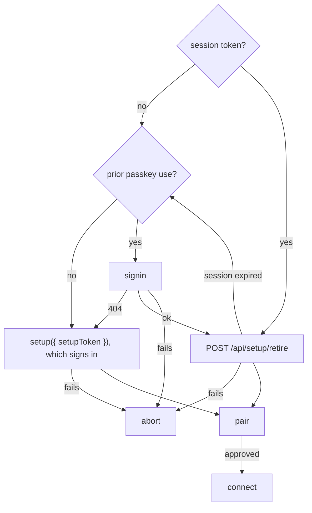

# Pocket App Architecture

> - See `docs/specs/glossary.md` for Session / Pane vocabulary.
> - How the phone client (Dormouse Pocket) is structured and deployed. The protocol is [remote-api.md](./remote-api.md); the selfhost Relay is [relay.md](./relay.md); key and pairing rules are [remote-security-model.md](./remote-security-model.md).

## The seam: the remote session is a platform adapter

`lib` renders every Dormouse surface through a `PlatformAdapter`, whose PTY core — `requestInit`/`onPtyList` resume path included — maps one-to-one onto the remote-api v1 terminal protocol:

| PlatformAdapter          | remote-api                              |
| ------------------------ | --------------------------------------- |
| `onPtyList`              | `directory.snapshot`                    |
| attach semantics         | `surface.attach` (attach-is-the-resize) |
| `onPtyData`              | `terminal.data`, both projections        |
| `writePty`               | `terminal.write`, minus renderer replies |
| `resizePty`              | `terminal.resize`                       |
| `onPtyExit`              | `terminal.closed`                       |

Pocket is:

> auth screens + `MobileTerminalUi`/`MobileWall` + **`RemotePtyAdapter`**

— the composition [mobile-terminal-ui.md](./mobile-terminal-ui.md) owns, which the website also wires on `FakePtyAdapter` (`website/src/components/PocketTerminalExperience.tsx`). **Everything outside the PTY core no-ops or is absent** — `getCwd` → null, shells/clipboard empty, alerts inert, `alertAwait` settling `cancelled` rather than never resolving.

**Scanning is the only way in** — no setup password, no typed credential; the code on the computer's screen is both account setup and pairing.

**A QR the native camera opened is origin bootstrap only.** The `#pair?` fragment is erased before the first render, parsed or not; nothing is retained, no call is made, the token is not spent, and the auth screen asks for a scan from inside Pocket. **An installed iOS Pocket can never receive a scanned hash** — Camera opens Safari, a different partition. (rationale)

**The scanner reads a code as data**: it never navigates, and camera or pasted text goes to `parsePairingInvitationUrl` ([relay.md](./relay.md) owns the grammar) (rationale). **The invitation lives in memory only**, cleared on every terminal outcome.

**After the parse.**

**A phone that registers nothing spends the code at `POST /api/setup/retire`**, so a photographed QR cannot register a passkey afterwards. **A session the Relay no longer honors falls back to sign-in with the same code**, which the session gate refused before spending. **Only a sign-in refused 404 falls back to registering** (rationale). Pairing runs per [remote-security-model.md](./remote-security-model.md) → Pairing, and **the two digits go on screen before the outcome is known and stay until it lands**. **Cancelling closes the relay socket** and reports nothing. (rationale) **A refused token is reported, never folded away**: `SETUP_TOKEN_INVALID_ERROR` becomes `SetupTokenInvalidError`, whose recovery is a new code on the computer.

**Runtimes are gated, not degraded**: `probeNoiseSupport` runs before sign-in, setup, pairing, or connection; `false` renders a fixed upgrade requirement instead.

**Pocket hides `MobileWall`'s local Kill affordance**: v1 grants no phone-side kill or layout authority (rationale).

**An inline image crosses the relay as the ordered `terminal.data` messages its PTY chunks produce**, reassembled by Pocket's own xterm, which loads ImageAddon wherever the terminal's `inlineImages` setting is on. **Nothing coalesces them and no size gates them** (rationale); each is bounded only by what the Burrow feeds its parser ([remote-api.md](./remote-api.md) → Terminal surfaces).

**Must drop an entire `terminal.data` projection pair if either projection has invalid base64url or UTF-8**, then continue accepting later data.

`RemotePtyAdapter` exposes the adapter-specific `setActivePane(id)`: v1 allows one attachment per session, so pane switching is detach → attach. **Writes and resizes for a non-attached pane are dropped, but the latest resize for a pane being attached is kept**: its attach or a `terminal.resize` after it carries that size (rationale). **A refused `terminal.resize` after the attach never fails `setActivePane`.** Badges for non-attached panes come from `directory.watch` without attaching.

* **Must normalize dimensions before sending or caching them.**
* **Must settle fire-and-forget PTY failures and release subscriptions that arrive after disposal**; a disposed adapter never restarts or delivers events.
* **Must serialize attachment transitions**, completing stale detaches before another attachment to the same surface starts.
* **Must close an authorized connection when `hello` or adapter initialization fails, or the wall's current attachment fails; report on the Burrows list.**
* **`PtyInfo.alive` is `entry.alive`, never derived from `entry.exitCode`** — the latter is the last command's shell-integration status.
* **An absent `terminal.closed` exit code maps to `-1`, not `0`** — the local path's sentinel.
* **Exited surfaces stay in the directory** with `alive:false`, so the wall filters them out of selectable sessions and the active-pane default.

**The pinned record picks a row's primary action.** The Burrows view lists the `KnownBurrowV1` records (no record, no row), stamped online from `GET /api/burrows`, offering Connect alone or **Pair again** alone. **Nothing asks the Burrow**: only an authenticated `pairing-required` outcome moves a row, dropping local authorization without discarding the pin (rationale). **Remove** tombstones the delivery id before deleting the record.

**A record of the signed-in account the Relay's list no longer names is removed**, marked only off a `GET /api/burrows` that succeeded; a listed offline Burrow, and another account's record, keep the offline row. **Must bind removal checks to the account that started the list read.** Its row reads `BURROW_REMOVED_COPY` for the deployment Pocket read (`docs/specs/remote-network.md` -> "Anywhere") and offers **Forget** alone, which is Remove. **A Connect answered `BURROW_UNAVAILABLE_MESSAGE` re-reads the list**, showing that copy instead where the Burrow is gone; a failed re-read keeps the original.

Source of truth: `PlatformAdapter` in `lib/src/lib/platform/types.ts`; `App` in `lib/src/remote/pocket-app/App.tsx`; `ScanInvitation` in `lib/src/remote/pocket-app/ScanInvitation.tsx`; `takePairingHash` in `lib/src/remote/pocket-app/pair-link.ts`; `PocketClient` in `lib/src/remote/client/pocket-client.ts`; `RemotePtyAdapter` in `lib/src/remote/client/remote-adapter.ts`.

## Design system and theming

**All of Pocket — the auth screens included — renders on the shared themeable design system** (`--color-*` tokens over `--vscode-*`; [theme.md](./theme.md), `DESIGN.md`), never the website's separate "homepage" system (`website/src/index.css`). **No Pocket-specific palette**: a theme change re-skins auth screens and wall together.

**The theme is restored before first paint** (rationale), defaulting to `POCKET_THEME_ID`, which the website playground imports so the two cannot drift. Restoring also syncs the document-level chrome — root `color-scheme` and the `<meta name="theme-color">` tint — from the applied theme.

Source of truth: `restorePocketTheme` in `lib/src/remote/pocket-app/pocket-theme.ts`; `PK` in `lib/src/remote/pocket-app/pocket-chrome.tsx`.

## Installable web app

Pocket ships a web app manifest and a service worker: installable to a home screen, able to receive Web Push while backgrounded or closed.

**Must request iOS push permission from a user gesture in a Home Screen web app.** Pocket declares `display: standalone`; installation is manual. **Must ship manifest icons and `apple-touch-icon`**, which takes precedence on iOS (rationale). The manifest and icons are checked-in source under `lib/pocket/public/`, each referenced by an absolute root path.

**The worker is built, not copied.** It decrypts sealed pushes ([remote-security-model.md](./remote-security-model.md) -> Push sealing), so it imports the shared crypto, the IndexedDB records, and `boundedPushText` rather than mirroring them. It is one classic IIFE at the stable, unhashed `/sw.js`, registered with `scope: '/'` and **no `type: 'module'`**. **A worker that is not one classic self-contained script fails the build**: `lib/scripts/assert-pocket-worker.mjs` runs last in `build:pocket`, which root `pnpm build` runs (rationale).

- **The worker caches nothing and registers no `fetch` handler** (rationale). It handles `push`, `notificationclick`, and `install`/`activate` to take over immediately (`skipWaiting` + `clients.claim`) — nothing else.
- **Every delivery ends in a notification.** `userVisibleOnly: true` promises it (rationale), so a push with no payload, an unknown `burrowId`, a `pairing-required` record, a failed decrypt, or malformed plaintext shows the generic content-free notice rather than returning early. What does decrypt is re-validated and re-bounded here ([alert.md](./alert.md) -> Push notifications owns the rule).
- **Registration is best-effort and never awaited**: a failure warns and boot continues (rationale) — ordinary without support and on an insecure origin, since service workers need a secure context.
- **Must focus an existing app window on notification click, preserving its screen, or open `/` if none exists.** Pushes carry no Pane navigation target.

**The installed app is a separate storage partition from the browser tab** — iOS Safari and a Home Screen web app share no cookies, `localStorage`, or IndexedDB — so the install mints its own per-Burrow statics, signs in once on its own, and is a *different Client*, **needing its own pairing approval on each Burrow**. (rationale) **The two cannot be merged**, so Pocket suggests a label naming the mode at pairing — `Dormouse Pocket (Home Screen)` versus `Dormouse Pocket (browser)` — for the laptop's approval modal and Alarm settings to tell them apart.

**Signing in *is* enough to ask.** `SigninFinishResponse` returns the asserted passkey's public key, which a Client needs to build a presence proof, so a profile that never registered can still pair (rationale); holding that public key authorizes nothing ([remote-security-model.md](./remote-security-model.md) -> Client statics). **If the cached copy disappears mid-session, Pocket clears the session token and returns to sign-in** (`PasskeyUnavailableError`).

Source of truth: `lib/pocket/public/manifest.webmanifest`; `lib/src/remote/pocket-app/sw.ts` with `lib/vite.sw.config.ts`; `registerPushServiceWorker` in `lib/src/remote/pocket-app/service-worker.ts`; `deviceLabel` in `lib/src/remote/pocket-app/views.tsx`.

### Detecting install state, and what cannot be detected

Installed means `navigator.standalone === true` (iOS) or the standard `(display-mode: standalone)` media query. **Push availability is evaluated in this order, and every unavailable result is named in the UI**: `needs-install` (`navigator.standalone` exists but the app is not installed — first, since iOS tabs omit the APIs below), `unsupported` (no service worker, `Notification`, or `PushManager`), `no-worker` (the registration failed or resolved empty), `denied`, then `ready`.

**Never parse the user-agent:** iPadOS reports as a Mac; `navigator.standalone`'s presence is the install-required signal. **A tab cannot detect the installed app**, so the copy allows for "already installed, wrong window."

**Push is asked for once per device, on one card on the Burrows view, never from the wall or a Burrow row**: the prompt and the `PushSubscription` are scope-wide, and only the Relay's rows are per `(burrowId, deliveryId)` ([relay.md](./relay.md) → State files). Its tap subscribes the browser, then registers every paired Burrow.

**Which Burrows this device is registered with is read from the Relay on entering the Burrows list**, never tracked locally (rationale). **The readback is by capability, never by identity** (rationale): `POST /api/push/subscriptions/query` presents this browser's own delivery ids and reports only on those ([relay.md](./relay.md) → Web Push). `POST /api/push/subscribe` answers with the same thing — every Burrow this device is registered with after the mutation — so **both are complete answers, never deltas**: only which is newer.

**A Relay row is necessary but not sufficient for "push on".** Pocket also checks that permission is still granted, that the scope holds a `PushSubscription` minted for the Relay's current VAPID key, and that it points at the registered address; any of the four failing re-offers Enable, and the Relay omits such rows too ([relay.md](./relay.md) → Web Push).

**Pocket records a SHA-256 digest of the address each time the Relay accepts a registration** (`dormouse-pocket:push-endpoint`) and compares it on open (rationale) — a digest, since the address is a bearer capability. **One key per device, not per Burrow.** **Absent reads as no opinion, not as a mismatch**, so a device that predates the record, or whose storage was cleared, is not forced to re-register.

**Repair waits for the next app open, never a `pushsubscriptionchange` handler in `sw.js`**: a worker cannot obtain a session token, and **unattended re-registration would need a long-lived credential** [remote-security-model.md](./remote-security-model.md) does not grant.

**Registering another Burrow, or retrying that POST, reuses the scope's existing `PushSubscription`** when its `applicationServerKey` matches the Relay's VAPID key byte-for-byte; a new endpoint is minted only when the key differs (rationale). **When it does rotate, the Relay drops that device's other Burrow rows in the same mutation** and its response lists what survived, which makes a committed POST whose response was lost self-repairing (rationale).

**Obsolete delivery mappings are retired, durably.** A `pairing-required` transition, a re-pair that mints a new id, and an explicit **Remove** each write the old `{ burrowId, deliveryId }` to `PendingDeliveryDeletionV1` *before* the record forgets it (rationale), then call the idempotent deletion route; tombstones retry until a Relay answer clears them. **This deletes the delivery row alone** — never the scope's shared `PushSubscription`, and never another Burrow's row.

Source of truth: `getPushAvailability` / `subscribeToPushInBrowser` in `lib/src/remote/client/push-subscribe.ts`; `pushNoticeState` in `lib/src/remote/pocket-app/App.tsx`; `PocketClient.subscribeToPush` / `retirePendingDeletions` in `lib/src/remote/client/pocket-client.ts`; `pushEndpointFingerprint` in `remote-lib-common/src/security/push.ts`.

## What Pocket stores

**Must have a successful current-page storage probe before a scan starts registration, sign-in, token retirement, or pairing**, selecting the Client static format per [remote-security-model.md](./remote-security-model.md) → Client statics. The probe is shared in flight, cached only on success and only in memory, and invalidated by any later store or key-generation failure. **Both formats failing shows a storage compatibility error without resetting pairing data**, pointing at `/diagnostics/index.html`; **it names the failed probe stage and an allowlisted exception name, never a browser exception message or key material.** (rationale)

**Must use metadata-only summaries for listing, push registration and queries, removal, and re-pair identity checks**, so a corrupt key blocks none of them; connection and push decryption use full records. **A connection-record read failure shows fixed retry/scan text, never browser exception details, and changes no authorization**: a fresh scan keeps the Burrow pin and requires fresh approval. (rationale)

**Page and worker decode both formats.** **The encrypted envelope (`aes-gcm-x25519-v1`, its context string included) is a persisted format**, so every later build must read it; **older builds cannot**, and rollback means a compatible build or pairing again.

**One module owns the IndexedDB name, its version, its upgrade, and every open** (rationale). `dormouse-pocket` is at **v4**: `known-burrows` (`KnownBurrowV1`, keyed by `burrowId`) and `pending-deletions` (`PendingDeliveryDeletionV1`, keyed `burrowId:deliveryId`); every earlier version upgrades to that shape. **A version bump is a compatibility event: it must never empty `pending-deletions` for a store already at v4**, which would discard owed deletions. **`navigator.storage.persist()` is requested best-effort**: a browser that refuses gets ordinary eviction-prone storage, which re-pairing survives ([remote-security-model.md](./remote-security-model.md) → Client static loss).

**A `KnownBurrowV1` is this Client's whole authorization state** for one Burrow. **`localStorage` holds only the `:passkey:` cache, the `:push-endpoint` digest, and the Relay session** (`dormouse-pocket:session`: token, account, credential id, expiry; rationale). **A launch holding an unexpired session opens on the Burrows list**, whose first read finds out whether the Relay still honors it. **Sign out on the Burrows view forgets the session locally; nothing revokes it on the Relay.**

Source of truth: `requirePocketKeyStorage` in `lib/src/remote/client/pocket-db.ts`; `generatePocketKeyPair` in `lib/src/remote/client/pocket-private-key.ts`.

## Serving the built bundle

**Caching is set explicitly.** Vite content-hashes everything it emits into `assets/`, so those are `immutable`; everything else — `index.html`, the built `sw.js`, and the `public/` passthroughs at the root — is `no-cache`: revalidate before use, not never store, and load-bearing (rationale). Two rules make it hold:

- **The class comes from the request path** (`/assets/` or not), never the platform-shaped resolved path (rationale).
- **The SPA fallback overrides that class with the shell's, and 404s under `/assets/`**: the shell is never an answer to a subresource miss. (rationale)

The Hosted Relay serves the same bundle by the same rules (`docs/specs/hosted.md` -> "Relay").

Source of truth: `registerPocketServing` in `relay/src/app.ts`; `pocketRoutes` in `hosted/server/pocket.ts`. Both built HTML shells are checked by `assertPocketShell` in `lib/scripts/assert-pocket-worker.mjs`.

### The capability harness

**Must serve the opt-in capability harness at `/diagnostics/index.html`**, built from `lib/pocket/diagnostics/` as a second Pocket HTML entry with its own manifest identity and start URL. Four rules make its evidence worth anything:

- **Never read pairing data, open a production database, request passkeys or media permissions, or upload results**; reports omit key material.
- **Must use the production key codec, authenticated context included**, for the encrypted round-trip and restart tests. API presence is observational and certifies no platform, so a report states which browser/app context it measured; a crypto-storage pass requires reopening and using the key.
- **Must retain a restart checkpoint only on explicit preparation**, in a diagnostic-only database, until explicit cleanup; verification needs a new page instance and derives the saved expected result with the recovered key.
- **Never claim a page reload proves process termination.**

**Must identify harness v3 production-format reports and reject legacy restart checkpoints with explicit cleanup/reprepare instructions**, never silently reclassifying experimental evidence. (rationale)

Source of truth: `runCapabilities` in `lib/pocket/diagnostics/capabilities.js`.

## A backgrounded phone loses its Burrow session

**While a connection is established and the page is visible, Pocket sends one fixed-size keepalive every `E2E_KEEPALIVE_INTERVAL_MS` (30 s)** on the Noise session; hiding the page pauses them, and returning sends one immediately before resuming the interval. (rationale)

The Burrow disposes any session it has not decrypted a Client message on for `ESTABLISHED_E2E_IDLE_TIMEOUT_MS` ([remote-security-model.md](./remote-security-model.md) → Burrow bounds), so **a phone suspended for longer comes back to no session**, and reconnecting costs a fresh Noise handshake (rationale). **Connect rides the Burrow's presence window whenever message 2 offers one, and proves presence otherwise** ([remote-security-model.md](./remote-security-model.md) → Presence window); **a ride refused `presence-rejected` is retried exactly once, on a fresh handshake that always proves**, and the caller sees only the retry's outcome (rationale). **Pocket runs the same deadline against its own last send**, before a keepalive and before every request, and reports burrow loss when it passes: the reap's goodbye may never be read, and the relay socket to the *Relay* stays open. (rationale)

**The Burrow's goodbye is burrow loss** — its idle reap, a newer session from this same Client static, or the person at the computer taking a pane back ([remote-api.md](./remote-api.md) → Transport): the phone leaves the wall exactly as it does for a `burrow-gone`, and stays paired.

Source of truth: `ClientSessionCore` in `lib/src/remote/client/session-core.ts`; `PocketClient.connect` in `lib/src/remote/client/pocket-client.ts`.

## The path the session takes

**Pocket offers a direct path once the connection outcome says `ok`**, over the browser's own `RTCPeerConnection` (ICE servers by deployment, read before every Connect and pairing: [remote-network.md](./remote-network.md) → Anywhere), and keeps the session on the relay when the browser has none or the Burrow declines ([remote-api.md](./remote-api.md) → Direct path owns the whole protocol) — **unless the outcome says `directOnly`**, where the connect answers only once the direct path carries the session ([remote-network.md](./remote-network.md) → Local networks).

**Must retire the previous session — its peer, its channel, and its pending requests — immediately before the replacement's connection request goes out, and never report burrow loss for it**: the old channel's close can otherwise arrive first and fail the replacement's waiter. **Never earlier than that**: a presence proof the user dismisses, or a handshake that fails, leaves a working session untouched, and a replacement refused after the request has gone leaves none.

**Must label the connected header with the live path, `relay` or `direct`, without status colours**, keeping fallback reasons in hover text. **Must pass only a `DirectRelayCause` to Pocket, never runtime failure text**; `TRANSPORT_RELAY_CAUSES` owns the displayed sentences. After the switch, a channel failure ends the session (remote-api.md → Direct path): Pocket returns to the list, and reconnecting costs a fresh handshake.

Source of truth: `PocketClient.connect` in `lib/src/remote/client/pocket-client.ts`; `deploymentDirectPeer` in `lib/src/remote/pocket-app/deployment.ts`; `TRANSPORT_RELAY_CAUSES` in `lib/src/remote/pocket-app/views.tsx`.

## An expired session drops to sign-in

Sessions expire ([relay.md](./relay.md)) and, on a self-host Relay, also end on every restart, while the passkey and paired Burrow records outlive both; Hosted also ends the session of an account no longer entitled (`docs/specs/hosted.md` -> "Relay"). **Pocket therefore treats a dead session as actionable, not reportable** (rationale): `PocketClient` clears its token, in memory and in storage, and throws `SessionExpiredError`; the app tears down any live adapter and returns to sign-in carrying that message. One passkey prompt restores the Burrows list, pairing and push registration intact.

- **The trigger is the session gate specifically**, matched on the shared `UNAUTHORIZED_ERROR` from `remote-lib-common/src/remote/wire.ts` — a refused setup token answers 401 too. (rationale)
- **A rejected relay upgrade carries no status**, so `openSocket` asks an authenticated route what happened: a 401 there means expiry, anything else leaves it an ordinary socket failure.

Source of truth: `SessionExpiredError` in `lib/src/remote/client/pocket-client.ts`.

## Deployment: same-origin, always

**The Pocket app is always served same-origin with its API**: WebAuthn binds passkeys to the serving origin, and Chrome's Private Network Access rules block public-site → private-network fetches. Pocket holds itself to it by construction — an empty API base, a `wsBase` from `location.origin` — and the Relay enforces it: a registration or assertion whose `clientDataJSON.origin` is not the configured origin is rejected ([relay.md](./relay.md); rationale); the Relay emits no cross-origin grant ([security-remote.md](./security-remote.md#cross-origin-access)). **The bundle mounts at the origin root, never under a path prefix**: the manifest's `start_url`/`scope`, the worker's registration scope, and the shell's manifest/icon links are all root-absolute. The one-time page reuses Pocket's screens and wall but not this rule (`docs/specs/one-time.md` -> "Phone page").

**The origin is served with a Content-Security-Policy**, the defense in depth around the active XSS `docs/specs/security.md` -> "What is not defended" names (rationale). **Every source is the app's own origin** (`default-src 'self'`, with `frame-ancestors`, `base-uri` and `object-src` `'none'`), **loosened only by** `style-src 'unsafe-inline'`, the WebSocket origin named in `connect-src` (rationale), `data:`/`blob:` images, and `blob:` media. **`script-src` stays `'self'` plus `'wasm-unsafe-eval'` ([layout.md](./layout.md#inline-graphics)), with no nonce pipeline**: `assertPocketShell` fails `build:pocket` on any inline `<script>` body or off-origin `src`/`href` in the emitted `index.html`. (rationale)

One lib-owned bundle, two deployments:

* **Selfhost:** the Relay serves the bundle (`lib/dist-pocket`); selfhost auth never depends on dormouse.sh existing.
* **Hosted:** the relay Worker serves it at the root of `relay.dormouse.sh` beside the Hosted Relay's routes (`docs/specs/hosted.md` -> "Relay"); rpId is that host. The staging adds `deployment.json`, which tells the bundle Hosted serves it ([remote-network.md](./remote-network.md) → Anywhere).

**The website stays fully static — playground and marketing pages — in both worlds**, sharing all terminal UI through `lib` and never duplicating Pocket code.

Source of truth: `pocketContentSecurityPolicy` in `remote-lib-common/src/remote/relay-common.ts`.

## Future

**Scope: pocket-polish**

1. **Dedupe the composition** — the website's `PocketTerminalExperience` and the Pocket shell (`PocketWall.tsx`) each wire `MobileTerminalUi` + `MobileWall` independently; extract the shared wiring so they cannot drift.
2. **Theme picker in Pocket** — the app restores the persisted theme but exposes no picker; add the shared `ThemePicker` (and its theme-debugger entry) once its dropdown is phone-friendly.
