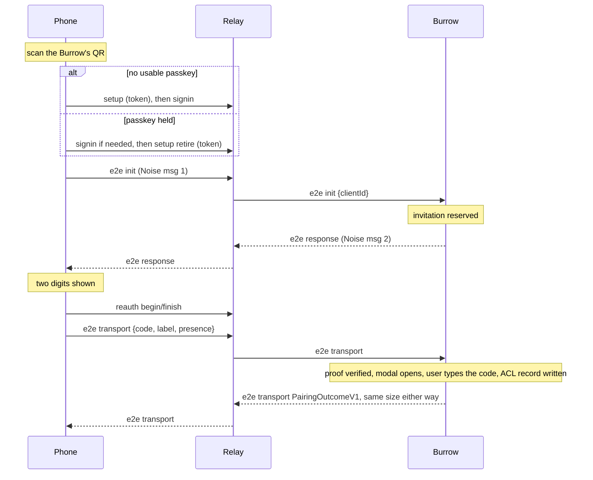
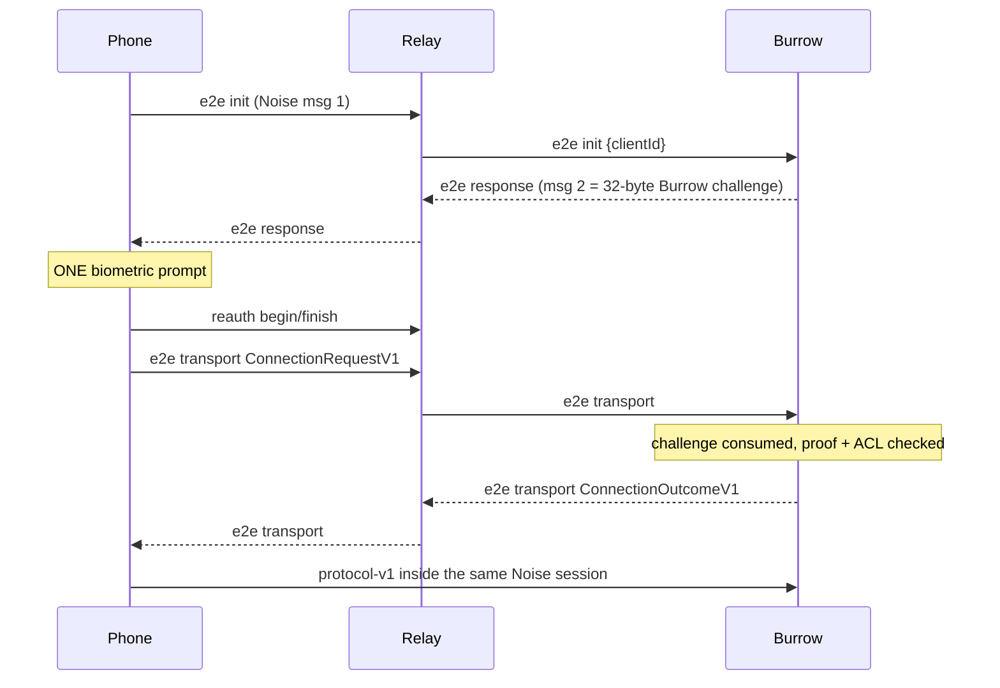
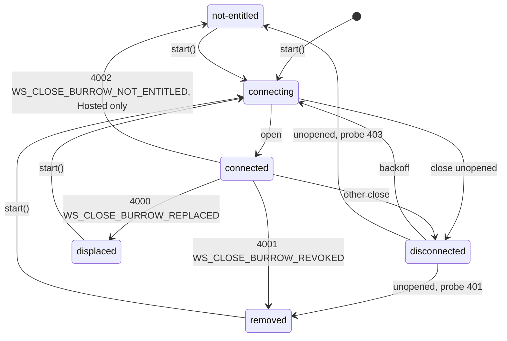

# Relay (selfhost) and Burrow service

> - See `docs/specs/glossary.md` for Session / Pane / Surface vocabulary; this spec uses it for what the relay exposes.
> - Owns the selfhost Relay server (`relay/`), the wire it routes, and the desktop Burrow service that enrolls with it: the Relay origin a build bakes, `BurrowService` and its store, enrollment, the relay socket, Settings → Remote control, and running and installing the Relay. `docs/specs/hosted.md` owns the Hosted Relay; host plumbing is `docs/specs/standalone.md` -> "Burrow service" and `docs/specs/vscode.md` -> "Burrow: a service in the extension host".
> - Read `docs/specs/remote-security-model.md` first — it owns the trust model this one deploys and what the Burrow decides and proves; `docs/specs/remote-api.md` owns what flows after authorization, `docs/specs/pocket-app.md` the Pocket app this Relay serves.

The Relay is one Node process (Hono). No database. Every security primitive lives in `remote-lib-common`.

## Guardrails

* **One account** (`accountId: "owner"`), created once off a code an enrolled Burrow displayed; the setup password enrolls Burrows and registers nothing.
* **Terminal-only**: exactly `docs/specs/remote-api.md` -> "v1 scope".
* **Revocation is hand-editing a JSON file** ("State files"); no management UI. **Must re-check a connected Burrow's membership in `burrows.json`** every `BURROW_REVOCATION_SWEEP_MS`, the upgrade check running once and a Burrow staying connected indefinitely: a revoked Burrow's socket closes `WS_CLOSE_BURROW_REVOKED` (4001), its Clients get `burrow-gone`, and a later upgrade answers 401. Revoking a *Client* is the Burrow's own ACL and needs a Burrow restart (`docs/specs/remote-security-model.md` -> "Revocation propagation").
* **No resume protocol**: a dropped WebSocket is handled by reloading the page or reconnecting the Burrow.
* **Everything transient is in memory** (challenges, sessions, presence nonces, routing); a Relay restart means everyone reconnects. **Transient stores must prune expired entries as they issue** (rationale).
* **A cap that one caller can spend on another's behalf is not a cap.** Every keyed transient store is keyed by whoever grew it: setup tokens per minting Burrow (`MAX_TOKENS_PER_BURROW`), presence nonces per session (`MAX_PENDING_REAUTH_NONCES_PER_SESSION`, with `MAX_REAUTH_NONCE_SESSIONS` LRU buckets bounding the total). **The two challenge issuers are the accepted exception**: one flat `MAX_PENDING_CHALLENGES` map apiece, whose oldest entry a caller past that route's gate (sign-in has none) can evict at the cost of one ceremony's retry (rationale).

## Configuration

Production configuration (`pnpm --filter relay start`, containers, installers):

| Env var | Meaning |
| --- | --- |
| `DORMOUSE_ORIGIN` | External origin; source of the WebAuthn `rpId`/`origin` and the Burrow's `ConnectionPolicy`. Default `http://localhost:<port>`. |
| `DORMOUSE_STATE_DIR` | The JSON state files. Default `./data`. |
| `DORMOUSE_POCKET_DIR` | The built Pocket app served at `/*`. Default `lib/dist-pocket` resolved from the compiled Relay's own location, never the cwd (rationale); without an `index.html`, `GET /` is a plaintext stub naming the build command. |
| `PORT` | Default 3000. Blank reads as unset; `PORT=0` is a `ConfigError` (rationale). |
| `DORMOUSE_REQUIRE_USER_VERIFICATION` | Only `true`, trimmed, demands a user-verified assertion for sign-in and re-auth (rationale); mirrored to every Burrow as `ConnectionPolicy.requireUserVerification` (`docs/specs/security-remote.md` -> "Trust boundary"). |
| `DORMOUSE_BIND_HOST` | Interface to listen on; unset binds every interface (below). |
| `DORMOUSE_VAPID_PUBLIC_KEY` / `DORMOUSE_VAPID_PRIVATE_KEY` | Web Push keypair, both or neither; a missing, malformed, or mismatched pair exits at startup. Unset, one is minted into `vapid.json` on first boot. |
| `DORMOUSE_VAPID_SUBJECT` | RFC 8292 contact, defaulted from `DORMOUSE_ORIGIN` ("Web Push"); an invalid value exits at startup. |
| `DORMOUSE_RUNTIME_FILE` | Absolute path of the runtime record, written only once bound (POSIX `0600`); unset writes nothing; relative is a `ConfigError` (rationale). The installers keep it outside `DORMOUSE_STATE_DIR` (`SELF_HOST.md`), which the Relay does not enforce (rationale). |
| `DORMOUSE_RELEASE_ID` | The release directory's name from the installer's `run-relay` wrapper, recorded in the runtime file; `null` when no installer started the Relay. |
| `DORMOUSE_ENROLL_TOKEN_FILE` | Absolute path to the installer's enrollment offer (shape in `remote-lib-common/src/remote/enroll-offer.ts`), which `POST /api/burrow/enroll` accepts in place of the setup password; unset turns one-click enrollment off; relative is a `ConfigError` (rationale). |

**The enrollment offer lasts until the first Burrow enrollment or 24 hours, whichever comes first**, `burrows.json` existing being the durable marker (rationale), and **exactly one concurrent redemption wins**.

**Must generate the setup password inside the Relay on first boot — 32 random bytes as lowercase hex — never accept it as configuration, and persist it as `setup-password.json`.**

**The Relay itself always speaks plain HTTP**; WebAuthn needs a secure context, so `localhost` serves development and a real phone needs TLS in front (`tailscale serve` is the intended selfhost path; any reverse proxy works).

**Must bind loopback when the TLS proxy is local**: a socket on every interface also publishes the plaintext port to the LAN and the tailnet. The selfhost installers set `DORMOUSE_BIND_HOST`; the default stays unbound for containers, where the namespace is the boundary; **every developer and test entrypoint binds loopback itself**, and an explicit value wins. Binding loopback is containment, not admission: "HTTP API" owns the gates and `docs/specs/security-local.md` -> "Loopback Listeners" the admission rule, which `scripts/loopback-lint.mjs` does not check for this socket (rationale).

**`DORMOUSE_ORIGIN` is normalized to a bare origin exactly once**, in `readConfig` by `normalizeOrigin`; anything but an `http`/`https` URL with a host is a `ConfigError` naming the variable (rationale). Every WebAuthn, enrollment, and pairing-URL compare uses that string rather than re-parsing it.

Source of truth: `readConfig` in `relay/src/config.ts`; `startRelay` in `relay/src/start.ts`; `redeemEnrollToken` in `relay/src/enroll-token.ts`; `SetupPasswordStore` in `relay/src/state.ts`; `RuntimeInfo` in `relay/src/runtime-file.ts`. `relay/test/bind-host.test.mjs` pins that the bind, not just the config, holds.

## State files

Five JSON files, sketched because hand-editing them is the revocation mechanism (Guardrails):

- `account.json` — `{ accountId, passkeys: [{ credentialId, publicKey /* SPKI b64u */, label, createdAt }] }`
- `burrows.json` — `[{ burrowId, burrowToken, enrolledAt }]`; **no label**: the Relay keeps no name for a Burrow
- `push-subscriptions.json` — `[{ burrowId, deliveryId, endpoint, keys, vapidPublicKey, subscribedAt }]`
- `vapid.json` — `{ publicKey, privateKey, createdAt }`; only when env configures no keypair
- `setup-password.json` — `{ password, createdAt }`

**Must refuse a malformed singleton record** (`account.json`, `vapid.json`, `setup-password.json`) rather than mint over it as first boot.

**The Burrow's ACL is never here**; it lives with the Burrow ("Burrow side").

**Any new file under `$DORMOUSE_STATE_DIR` must go through `writeAtomic`**: temp-file-plus-rename, every mutation serialized per store, POSIX `0o700` for the directory and `0o600` for files — `burrows.json` holds each `burrowToken` in plaintext, `vapid.json` a private key. **Never build anything on that mode** (rationale); the installed Relay's state is protected by the installer's directory permissions ("Installing it").

**Collection rows are validated as they are read**, a half-finished hand edit being an expected state: a malformed `burrows.json` row is dropped (rationale); a malformed subscription reads as a missing registration, which Pocket repairs by re-offering Enable.

**`burrowId` is base64url of 16 bytes (`isE2eId`) on both sides** (rationale): a wrong shape reads as un-enrolled on the Relay and fails enrollment on the Burrow.

**A subscription whose `burrowId` has left `burrows.json` is dropped on read**, so revoking a Burrow cascades without a restart; **an absent `burrows.json` drops nothing**. A pre-end-to-end row is dropped too, with one warning per process.

`push-subscriptions.json` is the one store that deletes:

* **Rows are keyed on (`burrowId`, `deliveryId`)**, so a phone paired with two laptops subscribes twice and a Burrow reads or reaches only its own subscribers. Each row records the VAPID public key it was registered under, so a key rotation reads as stale.
* **An upsert whose endpoint differs drops every row on an address this delivery is moving off**, under every Burrow, one service-worker scope having one subscription. The addresses moved off are read from every row carrying this `deliveryId`; the rows dropped are matched on endpoint, which reaches siblings whose delivery ids the request never names; and a row already on the presented endpoint stays, so a second Burrow's registration is additive. **A brand-new `deliveryId` cannot know its scope's previous address**, so those rows survive a re-pair until a 404/410 retires them (rationale).
* **The upsert answers the state it left** — every Burrow the endpoint is registered with under the current VAPID key — so retrying a committed POST whose answer was lost is idempotent.
* **Every stored field is bounded and the row count capped** (rationale): `MAX_PUSH_ENDPOINT_LENGTH`, keys that must decode to an RFC 8291 P-256 point and 16-byte secret (`importableWebPushKeys`), and `MAX_PUSH_SUBSCRIPTIONS_PER_BURROW` / `MAX_PUSH_SUBSCRIPTIONS_TOTAL`, **evicting the oldest first and never the row just written**.

Source of truth: `relay/src/state.ts`, including `MAX_PUSH_SUBSCRIPTIONS_TOTAL`; the per-Burrow cap and field bounds in `remote-lib-common/src/remote/relay-common.ts`; `importableWebPushKeys` in `remote-lib-common/src/remote/web-push.ts`.

## WebAuthn without a WebAuthn library

No WebAuthn library (rationale): registration requests `attestation: 'none'` and reads the SPKI key from `response.getPublicKey()`. **Assertions go through `verifyPasskeyAssertion` in `remote-lib-common`, the Burrow's own verifier**, so Relay and Burrow cannot disagree on a valid assertion.

- **Registration** (`checkRegistration`, shared with the Hosted Relay) **must redeem the challenge before the origin check**, so a wrong-origin registration still burns it, and requires a key that imports as ECDSA P-256. A credential id already stored is a 409, so re-registration cannot displace a stored key.
- **Must verify sign-in and re-auth against the stored passkey under the Relay's UV policy**, consuming the challenge or presence nonce first. An unknown credential is 404. Both Relays refuse with the error constants in `remote-lib-common/src/remote/wire.ts`.
- **Setup and sign-in each get their own `ChallengeIssuer`**, so a challenge minted for one cannot redeem in the other; each is capped (`MAX_PENDING_CHALLENGES`) as well as swept (rationale). Re-auth uses `PresenceNonceStore`.
- **The browser's `clientDataJSON.challenge` is canonicalized by decoded bytes before lookup**, so a padded serialization redeems without weakening single use.

Source of truth: `checkRegistration` / `verifySigninAssertion` in `remote-lib-common/src/remote/relay-common.ts`.

## HTTP API

Paths and shapes are `API_ROUTES` / `WS_ROUTES` and their types in `remote-lib-common/src/remote/wire.ts`, shared by Relay, Burrow, and Pocket.

| Route | Auth | Does |
| --- | --- | --- |
| `GET /api/hello` | — | Fixed health response; **carries no release identity**, which the runtime file holds ("Installing it") |
| `POST /api/setup/begin` | setup token | Registration challenge, gated exactly as `finish` is; answers the account's credential ids for a retry's `excludeCredentials` |
| `POST /api/setup/finish` | setup token | Registers the passkey; `label` is reduced (`boundedPushText`), never refused |
| `POST /api/setup/retire` | session token | Spends a live setup token, registering nothing (rationale); 204, or 401 `SETUP_TOKEN_INVALID_ERROR` |
| `POST /api/signin/begin` | — | Sign-in challenge |
| `POST /api/signin/finish` | — | Verifies the assertion; issues a 12-hour in-memory session token |
| `POST /api/reauth/begin` | session token | Takes a `PresenceBinding`, mints a single-use `relayNonce`, answers `presenceChallenge(binding, nonce)` with the bound credential as the sole `allowCredentials` entry; 404 for an unregistered credential, 400 for a missing or malformed binding |
| `POST /api/reauth/finish` | session token | Verifies against the **stored** key for that credential; **extends nothing** — not the session, not the relay socket |
| `POST /api/burrow/enroll` | setup password or enroll token | Exactly one credential, else 400. **Takes no label.** A foreign `origin` is a 409 `ORIGIN_MISMATCH_ERROR` naming the Relay's, ahead of the credential (rationale), and a missing or non-string one a 400. `MAX_ENROLLED_BURROWS` is a 409 naming `burrows.json`, checked after the credential (rationale) |
| `POST /api/burrow/setup-token` | burrow token | Mints the token behind this Burrow's QR (below) |
| `GET /api/burrows` | session token | Enrolled Burrows and whether each is connected |
| `GET /api/push/config` | — | The public VAPID key, or `null` when push is off |
| `POST /api/push/subscribe` | session token | Upserts `(burrowId, deliveryId)`; 404 for an unknown `burrowId` (rationale) |
| `POST /api/push/subscriptions/query` | session token | Which **presented** `deliveryIds` are registered, and for which Burrow |
| `DELETE /api/push/subscriptions/:deliveryId` | session token | **Always 204**, revealing nothing |
| `GET /api/push/devices` | burrow token | This Burrow's `deliveryId`s under the current VAPID key |
| `POST /api/push/send` | burrow token | One sealed envelope per named delivery ("Web Push") |
| `GET /ws/burrow` | burrow token | The Burrow's relay socket |
| `GET /ws/client` | session token | A Client's relay socket |
| `GET /*` | — | The built Pocket app, registered last; cache policy and SPA fallback: `docs/specs/pocket-app.md` |

The device-code routes `burrowEnrollBegin` / `burrowEnrollPoll` are Hosted's (`docs/specs/hosted.md` -> "Burrow enrollment"); here they 404. The Relay emits no cross-origin grant (`docs/specs/security-remote.md` -> "Cross-origin access"). **WS auth rides the `token` query param**, browsers being unable to set WebSocket headers.

**Every request body is bounded at `MAX_REQUEST_BODY_BYTES` before any route or credential gate runs** (rationale), so a correct credential in an over-long body is still 413. **Only `/api/push/send` is exempt**, at `MAX_PUSH_SEND_BODY_BYTES`, derived from what a maximal fan-out costs.

**Must admit Burrow enrollment through one process-global `TokenBucket` before body parsing** (`BURROW_ENROLL_ATTEMPT_BURST`, `BURROW_ENROLL_ATTEMPT_REFILL_MS`); empty, it answers 429 with `Retry-After`.

**Must compare the setup password in constant time, and delay only that rejection** (rationale); Burrow tokens use a constant-time full-row scan. **Must reject a `burrowToken` outside its minted 32-byte base64url shape before reading `burrows.json`**; that read is cached on the file's stat, so a hand edit still revokes at once.

**Every session-gated route, the `/ws/client` upgrade included, answers an unknown or expired token 401 with exactly `UNAUTHORIZED_ERROR`**, which Pocket keys its sign-in recovery on (`docs/specs/pocket-app.md` -> "An expired session drops to sign-in"); a rejected enroll token answers the same body and delay. **A rejected setup token answers the distinct `SETUP_TOKEN_INVALID_ERROR`**, undelayed, which Pocket keys "scan again" on.

Source of truth: `createApp` in `relay/src/app.ts`; `TokenBucket` in `remote-lib-common/src/security/token-bucket.ts`.

### Setup tokens and the pairing QR

An enrolled Burrow mints a setup token over its own authenticated channel; the answer is `{ token, expiresAt }` with no origin, the Burrow composing the QR from its enrolled origin. **Scanning is the only way a passkey is registered.**

**The QR grammar is this spec's.** Exactly `<enrolledOrigin>/#pair?<v>.<burrowId>.<inviteId>.<expiry>.<setupToken>.<ephPub>`, the bare origin appearing only as the prefix, so a native camera reaches the right self-hosted Pocket and **the fragment never reaches the Relay**. The fragment is positional and dot-delimited, with no field names:

| Field | Encoding, exact length | Purpose |
| --- | --- | --- |
| `v` | literal `1`, one character | E2E wire version; any other value is rejected, never negotiated |
| `burrowId` | 16 bytes as 22-character unpadded base64url | relay destination |
| `inviteId` | 16 bytes as 22-character unpadded base64url | single-use invitation held only in Burrow memory |
| `expiry` | unsigned 32-bit epoch seconds as exactly 10 decimal digits | advisory Client fail-fast; Burrow memory stays authoritative |
| `setupToken` | 32 bytes as 43-character unpadded base64url | credential for `/api/setup/*` |
| `ephPub` | 32-byte X25519 public key as 43-character unpadded base64url | one-use Burrow Noise responder key for this invitation |

**`PAIRING_QR_URL_MAX_LENGTH` (256) is enforced before any encoder runs**, so a mint over it fails naming the origin; the origin bound it sets is in "Relay origin".

**`parsePairingInvitationUrl` answers the complete invitation or `null`** — never a partial parse, never an error a caller can distinguish. Two of its checks are this spec's: the URL is **HTTPS, or plain HTTP on exactly `localhost`, `127.0.0.1`, or `[::1]`** (rationale), and its origin **equals the running app's exactly** — the only thing keeping a code from bootstrapping another deployment's Pocket.

- **`/api/burrow/enroll` counts its credential by presence, not type** (rationale); a setup route without a live token is the same 401 as one with a dead one.
- **`begin` peeks; `finish` consumes before validating the registration**, so of two overlapping finishes one registers. A failure past that restores the token on its original expiry; a confirmed revocation leaves it spent. `retire` consumes and registers nothing.
- **Both gates re-read `burrows.json`**, so a revoked Burrow's tokens die with it.
- **TTL is `DEFAULT_PAIRING_TTL_MS`**, the invitation's; each Burrow's outstanding tokens are capped at `MAX_TOKENS_PER_BURROW`, its own oldest evicted, the Burrow bounding its invitation map at the same number.

Source of truth: `remote-lib-common/src/security/pairing-invitation.ts` and `parseLinkFragment` in `remote-lib-common/src/security/link-url.ts`, with exact vectors in `remote-lib-common/test/pairing-invitation.test.mjs`; `relay/src/setup-token.ts`. What the invitation proves: `docs/specs/remote-security-model.md` -> "Pairing".

### Web Push

The Relay reaches a phone whose app is closed through the platform's push service, via `web-push`; the Burrow and webview halves are `docs/specs/alert.md` -> "Push notifications".

- **Two audiences, two credentials.** A Client registers, queries, and deletes its own rows with a session token plus the `deliveryId` the Burrow minted; a Burrow reads and sends with its `burrowToken`. **The send route takes the `burrowId` from the token, never the body.**
- **The Relay never selects recipients**: an absent or empty `recipients` is a 400, not a fan-out.
- **Possession of the delivery id is the whole authorization** (256 unguessable bits). **The Relay never lists delivery ids to a session**, and `/api/push/devices` gives a Burrow identities only: **the endpoint and its keys never leave the Relay**.
- **Delivery views are VAPID-current**: rows registered under another key are omitted from query, devices, and send (rationale), and stay on disk until Pocket re-registers.
- **A subscription authorizes nothing**; the Burrow's ACL alone decides what a Client reaches.
- **Endpoint egress is public HTTPS only.** Registration refuses credentials, localhost, and non-public IP literals; delivery's own HTTPS agent refuses, at connect time, a hostname with any non-public answer and connects to the exact address it checked. Ranges: `docs/specs/security-remote.md` -> "What crosses the boundary".
- **The payload is sealed and the Relay reads none of it**: `docs/specs/remote-security-model.md` -> "Push sealing".
- **404/410 deletes the row; any other refusal is logged — by endpoint origin only, the endpoint being a bearer capability — with the push service's reason (rationale), and counted in `failed`**, the route answering 200 either way.
- **A per-request inactivity timeout and a per-send wall-clock deadline both resolve as `failed`**, keeping the row; **the deadline is the route's, not the sender's**, so it holds for any injected `PushSender` (rationale). **Must count sender throws as `failed`**, preserving sibling deliveries.
- **Push is disabled, not half-working, and only a missing VAPID subject disables it** (`startRelay` always resolves a keypair; an absent key reaches only an injected `createApp` config): `/api/push/config` answers `null` and subscribe/send 503.
- **A VAPID subject naming a loopback host is a startup error, not a default** (rationale): the default is `DORMOUSE_ORIGIN` when that is https and not loopback, else none.

Source of truth: `relay/src/push-endpoint.ts`; `relay/src/push.ts`, including `assertVapidSubject`; `defaultVapidSubject` in `remote-lib-common/src/remote/web-push.ts`.

## Routing

The Relay routes JSON envelopes between Client and Burrow sockets (`@hono/node-ws`). **`clientId` is a Relay-assigned secret** stamped onto every Burrow-bound frame so the Burrow can address replies, and never sent to a Client.

**The `e2e` envelope is the whole surface.** Four `t: 'e2e'` frames: Client→Relay, Relay→Burrow with `clientId` stamped, Burrow→Relay, Relay→Client with `burrowId` stamped from the socket. A Burrow handles exactly these and `client-gone`, ignoring anything else; any other Client frame type is answered with an `error` and reaches no Burrow.

- **An `init` binds** the Client socket to the named Burrow, replacing any binding; a different, live, previously bound Burrow gets `client-gone` first.
- **A `transport` frame is forwarded only within that binding**, in either direction; one outside it is dropped.
- **A frame naming an offline Burrow is answered with an offline `error`** and leaves the binding as it was.
- **Never parsed, never remembered, never authorized**: the Relay does not decode `ct`, keeps no Noise state, and verifies nothing; only the Burrow knows whether a ceremony succeeded.
- **Shape bounds are defense in depth, on a both-sides rule** (`isE2eClientFrame` / `isE2eBurrowFrame`): a malformed Client frame gets an `error`, a malformed Burrow frame is dropped, and **the Burrow runs the same guard on arrival** (rationale).
- **Every Relay reads and rebuilds frames through one frame layer** (`remote-lib-common/src/remote/relay-routing.ts`) **and passes the same routing cases** (`remote-lib-common/test/harness/relay-parity.mjs`, registered by `relay/test/relay.test.mjs`, `relay/test/e2e-relay.test.mjs`, and `hosted/server/tests/relay-room.test.ts`).

Resource bounds:

* **`maxPayload` is `MAX_RELAY_FRAME_BYTES`**, derived from the frame guards' bounds and counted in UTF-8 bytes on every Relay; over it the socket closes 1009.
* **Client sockets are capped at `MAX_RELAY_CLIENT_SOCKETS`; the next is refused (1013), never admitted by evicting another.**
* **An expired session's socket is closed** 1008 `unauthorized`, the pair the upgrade answers with. **Only a registered conn is routed or torn down**, so a frame buffered behind that close cannot open a ceremony.
* **A half-open socket is closed by heartbeat**: unanswered within `RELAY_IDLE_TIMEOUT_MS`, three ping intervals, so a peer pinging every `RELAY_PING_INTERVAL_MS` (30 s) is never retired; it is unregistered and closed 1001.

**Must answer the text `RELAY_PING` with `RELAY_PONG`** on either socket kind, compared whole before any parse, never forwarded and never an `error`. **The Burrow and Pocket ping every `RELAY_PING_INTERVAL_MS`, and a ping still unanswered when the next is due ends the socket**; Pocket pauses while the page is hidden.

**Only one socket may own a `burrowId`.** A second registration displaces the first: its Clients get `burrow-gone`, **their bindings are cleared at replacement time** (the new process has a fresh ACL), and the old socket closes `WS_CLOSE_BURROW_REPLACED` (4000), on which the evicted Burrow stands down ("Burrow side").

Source of truth: `RelayHub` in `relay/src/relay.ts`; the sweeps in `relay/src/app.ts`; the frame guards and `RELAY_PING` in `remote-lib-common/src/remote/wire.ts`; the bounds in `remote-lib-common/src/remote/relay-common.ts`; `RelayHeartbeat` in `lib/src/remote/ws.ts`.

### Pairing (phone ↔ laptop, first time)



What each step establishes: `docs/specs/remote-security-model.md` -> "Pairing".

### Connect (every session)



What each step establishes: `docs/specs/remote-security-model.md` -> "Connection"; what then flows: `docs/specs/remote-api.md` -> "Transport".

### E2E framing

**Must frame Client and Burrow transport messages with the shared `noise-transport` module once `Split` has run.**

- **Transport plaintext is `[kind: u8][body]`**: `0x00` keepalive, exactly 32 zero bytes; `0x01` stream, a slice of the application byte stream; `0x02` control, UTF-8 JSON NUL-padded to exactly `CONTROL_PAYLOAD_SIZE` (4096), so an approval and a denial are one size on the wire. Any other kind, body length, or non-object JSON is rejected.
- **Each application message is `u32 big-endian length || bytes`**, chunked so every Noise message fits 65,535 bytes. **A declared length over `MAX_APP_MESSAGE_LENGTH` (1 MiB) is rejected as soon as its prefix arrives.**
- **The first failure poisons the session**: a decrypt failure, a nonce gap or reorder, or a framing violation destroys it and every later call throws.
- **The control messages are the two ceremonies' outcomes, the direct path's signals** (`docs/specs/remote-api.md` -> "Direct path"), **and the Burrow's goodbye** (`docs/specs/remote-api.md` -> "Transport").
- **Prologues are `lengthPrefixedConcat`** of `dormouse/e2e/v1`, the ceremony kind, the `burrowId`, and then the connection id for a connection, or for a pairing the invitation's `v`, `inviteId`, `expiry`, `setupToken`, `ephPub` — `burrowId` ahead of `v` here, behind it in the QR.

Source of truth: `remote-lib-common/src/security/noise-transport.ts`.

## Relay origin

**Every desktop build bakes exactly one origin, `DORMOUSE_RELAY_ORIGIN`, into the Node bundle that holds the relay socket, and its Burrow reaches no other Relay.** No CSP fences that socket, and **the webview CSPs carry no relay sources** (`docs/specs/vscode.md` -> "CSP policy"; `standalone/scripts/tauri-conf.test.mjs`). The origin sets the build's mode (rationale):

| `DORMOUSE_RELAY_ORIGIN` | Mode | Relay | One-time connection | Managed voice | Standalone auto-update |
| --- | --- | --- | --- | --- | --- |
| unset, or `https://relay.dormouse.sh` | Hosted | Hosted's, enrolled by device code | at this origin | at `https://voice.dormouse.sh` | on |
| any other accepted origin | self-host | exactly this origin | off | off | off |

- **A self-host build sends nothing to `dormouse.sh` or any host under it unless the user clicks a link** (rationale). **Every Hosted-reaching host feature takes the nullable `hostedOrigin` or `hostedVoiceOrigin` and does nothing on `null`** (`docs/specs/one-time.md` -> "Service and hosts", `docs/specs/alert.md` -> "Managed voice"); the standalone webview never checks for updates (`docs/specs/auto-update.md` -> "How it works").
- **The stock binary reaches only the default origin**, so self-hosting takes a source build whose `DORMOUSE_RELAY_ORIGIN` is exactly its Relay's `DORMOUSE_ORIGIN` (`SELF_HOST.md` -> "Prerequisites").
- **Accepted origins**: a bare origin as `new URL` spells it, on `https:` or on loopback `http:` (`localhost`, `127.0.0.1`, `[::1]`), of at most `MAX_RELAY_ORIGIN_LENGTH`, the longest a one-time link fits. Anything else fails the build. **The pairing QR's fixed tail leaves a self-host origin 103 characters** ("Setup tokens and the pairing QR"): an origin of 104–167 characters builds and enrolls, then every "Set up a phone" fails.
- **`DORMOUSE_RELAY_IS_HOSTED=1` counts a non-default origin as Hosted in a dev build only** — `pnpm dev:standalone`, `pnpm innerdogfood`, VS Code's `watch`. **Every other build is a release build and fails when the flag is set or the origin is loopback `http:`** (rationale). Unflagged, a loopback origin is a local self-host Relay.
- **The retired `DORMOUSE_REMOTE_CONNECT_SRC` set non-blank fails the build.**
- **Managed voice's origin is the constant `HOSTED_VOICE_ORIGIN`, never baked or overridden**, a loopback dev Hosted build included (rationale). **The account's origin is the constant `HOSTED_ACCOUNT_ORIGIN`, never baked and never requested**: the desktop opens it only on a user's click, in the browser. Hosted's origins: `docs/specs/hosted.md` -> "Application boundary".

**The Burrow composes every Relay URL from the baked origin and takes none as input.** `enroll` and `enrollOffer` post to it, and **a Hosted build refuses both**; device-code enrollment ("Burrow side") is Hosted's alone. Any build refuses all three under the network policy's `nothing` (`docs/specs/remote-network.md` -> "Policy"). **An enrollment whose Relay URL or `origin` names another origin reads as none** wherever one is read — `start`, `status`, VS Code's activation — and stays on disk untouched, so switching back restores it (rationale). Origins compare as `new URL(...).origin`.

**The enroll request carries the baked origin**, which a Relay served from another refuses ("HTTP API"). **The Burrow refuses a reported `origin` other than its own before persisting**, naming the `burrows.json` row left behind.

**Both build failure modes are silent, so the build catches both** (rationale): a bad variable, and a bundle the `define` did not reach, the readers taking the value **as a `declare const`, never an import**. **The standalone webview bakes the same pair** through Vite's `define`: the dev server under the dev rule, `vite build` under the release rule.

**Enrollment and Burrow-authenticated push fetches must use `redirect: 'error'`**: Node does not re-check a redirect target, so following one could carry the setup password, a device code, the `burrowToken`, or notification metadata to another origin.

Source of truth: `resolveRelayOrigin` and `assertRelayOriginBaked` in `scripts/relay-origin.mjs`; `isAcceptedRelayOrigin` in `remote-lib-common/src/security/one-time-link.ts`; `bakedRelay` in `lib/src/host/relay-origin.ts`; `BurrowService` in `lib/src/host/remote/service.ts`.

## Burrow side (`lib` + the two Node hosts)

**The Burrow is a service in the process that owns the PTYs, never a webview**: `BurrowService`, in the Tauri sidecar and in the VS Code extension host. The webview holds only UI — the pairing modal, the `window.dormouseBurrow` console hook, ring detection for push (`docs/specs/alert.md` -> "Push notifications"), and answering for its own panes and terminal sizes — reaching the service over the `burrow:*` bridge. `lib/src/host/remote/` is shared by both hosts; only the store, process plumbing, and bridge transport are host-owned.

**The store contract.** Both `BurrowStateStore` implementations:

* **Reads fail closed**: an error that says nothing about what the file holds answers neither empty nor stale, since an empty ACL silently de-pairs every device.
* **The in-memory view advances only after the durable write lands.**
* **Every mutation is serialized in call order** through `createSerialQueue`, so an older ACL snapshot cannot land last (rationale).
* **A store that cannot persist still holds what it is given** in memory and reports `persistent: false`.
* **The ACL is keyed per `burrowId`**: an enrollment onto a fresh one starts empty; a re-enrollment onto the same one keeps its paired devices.

**Enrollment** (Settings, or the console hook, once):

- **Must mint the Noise static before requesting enrollment, and never send either half** (`docs/specs/remote-security-model.md` -> "Burrow identity"). The request carries one credential and the baked `origin`, nothing else: **the operator's `label` is kept locally and disclosed only inside encrypted outcomes**.
- **`burrowToken` never enters a webview realm**: `enroll` answers `{ burrowId }`.
- **A 200 that is not an enrollment fails the exchange**: the response goes through the same `isEnrollment` guard every read uses, naming the bad field (rationale).
- **Burrow→Relay requests time out at `BURROW_REQUEST_TIMEOUT_MS`, under the webview's own 15 s command budget** (rationale).
- **The store goes first**: the save is awaited before any running Burrow is stopped (rationale), and **`clearEnrollment` awaits the delete before anything else**. Replacing a running Burrow emits a `status` event with `enrolled: false` between the two, since the webview's gate is edge-triggered.
- **Enrolled, the service holds `GET /ws/burrow` under every network policy level but `nothing`**, which keeps the enrollment without a socket (`docs/specs/remote-network.md` -> "Policy").
- **`suggestedLabel` names the app beside the hostname**: standalone and the extension are two Burrows on one machine, and Pocket lists them as two rows.

**Hosted enrollment** (a Hosted build; the protocol is `docs/specs/hosted.md` -> "Burrow enrollment"): `beginHostedEnrollment` posts at the baked origin and the service polls on its own, off the lifecycle chain. Refused on an enrolled machine.

- **Must answer a code already waiting, or redeeming, rather than replace it**: another VS Code window's Enroll reaches the same service. **Never change what ended until a new begin has its code.**
- **Never send the device code to the webview**, as for `burrowToken`.
- **Must compose the verification URL, never take it from the Relay, in a release build**: `HOSTED_ACCOUNT_ORIGIN/enroll#<userCode>`. A dev Hosted build (`isDevHostedBuild`) takes only the origin of the Relay's `verificationUrl`, after `parseLinkFragment`'s checks, and refuses a begin without one.
- **Must stop polling** on the Relay's `expired`, at this machine's own deadline (the clocks being separate), on Cancel, on disposal, and under `nothing`. **A full account polls on**, the Relay keeping the approval. **A poll with no answer or a 5xx retries; a 429 also widens the interval**, capped at `MAX_ENROLL_POLL_INTERVAL_S`; any other refusal ends the run.
- **Must hold a redemption that lands after Cancel or a new begin**: the Relay has spent and recorded it. When it cannot be held, the failure names the Burrow and the account page to remove it at.
- **Must retain an enrollment whose save succeeded when startup fails**, reporting restart guidance, never removal advice.

**Relay socket policy**: one socket at a time, reconnected with backoff after any close **except three, which are terminal** (rationale): the Burrow disposes its sessions, latches a state, and arms no timer.



`start()` is an explicit `reconnect()` or a fresh start; after `displaced` it takes the slot back.

- **A socket that never opened is probed before its next backoff**, a refused upgrade being only an error event: one `GET /api/push/devices` as the Burrow, whose 401 `UNAUTHORIZED_ERROR` or `UNKNOWN_BURROW_TOKEN_ERROR`, or 403 `NOT_ENTITLED_ERROR`, latches. **Only a 2xx, 401, or 403 spends the failure streak's one probe** (rationale).
- **A latched `removed` or `not-entitled` Burrow (`relayRefuses`) asks its Relay nothing more**: no push, device list, or setup code.
- **Ignore every event and probe answer from a socket the runtime no longer owns** (rationale), and **never construct a socket after service disposal**.

**Security**: `BurrowAcl`, `ChallengeIssuer`, `verifyPresenceProof`, and the Noise responder for both ceremonies run in the service's process. **Must keep authorization in the Burrow process**; the expected two-digit code never leaves it (`docs/specs/remote-security-model.md` -> "Pairing").

**Setup codes**: `setupQr`, enrolled only, mints the Relay's setup token, has the `BurrowRuntime` mint an invitation, and composes the URL ("Setup tokens and the pairing QR"). **A mint that resolves onto a different Burrow is refused rather than painted.** **The QR's secrets cross into the webview — displaying them is their purpose — while the invitation's private half and `burrowToken` stay in the Burrow process.** The Burrow reports its invitation states as an `invitation` event. **A route the Relay may legitimately hold open past `BURROW_REQUEST_TIMEOUT_MS` passes its own timeout** (push delivery).

**Pairing confirmation**: the queue is service-side; webviews mirror `{ kind, clientId, pairingId, label, requestedAt }[]`, pushed whole on every change, and echo the kind, both ids, and the **typed digits** on Confirm, so the approve/deny closures never leave the Burrow process. A one-time connection's request rides the same queue under its own kind (`docs/specs/one-time.md` -> "Service and hosts"). **A confirmation is bound to the displayed `pairingId`, not whichever ceremony holds `clientId`**: a re-sent pairing replaces its predecessor, and an old modal's action is rejected. **Confirming after the invitation expires answers `invitation-expired`, ACL untouched.** In VS Code the queue reaches every window.

**Terminal bridge**: `docs/specs/remote-api.md` -> "The provider seam".

Source of truth: `BurrowService` in `lib/src/host/remote/service.ts`; `BurrowConsoleStatus` in `lib/src/host/remote/service-protocol.ts`; `FileBurrowStateStore` in `lib/src/host/remote/burrow-state-store.ts`; `performEnrollment` in `lib/src/remote/burrow/enrollment.ts`; `BurrowRuntime` in `lib/src/remote/burrow/burrow-runtime.ts`; `probeBurrowStanding` in `lib/src/remote/burrow/burrow-fetch.ts`; `installBridgeMode` in `lib/src/remote/burrow/activation.ts`, the webview half. The relay socket policy is pinned by `lib/src/remote/burrow/burrow-relay-socket.test.ts`.

### Remote control, in the Settings dialog

The **Remote control** choices sit in the Phones section of Settings → Network under any level but Nothing (`docs/specs/remote-network.md` -> "Settings → Network"): **One-time connection** (`docs/specs/one-time.md` -> "Laptop UI") and **Persistent Relay**, whose enroll view follows the build's `relayMode`. A self-host build enrolls only under **My Relay only**; a Hosted build under Local networks or Anywhere. **It renders nothing where `getPlatform().burrow` is absent** — the website and the lib dev server have no Burrow service.

- **The offer card shows only where it can be pressed**: an unexpired local offer file naming the baked origin, on an un-enrolled self-host Burrow. **Reading the file is bounded to that state** (rationale).
- **The offer's token never enters a webview**: `status` carries only whether there is one (`docs/specs/security-remote.md` -> "Credentials at rest"). **The click re-reads the file**, so an old card cannot reuse a spent offer; `enrollOffer` takes `{ label }` alone.
- **The setup password is passed through, never held**, and cleared on success.
- **Refusals show the service's own error**, never a generic wrong-password message.
- **"Set up a phone" mints only when its panel opens**, replaces its code before `expiresAt` while open, and **reports which decision ended the code** in fixed local copy (`docs/specs/remote-security-model.md` -> "Pairing"; rationale).
- **`removed` and `not-entitled` offer no "Set up a phone"**; a Hosted `removed` offers Enroll again, which clears the enrollment and then begins a device-code enrollment.
- **The Hosted enroll view renders `status.hostedEnrollment` and holds no state of its own**; it opens `verificationUrl` with `openExternal` only on a click.
- **Status is re-read, not patched**: the service's `status` event carries only `{ enrolled, serving, serviceId }`, so every event triggers a full `status` command, and the dialog re-reads on open since another window may have enrolled. **The connection is polled while something is subscribed**, never as a standing timer in every window (rationale).

**Never expose pairing confirmation or one-time commands on `window.dormouseBurrow`**; its enrollment methods are the scripting seam.

Source of truth: `lib/src/components/RemoteControlSection.tsx`, pinned by `lib/src/components/RemoteControlSection.test.tsx`; `lib/src/remote/burrow/burrow-status-store.ts`; `readUsableOffer` in `lib/src/host/remote/service.ts` over the per-platform path in `lib/src/host/remote/enroll-offer.ts`; `installBridgeMode` in `lib/src/remote/burrow/activation.ts`.

## Testing

`pnpm --filter relay test` drives setup → pairing → connect through real HTTP and WebSocket boundaries: `FakeBurrow` and `FakeClient` in `remote-lib-common/test/harness/` run both ceremonies over the shared primitives, and process-level tests spawn the real entrypoint. `remote-lib-common/test/security-guarantees.test.mjs` drives the security model's guarantee list. `relay/test/malicious-relay.test.mjs` runs both halves over a Relay that tampers with frames, ending with a guard-less router whose frames the Burrow must refuse itself. Browser-dependent Burrow and Pocket UI remain dogfood coverage.

## Running it

**1. Relay + Pocket**: `pnpm dev:relay` builds both and prints the bound URL.

- **The dev runner binds an OS-assigned port unless `PORT` is pinned**, deriving the default origin from it; **a pinned port that is occupied fails without stopping its owner**. Production `PORT` rules ("Configuration") are unchanged.
- **Dev state defaults to `<worktree>/relay/data` regardless of cwd**; `DORMOUSE_STATE_DIR` overrides it **unless it equals `DORMOUSE_RECOVERY_DIR`**, which an older Dormouse leaks as both.
- **Explicit origin and bind-host overrides are kept**; a blank bind host means loopback.
- **Use the printed origin for the Burrow, enrollment, and Pocket**; pin `PORT=3000 pnpm dev:relay` to keep it across restarts, as below.

For a real phone set `DORMOUSE_ORIGIN` to your TLS origin (e.g. via `tailscale serve`). On localhost **push is off**, and the Relay says so at startup ("Web Push"); to exercise it there, supply a contact:

```sh
DORMOUSE_VAPID_SUBJECT=mailto:you@example.com pnpm dev:relay
```

**2. Burrow**: a dev build baked with the local origin ("Relay origin"), enrolled with the `password` from the generated `setup-password.json` ("Remote control, in the Settings dialog"):

```sh
DORMOUSE_RELAY_ORIGIN=http://localhost:3000 pnpm dev:standalone
```

For a headless stand-in Burrow, `node relay/scripts/fake-burrow.mjs http://localhost:3000` reads the same state, prints a pairing URL, and auto-approves.

**3. Phone**: open the Relay origin there, then set up a phone from the laptop (`docs/specs/pocket-app.md`; for push, `docs/specs/pocket-app.md` -> "Installable web app").

Limitations: each browser partition needs its own pairing; clearing site data destroys it; a dropped WebSocket returns to the Burrows view, where Connect reconnects.

`scripts/pairing-walkthrough/README.md` drives all three in real browsers; the run is not in CI.

Source of truth: `relay/scripts/dev.mjs`; `devStateDir` in `relay/scripts/dev-paths.mjs`.

## Installing it

The shipped selfhost deployment is a per-login user agent on the user's own machine, reachable only from their tailnet, `tailscale serve` terminating HTTPS and proxying to the Relay on loopback.

**`SELF_HOST.md` is both the operator runbook and the installer spec**, audited by the `FAIL IF` lines in `docs/specs/security-remote.md` and checked by `scripts/deploy-lint.mjs` (`pnpm lint:deploy`). Two couplings stay here: the Relay writes `DORMOUSE_RUNTIME_FILE` / `DORMOUSE_RELEASE_ID` once bound ("Configuration"), so the installers' health checks prove *which* release answered; and a Burrow reaching it needs a build baked with its origin ("Relay origin").

Source of truth: `deploy/local/install-macos.sh`, `deploy/local/install-windows.ps1`, `deploy/local/install-linux.sh`.

## Future

**Scope: relay-origin-migration** — re-binding the passkey and enrollments after a Tailscale node rename. Relay-pushed revocation is staged in [remote-security-model.md](./remote-security-model.md) `## Future`.
