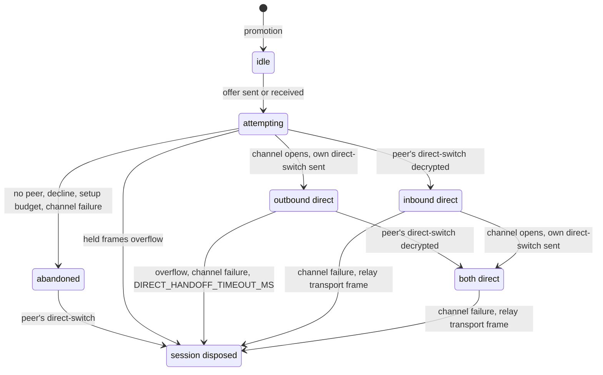

# Remote Surface API

> See `docs/specs/glossary.md` for the canonical Pane / Surface / Session model; this spec uses that vocabulary and adds only remote-specific terms (Viewer, and the wire-level `DirectoryEntry` projection of a pane).
> Owns the protocol a Client speaks to view and control a Burrow's surfaces. [remote-security-model.md](./remote-security-model.md) owns authorization; `docs/specs/relay.md` owns the relay and framing underneath.

**Every message below travels inside one authorized session, and the Burrow may terminate that session — and every stream in it — at any time.**

**Replicate state, never stream a desktop**: terminals travel as PTY data rendered client-side, browser surfaces ([Future](#future)) as per-surface screencasts, each its own placeable stream. (rationale)

## v1 scope

**Scope: protocol-v1** — the shipped protocol, the smallest that lets a phone (Dormouse Pocket) **sign in, pick a pane, see it live, and type into it**. **Must restrict it to terminal listing, one attachment per session, and terminal input/resize; never layout operations.** Everything else, browser-surface remoting and the VR headset included, is staged in [Future](#future).

Source of truth: `remote-lib-common/src/remote/wire.ts` (every wire type and shared constant named below), `RemoteApiSession` in `lib/src/remote/burrow/remote-api.ts` (the Burrow implementation).

### The provider seam

The Burrow's process: `docs/specs/relay.md` → "Burrow side". Within it, `RemoteApiSession` speaks this protocol and nothing else: surface ids, PTY ids, sizes, bytes.

**Must keep environment-specific answers behind `BurrowSurfaceProvider`.** **The session imports no platform adapter, no store, and no `document`**, and both installations share the ask-backed half, so an attach cannot be answered differently in one burrow than the other.

**`SurfaceHandle.ptyId` is a provider-local routing key**, not necessarily the PTY process's own id — the VS Code provider mints an opaque per-peer handle. (rationale)

**Keep stream ownership on `PtyStream`**: resolving a `SurfaceHandle` creates no subscription; `streamPty` starts it and `PtyStream.stop` ends it. (rationale)

Source of truth: `BurrowSurfaceProvider` in `lib/src/remote/burrow/burrow-surface-provider.ts`, `lib/src/host/remote/ask-surface-provider.ts`.

## Terminology

A Surface is named on the wire by `surfaceId`. Remote-only vocabulary:

* **Viewer** — one connected Client session. Multiple viewers may coexist.

## Transport

**Every message below is JSON, carried as one length-prefixed application message on one authorized Noise session** that the WebSocket relay pipes without decoding (`docs/specs/relay.md` → "Routing", "E2E framing"). **Terminal data rides that same stream**; media channels arrive with browser surfaces ([Future](#future)). **Must use the same API and session authorization for self-host and Hosted accounts.**

**A `RemoteApiSession` exists only for an authorized session**: created at promotion ([remote-security-model.md](./remote-security-model.md) → Connection), disposed when the Client disconnects, when the Burrow reaps the session, and by any promotion that replaces it, so **a re-authorizing Client can never inherit the previous session's attachment**.

**The Burrow says goodbye before an ending it chose**: `SessionEndV1` (`{ v: 1, t: 'session-end' }`, exact keys), one padded control message on whichever path carries the session — Take back, an idle reap, a one-time End, a replacement from the same Client static on another relay socket, a paired direct-only session's ending, a one-time path refusal. **A path's ending adds `reason: 'network-not-allowed'`, and may add one IP literal `address` (≤ 45 characters) with its `addressSource`** (`docs/specs/remote-network.md` -> "Local networks"). **Never on a poisoned session, never instead of the dispose.** **The session is over at the goodbye**: nothing after it is read, and the remote-api handler goes with it. **A switched channel closes only once the goodbye has left it, or after `SESSION_END_FLUSH_MS`**, sending nothing more meanwhile (rationale). A Client reports the goodbye as burrow loss (`endedByBurrow`).

Source of truth: `BurrowRuntime.#promoteConnection` in `lib/src/remote/burrow/burrow-runtime.ts`, `EstablishedE2eSession.end` in `lib/src/remote/burrow/established-session.ts`, `SessionEndV1` in `remote-lib-common/src/security/e2e-ceremony.ts`, `ClientSessionCore` in `lib/src/remote/client/session-core.ts`.

### Direct path

After authorization the same Noise session may move off the Relay onto a WebRTC data channel. What that adds to the trust model: `docs/specs/remote-security-model.md` -> "Direct path"; the ICE servers each end gathers through, and Local networks' restrictions: `docs/specs/remote-network.md` -> "Anywhere", "Local networks". **Both Burrows answer** over `node-datachannel`'s W3C polyfill ([standalone.md](./standalone.md) → "Burrow service", [vscode.md](./vscode.md) → "The direct path"), **loaded at the first offer, never at boot**, a load failure declining from then on.

**Every signal rides inside the session** as a control message (`docs/specs/relay.md` -> "E2E framing"), guarded by `DirectSignalV1`: `direct-offer` (Client→Burrow, SDP), `direct-answer` (Burrow→Client, SDP), `direct-decline` (Burrow→Client), `direct-switch` (either direction). **The Relay never sees an SDP, a candidate, or that a direct path exists.** **An unknown control shape on an established session is ignored, never a session failure**, so a peer without this stack stays relayed.

- **The Client offers once, after `ConnectionOutcomeV1 { ok: true }`, and never retries**; it is always the offerer and creates the one channel.
- **The Burrow answers at most one offer per session**, and declines where it has no peer to build.
- **Each side sends its whole description once, never trickled**, when its gathering settles (rationale).
- **The answerer's setup budget (`DIRECT_ANSWER_TIMEOUT_MS`) is shorter than the offerer's (`DIRECT_SETUP_TIMEOUT_MS`)**, so the answerer gives up first.
- **An SDP over `MAX_DIRECT_SDP_LENGTH` is never sent**: the Client skips the offer, the Burrow declines. The bound derives from `CONTROL_PAYLOAD_SIZE`, so a maximal signal fits one control body.

**The two shipped stacks are proven against each other by hand**, by `scripts/direct-interop/run.mjs` (rationale).

**Every byte on the channel is a Noise transport message of the promoted session**: one message per channel frame, raw bytes, the same two `CipherState`s and counters. **Every inbound frame is bounded at `NOISE_MAX_MESSAGE_LENGTH` before decryption**, and a frame over it — or a non-binary message — disposes the session. (rationale)

**The channel is reliable, ordered, and labelled `DIRECT_CHANNEL_LABEL`, and one whose association reports a per-message limit under `NOISE_MAX_MESSAGE_LENGTH` is refused** — all checked before the open is reported, so a refusal is a channel failure, and an answerer refusing before it has answered declines. An unreported limit is not treated as small. **Two gaps are accepted**: a Burrow's polyfill rebuilds every incoming channel with its own defaults, so the offerer's reliability flags never reach the check and there only the label is load-bearing; and the limit is the *remote's* advertised one, so where the two ends disagree a peer that has already switched loses the session. (rationale)

**A sender bounds its own queue, in order**, at `MAX_DIRECT_PENDING_FRAMES` / `MAX_DIRECT_PENDING_BYTES` — the pair a receiver's hold uses — and overflow disposes the session.

**The switch preserves order per direction**, by one `DirectCutover` at each end:



* A sender's `direct-switch` is its **last** message on the relay path; every later message, keepalives included, goes on the channel. A receiver holds channel frames until it decrypts the peer's — **overflow disposing the session** — then drains them in arrival order.
* **Once either direction has switched, a channel failure disposes the session**: the Client reports burrow loss exactly as a `burrow-gone`. **Before any switch it only abandons the attempt** — including a channel not open by its setup budget — and the session stays relayed.
* **After inbound has switched, a relay `transport` frame disposes the session**, refused before any decrypt, as does a `ct` that will not decode.
* **A `direct-switch` reaching an abandoned or never-begun end ends the session.**
* **An end waits at most `DIRECT_HANDOFF_TIMEOUT_MS` after its own switch for the peer's**; one whose peer switched first waits on nothing.
* **A connection reporting `failed` or `closed` fails the channel at once; `disconnected` is waited out** for `DIRECT_DISCONNECTED_GRACE_MS`.

**The Relay stays the lifecycle authority.** `client-gone`, `burrow-gone`, and either relay socket closing dispose the session, channel included, exactly as relayed; the idle deadline, keepalives, and every Burrow bound are path-agnostic ([remote-security-model.md](./remote-security-model.md) → Burrow bounds). A one-time session has no Relay; its authority after the switch is the channel ([remote-security-model.md](./remote-security-model.md) → One-time connection).

**One peer connection per session**, created at the offer, closed on every disposal path, never existing before promotion. What Pocket shows of the path: [pocket-app.md](./pocket-app.md) → "The path the session takes".

Source of truth: `remote-lib-common/src/security/direct-path.ts` (the signals, the constants, and the `DirectCutover` both ends run), `DirectEndpoint` in `lib/src/remote/direct/direct-endpoint.ts` (the direct-path policy, one per authorized session), `DirectPeer` in `lib/src/remote/direct/direct-peer.ts` (the negotiation and the channel).

### Envelope

Requests are correlated by `requestId`, events by `subId` (`RemoteRequest`, `RemoteResponse`, `RemoteEventMsg`).

**A subscribing method (`directory.watch`, `surface.attach`) opens its stream under the request's own id** — `requestId` reused as the `subId` — so the Client installs its handler before sending and never races a snapshot or a first data frame. **Must dispatch by the canonical `REMOTE_METHODS` and `REMOTE_EVENTS` names**, so a future event lands additively and an old client ignores what it does not know.

**Every peer-supplied `cols`/`rows` passes through `clampTerminalDimension`** — 1 … `MAX_TERMINAL_DIMENSION` (2000), falling back to the current size when absent or non-finite — at every end that applies one. The upper bound is the security-relevant half. (rationale)

### Hello

First exchange on the control channel; establishes version and viewer kind (`HelloParams` / `HelloResult`), and returns the flat `grants` ([Input authority](#input-authority-and-multiple-viewers)). **The Burrow does not *gate* other methods on it** — authorization already happened at connect time, so skipping hello grants nothing.

Reserved: a `capabilities` field on the client hello (what the client can render — screencast formats, window support) lands additively when browser surfaces arrive; see [Future](#future).

## Directory (the phone's picker)

**Must list registered terminal Surfaces, excluding helper Sessions.** A Tool remains listed through its terminal even while showing its browser capability. `directory.watch` subscribes without attaching; `DirectoryEntry` / `DirectorySnapshot` own the payload. Thumbnails are staged ([Future](#future)).

**Must list every Workspace's terminals, hidden ones included; `workspace` names an entry's Workspace only where its `ref` is unique across the Burrow's Windows** (standalone; VS Code sends none; rationale). **Entries arrive in each Window's strip order** (rationale); `active` marks the Workspace that Window shows. **A Client must list entries without `workspace` as before.**

Reserved: `workspace.ref` and `name` are `WindowSnapshot.workspaces[]` keys ([Future](#future), The Window).

Reserved: **`paneRef` is set to the same value as `surfaceId`** and no Client reads it — it becomes the Pane handle when `window.watch` lands ([Future](#future), The Window), so a Burrow keeps setting it. **`focused` and `exitCode` likewise have no Client reader yet.**

**Snapshot-only, never deltas**: on any change the Burrow coalesces and resends the whole listing, one snapshot per collect (rationale). **A collect emits only while it is still the newest and its subscription stands**, so a stale answer — an empty timed-out one included — never blanks the picker (rationale). **A collection that rejects emits nothing**, leaving the last good snapshot standing; the next invalidation or `directory.watch` retries it.

**Duplicate `surfaceId`s collapse to the first answerer** — the same owner an attach's read-only resolve probe selects, so the row shown is the surface attached. (rationale)

Invalidation reaches the session through `watchDirectory`, Workspace and membership changes included. **A late answer — one for an ask that already settled — invalidates the directory rather than being dropped** (rationale), at each burrow's ask bridge (`docs/specs/standalone.md` -> "Rust ↔ sidecar bridge", `docs/specs/vscode.md` -> "Peer surfaces").

**Never list or attach standalone browser or iframe Surfaces**: neither enters the xterm registry. ([Future](#future) stages browser remoting; iframes stay unsupported even there.)

**`alive` is real PTY-process liveness**, distinct from `exitCode` — the last finished command's shell-integration status: a pane may report `alive: true` with an `exitCode` set, or `alive: false` with none. **An exited pane stays listed at `alive: false`** until the user closes it, and the picker stops offering it.

Source of truth: `RemoteApiSession` in `lib/src/remote/burrow/remote-api.ts`, `lib/src/remote/burrow/directory-collect.ts` (the entry mapping).

## Attaching to a surface

`surface.attach { surfaceId, cols, rows }` opens the surface's stream; `surface.detach { surfaceId }` closes it. **Detach names its surface** so a stale detach cannot kill a newer attachment; **detaching anything that is not the current attachment is an idempotent no-op**. One attachment per session ([Future](#future) lifts the cap for VR). **Attachment is view-state only, with one exception**: attaching to a terminal takes size authority.

### Terminal surfaces

Replicated, not screencast: the client renders its own xterm from the same data the burrow UI consumes. **That is the *processed* stream** — Dormouse-owned sequences parsed, stripped, and answered at the Burrow; renderer-owned ones remain, and every renderer parses them for itself ([terminal-escapes.md](./terminal-escapes.md)).

**The Burrow discards terminal reports arriving from a remote session** — the owner's xterm is the sole reply authority for renderer-owned queries (device attributes, DSR/CPR, window ops, XTSMGRAPHICS, cell size, kitty graphics responses). **A mirror renders and may take size authority, but never answers.** (rationale) The Client drops the same chunks rather than spending the relay on them; only a chunk wholly made of report shapes matches, so keystrokes and pastes never do (`inputIsReplayTerminalReport` in `lib/src/lib/terminal-report-filter.ts`).

**The unit of processed output is a projection pair, never a bare string.** `terminal.data` carries `bytes` — the renderer projection — and `text`, the same chunk with string-control payloads removed; **`text` omitted means identical to `bytes`, present is authoritative, empty included** (rationale). Additive on protocol-v1. The same pair crosses every Burrow seam as `ProcessedPtyChunk` and arrives as `PtyDataDetail`, so a Client's text consumers read what the Burrow's own do.

**One `terminal.data` never approaches the 1 MiB application-message cap**: the owner bounds what it feeds the parser, so **both** projections plus their framing stay inside `MAX_APP_MESSAGE_LENGTH` without a rechunker on this path ([terminal-escapes.md](./terminal-escapes.md) → "Parsing location"). **A message over the cap is dropped, not truncated**, so that bound is all that keeps a Client from losing a chunk mid-stream.

Source of truth: `TerminalDataEvent` in `remote-lib-common/src/remote/wire.ts`, `ProcessedPtyChunk` in `lib/src/lib/processed-pty-stream.ts`, `PtyDataDetail` in `lib/src/lib/platform/types.ts`.

#### Attach is the resize

**Attach carries the client's dimensions, and there is no snapshot transfer** (rationale):

1. Client attaches with `{ cols, rows }`.
2. Burrow resizes through the owning xterm's resize path (last-attach-wins); the resulting `SIGWINCH` repaint is what fills the client's screen. (rationale)
3. **If the requested size equals the current size**, the Burrow requests an owner-managed **PTY-only** repaint: the owner bounces the PTY's rows and restores them, the xterm staying at the requested size.

**Must cancel restoration on every later PTY resize or repaint, exit, kill, or replacement.** Local and other-Viewer size writers share that owner. Detach/disposal leave restoration running. (rationale)

Source of truth: `resize` in `standalone/sidecar/pty-core.js`, shared by both hosts and pinned by `standalone/sidecar/pty-core.test.js`.

**Normal-screen history does not regenerate on resize** and is absent from the shipped protocol (see [Future](#future): in-flight replay, then semantic scrollback).

**Must encode PTY bytes as base64url.**

`terminal.data` and `terminal.closed` are the whole v1 stream: **a viewer is not notified when another display takes size authority**, and semantic state (activity/cwd/title) reaches the client only through `directory.snapshot`. The burrow→client `terminal.resize` and `terminal.semantic` events are staged in [Future](#future) (item 5).

#### Attachment invariants

* **Only the current attachment is writable.** A `terminal.write` / `terminal.resize` for a detached surface — or a background one listed in the directory but not attached by this session — is rejected, reaching neither the PTY nor its size.
* **The attachment is pinned to a terminal, not a registry slot** — bound to the terminal resolved at `surface.attach`, so a Burrow-side pane swap leaves the stream and both input methods on the same PTY, never re-resolving `surfaceId`.
* **Exit drops the attachment.** The Burrow emits `terminal.closed` and *then* drops it, so a later write/resize is rejected ("surface is not attached") rather than reaching the disposed terminal.
* **A late resolution never becomes an attachment.** Disposing the Viewer, and any newer `surface.attach`, invalidate an in-flight resolution; a handle arriving afterwards is ignored without subscribing or replacing the current attachment. (rationale)
* **Every attach is answered** — a superseded one with an error, never left pending, since the Client holds the request and its event subscription open until answered. Sole exception: a disposed session has no transport to answer on.
* **Must acknowledge only a size the owner reports applied.** Missing resize answers, rejected resolution or resize, and synchronous attach-start failures are protocol errors contained inside the session.
* **Subscription and liveness are atomic: a PTY that died while `resolveSurface` was in flight must still be observed.** Every production provider replays the recorded exit before the subscription is usable — a VS Code peer by acknowledging its `subscribe` on the same ordered socket *after* any replay. The attach is then answered `surface closed while attaching` and the buffered `terminal.closed` dropped, never flushed.

Source of truth: `RemoteApiSession` in `lib/src/remote/burrow/remote-api.ts`, pinned by `lib/src/remote/burrow/remote-api.test.ts`; the peer `subscribe` / `subscribed` frames in `vscode-ext/src/peer-link.ts`.

#### Size authority: last-attach-wins

A terminal has one size, and **the most recent remote size writer holds it**: an attach with dimensions and `terminal.resize` both resize through the owning xterm under a `SurfaceHold` — an opaque per-session holder id, its label, and a per-attachment lease — which the owning webview records, with the size, before the size moves. **A pane keeps one hold per holder**, the newest writer's last; another viewer's release leaves the rest. **A held pane stands at its newest hold's size**: when that hold goes first, the pane takes the size the holder now newest last set (rationale).

- **Never re-fit a held pane locally** — box resize, layout settle, remount, focus, or keystroke (rationale).
- **Must show the strip on a held pane, and only there** ([layout.md](./layout.md) → "Pane body"): the newest holder's label — the ACL record's, bounded again by `boundedPairingLabel`, or the one-time device label — as text, with `+N` for the other holders.
- **Take back ends every session holding the pane**, never resizes a phone: one `takeBack { holder }` per hold runs the end that session's runtime supplied — End for a one-time connection, goodbye and dispose for a Pocket session, which stays paired (rationale). **The pane then clears each hold it asked about whatever the answer.**
- **Must release on every end of an attachment** — detach, a newer attach, exit, a failed or superseded attach, disposal. **An attach whose resolve answered nothing or failed releases at every owner** (`releaseSurface`), since an owner answering past `ASK_BUDGET_MS` holds the pane anyway. **A release clears only its holder's hold, and only while its lease is still that hold's; the owner re-fits once no hold remains.**
- **Must answer `release` with nothing and ignore an unknown op**; an attach whose hold is malformed sizes without holding.
- **Must drop every hold another service instance took** once a `status` event names another `serviceId` — a VS Code broker window closed, a sidecar restarted — since no release will come. Each `BurrowService` mints one, names it in every `status` event (once at start too), and stamps it on its sessions' holds (rationale).
- **Holds live in webview memory**: a reload or a Workspace transfer drops them, and the pane fits its box under a phone still attached.

Source of truth: `lib/src/remote/burrow/peer-surfaces.ts` (the owner's half), `lib/src/lib/size-hold-store.ts`, `takeBackSize` in `lib/src/remote/burrow/take-back.ts`, `BurrowService` in `lib/src/host/remote/service.ts` (the `serviceId`).

## Input authority and multiple viewers

**Input authority is flat**: selfhost is single-user, so every authorized session, a one-time one included, is the owner and gets full input (`grants: { input: true, layout: false }`), and no session gets layout operations.

Concurrency then needs no arbitration: attach state is per-session and streams fan out per attachment, one PTY subscription and one sink each (rationale). The window lease ([Future](#future)) is the only exclusive resource.

Graded grants, layout mutations, and connected-viewer display with per-viewer disconnect are staged ([Future](#future) items 5–6).

Reserved: For [Future](#future) items 2–3, clients must tolerate additive optional `inflight` and `blocks` fields on `TerminalAttachResult`.

## Future

One protocol, two consumption depths: the phone (protocol-v1) and a VR headset.

| Capability              | Phone            | VR (future)      |
| ----------------------- | ---------------- | ---------------- |
| `directory.watch`       | yes (the picker) | optional         |
| `surface.attach`        | one at a time    | many at once     |
| `window.watch` (layout) | no               | yes              |
| Layout mutations        | no               | yes              |
| Input                   | to attached pane | to any surface   |

### 1. Browser surfaces (`agent-browser`)

The existing screencast path (`docs/specs/dor-browser.md`), made remote:

* The client hello gains the reserved `capabilities` field: `{ screencast: ['jpeg' | 'webp'], input: boolean, window: boolean }`.
* `DirectoryEntry` gains browser entries — `type: 'browser'` (the canonical component-level kind, `docs/specs/glossary.md` Naming conventions) plus a browser-only `url` field.
* Media frames share the WebSocket with control messages. **A dropped frame is skipped, never queued behind**: the Burrow keeps only the newest frame per attachment and sends it when the socket drains, so a slow link degrades to a lower frame rate instead of a growing buffer.

```ts
type BrowserEvent =
  | { event: 'browser.frame'; data: { format: 'jpeg' | 'webp'; width: number; height: number; bytes: string } }
  | { event: 'browser.tab';   data: AgentBrowserTab }   // title/url/active changes
  | { event: 'browser.closed'; data: {} };

// client → burrow (requires the input grant); coordinates in frame space,
// the burrow maps them through the screencast scale into CDP input.
type BrowserInput =
  | { method: 'browser.pointer'; params: { surfaceId: string; kind: 'tap' | 'down' | 'move' | 'up' | 'scroll'; x: number; y: number; dx?: number; dy?: number } }
  | { method: 'browser.key';     params: { surfaceId: string; text?: string; key?: string; modifiers?: number } };
```

Fixed, phone-appropriate screencast parameters (JPEG, capped dimension and frame rate) first; quality negotiation (`browser.quality`) and remote navigation (`browser.navigate`) after — a phone can drive the page's own UI meanwhile.

Iframe surfaces stay unsupported even here: omitted from the directory, refusing attachment. Window snapshots still list them (the layout must be truthful) and VR renders an inert placeholder. Nothing else in the protocol assumes they exist.

### 2. In-flight command replay

A command still running — "is my build done?" — is the commonest reason to open a pane on the phone, and a resize repaint shows nothing for one quietly writing a log; agent TUIs, the primary workload, do repaint, which is what makes this deferrable. The Burrow retains the current command's output from its `commandStart` boundary (OSC 133/633, with the existing keystroke-heuristic fallback), tail-capped to a fixed byte budget, dropped at the next prompt; attach replays it via the reserved `inflight` field:

```ts
inflight?: {
  commandLine: string | null;
  startedAt: number;
  bytes: string;                // base64, tail-capped
  truncated: boolean;
}
```

### 3. Semantic command scrollback

History arrives as structure the Burrow already extracts, not emulator state: OSC 133/633 segmentation gives per-command boundaries, alt-screen spans are already tracked and stripped, and the in-flight buffer is the same capture retained for K commands instead of one:

```ts
interface CommandBlock {
  commandLine: string | null;
  cwd: string | null;
  exitCode: number | null;      // null while still running
  startedAt: number;
  finishedAt: number | null;
  bytes: string;                // output, tail-capped, alt-screen spans stripped
  truncated: boolean;
}
```

Attach also delivers recent blocks, rendered at the client's own width — collapsible cards on the phone, panels in VR — rather than replaying a fixed-width terminal. A `blocks` field on `TerminalAttachResult` plus a `terminal.block` event.

### 4. Directory thumbnails

### 5. Tethering display and viewer visibility

The Burrow's own pane already shows its holder ([Size authority](#size-authority-last-attach-wins)); every other attached viewer of a held pane greys out and shows only **"tethering to \<device\>"** instead of fighting over `SIGWINCH`, and interacting with it takes authority back. Alongside: the Burrow UI lists connected viewers with per-viewer disconnect, and in-flight input is dropped the moment a session is killed.

The wire half, as new event names:

```ts
// burrow → client: another display took size authority over your attachment
{ event: 'terminal.resize';   data: { cols: number; rows: number } }
// burrow → client: live cwd/activity/title for the attached pane
{ event: 'terminal.semantic'; data: TerminalSemanticEvent }
```

`terminal.resize` lets an attached viewer show its own tether state instead of rendering garbled wrap until re-attach; `terminal.semantic` frees the attached pane's header from the coalesced `directory.snapshot` cadence. Acknowledgement rides the same stage — a `terminal.acknowledge` on touch, without which only a Client's keystrokes put a ring out (`alertAcknowledge` is inert today).

### 6. Graded grants and layout mutations

Layered so "the Burrow is the final authority" holds at every step:

1. **Pairing-time**: the ACL record's approval carries a standing grant (observe-only vs interactive) chosen in the Burrow's approval UI.
2. **Session-time**: the hello's `grants` reports what the session actually got.
3. **Layout**: destructive operations (`surface.kill`) require the `layout` grant and are confirmed on the Burrow the same way local kills are (KillConfirm), unless the Burrow user opts a session into unattended control.

### 7. The Window (VR)

VR does not stream the desktop; it *is* the desktop — the headset runs the same web UI (`lib`) against remote data sources instead of local ones.

`window.watch { windowRef }` subscribes to one Window's layout tree plus geometry. One authorized session addresses one Burrow, which may expose several Windows (VS Code). Window discovery and selection precede the watch; its target and every snapshot carry an explicit Burrow-scoped Window identity. Each snapshot follows the glossary containment (`Window ⊃ Workspace ⊃ Pane ⊃ Surface`):

```ts
interface WindowSnapshot {
  windowRef: string;
  workspaces: Array<{
    ref: string; name: string;
    panes: Array<{
      paneRef: string;
      /** Normalized rect within the Workspace's Wall, for initial spatial placement. */
      rect: { x: number; y: number; w: number; h: number };
      surfaces: Surface[];      // the existing Surface shape
    }>;
  }>;
  /** Which Workspace the Burrow has mounted locally. */
  activeWorkspaceRef: string;
  focusedSurfaceId: string | null;
}

type WindowEvent =
  | { event: 'window.snapshot'; data: WindowSnapshot }
  | { event: 'window.changed';  data: WindowSnapshot };  // coalesced; layouts are small
```

The rects seed VR placement; the headset then owns spatial arrangement locally — re-hanging panels in space is presentation, not layout, and does not round-trip.

**Layout mutations** reuse the existing `surface.*` control vocabulary over the session (requires the `layout` grant):

```
surface.split    surface.ensure    surface.send
surface.kill     surface.read      surface.focus
```

These are the methods the dor CLI speaks today; the remote API reuses their request/response shapes so one Burrow handler dispatches both.

**Window lease.** A VR session may request `window.lease { windowRef }`, declaring itself that Window's primary display. Sizing needs no lease — last-attach-wins already hands VR the panes it displays — so the lease is presentational: that Window tethers wholesale instead of pane by pane, and panes created in it while the lease is held open tethered to the leaseholder. One lease per Window; the Burrow user can always reclaim it locally. Phones never need it.

### 8. Direct path

**Scope: direct-path** — latency. The shipped half is [Transport → Direct path](#direct-path), which Pocket and both Burrows speak today. What remains is to **dogfood** it across a tailnet, keystroke round-trip measured relayed and direct into the rationale.

A session surviving relay loss remains unstaged.

### 9. Audio

Browser surfaces can produce audio; VR will want it (spatial, per-panel).

### QoS hardening (phone-first, orthogonal to the stages above)

* Terminal output is already coalesced burrow-side; the remote stream should add a per-session byte budget with tail-drop + resync (an implicit re-attach: repaint via resize) rather than unbounded buffering on a bad link.
* Detach on backgrounding: when the phone app/PWA loses visibility, the client detaches streams but keeps the control channel; reattach is one message.

### Open questions

* **Browser media**: screencast frames over the WebSocket first; on the direct path, a video track would be smoother for VR. Possibly phone=frames, VR=track, negotiated in the hello.
