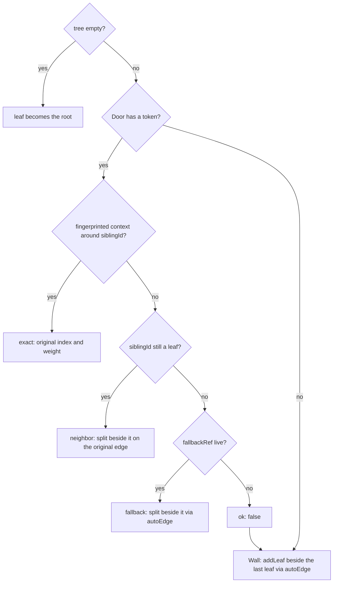

# Tiling Engine (Lath)

> - See [glossary.md](glossary.md) for the Surface model, the `Window ⊃ Workspace ⊃ Pane ⊃ Surface` hierarchy, and the Pane / Door / baseboard / passthrough vocabulary used here.
> - **Owns** the engine internals: the pure core under `lib/src/lib/lath/` (model, layout, ops, animator, hit-testing) plus the Wall binding with native motion and hierarchical DnD.
> - **Defers** the interaction model on top to [layout.md](layout.md): selection, focus, modes, session lifecycle.
> - Evidence behind the rules: [tiling-engine.rationale.md](tiling-engine.rationale.md).

## Principles and non-goals

Lath is a headless geometry engine: it owns the split tree, rects, animation targets, and drag hit-testing — nothing else (rationale).

- Every operation is `(tree, args) → result`: no listeners, no event emitters, no timing assumptions.
- **The core must never import DOM, React, or Three.js types** — tree, `layout()`, ops, hit-testing, sash geometry, and the animator are plain data in and out, so the planned Three.js adapter (the VR Window item in [remote-api.md](remote-api.md)'s staged remainder) reuses every one unchanged.
- **Never give Lath a concept of selection, focus, mode, or activation** — those stay in the Wall, and the binding emits no activation events and never calls `.focus()`.
- Non-goals: tab stacking, floating groups, popout windows, the mobile compositions (MobileWall does not tile), and building the Three.js adapter itself.

## Core model

`LathTree` is a nullable root of leaf or weighted split nodes: a `'row'` split lays children left→right, `'col'` top→bottom. Trees are immutable. Nodes are addressed by path (child indexes from the root), and **paths are ephemeral** — valid only until the next op, never persisted.

Invariants, enforced by every op and checked by `validate(tree)`:

- A split has ≥ 2 children and **never directly contains a same-direction split** — same-direction children flatten on construction, i3-style, so every ancestor boundary is a real, distinct drop scope.
- Weights within a split are finite, > 0, and sum to 1.
- Leaf ids are unique. `root: null` is the empty Wall, and **no add / split / insert op accepts one** — the Wall seeds it with `leafTree(id)`, and `restore` alone reinserts into it. The "always one pane visible" auto-spawn rule stays app-level.

**Zoom is never in the tree.** It is presentation state (`zoomedId` in the wall store), so the tree, every other rect, and all leaf DOM stay unchanged beneath a zoomed leaf.

Source of truth: `LathTree` / `validate` in `lib/src/lib/lath/model.ts`.

## Layout

`layout(tree, rect, opts)` is pure. Children plus gaps tile each split's span exactly in integer pixels — adjacent panes never seam or overlap. Weights are clamped against `minLeaf` at layout time, and **stored weights are never rewritten by layout**; a split whose minimums exceed its span degrades to min-proportional allocation, honoring minimums only when feasible.

**Every derived query must be called with the same `rect` + `opts` the caller renders with**, or its geometry diverges from the screen:

- `neighbors` — spatial navigation: candidates lie beyond or touch the leaf's edge; secondary-axis overlap preferred, then nearest edge-to-edge, tie-broken by smaller y, then x, then id.
- `autoEdge` — the split heuristic: laid-out rect wider than tall → `'right'`, else `'bottom'` (`'right'` for a missing leaf).
- `sashes`, `nodeRectAtPath` — divider and interior-node geometry.

Source of truth: `lib/src/lib/lath/layout.ts`.

## Operations

All ops are pure and synchronous and return `{ tree, ok }` plus op-specific fields. **On `ok: false` the returned `tree` is the input object**, on `ok: true` always a fresh one — so identity comparison detects a rejected op, and tree identity never signals "no visual change." Sash live-resize and DnD previews evaluate ops speculatively per frame without committing (rationale).

| Operation | Behavior |
|---|---|
| `split` | Insert a new leaf beside a reference, taking half its weight. |
| `remove` | Remove a leaf and return its restore token; siblings absorb its weight proportionally. |
| `replace` / `swap` | Change leaf identities atomically, preserving geometry. |
| `move` | Remove and reinsert atomically, carrying the old weight. Back in its own split the siblings keep their proportions, so a reorder or drop-back moves no other pane. A target that cannot be re-found after the removal rejects. |
| `resize` | Move the visible boundary, clamped against recursive minimums; every other child keeps its rect. Callers pass the drag-start tree and the cumulative delta. |
| `insert` | Insert a new leaf beside an edge target. |
| `restore` | Reinsert from a persisted token through the tiers in [Restore tokens (Doors)](#restore-tokens-doors). |

A `DropTarget` is a leaf swap or an edge at an ancestor path, optionally narrowed to a contiguous child range of that split. **Must normalize a range away in the committed tree**, so persistence keeps its version-1 shape.

Source of truth: `lib/src/lib/lath/ops.ts`; `lib/src/lib/lath/drop-target.ts`.

## Hierarchical drag and drop

Drags use pointer events only, never HTML5 DnD, so they are drivable from CDP. One drag controller owns both the pane and the Door gestures; `Door.tsx` / `Baseboard.tsx` report presses only. **Must hit-test each preview and the release against the store's live tree**, including commits React has not rendered, so a background `dor split` / `dor kill` mid-drag shows up in the next preview.

`hitTest` returns the one drop a point would commit: its target, its preview rect, and its scope. The scope model:

- A leaf's center yields `swap` (internal drags only, never with itself); its inner edge bands drop beside the leaf. A point in a gap attributes to the nearest leaf, so boundaries have no dead zones.
- **A slide along an edge widens the scope** to the smallest one spanning anchor to pointer: the leaf, a contiguous range of an ancestor's children laid along the line, or a whole ancestor sharing the line. Equal spans resolve to the innermost (rationale); leaving the line drops the anchor.
- **Must anchor a slide only where the pointer pauses on an edge drop**, never on the dragged pane's own rejected edge, so sweeping a header along the header row drops beside one pane at a time (rationale).
- **Every drop's preview rect is the exact rect it would commit** — a speculative op plus `layout`, never a heuristic zone. Rejected ops and beside-itself no-ops yield no drop.

A pane drag starts on a leaf's header past the drag threshold, primary button only, off its controls, and **never while zoomed or during a sash drag**. The press has already run the header's click path, so a drag begins from passthrough on that pane (rationale). Drops surface as proposals the Wall commits: drag start moves selection onto the dragged pane, a candidate drop `move`s it, and a release below the wall minimizes it with its token. Escape, pointer cancellation, window blur, or a release on nothing cancels, and a Door stays. **Must delegate Workspace-strip pane drops to `docs/specs/layout.md` → Moving Surfaces between Workspaces** before local hit-testing.

A Door drag-out runs the same machinery as an external drag (no swap candidates; the chip stays in the baseboard meanwhile). Its drop inserts the Surface at the hit-tested position — **the token is not consulted, because the user chose the position**.

Source of truth: `createDragController` in `lib/src/components/wall/lath-drag-controller.ts`; `hitTest` in `lib/src/lib/lath/hit-test.ts`.

## Restore tokens (Doors)

**Must persist `RestoreToken` as the Door's sole restore payload.** Its fields and capture rules live beside `remove` in `lib/src/lib/lath/ops.ts`; a token persisted before the sibling-subtree fields existed keeps the older leaf-neighbor behavior. `restore` applies three tiers from the Wall's reattach:

- A leaf removed from a two-child split whose survivor is a single leaf always degrades to neighbor (50/50), since the collapse erases the fingerprinted parent. A root-leaf removal reaches only fallback.
- A survivor that is a split subtree keeps exact, so `A | (B over C)` restores beside the whole `B/C` column rather than inside it — including after that subtree flattened into its grandparent; a changed group degrades to neighbor.
- **Must supply a live `fallbackRef` when the exact and neighbor tiers fail in a nonempty tree.**

Source of truth: `RestoreToken` / `restore` in `lib/src/lib/lath/ops.ts`.

## Parked leaves

A parked leaf is mounted by the adapter but absent from the split tree: its DOM survives while it lays out nothing, paints nothing, and takes no input. It exists for Surfaces whose state lives in the DOM — an `<iframe>`'s document, a screencast canvas — where a plain remove turns reattach into a reload. A parked leaf still carries a token: parking decides whether DOM survives, the token where it lands.

- **Every minimize doors, whatever the Surface kind; only a park also keeps the DOM.** **Must park browser and Tool Surfaces** (`shouldParkOnMinimize`), unlike terminals, whose persistent xterm instance remounts without replay ([glossary.md → View](glossary.md#view)). A Surface may also be born as a Door (`dor split` / `dor ensure` targeting another Door), with no pane to detach.
- **Parking must be one commit**: an id absent from both the tree and the parked set for even one render unmounts the leaf and loses its DOM state, so every re-admitting op unparks in the same commit. **`seed` admits by tree membership**, never by the metadata it is handed (rationale), and runs once per Wall mount, so a Workspace switch never re-seeds.
- **One `leafMeta` map holds every leaf the Wall owns**, laid out or Doored, so **no Door record carries a metadata copy that can go stale**: title and params writes reach a Doored leaf by the same path as a visible one, and every reader goes through `lath.getMeta(id)` (rationale). The runtime Door record is `{ id, token }`; on hydration `seed` reads a restored Door's persisted row for its metadata, the only place it does.
- **A parked leaf keeps its last rect, held in the store and never the adapter** (rationale), and renders there hidden and inert, so the guest never sees a zero-extent viewport (rationale). A leaf parked before the Wall reports geometry falls back to the whole wall rect.
- **Parked is a visibility signal**: it reaches the body as `PaneProps.parked` ([Pane props contract](#pane-props-contract)), so a minimized `agent-browser-screencast` releases viewer resources while keeping its daemon session.
- **Never evict parked browser or Tool DOM to enforce a count limit** — retention is unbounded until reattach or Surface destruction (rationale). Parking covers minimized browser and Tool Surfaces only: a hidden Workspace parks nothing (`docs/specs/layout.md` → Workspace lifecycle).

Source of truth: `minimizePane` in `lib/src/components/Wall.tsx`; `doorLeaf` in `lib/src/components/wall/lath-wall-store.ts`.

## The wall store and engine

**`lath-wall-store.ts` is the sole state authority**: tree, `leafMeta`, parked set, `zoomedId`, and a revision bumped on every commit, behind a `useSyncExternalStore` snapshot. **Every tree mutation commits atomically**; a rejected op commits nothing and notifies nothing. **Must reject zero-area geometry reports**, keeping the last valid geometry, since the geometry-dependent queries (`neighborOf`, `autoEdgeFor`, restore's fallback tier) read it (rationale). `LATH_LAYOUT_OPTS` is the one geometry both the store and the adapter lay out with.

`lath-wall-engine.ts` is the Wall-facing handle over the store — the animator, vocabulary maps, meta builders, persistence conveniences — built once per Wall mount, one per mounted Wall, never shared across Workspaces. Its readers rely on two projections: `listPanes()` is tree pre-order, so **Doored and parked leaves are not listed** (rationale), while `getMeta(id)` resolves them.

Selection, focus, and mode policy stay at the Wall ([layout.md](layout.md)). The `Cmd/Ctrl+Arrow` swap is one `swapLeaves` with no companion title swap — meta and registry entries follow ids. Embed self-focus surfaces as `onLeafFocused(id)` from `focusin`, which the Wall adopts like a click.

Source of truth: `lib/src/components/wall/lath-wall-store.ts`; `lib/src/components/wall/lath-wall-engine.ts`.

## The HTML adapter (LathHost)

An adapter owns exactly three things: mapping input into Wall coordinates, applying animator frames to its scene each tick, and hosting pane content. LathHost is the engine's only non-headless part.

- **Must never re-parent, reorder, or unmount a leaf's div within one Wall** except on a remove commit, and **must render leaf divs in sorted-by-id DOM order, never tree order** — moving DOM nodes blurs the xterm inside one and reloads a moved `<iframe>`.
- **Header, body, and whole-leaf overlay slots resolve from `leafMeta` through one component registry**, never a surface-kind branch beside it; an unregistered key renders that slot empty.
- A sash drag streams a `resize` preview and proposes one commit on release; Escape, pointer cancellation, window blur, or a concurrent tree or zoom change cancels it.
- **Must report geometry from the measuring layout effect, never a passive effect** (rationale).

Source of truth: `LathHost` in `lib/src/components/wall/LathHost.tsx`.

## Animation

**Animation is core, not adapter.** The headless animator turns committed layout changes into frames as a pure function of a passed-in `now`, so every renderer animates identically and tests assert interpolated values against a fake clock. [layout.md → Animations](layout.md#animations) owns the user-visible behaviors.

- Layers are discrete, never interpolated; adapters map `LATH_LAYER_TILED`, `LATH_LAYER_DYING`, and `LATH_LAYER_ELEVATED` to renderer z-order.
- **A caller needing a rate must read `slope(t)` off the `Easing` `cubicBezier` returns (`LATH_EASING` for house motion)**, never differences of successive samples (rationale; [layout.md → Ring travel](layout.md#ring-travel) is the cautionary case).
- A retarget mid-flight starts every leaf from its current interpolated frame, so motion is interruptible. Hand-placed geometry (sash commits, container resizes) snaps.
- **Must derive add/insert hints from the opposite placement edge, and reattach hints from the opposite token edge.**
- **Must prefer a parked leaf's held rect over an explicit enter hint, and an explicit hint over a derived one** (rationale).
- **Exit is two-phase**: `markDying` fades the leaf in place with its DOM still mounted, then `store.removeLeaf` commits before `disposeSession` and survivors tween into the space. A second kill of a dying leaf is a no-op, and a dying leaf takes no pointer input.
- Reduced motion is the same code path with zero duration (`motionIsInstant()`). **There is no CSS entrance/exit path.** **Must re-assert the current frames after every React commit while unsettled** (rationale).

Source of truth: `createAnimator` in `lib/src/lib/lath/animator.ts`; the animator ownership in `lib/src/components/wall/lath-wall-engine.ts`.

## Pane props contract

**Every pane body and header component takes plain `PaneProps` and never sees the engine**:

- Read: `PaneProps` — `{ id, title, params, parked? }`, straight from `leafMeta`, parked leaves included.
- Write: `PaneWriteContext` (`setTitle`, `updateParams`), provided by the Wall over the store; the `dor` params refresh and render-swap flows route through it.
- Visibility: `parked` is the one non-meta prop, and absent means "not parked" — right for anything rendered outside LathHost. `useSurfaceVisibility(parked)` folds it with document visibility and the Wall's Workspace being visible (`docs/specs/layout.md` → "Workspaces"), so a backgrounded window, a hidden Workspace, and a minimized browser or Tool Surface all gate streaming while the session stays alive.
- Terminal sizing: `docs/specs/layout.md` → "Animations".

Source of truth: `lib/src/components/wall/pane-props.ts`; `PaneWriteContext` in `lib/src/components/wall/wall-context.tsx`.

## Persistence

The versioned Lath layout rides inside `PersistedSession`, written only in the native Lath format; the layout carries metadata for the tree's own leaves, and each Door persists as its own row. **A Tool's derived browser fields are stripped and a Tool still awaiting approval persists as a plain terminal** (`docs/specs/dor-tool.md` → Persistence and hosts). A parked document never survives a restart, only a minimize.

**The session read boundary validates the layout once**: `persistedLathLayout` returns it only when node shapes, tree invariants, and metadata for exactly its leaves are valid. **Both recovery paths then require the layout's leaf set to match the visible pane set**; an absent, rejected, or mismatched layout falls back to fresh panes, except that **a cold restore holding a visible Tool pane must synthesize a single-row layout from the pane projection instead**, dropping browser panes, so Tool identity and commands survive corrupt geometry (`lib/src/lib/session-restore.test.ts`).

Source of truth: `lathLayoutFromStore` in `lib/src/lib/lath/persistence.ts`; `persistedLathLayout` in `lib/src/lib/session-restore.ts`.
