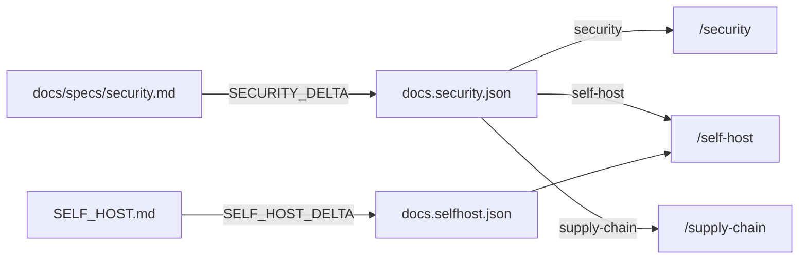

# Website Documentation

> - See `docs/specs/glossary.md` for canonical Surface / Session / Pane vocabulary used by the public product guide and browser workflow.
> - Owns the public references on dormouse.sh and the off-site product guide.
> - The page list is `DOCS_PAGES` in `website/src/lib/docs-pages.ts`; the repository files a route publishes are `SITE_ROUTES` in `website/scripts/generate-docs.js`.

Internal specs are maintainer references; only the security spec is published, whole. Public docs describe shipped behavior above each spec's fold and never expose host plumbing, internal state shapes, or staged `## Future` material.

## Canonical product guide

`vscode-ext/README.md` is the single authored source for the general product guide, published without prose forks by the VS Code Marketplace, Open VSX, and GitHub. It has no page on this site; its build-time parse is owned by [Generated documentation boundary](#generated-documentation-boundary) (rationale).

The guide addresses a VS Code user; the standalone app gets one section pointing at its download. Its sections, which `checkGuideSections` reads from this fence:

```text
## Tmux with browsers
## Alerts
## Push notifications you can self-host
## Terminals that know their ports
## Browsers for you (and your agents)
## Select and copy-paste like you meant
## Getting started
## Keyboard shortcuts
## Coding agents
## Dormouse Hosted
## Standalone app
## Links
```

Content invariants, checked by review unless a check is named:

- The alert explanation matches [alert.md](alert.md): notification protocols and unattended command exit ring with zero configuration, independent of WATCHING; command exit needs `OSC 633` / `OSC 133` boundaries, and WATCHING the reported command line (`docs/specs/alert.md` → WATCHING Track). The guide must not promise that every quiet Pane is automatically marked done after a fixed interval.
- Pocket is described only as shipped or explicitly in development.
- Browser Surfaces are explained to match [dor-browser.md](dor-browser.md) without exposing persisted params, controller registries, proxy plumbing, or future renderers.
- VS Code command names in getting started exist in `vscode-ext/package.json` (`checkVsCodeCommands`).
- Detailed CLI behavior links to `/dor`; the complete agent operating guide links to `/agent-skill`; the Hosted service page links to `/hosted` (`checkRoutesToReferences`).
- The guide renders no `TODO:` placeholders and no copied internal future design.

### Marketplace and Open VSX constraints

The extension-root README is the packaged listing body, so the canonical guide stays within Marketplace-compatible Markdown:

- It does not depend on React, JavaScript, custom CSS, or website-only layout.
- User-provided SVG images are not allowed; content uses raster media or an approved badge provider.
- Media is **repo-relative local files under `vscode-ext/images/`**, referenced the way GitHub expects (`images/hero.jpg`) — never `vscode-ext/media/`, which the extension build empties. **Never** reference remote media, `github.com/user-attachments` URLs least of all (rationale).
- The same content renders usefully in Open VSX and GitHub Markdown.

| Renderer | How `images/x.gif` resolves |
| --- | --- |
| GitHub | Natively, relative to `vscode-ext/` |
| Packaged extension pane | From `images/` inside the VSIX, retained by `!images/**` in `.vscodeignore` |
| Marketplace / Open VSX | `vsce --baseImagesUrl https://dormouse.sh/guide` rewrites both Markdown images **and** raw `` attributes at package time |
| `dormouse.sh` | The generator copies `vscode-ext/images/` to `public/guide/images/`, which is what `--baseImagesUrl` above resolves against |

**Must pass** `--baseImagesUrl` on every `vsce` or `ovsx` invocation that builds a VSIX from source, rather than letting either infer a base (rationale); `checkImageBaseUrl` pins them to `SITE_IMAGE_BASE`, exempting a `--packagePath` republish.

**Never** write to `public/guide/` from anything but the generator, which replaces its `images/` directory each build (rationale). Hand-authored assets stay at `public/` root.

**The guide spells site links absolutely** (`https://dormouse.sh/dor`); `localizeSiteLinks` turns them back into served paths on the site ([rendering contract](#markdown-rendering-contract) op 5).

Reserved: because the generator guarantees it, same-site hrefs reach `MarkdownDocument` root-relative, and the renderer's external-link test is a bare scheme check. A new documentation source rendered through that component — the revived guide page under **Scope: guide-page-return** included — must run through `localizeSiteLinks` too, or its site links will open in a new tab pointed at production.

A major guide rewrite also reviews the listing's discovery fields in `vscode-ext/package.json` against the official [publishing guide](https://code.visualstudio.com/api/working-with-extensions/publishing-extension#marketplace-integration) and [Marketplace presentation guide](https://code.visualstudio.com/api/references/extension-manifest#marketplace-presentation-tips).

## Markdown parsing

**Must reject unsupported Markdown with `UnsupportedMarkdownError`, never silently degrade it.**

**May accept raw HTML only through the parser's `` attribute allowlist, with a relative or `https:` source.** Other tags or attributes fail. Standalone HTML comments are dropped; inline comments fail (rationale).

**Must assign unique GitHub-style heading ids, reserving authored and generated numeric suffixes alike and replacing each space individually.** `website/scripts/docs-parser.test.js` pins slug collisions.

**Must retain ordered-list starts and blank-separated paragraphs within their own list item.** **Must interpret backslash escapes only before ASCII punctuation**, preserving ordinary path characters.

Source of truth: `parseMarkdown` and `createSlugger` in `website/scripts/docs-parser.js`.

## Markdown rendering contract

Every Markdown source keeps its content in source order; `buildDocument` applies the structural delta to the guide and every document `SITE_ROUTES` publishes:

1. Omit the source's top-level `#` title; a page shell supplies its own.
2. Generate an on-page table of contents from the remaining headings.
3. Assign stable, unique heading ids with one checked slugger.
4. Resolve links into the repository: to the page that publishes the file where one exists (`SITE_ROUTES`), otherwise to the canonical file on GitHub, keeping the fragment.
5. Rewrite links pointing back at this site to the **served** root-relative path: origin dropped, `sitePath`'s trailing slash added unless the path already carries one or an extension, query and fragment verbatim — so `https://dormouse.sh/dor#agent-browser` becomes `/dor/#agent-browser`. Only exact-origin matches are rewritten.

`dor/skill.md` does not pass through `buildDocument`: it is asserted free of site links instead ([`/agent-skill` guide](#agent-skill-guide)).

**Never** publish a relative repository link as-is; `resolveRepoLinks` sends it to the publishing page or the canonical file and fails the build when the target does not exist, and `assertRouteFragments` fails it when a fragment into a published page names no heading that page renders. A source keeps its repo-relative link, which spec-lint verifies down to the fragment. Known gap: `assertRouteFragments` skips query-bearing links.

**Never** use a regular expression or a line-number patch to turn a canonical source's prose into site prose. Channel-specific differences are explicit entries in one fixed delta table per document (`*_DELTA`), each naming exactly one source target and failing the build when its target matches zero blocks or more than one.

**Must remove a withheld section with all its subsections, stopping at the next same-depth or shallower heading.**

**Must redirect withheld-section links to the canonical file on GitHub and fail generation on remaining dangling anchors.**

Tables, media, and prose fit a phone's width without horizontal overflow, an inline code span offering a break at each of its separators (rationale). **Never** let such a hint change what the span's `textContent` yields, so a path still pastes into a shell. **Never** inject an HTML string.

Source of truth: `buildDocument` in `website/scripts/generate-docs.js`; `MarkdownDocument` in `website/src/components/MarkdownDocument.tsx`.

## Per-page head tags

`siteMeta` in `website/src/lib/site-meta.ts` builds every page's title, description, canonical, and social cards; a page exports `meta` calling it with its own.

**Never** hardcode one of those in `root.tsx`'s `<head>`, which is emitted before `<Meta />` (rationale). **Must** give every prerendered page a canonical on its own path, carrying the trailing slash the host redirects to. **Never** claim one from a route served through the SPA fallback, where the client `<Meta />` appends a second canonical (rationale); `siteMeta`'s `indexable: false` sends `robots: noindex, follow` instead. `checkPageHeadTags` and `checkSiteOrigin` pin the first two.

**Every in-site link spells that served path** — `sitePath` in components, the generator's rewrites in reference prose — so no reader lands on a redirect. Exempt: `/` with its anchors, and the `/docs` entrypoint, which names no page. `checkInSiteHrefsAreServed` pins it.

## Reference page chrome

**Each page's `linkedFrom` names every document owing it a link** — the two READMEs and the homepage — so the obligation is registry-driven, never inferred from the path. `checkRoutesToReferences` reads it.

**The rail is the only table of contents**, and **must** agree with the page's heading outline a screen reader navigates (`website/src/pages/DorDocs.test.tsx`).

**`/docs` is an entrypoint, not an index.** It redirects with a 302 to the page `DOCS_DEFAULT_PATH` names (rationale); there is no page at `/docs` itself, and `checkDocsEntrypoint` keeps the redirect and the constant agreeing. Reference pages live at the top level (`/dor`, `/security`) with stable URLs, and each old `/docs/<page>` URL keeps a 301 in `_redirects` because READMEs and external links carry it. **Never give a page a slug that `website/src/routes.ts` or `website/public/` already serves.**

These pages follow the reader's theme, through `DocsLayout`; the rest of the site does not.

**Docs text must clear WCAG AA against the surface carrying it, call-to-action text both at rest and on hover; never dim text with opacity** (rationale). `website/src/lib/docs-accent.test.ts` pins the derived colors across bundled themes; `checkNoDimmedDocsText` pins the call sites, allowlisting what is not text.

Source of truth: `DOCS_PAGES` in `website/src/lib/docs-pages.ts`; `DocsLayout` in `website/src/components/DocsLayout.tsx`; `website/public/_redirects`.

## `/hosted`

`docs/specs/pricing.md` -> "The Hosted page" owns what it says and sells; this section owns its place on the site.

**Must describe the account service and link its account app, privacy policy, and terms.**

**Must describe the managed Relay as Pocket's Relay:** terminals stay on an awake, online computer, and self-hosting remains. `NotifySignupForm` exposes the `nedshed.dev` devlog handoff and keeps email per tab. **Must use native required-email validation.** `website/src/components/NotifySignupForm.test.tsx` pins all three.

**Must open `/self-host` with the Relay boundary:** Dormouse needs none; remote features require a configured Relay and otherwise make no network requests; it links `/hosted`. **`/hosted` opens with its plan cards** instead, and its managed Relay section discloses metadata, labels the review pending, and links the model. `website/src/lib/docs-rail.test.tsx` pins both.

**Must also link it from** Pocket marketing/tutorial, self-host docs, the remote-control settings, and the speech and push settings where `docs/specs/alert.md` -> "Settings dialog" offers Hosted; `linkedFrom` owns the rest. `/pricing` 301-redirects here rather than becoming a page, pinned by `checkPricingRedirect` in `scripts/public-docs-lint.mjs`.

Source of truth: `Hosted` in `website/src/pages/Hosted.tsx`; `HostingRequirementNotice` in `website/src/components/HostingRequirementNotice.tsx`.

## Hosted policies

**Must prerender `/privacy` and `/terms` outside Docs navigation with standalone marketing chrome and an effective date.**

Source of truth: `HostedPolicyLayout` in `website/src/components/HostedPolicyLayout.tsx`.

## `/dor` reference

The CLI page consumes the Markdown snapshots generated by `dor/test/cli-help.test.mjs`, which proves every snapshot equals real help output. The root help snapshot owns command order and inventory.

**Must retain `#targeting`, `#surface-handles`, `#dor`, `#commands`, and one anchor per canonical command snapshot filename.** `dor agent-browser` links to `#agent-browser`.

The targeting and Surface-handle introduction is extracted from the matching sections of `dor/skill.md`, never re-authored in the website.

**Must preserve unclassified help as ordered prose and reconstruct each shipped snapshot byte for byte from parsed source slices**; generation fails on a snapshot set that disagrees with the root inventory, and never silently discards source text.

Source of truth: `buildCli` in `website/scripts/generate-docs.js`; `parseHelp` in `website/scripts/help-parser.js`; `DorDocs` in `website/src/pages/DorDocs.tsx`.

## `/compatible-agents` guide

**Must publish `docs/compatible-agents.md` with `COMPATIBLE_AGENTS_DELTA` removing its title, spec front matter, “Recovery contract (maintainers)” section, and `## Future`.** **Must keep its supported-agent table aligned with `CODING_AGENTS` in `lib/src/lib/coding-agents.ts`**, pinned by `website/scripts/generate-docs.test.js`.

Source of truth: `COMPATIBLE_AGENTS_DELTA` in `website/scripts/generate-docs.js`; `CompatibleAgentsDocs` in `website/src/pages/CompatibleAgentsDocs.tsx`.

## `/agent-skill` guide

**Must render `dor/skill.md` exactly, adding only page chrome and contextual links into `/dor` derived from its headings**; generation fails on a command heading with no matching anchor. **Never emit the unused raw skill Markdown into browser data.**

**Never inject website URLs into the bundled skill; must reject links to the website's origin rather than rewriting them** (rationale). Known gap: the current prefix check misses bare-origin, case, default-port, and protocol-relative spellings.

Source of truth: `buildSkill` in `website/scripts/generate-docs.js`; `AgentSkillDocs` in `website/src/pages/AgentSkillDocs.tsx`.

## `/self-host` runbook

**Never keep a second copy of `SELF_HOST.md` under `website/`**; the page publishes the canonical file (rationale). `SELF_HOST_DELTA` withholds its `#` title, its opening blockquote, and the sections addressed to the assistant or to a maintainer, each rule carrying its own `reason`.

**Must** keep every withheld section present in `SELF_HOST.md`: a delta rule matching nothing fails the build, so renaming one is a decision, never a silent republication.

Above the runbook the page renders the security spec's self-host rows from `docs.security.json` ([`/security` spec](#security-spec)).

Source of truth: `SELF_HOST_DELTA` in `website/scripts/generate-docs.js`; `SelfHostDocs` in `website/src/pages/SelfHostDocs.tsx`.

## `/security` spec

`docs/specs/security.md` stays canonical in `docs/specs/`, budgeted by spec-lint and read by the nightly audit. `SECURITY_DELTA` withholds its `#` title and front-matter blockquote and nothing else.

**Must** publish every section, so **the spec may carry no `## Future` heading and no `Reserved:` paragraph**; `checkSecurityFold` pins that, and staged material has to be withheld by a delta rule before it can exist there.

**Must** render the guarantees table and the two lists by audience, from `docs.security.json`, never restated: `securityAudiences` splits each entry by the spec its links name, and an entry naming no spec, a spec in no group, or two groups fails the build.



The spec file on GitHub is the one place every entry appears together. The three pages cross-link, and each specialized page links `/security#how-the-guarantees-are-checked`; `website/src/pages/security-pages.test.tsx` pins the entries and links.

Source of truth: `SECURITY_DELTA`, `SECURITY_AUDIENCES` (spec → audience), and `securityAudiences` in `website/scripts/generate-docs.js`; `SecurityDocs` in `website/src/pages/SecurityDocs.tsx`.

## Generated documentation boundary

**Must generate public references from their canonical sources at build time.** `generateDocs` owns the inputs; `PUBLISHED_PAGES` owns which results are emitted. **Must write a separate gitignored `website/src/data/docs.<page>.json` per published result, never one combined module** (rationale).

**Must parse and validate the unpublished product guide and sync its media without emitting its data.** Reserved: **Scope: guide-page-return** restores that write. **Must strip `BUILD_ONLY_FIELDS` from emitted results while retaining them in memory for tests and public-doc lint.**

**Never import Node-based Dor command implementations into browser pages.**

**Must run generation from website `predev`, `pretest`, and `prebuild`, and reproduce output from a clean checkout.**

Source of truth: `generateDocs` and `main` in `website/scripts/generate-docs.js`; scripts in `website/package.json`; generated paths in `.gitignore`.

## Homepage browser proof

The **Browsers for you (and your agents)** section in `website/src/pages/Home.tsx` links to `/dor#agent-browser` and `/agent-skill`.

Its terminal-to-browser transcript is authored literals, not generated or tested (rationale): command *syntax* matches `dor/test/snapshots/help/`, and output uses only notation the CLI itself documents. **Must mark the block authored and untested in a source comment.**

## Root README

Root `README.md` is shorter than the canonical product guide and does not duplicate it, and never presents staged plans as shipped behavior. Its development material is reviewed against current package scripts.

## Public-doc validation

**Must typecheck the website before its tests.** `website/package.json` runs `tsc --noEmit` before Vitest.

`scripts/public-docs-lint.mjs` (root `pnpm test`) checks the rules above mechanically; each rule names its own check. The rules with no other home:

- **No public source renders a `TODO:` placeholder** — the two READMEs and every Markdown page `SITE_ROUTES` publishes. A pending image may wait in an HTML comment.
- **Public links use canonical HTTPS URLs, and a local link resolves**. `SELF_HOST.md` and the security spec get only the HTTPS half; spec-lint already resolves their relative links.
- **Every page whose `linkedFrom` names a README is linked from it**, as an exact URL. The guide owes no link to `/self-host` or `/security`: neither running a Relay nor auditing the repository is part of installing an editor extension.
- **The homepage links every page whose `linkedFrom` names it**, root-relatively.
- **No page is served under `/docs`, and the homepage links none there**: `checkNoDocsPrefixPages` fails on a `DOCS_PAGES` path or a homepage href starting with `/docs`, which can only be the entrypoint or a legacy 301.

When a public feature section changes, review compares it with its owning implementation spec; prose is not checked with phrase blacklists.

## Future

**Scope: website-docs-release**

Remaining work, in staged order:

1. **VSIX packaging verification.** Inspect the packaged README and media inventory as part of release, so a listing cannot ship with a broken image or an unretained local asset.
2. **Live listing verification.** After publication, inspect the rendered Marketplace and Open VSX pages, and preview the root README under GitHub Markdown. If packaged or live README inspection becomes a release step, [deploy.md](deploy.md) owns that release ordering and verification.
3. **Promote public-doc contracts.** Move the contracts that constrain CLI help text and VS Code command titles into [dor-cli.md](dor-cli.md) and [vscode.md](vscode.md), so a change there sees the public-doc consequence without reading this spec. Public wording alone does not change a behavior spec when it accurately describes already-shipped behavior.

**Scope: guide-page-return**

A hosted rendering of the general product guide was built, shipped at `/docs`, and then withdrawn — the guide reads well enough where it is already published, and the page did not earn its place in the site's navigation. The pipeline is whole, not a stub: `buildGuide` runs on every build, and only the write of its data file was dropped once nothing imported it.

Reviving it needs a page component, an entry in `docs-pages.ts`, and `PUBLISHED_PAGES` gaining `guide` — not new pipeline work. Whoever does it should first answer the question that removed the page: what this rendering gives a reader that the Marketplace and GitHub renderings do not.
