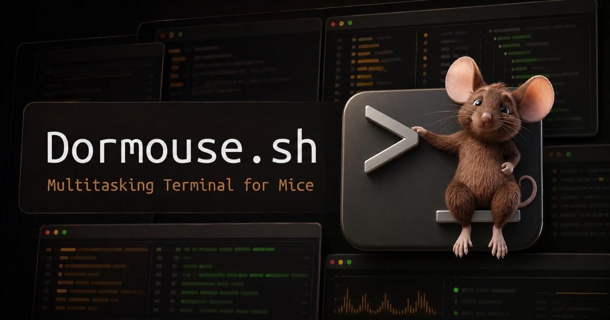

# Dormouse

**So many terminals. Which ones need attention?** A dormouse knows when to wake.

A multitasking terminal for mice and thumbs (and hotkey wizards too): your terminals and browsers tiled side by side inside VS Code, and the one that needs you lights up.



<!-- TODO: replace the hero with the Dormouse panel: a few coding agents and a dev server tiled side by side, one pane ringing -->

Try it in your browser first: [dormouse.sh/playground](https://dormouse.sh/playground).

## Tmux with browsers

<!-- TODO: GIF of splitting, dragging, zooming, and minimizing panes (the homepage's tmux video would do) -->

Soft as a mouse, sharp as a tmux. Split, drag, zoom, and minimize panes with the mouse, or keep your hands on [tmux keybinds](#keyboard-shortcuts). A minimized pane becomes a **door** on the baseboard and keeps running. Dormouse follows your VS Code theme exactly, so it's hard to tell it isn't built in.

## Alerts

<!-- TODO: image of a ringing pane beside a pane showing a TODO pill -->

A pane rings when its program asks for you (`BEL`, `OSC 9`, `OSC 99`, `OSC 777`), or when a command you started finishes while you're away — no setup. Coding agents are watched by default, so their pane rings when they go quiet; right-click any pane to watch its command too.

Look at a ring without typing and it becomes a **TODO**; type into the pane to clear both. Rings also show on the VS Code tab, and can be spoken aloud. Command-exit alerts and watching use shell integration (`OSC 633` / `OSC 133`), which Dormouse sets up for zsh, bash, PowerShell, and WSL.

## Push notifications you can self-host

<!-- TODO: image of Dormouse Pocket on a phone with the radial menu open (the homepage's phone mockup would do) -->

Your agent hits a permission prompt after you leave. Dormouse Pocket buzzes your phone, and one drag on its radial menu sends `y`, `n`, Esc, or Ctrl+C. The Relay is yours — one Node process behind `tailscale serve` — and sessions are end-to-end encrypted.

The released extension connects through [Dormouse Hosted](https://dormouse.sh/hosted/?ref=readme); a self-hosted Relay takes a build from source. Try the phone interface at [dormouse.sh/playground/pocket](https://dormouse.sh/playground/pocket).

## Terminals that know their ports

Six panes running and something's serving `:3000`. Which one? Right-click a pane to list the ports it's listening on, and open one in a browser pane.

## Browsers for you (and your agents)

<!-- TODO: image of a dev server's page in a browser pane next to the terminal running `pnpm dev` -->

A browser is just another pane, and your agent drives the same one you're watching:

```sh
dor ensure -- pnpm dev              # created surface:3
dor agent-browser open surface:3    # open the port surface:3 is serving
```

Dormouse drives the agent-browser or Playwright CLI you already have rather than shipping a browser. See the [`dor agent-browser` reference](https://dormouse.sh/dor#agent-browser).

## Select and copy-paste like you meant

<!-- TODO: GIF of overriding a TUI's mouse capture and copying in Auto from the copy editor -->

When a TUI grabs the mouse, one click in the pane header takes it back. Every selection opens a copy editor showing exactly what lands on the clipboard: **Auto** joins the hard wraps back into the line the program printed, **Exact** keeps them, and `e` expands a clipped selection to the whole URL, path, or paragraph. Paste a screenshot to hand your agent its path.

## Getting started

1. Install from the [Visual Studio Marketplace](https://marketplace.visualstudio.com/items?itemName=diffplug.dormouse) or [Open VSX](https://open-vsx.org/extension/diffplug/dormouse). It also works in Cursor, Windsurf, and other VS Code forks.
2. Open the **Dormouse** tab in the Panel, or run **Dormouse: Focus**. **Dormouse: Open in Editor** opens more as editor tabs.

## Keyboard shortcuts

Tap **Left Shift, then Right Shift** (Left ⌘, then Right ⌘ on a Mac) for command mode; press `Enter` or click a pane to go back to typing.

| Key | Action |
| --- | --- |
| `\|` or `%` | Split left/right |
| `-` or `"` | Split top/bottom |
| Arrows | Move between panes; with `⌘`/`Ctrl`, swap |
| `z` | Zoom |
| `m` or `d` | Minimize, or reattach a door |
| `k` or `x` | Kill |
| `,` | Rename |

The [shortcut reference](https://github.com/diffplug/dormouse/blob/main/docs/specs/shortcuts.md) has the rest.

## Coding agents

[Claude Code, Codex, GitHub Copilot, Antigravity, Warp, and Cursor](https://dormouse.sh/compatible-agents) are watched by default, and resume their conversations after VS Code reloads. Every terminal has the `dor` CLI on its `PATH`, so agents can open panes, run a dev server exactly once, and drive browser panes: see the [`dor` reference](https://dormouse.sh/dor) and the [agent skill](https://dormouse.sh/agent-skill).

## Dormouse Hosted

Optional and paid: a managed Relay so Pocket works without running your own, and an ElevenLabs voice for spoken alarms. [See plans and pricing](https://dormouse.sh/hosted/?ref=readme).

## Standalone app

Don't settle for your operating system's built-in terminal: Dormouse is also a desktop app for macOS, Windows, and Linux, at [dormouse.sh](https://dormouse.sh/#download).

## Links

[Changelog](https://dormouse.sh/changelog) · [Issues](https://github.com/diffplug/dormouse/issues) · [Source](https://github.com/diffplug/dormouse) · [Security](https://dormouse.sh/security) · [Supply chain](https://dormouse.sh/supply-chain) · by [DiffPlug](https://www.diffplug.com/)
